# bodyLLM internal scan

Archivo: `lib/handlers/messageHandler.ts`
Rango analizado: L5160-L11833
Tamaño estimado: 6674 líneas
Bucket size: 250

> Scan estático readonly. Sirve para mapear densidad interna de `bodyLLM`, no para modificar código.

---

## 1. Buckets internos de bodyLLM

| Rango | Top markers | returns | awaits | decisions | temporal/check markers |
| --- | --- | ---: | ---: | ---: | ---: |
| 5160-5409 | `date/temporal:117`, `structured analyze:45`, `create:43`, `reservationSlots:19`, `graph/classifier/policy:19`, `state/result:18`, `faq/policies/amenities:14`, `reply builders:12` | 5 | 3 | 13 | 37 |
| 5410-5659 | `modify:58`, `date/temporal:58`, `reservationSlots:53`, `create:43`, `availability:28`, `state/result:27`, `graph/classifier/policy:18`, `reply builders:16` | 10 | 10 | 16 | 18 |
| 5660-5909 | `date/temporal:97`, `create:71`, `reservationSlots:51`, `state/result:34`, `availability:29`, `graph/classifier/policy:13`, `reply builders:9`, `modify:7` | 5 | 7 | 17 | 60 |
| 5910-6159 | `create:69`, `date/temporal:56`, `reservationSlots:45`, `state/result:35`, `modify:27`, `reply builders:17`, `email/whatsapp copy:13`, `early return:10` | 10 | 12 | 19 | 18 |
| 6160-6409 | `modify:101`, `date/temporal:81`, `reservationSlots:38`, `state/result:26`, `reply builders:18`, `selected target:15`, `create:11`, `conversationFocus:10` | 8 | 7 | 12 | 13 |
| 6410-6659 | `email/whatsapp copy:106`, `reservationSlots:84`, `date/temporal:52`, `modify:40`, `selected target:34`, `state/result:31`, `reply builders:17`, `graph/classifier/policy:11` | 9 | 17 | 21 | 19 |
| 6660-6909 | `modify:66`, `date/temporal:46`, `snapshot/verify:45`, `email/whatsapp copy:45`, `reservationSlots:31`, `structured analyze:19`, `selected target:17`, `graph/classifier/policy:14` | 11 | 12 | 11 | 7 |
| 6910-7159 | `date/temporal:129`, `reservationSlots:69`, `modify:54`, `create:38`, `state/result:25`, `reply builders:19`, `snapshot/verify:16`, `structured analyze:14` | 7 | 6 | 9 | 39 |
| 7160-7409 | `modify:73`, `date/temporal:57`, `snapshot/verify:51`, `reservationSlots:34`, `selected target:28`, `reply builders:23`, `email/whatsapp copy:14`, `structured analyze:13` | 8 | 8 | 11 | 20 |
| 7410-7659 | `date/temporal:148`, `modify:126`, `reservationSlots:117`, `selected target:32`, `reply builders:26`, `state/result:24`, `email/whatsapp copy:11`, `conversationFocus:10` | 9 | 8 | 10 | 43 |
| 7660-7909 | `modify:129`, `date/temporal:112`, `reservationSlots:91`, `reply builders:34`, `state/result:32`, `early return:15`, `email/whatsapp copy:15`, `graph/classifier/policy:15` | 15 | 9 | 17 | 36 |
| 7910-8159 | `date/temporal:79`, `availability:58`, `reservationSlots:50`, `modify:38`, `reply builders:38`, `create:33`, `state/result:27`, `graph/classifier/policy:20` | 15 | 9 | 17 | 31 |
| 8160-8409 | `create:203`, `date/temporal:202`, `reservationSlots:37`, `reply builders:33`, `confirm:18`, `state/result:16`, `early return:9`, `modify:7` | 9 | 5 | 10 | 47 |
| 8410-8659 | `create:97`, `email/whatsapp copy:60`, `reservationSlots:50`, `date/temporal:40`, `state/result:21`, `reply builders:17`, `early return:13`, `graph/classifier/policy:11` | 13 | 12 | 17 | 22 |
| 8660-8909 | `email/whatsapp copy:194`, `reservationSlots:86`, `state/result:38`, `date/temporal:36`, `snapshot/verify:13`, `early return:12`, `graph/classifier/policy:10`, `confirm:1` | 11 | 27 | 29 | 14 |
| 8910-9159 | `email/whatsapp copy:112`, `reservationSlots:78`, `cancel:55`, `date/temporal:33`, `state/result:30`, `confirm:20`, `snapshot/verify:17`, `create:15` | 8 | 22 | 17 | 14 |
| 9160-9409 | `cancel:50`, `create:46`, `date/temporal:40`, `confirm:35`, `reservationSlots:28`, `reply builders:24`, `modify:19`, `email/whatsapp copy:18` | 16 | 12 | 19 | 11 |
| 9410-9659 | `reservationSlots:83`, `date/temporal:67`, `modify:56`, `snapshot/verify:55`, `state/result:31`, `create:24`, `reply builders:22`, `early return:21` | 21 | 14 | 21 | 18 |
| 9660-9909 | `reservationSlots:71`, `date/temporal:70`, `snapshot/verify:61`, `reply builders:41`, `canonical state:29`, `state/result:24`, `confirm:24`, `create:17` | 10 | 4 | 10 | 37 |
| 9910-10159 | `reply builders:36`, `billing:34`, `reservationSlots:24`, `graph/classifier/policy:21`, `create:15`, `state/result:14`, `email/whatsapp copy:12`, `fallback:11` | 6 | 7 | 12 | 6 |
| 10160-10409 | `graph/classifier/policy:44`, `reservationSlots:43`, `fallback:32`, `state/result:29`, `date/temporal:24`, `reply builders:24`, `create:23`, `email/whatsapp copy:18` | 0 | 7 | 12 | 5 |
| 10410-10659 | `date/temporal:146`, `modify:110`, `reservationSlots:45`, `reply builders:22`, `state/result:18`, `selected target:13`, `email/whatsapp copy:13`, `create:10` | 5 | 7 | 11 | 26 |
| 10660-10909 | `date/temporal:187`, `create:73`, `reservationSlots:39`, `modify:28`, `confirm:16`, `state/result:14`, `reply builders:14`, `structured analyze:11` | 6 | 4 | 21 | 65 |
| 10910-11159 | `create:106`, `date/temporal:87`, `reservationSlots:74`, `availability:35`, `modify:30`, `state/result:29`, `reply builders:16`, `email/whatsapp copy:13` | 9 | 9 | 24 | 23 |
| 11160-11409 | `create:46`, `reservationSlots:27`, `date/temporal:22`, `reply builders:21`, `snapshot/verify:20`, `modify:12`, `billing:12`, `faq/policies/amenities:10` | 6 | 5 | 19 | 12 |
| 11410-11659 | `billing:55`, `early return:43`, `confirm:40`, `email/whatsapp copy:21`, `date/temporal:21`, `create:18`, `structured analyze:17`, `modify:13` | 43 | 2 | 40 | 2 |
| 11660-11833 | `reservationSlots:52`, `date/temporal:45`, `early return:25`, `email/whatsapp copy:20`, `state/result:8`, `reply builders:7`, `modify:6`, `availability:4` | 25 | 0 | 17 | 13 |

---

## 2. Diagrama tentativo por buckets

```mermaid
flowchart TD
  B0["5160-5409<br/>date/temporal<br/>structured analyze<br/>create"]
  B1["5410-5659<br/>modify<br/>date/temporal<br/>reservationSlots"]
  B2["5660-5909<br/>date/temporal<br/>create<br/>reservationSlots"]
  B3["5910-6159<br/>create<br/>date/temporal<br/>reservationSlots"]
  B4["6160-6409<br/>modify<br/>date/temporal<br/>reservationSlots"]
  B5["6410-6659<br/>email/whatsapp copy<br/>reservationSlots<br/>date/temporal"]
  B6["6660-6909<br/>modify<br/>date/temporal<br/>snapshot/verify"]
  B7["6910-7159<br/>date/temporal<br/>reservationSlots<br/>modify"]
  B8["7160-7409<br/>modify<br/>date/temporal<br/>snapshot/verify"]
  B9["7410-7659<br/>date/temporal<br/>modify<br/>reservationSlots"]
  B10["7660-7909<br/>modify<br/>date/temporal<br/>reservationSlots"]
  B11["7910-8159<br/>date/temporal<br/>availability<br/>reservationSlots"]
  B12["8160-8409<br/>create<br/>date/temporal<br/>reservationSlots"]
  B13["8410-8659<br/>create<br/>email/whatsapp copy<br/>reservationSlots"]
  B14["8660-8909<br/>email/whatsapp copy<br/>reservationSlots<br/>state/result"]
  B15["8910-9159<br/>email/whatsapp copy<br/>reservationSlots<br/>cancel"]
  B16["9160-9409<br/>cancel<br/>create<br/>date/temporal"]
  B17["9410-9659<br/>reservationSlots<br/>date/temporal<br/>modify"]
  B18["9660-9909<br/>reservationSlots<br/>date/temporal<br/>snapshot/verify"]
  B19["9910-10159<br/>reply builders<br/>billing<br/>reservationSlots"]
  B20["10160-10409<br/>graph/classifier/policy<br/>reservationSlots<br/>fallback"]
  B21["10410-10659<br/>date/temporal<br/>modify<br/>reservationSlots"]
  B22["10660-10909<br/>date/temporal<br/>create<br/>reservationSlots"]
  B23["10910-11159<br/>create<br/>date/temporal<br/>reservationSlots"]
  B24["11160-11409<br/>create<br/>reservationSlots<br/>date/temporal"]
  B25["11410-11659<br/>billing<br/>early return<br/>confirm"]
  B26["11660-11833<br/>reservationSlots<br/>date/temporal<br/>early return"]

  B0 --> B1
  B1 --> B2
  B2 --> B3
  B3 --> B4
  B4 --> B5
  B5 --> B6
  B6 --> B7
  B7 --> B8
  B8 --> B9
  B9 --> B10
  B10 --> B11
  B11 --> B12
  B12 --> B13
  B13 --> B14
  B14 --> B15
  B15 --> B16
  B16 --> B17
  B17 --> B18
  B18 --> B19
  B19 --> B20
  B20 --> B21
  B21 --> B22
  B22 --> B23
  B23 --> B24
  B24 --> B25
  B25 --> B26

  classDef darkBox fill:#111111,stroke:#d1d5db,stroke-width:1px,color:#ffffff;
  class B0 darkBox;
  class B1 darkBox;
  class B2 darkBox;
  class B3 darkBox;
  class B4 darkBox;
  class B5 darkBox;
  class B6 darkBox;
  class B7 darkBox;
  class B8 darkBox;
  class B9 darkBox;
  class B10 darkBox;
  class B11 darkBox;
  class B12 darkBox;
  class B13 darkBox;
  class B14 darkBox;
  class B15 darkBox;
  class B16 darkBox;
  class B17 darkBox;
  class B18 darkBox;
  class B19 darkBox;
  class B20 darkBox;
  class B21 darkBox;
  class B22 darkBox;
  class B23 darkBox;
  class B24 darkBox;
  class B25 darkBox;
  class B26 darkBox;
```

---

## 3. Returns por bucket

### 5160-5409

- L5261: `return { finalText, nextCategory, nextSlots, needsSupervision, graphResult: null };`
- L5288: `return { finalText, nextCategory, nextSlots, needsSupervision, graphResult: null };`
- L5305: `return {`
- L5316: `return {`
- L5337: `return {`

### 5410-5659

- L5412: `return { finalText, nextCategory, nextSlots, needsSupervision, graphResult: null };`
- L5476: `return {`
- L5484: `return {`
- L5506: `return {`
- L5534: `return {`
- L5546: `return {`
- L5557: `return {`
- L5570: `return {`
- L5596: `return {`
- L5617: `return {`

### 5660-5909

- L5671: `return {`
- L5718: `return {`
- L5849: `return {`
- L5873: `return {`
- L5902: `return {`

### 5910-6159

- L5921: `return {`
- L5932: `return {`
- L5969: `return {`
- L5983: `return {`
- L6014: `return {`
- L6050: `return {`
- L6081: `return {`
- L6093: `return { finalText, nextCategory: modifyContextActiveFast ? "modify_reservation" : (pre.prevCategory ?? null), nextSlots, needsSupervision, graphResult: null };`
- L6126: `return {`
- L6137: `return {`

### 6160-6409

- L6174: `return {`
- L6187: `return {`
- L6213: `return {`
- L6248: `return { finalText, nextCategory: modifyContextActiveFast ? "modify_reservation" : (pre.prevCategory ?? null), nextSlots, needsSupervision, graphResult: null };`
- L6288: `return {`
- L6351: `return { finalText, nextCategory: "modify_reservation", nextSlots, needsSupervision, graphResult: null };`
- L6389: `return {`
- L6397: `return {`

### 6410-6659

- L6441: `return {`
- L6472: `return {`
- L6522: `return { finalText, nextCategory: "modify_reservation", nextSlots: knownSlots, needsSupervision, graphResult: null };`
- L6573: `return { finalText: finalTextWA, nextCategory: 'send_whatsapp_copy', nextSlots: pre.currSlots, needsSupervision: false, graphResult: null };`
- L6582: `return { finalText: failText, nextCategory: 'send_whatsapp_copy', nextSlots: pre.currSlots, needsSupervision: code && code !== 'WA_NOT_READY', graphResult: null };`
- L6592: `return { finalText: askNum, nextCategory: 'send_whatsapp_copy', nextSlots: pre.currSlots, needsSupervision: false, graphResult: null };`
- L6608: `return { finalText, nextCategory: 'send_email_copy', nextSlots, needsSupervision, graphResult };`
- L6617: `return { finalText, nextCategory: 'send_email_copy', nextSlots, needsSupervision, graphResult };`
- L6620: `const toDDMMYYYY = (iso?: string) => { if (!iso) return iso; const m = iso.match(/(\d{4})-(\d{2})-(\d{2})/); return m ? '${m[3]}/${m[2]}/${m[1]}' : iso; };`

### 6660-6909

- L6663: `return { finalText, nextCategory: 'send_email_copy', nextSlots, needsSupervision, graphResult };`
- L6680: `return { finalText, nextCategory: 'send_email_copy', nextSlots, needsSupervision, graphResult };`
- L6702: `return { finalText, nextCategory: 'send_email_copy', nextSlots, needsSupervision, graphResult };`
- L6711: `return { finalText, nextCategory: 'send_email_copy', nextSlots, needsSupervision, graphResult };`
- L6827: `return { finalText, nextCategory: "modify_reservation", nextSlots, needsSupervision, graphResult };`
- L6864: `return { finalText, nextCategory: "modify_reservation", nextSlots: currentPreviewSnapshot, needsSupervision, graphResult };`
- L6877: `return { finalText, nextCategory: "modify_reservation", nextSlots: updatedPreviewSnapshot, needsSupervision, graphResult };`
- L6880: `return { finalText, nextCategory: "modify_reservation", nextSlots: updatedPreviewSnapshot, needsSupervision, graphResult };`
- L6885: `return { finalText, nextCategory: "modify_reservation", nextSlots: currentPreviewSnapshot, needsSupervision, graphResult };`
- L6897: `return { finalText, nextCategory: "modify_reservation", nextSlots: currentPreviewSnapshot, needsSupervision, graphResult };`
- L6901: `return { finalText, nextCategory: "modify_reservation", nextSlots: currentPreviewSnapshot, needsSupervision, graphResult };`

### 6910-7159

- L6914: `return { finalText, nextCategory: "modify_reservation", nextSlots: currentPreviewSnapshot, needsSupervision, graphResult };`
- L6932: `return {`
- L6977: `return { finalText, nextCategory, nextSlots, needsSupervision, graphResult };`
- L7020: `return { finalText, nextCategory: "modify_reservation", nextSlots, needsSupervision, graphResult };`
- L7039: `return { finalText, nextCategory, nextSlots, needsSupervision, graphResult };`
- L7111: `return { finalText, nextCategory, nextSlots, needsSupervision, graphResult };`
- L7123: `return { finalText, nextCategory, nextSlots, needsSupervision, graphResult };`

### 7160-7409

- L7163: `return { finalText, nextCategory, nextSlots, needsSupervision, graphResult };`
- L7187: `return { finalText, nextCategory, nextSlots, needsSupervision, graphResult };`
- L7196: `return { finalText, nextCategory, nextSlots, needsSupervision, graphResult };`
- L7270: `return { finalText, nextCategory, nextSlots, needsSupervision, graphResult };`
- L7309: `return { finalText, nextCategory, nextSlots, needsSupervision, graphResult };`
- L7337: `return { finalText, nextCategory, nextSlots, needsSupervision, graphResult };`
- L7353: `return { finalText, nextCategory: "modify_reservation", nextSlots, needsSupervision, graphResult };`
- L7403: `return { finalText, nextCategory: "modify_reservation", nextSlots, needsSupervision, graphResult };`

### 7410-7659

- L7420: `return { finalText, nextCategory: "modify_reservation", nextSlots, needsSupervision, graphResult };`
- L7468: `return { finalText, nextCategory: "modify_reservation", nextSlots, needsSupervision, graphResult };`
- L7483: `return { finalText, nextCategory: "modify_reservation", nextSlots, needsSupervision, graphResult };`
- L7501: `return { finalText, nextCategory: "modify_reservation", nextSlots: snapshot, needsSupervision, graphResult };`
- L7506: `return { finalText, nextCategory: "modify_reservation", nextSlots: snapshot, needsSupervision, graphResult };`
- L7519: `return { finalText, nextCategory: "modify_reservation", nextSlots, needsSupervision, graphResult };`
- L7544: `return { finalText, nextCategory: "modify_reservation", nextSlots, needsSupervision, graphResult };`
- L7556: `return { finalText, nextCategory: "modify_reservation", nextSlots, needsSupervision, graphResult };`
- L7598: `return { finalText, nextCategory: "modify_reservation", nextSlots, needsSupervision, graphResult };`

### 7660-7909

- L7729: `return { finalText, nextCategory: "modify_reservation", nextSlots, needsSupervision, graphResult };`
- L7735: `return { finalText, nextCategory: "modify_reservation", nextSlots, needsSupervision, graphResult };`
- L7755: `return { finalText, nextCategory: "modify_reservation", nextSlots, needsSupervision, graphResult };`
- L7786: `return { finalText, nextCategory: "modify_reservation", nextSlots, needsSupervision, graphResult };`
- L7792: `return { finalText, nextCategory: "modify_reservation", nextSlots, needsSupervision, graphResult };`
- L7798: `return { finalText, nextCategory: "modify_reservation", nextSlots, needsSupervision, graphResult };`
- L7804: `return { finalText, nextCategory: "modify_reservation", nextSlots, needsSupervision, graphResult };`
- L7826: `return { finalText, nextCategory: "modify_reservation", nextSlots, needsSupervision, graphResult };`
- L7847: `return { finalText, nextCategory: "modify_reservation", nextSlots, needsSupervision, graphResult };`
- L7861: `return { finalText, nextCategory: "modify_reservation", nextSlots, needsSupervision, graphResult };`
- L7865: `return { finalText, nextCategory: "modify_reservation", nextSlots, needsSupervision, graphResult };`
- L7871: `return { finalText, nextCategory: "modify_reservation", nextSlots, needsSupervision, graphResult };`
- L7891: `return { finalText, nextCategory: "modify_reservation", nextSlots, needsSupervision, graphResult };`
- L7905: `return { finalText, nextCategory: "modify_reservation", nextSlots, needsSupervision, graphResult };`
- L7909: `return { finalText, nextCategory: "modify_reservation", nextSlots, needsSupervision, graphResult };`

### 7910-8159

- L7915: `return { finalText, nextCategory: "modify_reservation", nextSlots, needsSupervision, graphResult };`
- L7920: `return { finalText, nextCategory: "modify_reservation", nextSlots, needsSupervision, graphResult };`
- L7941: `return { finalText, nextCategory: "modify_reservation", nextSlots, needsSupervision, graphResult };`
- L7955: `return { finalText, nextCategory: "modify_reservation", nextSlots, needsSupervision, graphResult };`
- L7961: `return { finalText, nextCategory: "modify_reservation", nextSlots, needsSupervision, graphResult };`
- L7969: `return { finalText, nextCategory: "modify_reservation", nextSlots, needsSupervision, graphResult };`
- L8018: `return { finalText, nextCategory: "reservation", nextSlots, needsSupervision, graphResult };`
- L8026: `return { finalText, nextCategory: "reservation", nextSlots, needsSupervision, graphResult };`
- L8036: `return { finalText, nextCategory: "reservation", nextSlots, needsSupervision, graphResult };`
- L8064: `return {`
- L8078: `return { finalText, nextCategory: "reservation", nextSlots, needsSupervision, graphResult };`
- L8113: `return {`
- L8128: `return { finalText, nextCategory: "availability_inquiry", nextSlots, needsSupervision, graphResult };`
- L8152: `return { finalText, nextCategory, nextSlots, needsSupervision, graphResult };`
- L8157: `return {`

### 8160-8409

- L8212: `return {`
- L8262: `return { finalText, nextCategory: "reservation", nextSlots, needsSupervision, graphResult };`
- L8292: `return { finalText, nextCategory: "reservation", nextSlots, needsSupervision: needsSupervision \|\| readyCreateResult.needsHandoff, graphResult };`
- L8308: `return { finalText, nextCategory: "reservation", nextSlots: pausedDraft, needsSupervision, graphResult };`
- L8313: `return { finalText, nextCategory: "reservation", nextSlots, needsSupervision, graphResult };`
- L8322: `return { finalText, nextCategory: "reservation", nextSlots, needsSupervision, graphResult };`
- L8348: `if (!quotedTurnDirectWeekdayMatch) return {} as { checkIn?: string; checkOut?: string };`
- L8351: `if (typeof startWeekday !== "number" \|\| typeof endWeekday !== "number") return {};`
- L8355: `return checkIn && checkOut ? { checkIn, checkOut } : {};`

### 8410-8659

- L8417: `return {`
- L8431: `return {`
- L8446: `return { finalText, nextCategory: "reservation", nextSlots, needsSupervision, graphResult };`
- L8476: `return { finalText, nextCategory: "reservation", nextSlots, needsSupervision, graphResult };`
- L8497: `return {`
- L8527: `return {`
- L8545: `return {`
- L8582: `return { finalText: buildAskGuestName(pre.lang), nextCategory, nextSlots, needsSupervision, graphResult };`
- L8596: `return { finalText, nextCategory: "send_email_copy", nextSlots, needsSupervision, graphResult };`
- L8599: `if (!iso) return iso;`
- L8600: `const m = iso.match(/(\d{4})-(\d{2})-(\d{2})/); return m ? '${m[3]}/${m[2]}/${m[1]}' : iso;`
- L8629: `return { finalText, nextCategory: "send_email_copy", nextSlots, needsSupervision, graphResult };`
- L8646: `return { finalText, nextCategory: 'send_email_copy', nextSlots, needsSupervision, graphResult };`

### 8660-8909

- L8667: `return { finalText: ask, nextCategory: 'send_email_copy', nextSlots, needsSupervision, graphResult };`
- L8670: `if (!iso) return iso; const m = iso.match(/(\d{4})-(\d{2})-(\d{2})/); return m ? '${m[3]}/${m[2]}/${m[1]}' : iso;`
- L8697: `return { finalText: ok, nextCategory: 'send_email_copy', nextSlots, needsSupervision, graphResult };`
- L8713: `return { finalText: fail, nextCategory: 'send_email_copy', nextSlots, needsSupervision, graphResult };`
- L8772: `return { finalText, nextCategory: 'send_whatsapp_copy', nextSlots, needsSupervision, graphResult };`
- L8784: `return { finalText, nextCategory: 'send_whatsapp_copy', nextSlots, needsSupervision, graphResult };`
- L8793: `return { finalText, nextCategory: 'send_whatsapp_copy', nextSlots, needsSupervision, graphResult };`
- L8828: `return { finalText, nextCategory: 'send_whatsapp_copy', nextSlots, needsSupervision, graphResult };`
- L8840: `return { finalText, nextCategory: 'send_whatsapp_copy', nextSlots, needsSupervision, graphResult };`
- L8893: `return { finalText, nextCategory: "send_whatsapp_copy", nextSlots, needsSupervision, graphResult };`
- L8905: `return { finalText, nextCategory: "send_whatsapp_copy", nextSlots, needsSupervision, graphResult };`

### 8910-9159

- L8915: `return { finalText, nextCategory: "send_whatsapp_copy", nextSlots, needsSupervision, graphResult };`
- L8950: `return { finalText, nextCategory: "send_whatsapp_copy", nextSlots, needsSupervision, graphResult };`
- L8962: `return { finalText, nextCategory: "send_whatsapp_copy", nextSlots, needsSupervision, graphResult };`
- L9007: `return { finalText, nextCategory: "send_whatsapp_copy", nextSlots, needsSupervision, graphResult };`
- L9019: `return { finalText, nextCategory: "send_whatsapp_copy", nextSlots, needsSupervision, graphResult };`
- L9081: `return { finalText, nextCategory: "cancel_reservation", nextSlots, needsSupervision, graphResult };`
- L9127: `return { finalText, nextCategory: "cancel_reservation", nextSlots, needsSupervision, graphResult };`
- L9140: `return { finalText, nextCategory: "cancel_reservation", nextSlots, needsSupervision, graphResult };`

### 9160-9409

- L9175: `return { finalText, nextCategory: "cancel_reservation", nextSlots: {}, needsSupervision, graphResult };`
- L9180: `return { finalText, nextCategory: "cancel_reservation", nextSlots, needsSupervision, graphResult };`
- L9191: `return { finalText, nextCategory: "cancel_reservation", nextSlots, needsSupervision, graphResult };`
- L9211: `return { finalText, nextCategory: "cancel_reservation", nextSlots, needsSupervision, graphResult };`
- L9256: `return { finalText, nextCategory: "cancel_reservation", nextSlots, needsSupervision, graphResult };`
- L9269: `return { finalText, nextCategory: "cancel_reservation", nextSlots, needsSupervision, graphResult };`
- L9296: `return { finalText, nextCategory, nextSlots, needsSupervision, graphResult };`
- L9304: `return { finalText, nextCategory, nextSlots, needsSupervision, graphResult };`
- L9316: `return {`
- L9334: `return { finalText, nextCategory: "reservation", nextSlots, needsSupervision, graphResult };`
- L9349: `return { finalText, nextCategory: "reservation", nextSlots, needsSupervision, graphResult };`
- L9361: `return { finalText, nextCategory: "reservation", nextSlots, needsSupervision, graphResult };`
- L9367: `return { finalText, nextCategory, nextSlots, needsSupervision, graphResult };`
- L9370: `return { finalText, nextCategory, nextSlots, needsSupervision, graphResult };`
- L9390: `return { finalText, nextCategory, nextSlots, needsSupervision, graphResult };`
- L9406: `return { finalText, nextCategory: "modify_reservation", nextSlots, needsSupervision, graphResult };`

### 9410-9659

- L9440: `return { finalText, nextCategory: "modify_reservation", nextSlots, needsSupervision, graphResult };`
- L9453: `return { finalText, nextCategory: "modify_reservation", nextSlots: updatedPreviewSnapshot, needsSupervision, graphResult };`
- L9456: `return { finalText, nextCategory: "modify_reservation", nextSlots: updatedPreviewSnapshot, needsSupervision, graphResult };`
- L9461: `return { finalText, nextCategory: "modify_reservation", nextSlots: currentPreviewSnapshot, needsSupervision, graphResult };`
- L9473: `return { finalText, nextCategory: "modify_reservation", nextSlots: currentPreviewSnapshot, needsSupervision, graphResult };`
- L9477: `return { finalText, nextCategory: "modify_reservation", nextSlots: currentPreviewSnapshot, needsSupervision, graphResult };`
- L9490: `return { finalText, nextCategory: "modify_reservation", nextSlots: currentPreviewSnapshot, needsSupervision, graphResult };`
- L9526: `return { finalText, nextCategory: "reservation", nextSlots, needsSupervision, graphResult };`
- L9549: `return { finalText, nextCategory: "reservation", nextSlots, needsSupervision, graphResult };`
- L9554: `return { finalText, nextCategory: "modify_reservation", nextSlots, needsSupervision, graphResult };`
- L9557: `return { finalText, nextCategory: "modify_reservation", nextSlots, needsSupervision, graphResult };`
- L9563: `return { finalText, nextCategory: "modify_reservation", nextSlots, needsSupervision, graphResult };`
- L9568: `return { finalText, nextCategory: "modify_reservation", nextSlots, needsSupervision, graphResult };`
- L9573: `return { finalText, nextCategory: "modify_reservation", nextSlots, needsSupervision, graphResult };`
- L9597: `return { finalText, nextCategory: "modify_reservation", nextSlots: snapshot, needsSupervision, graphResult };`
- L9601: `return { finalText, nextCategory: "modify_reservation", nextSlots: snapshot, needsSupervision, graphResult };`
- L9614: `return { finalText, nextCategory: "modify_reservation", nextSlots, needsSupervision, graphResult };`
- L9626: `return {`
- L9639: `return { finalText, nextCategory: "reservation", nextSlots, needsSupervision, graphResult };`
- L9644: `return { finalText, nextCategory: "reservation", nextSlots, needsSupervision, graphResult };`
- L9649: `return { finalText, nextCategory: "reservation", nextSlots, needsSupervision, graphResult };`

### 9660-9909

- L9730: `return {`
- L9744: `return { finalText, nextCategory: "reservation", nextSlots, needsSupervision, graphResult };`
- L9755: `return toBodyLLMResult(state);`
- L9789: `return { finalText, nextCategory, nextSlots, needsSupervision, graphResult: null, rich: undefined };`
- L9798: `return { finalText, nextCategory, nextSlots, needsSupervision, graphResult: null, rich: undefined };`
- L9848: `return { finalText, nextCategory, nextSlots, needsSupervision, graphResult: null, rich: undefined };`
- L9853: `return { finalText, nextCategory, nextSlots, needsSupervision, graphResult: null, rich: undefined };`
- L9863: `return { finalText, nextCategory, nextSlots, needsSupervision, graphResult: null, rich: undefined };`
- L9883: `return { finalText, nextCategory, nextSlots, needsSupervision, graphResult: null, rich: undefined };`
- L9891: `return { finalText, nextCategory, nextSlots, needsSupervision, graphResult: null, rich: undefined };`

### 9910-10159

- L9910: `return keys.some((k) => hay.includes(k));`
- L10009: `return { finalText, nextCategory, nextSlots, needsSupervision, graphResult };`
- L10034: `return { finalText, nextCategory, nextSlots, needsSupervision, graphResult };`
- L10070: `debugLog("[KB] fastpath return", { ok: kb.ok, safeCat, hasText: Boolean(text) });`
- L10122: `return { finalText, nextCategory, nextSlots, needsSupervision, graphResult };`
- L10150: `return { finalText, nextCategory, nextSlots, needsSupervision, graphResult };`

### 10160-10409

- sin returns detectados

### 10410-10659

- L10463: `return { finalText, nextCategory: "modify_reservation", nextSlots, needsSupervision, graphResult };`
- L10503: `return { finalText, nextCategory: "modify_reservation", nextSlots, needsSupervision, graphResult };`
- L10515: `return { finalText, nextCategory: "modify_reservation", nextSlots, needsSupervision, graphResult };`
- L10536: `return { finalText, nextCategory: "modify_reservation", nextSlots, needsSupervision, graphResult };`
- L10562: `return { finalText, nextCategory: "modify_reservation", nextSlots, needsSupervision, graphResult };`

### 10660-10909

- L10732: `return { finalText, nextCategory, nextSlots, needsSupervision, graphResult };`
- L10741: `return { finalText, nextCategory, nextSlots, needsSupervision, graphResult };`
- L10767: `return { finalText, nextCategory, nextSlots, needsSupervision, graphResult };`
- L10775: `return { finalText, nextCategory, nextSlots, needsSupervision, graphResult };`
- L10890: `if (!iso) return iso \|\| '';`
- L10892: `return m ? '${m[3]}/${m[2]}/${m[1]}' : iso;`

### 10910-11159

- L10931: `const [dd, mm, yyyy] = d.split(/[\/\-]/); return '${yyyy}-${mm}-${dd}';`
- L10982: `return {`
- L10996: `return { finalText, nextCategory: "reservation", nextSlots, needsSupervision, graphResult };`
- L11005: `return { finalText, nextCategory: "reservation", nextSlots, needsSupervision, graphResult };`
- L11016: `return { finalText, nextCategory: "modify_reservation", nextSlots, needsSupervision, graphResult };`
- L11083: `return {`
- L11118: `return {`
- L11132: `return { finalText, nextCategory: "reservation", nextSlots, needsSupervision, graphResult };`
- L11139: `return { finalText, nextCategory: "reservation", nextSlots, needsSupervision, graphResult };`

### 11160-11409

- L11338: `return { finalText, nextCategory, nextSlots, needsSupervision, graphResult, rich };`
- L11343: `if (!raw) return raw;`
- L11362: `return out;`
- L11367: `if (!raw) return raw;`
- L11389: `return out;`
- L11403: `if (!asksAcceptance) return answer;`

### 11410-11659

- L11412: `if (!hit) return answer;`
- L11427: `if (!isNegative) return answer;`
- L11428: `return lang === "es"`
- L11436: `return lang === "es"`
- L11442: `return answer;`
- L11448: `if (!out) return out;`
- L11450: `if (hasQuestion) return out;`
- L11457: `return '${out}\n\n${followup}';`
- L11490: `return accepted`
- L11494: `if (asksCurrency) return 'Moedas habilitadas hoje: ${currencies.join(", ") \|\| "(a confirmar)"}.\n\nQuer que eu detalhe meios de pagamento e comprovantes?';`
- L11495: `if (asksInvoices) return 'Emitimos fatura: ${issuesInvoices ? "sim" : "por enquanto não"}.\nComprovantes: ${docs.join(", ") \|\| "(a confirmar)"}.\n\nQuer que eu detalhe meios de pagamento e moedas?';`
- L11496: `return 'Meios de pagamento habilitados: ${methods.join(", ") \|\| "(a confirmar)"}.\nMoedas habilitadas: ${currencies.join(", ") \|\| "(a confirmar)"}.\nGarantia com cartão: ${requiresCard ? "sim" : "não"`
- L11500: `return accepted`
- L11504: `if (asksCurrency) return 'Enabled currencies today: ${currencies.join(", ") \|\| "(to be confirmed)"}.\n\nDo you want details on payment methods and invoices?';`
- L11505: `if (asksInvoices) return 'Invoices issued: ${issuesInvoices ? "yes" : "currently disabled"}.\nInvoice documents: ${docs.join(", ") \|\| "(to be confirmed)"}.\n\nDo you want details on payment methods an`
- L11506: `return 'Enabled payment methods: ${methods.join(", ") \|\| "(to be confirmed)"}.\nEnabled currencies: ${currencies.join(", ") \|\| "(to be confirmed)"}.\nCard required for guarantee: ${requiresCard ? "yes`
- L11510: `return accepted`
- L11514: `if (asksCurrency) return 'Monedas habilitadas hoy: ${currencies.join(", ") \|\| "(a confirmar)"}.\n\n¿Querés que te detalle medios de pago y comprobantes?';`
- L11515: `if (asksInvoices) return 'Emitimos factura: ${issuesInvoices ? "sí" : "por el momento no"}.\nComprobantes: ${docs.join(", ") \|\| "(a confirmar)"}.\n\n¿Querés que te detalle medios de pago y monedas?';`
- L11516: `return 'Medios de pago habilitados: ${methods.join(", ") \|\| "(a confirmar)"}.\nMonedas habilitadas: ${currencies.join(", ") \|\| "(a confirmar)"}.\nTarjeta para garantía: ${requiresCard ? "sí" : "no"}.\`
- L11518: `if (lang === "pt") return "Posso te ajudar com pagamentos e faturamento. Quer que eu detalhe meios, moedas ou comprovantes?";`
- L11519: `if (lang === "en") return "I can help with payments and billing. Do you want details on methods, currencies, or invoices?";`
- L11520: `return "Puedo ayudarte con pagos y facturación. ¿Querés que te detalle medios, monedas o comprobantes?";`
- L11526: `if (!out) return out;`
- L11558: `return out;`

### 11660-11833

- L11660: `if (asksConditionalAvailability) return "¿Qué cambio querés consultar? Decime la habitación, fechas o cantidad de huéspedes para revisar disponibilidad.";`
- L11661: `return "Sí, podés modificar una reserva activa. Decime qué cambio querés consultar o cuál reserva querés revisar.";`
- L11664: `if (asksBeforePrice) return "De qual reserva você quer que eu relembre o preço?";`
- L11665: `if (asksConditionalAvailability) return "Qual alteração você quer consultar? Diga o quarto, as datas ou a quantidade de hóspedes para eu verificar a disponibilidade.";`
- L11666: `return "Sim, você pode alterar uma reserva ativa. Diga qual mudança deseja consultar ou qual reserva quer revisar.";`
- L11668: `if (asksBeforePrice) return "Which booking would you like me to remind you of the price for?";`
- L11669: `if (asksConditionalAvailability) return "What change would you like to check? Tell me the room, dates, or number of guests so I can review availability.";`
- L11670: `return "Yes, you can modify an active booking. Tell me what change you want to check or which booking you want to review.";`
- L11695: `return [`
- L11708: `return [`
- L11720: `return [`
- L11734: `if (!target?.reservationId) return "";`
- L11745: `return [`
- L11752: `return [`
- L11758: `return [`
- L11769: `if (!t) return true;`
- L11775: `return re.test(t) \|\| hotelDemo.test(t);`
- L11785: `return normalized;`
- L11787: `return undefined;`
- L11791: `return candidates[0]?.toUpperCase();`
- L11794: `return lang === "es" ? "¿Me compartís el *código de reserva*?"`
- L11802: `return {`
- L11819: `return { matched: true, mode: 'explicit', inlinePhone: phoneInline?.[1] };`
- L11827: `return { matched: true, mode: 'light', inlinePhone: phoneInline?.[1] };`
- L11830: `return { matched: false };`

---

## 4. Awaits por bucket

### 5160-5409

- L5174: `const stableIntent = await runStableIntentsGuard({`
- L5240: `await updateConversationState(pre.msg.hotelId, pre.conversationId, {`
- L5271: `const hotel = await getHotelConfigSafe(pre.msg.hotelId);`

### 5410-5659

- L5466: `await updateConversationState(pre.msg.hotelId, pre.conversationId, {`
- L5485: `finalText: await persistModifyPreviewContext(pre, resolvedModifyTarget0, snapshot),`
- L5494: `await persistAvailabilityInquiry(pre, fastPathSlots);`
- L5514: `const availabilityResult = await runAvailabilityCheck(availabilityPre, fastPathSlots, dr0.checkIn, dr0.checkOut, {`
- L5523: `await persistAvailabilityInquiry(pre, nextSlots);`
- L5545: `await persistCreateDraftSnapshot(pre, createDraftConsistency.sanitizedSlots);`
- L5556: `await persistCreateDraft(pre, fastPathSlots);`
- L5569: `const previewResult = await buildModifyDatesPreviewWithAvailability(pre, previewTarget, fastPathSlots);`
- L5587: `await updateConversationState(pre.msg.hotelId, pre.conversationId, {`
- L5625: `const supportedDrFastRaw = await extractSupportedTemporalDateRange(userTxtFast, pre.lang);`

### 5660-5909

- L5670: `await persistCreateDraftSnapshot(pre, createDraftConsistency.sanitizedSlots);`
- L5681: `const readyCreateResult = await runAvailabilityCheck(`
- L5693: `await updateConversationState(pre.msg.hotelId, pre.conversationId, {`
- L5848: `await persistCreateDraftSnapshot(pre, sanitizedCreateSlots);`
- L5861: `await persistAvailabilityInquiry(pre, normalizedFastPathSlots);`
- L5882: `const availabilityResult = await runAvailabilityCheck(availabilityPre, fastPathSlots, ciISO, coISO, {`
- L5891: `await persistAvailabilityInquiry(pre, nextSlots);`

### 5910-6159

- L5920: `await persistCreateDraftSnapshot(pre, createDraftConsistency.sanitizedSlots);`
- L5930: `await persistCreateDraft(pre, normalizedFastPathSlots);`
- L5941: `const readyCreateResult = await runAvailabilityCheck(`
- L5951: `await updateConversationState(pre.msg.hotelId, pre.conversationId, {`
- L5982: `const previewResult = await buildModifyDatesPreviewWithAvailability(pre, previewTarget, fastPathSlots);`
- L6000: `await updateConversationState(pre.msg.hotelId, pre.conversationId, {`
- L6034: `await updateConversationState(pre.msg.hotelId, pre.conversationId, {`
- L6079: `await persistCreateDraftSnapshot(pre, sanitizedCreateSlots);`
- L6125: `await persistCreateDraftSnapshot(pre, createDraftConsistency.sanitizedSlots);`
- L6136: `await persistCreateDraft(pre, fastPathSlots);`
- L6146: `const readyCreateResult = await runAvailabilityCheck(`
- L6156: `await updateConversationState(pre.msg.hotelId, pre.conversationId, {`

### 6160-6409

- L6186: `const previewResult = await buildModifyDatesPreviewWithAvailability(pre, previewTarget, fastPathSlots);`
- L6204: `await updateConversationState(pre.msg.hotelId, pre.conversationId, {`
- L6225: `await updateConversationState(pre.msg.hotelId, pre.conversationId, {`
- L6275: `await updateConversationState(pre.msg.hotelId, pre.conversationId, {`
- L6327: `const userDatesFast = await extractSupportedTemporalDateRange(userTxt, pre.lang);`
- L6379: `await updateConversationState(pre.msg.hotelId, pre.conversationId, {`
- L6398: `finalText: await persistModifyPreviewContext(pre, resolvedFastReservationTarget, snapshot),`

### 6410-6659

- L6418: `await updateConversationState(pre.msg.hotelId, pre.conversationId, {`
- L6467: `await persistModifyExecutionContext(pre, resolvedFastReservationTarget.reservationId, {`
- L6520: `await updateConversationState(pre.msg.hotelId, pre.conversationId, modifyMenuPatch as any);`
- L6540: `const { sendReservationCopyWA } = await import('@/lib/whatsapp/sendReservationCopyWA');`
- L6541: `const { isWhatsAppReady } = await import('@/lib/adapters/whatsappBaileysAdapter');`
- L6542: `const { publishSendReservationCopy } = await import('@/lib/whatsapp/dispatch');`
- L6553: `await sendReservationCopyWA({ hotelId: pre.msg.hotelId, toJid: jid, summary, conversationId: pre.conversationId, channel: pre.msg.channel });`
- L6555: `const { published, requestId } = await publishSendReservationCopy({ hotelId: pre.msg.hotelId, toJid: jid, conversationId: pre.conversationId, channel: pre.msg.channel, summary });`
- L6558: `const { redis } = await import('@/lib/services/redis');`
- L6561: `const ack = await redis.get('wa:ack:${requestId}');`
- L6563: `await new Promise(r => setTimeout(r, 120));`
- L6602: `await updateConversationState(pre.msg.hotelId, pre.conversationId, { supervised: true, desiredAction: 'notify_reception', updatedBy: 'ai' } as any);`
- L6622: `const { sendReservationCopy } = await import('@/lib/email/sendReservationCopy');`
- L6637: `await sendReservationCopy({ hotelId: pre.msg.hotelId, to: lastEmail, summary, conversationId: pre.conversationId, channel: pre.msg.channel });`
- L6645: `const { classifyEmailError } = await import('@/lib/email/classifyEmailError');`
- L6653: `if (attempt < 2 && !sent) await new Promise(r => setTimeout(r, 150));`
- L6657: `await updateConversationState(pre.msg.hotelId, pre.conversationId, { lastEmailCopyAttempt: { to: lastEmail, failures: 0, updatedAt: new Date().toISOString(), lastErrorType: undefined }, lastCategory: `

### 6660-6909

- L6666: `const { classifyEmailError } = await import('@/lib/email/classifyEmailError');`
- L6674: `await updateConversationState(pre.msg.hotelId, pre.conversationId, { supervised: true, desiredAction: 'notify_reception', lastEmailCopyAttempt: { to: lastEmail, failures: prevFailures, updatedAt: new `
- L6682: `await updateConversationState(pre.msg.hotelId, pre.conversationId, { lastEmailCopyAttempt: { to: lastEmail, failures: prevFailures, updatedAt: new Date().toISOString(), lastError: rawMsg, lastErrorTyp`
- L6771: `await updateConversationState(pre.msg.hotelId, pre.conversationId, {`
- L6821: `await persistModifyExecutionContext(pre, pendingModifyPatchEarly.reservationId, {`
- L6840: `const correctionDates = await extractSupportedTemporalDateRange(userTxtRaw, pre.lang);`
- L6857: `await persistModifyExecutionContext(pre, pendingTarget.reservationId, {`
- L6870: `await persistModifyExecutionContext(pre, pendingTarget.reservationId, {`
- L6879: `finalText = await persistModifyPreviewContext(pre, pendingTarget, updatedPreviewSnapshot);`
- L6890: `await persistModifyExecutionContext(pre, pendingTarget.reservationId, {`
- L6900: `finalText = await executeModifyReservationWithSnapshot(pre, pendingTarget.reservationId, currentPreviewSnapshot);`
- L6904: `await updateConversationState(pre.msg.hotelId, pre.conversationId, {`

### 6910-7159

- L6956: `await updateConversationState(pre.msg.hotelId, pre.conversationId, {`
- L6985: `const earlyModifyDates = await extractSupportedTemporalDateRange(userTxtRaw, pre.lang);`
- L7003: `await updateConversationState(pre.msg.hotelId, pre.conversationId, {`
- L7024: `await updateConversationState(pre.msg.hotelId, pre.conversationId, {`
- L7053: `const createDraftTemporalDates = await extractSupportedTemporalDateRange(userTxtRaw, pre.lang);`
- L7138: `await updateConversationState(pre.msg.hotelId, pre.conversationId, {`

### 7160-7409

- L7167: `await updateConversationState(pre.msg.hotelId, pre.conversationId, {`
- L7264: `await updateConversationState(pre.msg.hotelId, pre.conversationId, {`
- L7274: `const reservationListSource = await resolveReservationListSource(pre);`
- L7297: `await updateConversationState(pre.msg.hotelId, pre.conversationId, {`
- L7322: `await updateConversationState(pre.msg.hotelId, pre.conversationId, {`
- L7345: `await updateConversationState(pre.msg.hotelId, pre.conversationId, {`
- L7378: `const directModifyUserDates = await extractSupportedTemporalDateRange(userTxtRaw, pre.lang);`
- L7407: `await updateConversationState(pre.msg.hotelId, pre.conversationId, {`

### 7410-7659

- L7428: `await updateConversationState(pre.msg.hotelId, pre.conversationId, {`
- L7459: `await updateConversationState(pre.msg.hotelId, pre.conversationId, {`
- L7491: `await updateConversationState(pre.msg.hotelId, pre.conversationId, {`
- L7505: `finalText = await persistModifyPreviewContext(pre, target, snapshot);`
- L7509: `await updateConversationState(pre.msg.hotelId, pre.conversationId, {`
- L7532: `await updateConversationState(pre.msg.hotelId, pre.conversationId, {`
- L7566: `await updateConversationState(pre.msg.hotelId, pre.conversationId, {`
- L7640: `? await extractSupportedTemporalDateRange(userTxtRaw, pre.lang)`

### 7660-7909

- L7713: `await updateConversationState(pre.msg.hotelId, pre.conversationId, {`
- L7731: `const previewResult = await buildModifyDatesPreviewWithAvailability(pre, previewTarget, ingestedSlots);`
- L7770: `await updateConversationState(pre.msg.hotelId, pre.conversationId, {`
- L7788: `const previewResult = await buildModifyDatesPreviewWithAvailability(pre, previewTarget, correctedSlots);`
- L7811: `await updateConversationState(pre.msg.hotelId, pre.conversationId, {`
- L7836: `await updateConversationState(pre.msg.hotelId, pre.conversationId, {`
- L7863: `finalText = await persistModifyPreviewContext(pre, previewTarget, snapshot);`
- L7880: `await updateConversationState(pre.msg.hotelId, pre.conversationId, {`
- L7907: `finalText = await persistModifyPreviewContext(pre, previewTarget, snapshot);`

### 7910-8159

- L7930: `await updateConversationState(pre.msg.hotelId, pre.conversationId, {`
- L7957: `const previewResult = await buildModifyDatesPreviewWithAvailability(pre, previewTarget, snapshot);`
- L7991: `await updateConversationState(pre.msg.hotelId, pre.conversationId, {`
- L8038: `const availabilityResult = await runAvailabilityCheck(`
- L8047: `await updateConversationState(pre.msg.hotelId, pre.conversationId, {`
- L8101: `await persistAvailabilityInquiry(pre, availabilityInquirySlots);`
- L8130: `const availabilityResult = await runAvailabilityCheck(availabilityPre, availabilityInquirySlots, inquiryCheckIn, inquiryCheckOut, {`
- L8139: `await persistAvailabilityInquiry(pre, nextSlots);`
- L8156: `await persistAvailabilityInquiry(pre, availabilityInquirySlots);`

### 8160-8409

- L8210: `await persistCreateDraftSnapshot(pre, createDraftConsistency.sanitizedSlots);`
- L8264: `const readyCreateResult = await runAvailabilityCheck(`
- L8274: `await updateConversationState(pre.msg.hotelId, pre.conversationId, {`
- L8306: `await persistCreateDraft(pre, pausedDraft);`
- L8357: `const quotedTurnSupportedDates = await extractSupportedTemporalDateRange(trimmedQuotedReply, pre.lang);`

### 8410-8659

- L8415: `await persistCreateDraftSnapshot(pre, quotedDraftConsistency.sanitizedSlots);`
- L8427: `await persistCreateDraft(pre, quotedDraftConsistency.sanitizedSlots);`
- L8448: `const requoteResult = await runAvailabilityCheck(`
- L8458: `await updateConversationState(pre.msg.hotelId, pre.conversationId, {`
- L8479: `await persistCreateDraft(pre, quotedDraftConsistency.sanitizedSlots);`
- L8495: `await persistCreateDraft(pre, createDraftConsistency.sanitizedSlots);`
- L8525: `await persistCreateDraft(pre, createDraftConsistency.sanitizedSlots);`
- L8543: `await persistCreateDraft(pre, createDraftConsistency.sanitizedSlots);`
- L8564: `await updateConversationState(pre.msg.hotelId, pre.conversationId, {`
- L8602: `const { sendReservationCopy } = await import("@/lib/email/sendReservationCopy");`
- L8617: `await sendReservationCopy({ hotelId: pre.msg.hotelId, to: email, summary, conversationId: pre.conversationId, channel: pre.msg.channel });`
- L8620: `lastErr = err; attempt++; if (attempt < 2) await new Promise(r => setTimeout(r, 150));`

### 8660-8909

- L8672: `const { sendReservationCopy } = await import('@/lib/email/sendReservationCopy');`
- L8687: `await sendReservationCopy({ hotelId: pre.msg.hotelId, to: explicitEmail, summary, conversationId: pre.conversationId, channel: pre.msg.channel });`
- L8689: `} catch (err) { lastErr = err; attempt++; if (attempt < 2) await new Promise(r => setTimeout(r, 150)); }`
- L8738: `const { sendReservationCopyWA } = await import('@/lib/whatsapp/sendReservationCopyWA');`
- L8739: `const { isWhatsAppReady } = await import('@/lib/adapters/whatsappBaileysAdapter');`
- L8740: `const { publishSendReservationCopy } = await import('@/lib/whatsapp/dispatch');`
- L8751: `await sendReservationCopyWA({ hotelId: pre.msg.hotelId, toJid: jidInline, summary, conversationId: pre.conversationId, channel: pre.msg.channel });`
- L8753: `const { published, requestId } = await publishSendReservationCopy({ hotelId: pre.msg.hotelId, toJid: jidInline, conversationId: pre.conversationId, channel: pre.msg.channel, summary });`
- L8757: `const { redis } = await import('@/lib/services/redis');`
- L8760: `const ack = await redis.get('wa:ack:${requestId}');`
- L8762: `await new Promise(r => setTimeout(r, 120));`
- L8796: `const { sendReservationCopyWA } = await import('@/lib/whatsapp/sendReservationCopyWA');`
- L8797: `const { isWhatsAppReady } = await import('@/lib/adapters/whatsappBaileysAdapter');`
- L8798: `const { publishSendReservationCopy } = await import('@/lib/whatsapp/dispatch');`
- L8809: `await sendReservationCopyWA({ hotelId: pre.msg.hotelId, toJid: jid, summary, conversationId: pre.conversationId, channel: pre.msg.channel });`
- L8811: `const { published, requestId } = await publishSendReservationCopy({ hotelId: pre.msg.hotelId, toJid: jid, conversationId: pre.conversationId, channel: pre.msg.channel, summary });`
- L8814: `const { redis } = await import('@/lib/services/redis');`
- L8817: `const ack = await redis.get('wa:ack:${requestId}');`
- L8819: `await new Promise(r => setTimeout(r, 120));`
- L8860: `const { sendReservationCopyWA } = await import("@/lib/whatsapp/sendReservationCopyWA");`
- L8861: `const { isWhatsAppReady } = await import('@/lib/adapters/whatsappBaileysAdapter');`
- L8862: `const { publishSendReservationCopy } = await import('@/lib/whatsapp/dispatch');`
- L8873: `await sendReservationCopyWA({ hotelId: pre.msg.hotelId, toJid: jidInline, summary, conversationId: pre.conversationId, channel: pre.msg.channel });`
- L8875: `const { published, requestId } = await publishSendReservationCopy({ hotelId: pre.msg.hotelId, toJid: jidInline, conversationId: pre.conversationId, channel: pre.msg.channel, summary });`
- L8878: `const { redis } = await import('@/lib/services/redis');`

### 8910-9159

- L8918: `const { sendReservationCopyWA } = await import("@/lib/whatsapp/sendReservationCopyWA");`
- L8919: `const { isWhatsAppReady } = await import('@/lib/adapters/whatsappBaileysAdapter');`
- L8920: `const { publishSendReservationCopy } = await import('@/lib/whatsapp/dispatch');`
- L8931: `await sendReservationCopyWA({ hotelId: pre.msg.hotelId, toJid: jid, summary, conversationId: pre.conversationId, channel: pre.msg.channel });`
- L8933: `const { published, requestId } = await publishSendReservationCopy({ hotelId: pre.msg.hotelId, toJid: jid, conversationId: pre.conversationId, channel: pre.msg.channel, summary });`
- L8936: `const { redis } = await import('@/lib/services/redis');`
- L8939: `const ack = await redis.get('wa:ack:${requestId}');`
- L8941: `await new Promise(r => setTimeout(r, 120));`
- L8974: `const { sendReservationCopyWA } = await import("@/lib/whatsapp/sendReservationCopyWA");`
- L8975: `const { isWhatsAppReady } = await import('@/lib/adapters/whatsappBaileysAdapter');`
- L8976: `const { publishSendReservationCopy } = await import('@/lib/whatsapp/dispatch');`
- L8987: `await sendReservationCopyWA({ hotelId: pre.msg.hotelId, toJid: jid, summary, conversationId: pre.conversationId, channel: pre.msg.channel });`
- L8989: `const { published, requestId } = await publishSendReservationCopy({ hotelId: pre.msg.hotelId, toJid: jid, conversationId: pre.conversationId, channel: pre.msg.channel, summary });`
- L8992: `const { redis } = await import('@/lib/services/redis');`
- L8995: `const ack = await redis.get('wa:ack:${requestId}');`
- L8997: `await new Promise(r => setTimeout(r, 120));`
- L9068: `await updateConversationState(pre.msg.hotelId, pre.conversationId, {`
- L9085: `const { cancelReservation } = await import("@/lib/agents/reservations");`
- L9086: `const r = await cancelReservation(pre.msg.hotelId, pendingCancellation.reservationId);`
- L9093: `await updateConversationState(pre.msg.hotelId, pre.conversationId, {`
- L9130: `await updateConversationState(pre.msg.hotelId, pre.conversationId, {`
- L9158: `await updateConversationState(pre.msg.hotelId, pre.conversationId, {`

### 9160-9409

- L9182: `await updateConversationState(pre.msg.hotelId, pre.conversationId, {`
- L9194: `await updateConversationState(pre.msg.hotelId, pre.conversationId, {`
- L9214: `const { cancelReservation } = await import("@/lib/agents/reservations");`
- L9215: `const r = await cancelReservation(pre.msg.hotelId, resolvedCancelCode);`
- L9222: `await updateConversationState(pre.msg.hotelId, pre.conversationId, {`
- L9259: `await updateConversationState(pre.msg.hotelId, pre.conversationId, {`
- L9277: `const hotel = await getHotelConfigSafe(pre.msg.hotelId);`
- L9314: `await persistCreateDraft(pre, createDraftSlots);`
- L9352: `await persistCreateDraft(pre, createDraftSlots);`
- L9365: `await persistCreateDraft(pre, createDraftSlots);`
- L9374: `await updateConversationState(pre.msg.hotelId, pre.conversationId, {`
- L9400: `await persistModifyExecutionContext(pre, pendingModifyPatch.reservationId, {`

### 9410-9659

- L9433: `await persistModifyExecutionContext(pre, pendingTarget.reservationId, {`
- L9446: `await persistModifyExecutionContext(pre, pendingTarget.reservationId, {`
- L9455: `finalText = await persistModifyPreviewContext(pre, pendingTarget, updatedPreviewSnapshot);`
- L9466: `await persistModifyExecutionContext(pre, pendingTarget.reservationId, {`
- L9476: `finalText = await executeModifyReservationWithSnapshot(pre, pendingTarget.reservationId, currentPreviewSnapshot);`
- L9480: `await updateConversationState(pre.msg.hotelId, pre.conversationId, {`
- L9528: `await updateConversationState(pre.msg.hotelId, pre.conversationId, {`
- L9586: `await updateConversationState(pre.msg.hotelId, pre.conversationId, {`
- L9600: `finalText = await persistModifyPreviewContext(pre, genericModifyTarget, snapshot);`
- L9604: `await updateConversationState(pre.msg.hotelId, pre.conversationId, {`
- L9624: `await persistCreateDraftSnapshot(pre, createDraftConsistency.sanitizedSlots);`
- L9637: `await persistCreateDraft(pre, snapshot as ReservationSlotsStrict);`
- L9652: `const { confirmAndCreate } = await import("@/lib/agents/reservations");`
- L9653: `const result = await confirmAndCreate(pre.msg.hotelId, snapshot as any, pre.msg.channel);`

### 9660-9909

- L9685: `await updateConversationState(pre.msg.hotelId, pre.conversationId, {`
- L9754: `if (await tryConversationalGuestNameCapture(pre, state)) {`
- L9856: `const hotel = await getHotelConfigSafe(pre.msg.hotelId);`
- L9867: `const hotel = await getHotelConfigSafe(pre.msg.hotelId);`

### 9910-10159

- L9970: `const kbForced = await answerWithKnowledge({`
- L9979: `finalText = await harmonizeBillingCurrencyAnswer(finalText, kbUserText, pre.msg.hotelId, pre.lang);`
- L9985: `finalText = await buildDeterministicBillingReply(pre.msg.hotelId, pre.lang, kbUserText);`
- L10015: `finalText = await buildDeterministicBillingReply(pre.msg.hotelId, pre.lang, kbUserText);`
- L10051: `const kb = await answerWithKnowledge({`
- L10099: `await persistCreateLateralCategoryIfNeeded(pre, kbUserText, dominantTurnDomain, nextCategory);`
- L10134: `await persistCreateLateralCategoryIfNeeded(pre, kbUserText, dominantTurnDomain, nextCategory);`

### 10160-10409

- L10166: `graphResult = await withTimeout(`
- L10236: `const rbState = await retrievalBased({`
- L10267: `await tryBodyLLMStructuredEnrichment(pre, state);`
- L10283: `await tryBodyLLMStructuredFallback(pre, state);`
- L10318: `await persistCreateDraft(pre, createGatingSlots);`
- L10330: `await updateConversationState(pre.msg.hotelId, pre.conversationId, {`
- L10362: `await persistCreateLateralCategoryIfNeeded(pre, rawTurnText, dominantTurnDomain, nextCategory);`

### 10410-10659

- L10418: `const temporalUserDates = await extractSupportedTemporalDateRange(userTxt, pre.lang);`
- L10447: `await updateConversationState(pre.msg.hotelId, pre.conversationId, {`
- L10487: `await updateConversationState(pre.msg.hotelId, pre.conversationId, {`
- L10511: `const previewResult = await buildModifyDatesPreviewWithAvailability(pre, previewTarget, ingestedSlots);`
- L10538: `await updateConversationState(pre.msg.hotelId, pre.conversationId, {`
- L10600: `await updateConversationState(pre.msg.hotelId, pre.conversationId, {`
- L10616: `const userDates = await extractSupportedTemporalDateRange(String(pre.msg.content \|\| ""), pre.lang);`

### 10660-10909

- L10734: `const hotel = await getHotelConfigSafe(pre.msg.hotelId);`
- L10749: `const hotel = await getHotelConfigSafe(pre.msg.hotelId);`
- L10806: `await updateConversationState(pre.msg.hotelId, pre.conversationId, {`
- L10839: `const cons = (await import('./pipeline/dateConsolidation')).consolidateDates({`

### 10910-11159

- L10980: `await persistCreateDraftSnapshot(pre, createDraftConsistency.sanitizedSlots);`
- L10994: `await persistCreateDraft(pre, createQuoteSlots);`
- L11026: `const previewResult = await buildModifyDatesPreviewWithAvailability(pre, modifyTarget, modifySnapshot);`
- L11039: `const res = await runAvailabilityCheck(availabilityPre, nextSlots, ciISO!, coISO!);`
- L11049: `await updateConversationState(pre.msg.hotelId, pre.conversationId, {`
- L11116: `await persistCreateDraftSnapshot(pre, createDraftConsistency.sanitizedSlots);`
- L11130: `await persistCreateDraft(pre, createQuoteSlots);`
- L11141: `const res = await runAvailabilityCheck(availabilityPre, { ...nextSlots }, ciISO, coISO);`
- L11146: `await persistModifyExecutionContext(pre, modifyReservationId, {`

### 11160-11409

- L11194: `finalText = await harmonizeBillingCurrencyAnswer(`
- L11239: `await updateConversationState(pre.msg.hotelId, pre.conversationId, {`
- L11262: `await persistCreateDraftSnapshot(pre, createDraftConsistency.sanitizedSlots);`
- L11268: `await persistCreateDraft(pre, quotedReservationSnapshot as ReservationSlotsStrict);`
- L11294: `await updateConversationState(pre.msg.hotelId, pre.conversationId, {`

### 11410-11659

- L11415: `const cfg = await getHotelConfig(hotelId);`
- L11466: `const cfg = await getHotelConfig(hotelId);`

### 11660-11833

- sin awaits detectados

---

## 5. Decisiones por bucket

### 5160-5409

- L5195: `if (stableIntent.matched && stableIntent.response && !shouldSuppressStableIntent) {`
- L5218: `if (`
- L5226: `if (continuation) finalText = '${String(finalText \|\| "").trim()} ${continuation}'.trim();`
- L5228: `if (shouldClearSelectedReservationTargetForCategory(nextCategory, null)) {`
- L5239: `if (!shouldPreserveModifyTarget) {`
- L5264: `if (`
- L5291: `if (rawCreateDateIssue) {`
- L5304: `if (!isNonReservationFollowup && rawCreateSubFlow === "create" && rawCreateIntent.kind !== "modify" && rawCreateIntent.kind !== "cancel" && hasExplicitCreateContext) {`
- L5314: `if (dominantTurnDomain.dominant === "pricing" && !dominantTurnDomain.hasReservation) {`
- L5335: `if (vagueWeekendReservationIntent) {`
- L5345: `// Fast-path 0: if the user provides an explicit full date range in the same message, confirm immediately`
- L5403: `if (dr0.checkIn && dr0.checkOut && !isEventLikeMessage && !hasCompleteRichCreatePayloadInTurn0) {`
- L5409: `if (dr0Coherence && !dr0Coherence.ok) {`

### 5410-5659

- L5445: `if (shouldBypassRichCreateFastPath \|\| shouldBypassRichModifyFastPath) {`
- L5449: `if (`
- L5464: `if (!fastModifyValidation.ok) {`
- L5465: `if (fastModifyValidation.nextField) {`
- L5492: `if (availabilityInquiryPolicy0) {`
- L5495: `if (inquiryMissingField) {`
- L5519: `if (!availabilityResult.needsHandoff) {`
- L5542: `if (fastPathSubFlow === "create") {`
- L5544: `if (!createDraftConsistency.valid) {`
- L5555: `if (missingField) {`
- L5566: `if (fastPathSubFlow === "modify") {`
- L5568: `if (previewTarget?.reservationId) {`
- L5586: `if (fastPathSubFlow === "modify") {`
- L5616: `if (ambiguousQuotedProposalConfirmationFast) {`
- L5650: `if (fastPathSubFlow === "create" && !explicitTurnSlotsFast.guestName) {`
- L5652: `if (safeLeadGuestName) explicitTurnSlotsFast.guestName = safeLeadGuestName;`

### 5660-5909

- L5664: `if (currentTurnReadyCreateFast) {`
- L5669: `if (!createDraftConsistency.valid) {`
- L5786: `if (hasOneDateOnly && hasContext && !shouldDeferSingleDateFastPath) {`
- L5787: `if (singleFastISO && reservationContextualMissingSideFast) {`
- L5797: `if (`
- L5805: `if (!normalizedFastPathSlots.numGuests) {`
- L5807: `if (explicitGuestCount) normalizedFastPathSlots.numGuests = explicitGuestCount;`
- L5810: `if (`
- L5822: `if (inheritedCheckOutCoherence && !inheritedCheckOutCoherence.ok) {`
- L5828: `if (`
- L5836: `if (isPastReservationDateISO(coISO) \|\| (checkOutCoherence && !checkOutCoherence.ok)) {`
- L5842: `if (!sanitizedCreateSlots.numGuests) {`
- L5844: `if (explicitGuestCount) sanitizedCreateSlots.numGuests = explicitGuestCount;`
- L5859: `if (availabilityInquiryPolicyFast) {`
- L5862: `if (inquiryMissingField) {`
- L5881: `if (ciISO && coISO) {`
- L5887: `if (!availabilityResult.needsHandoff) {`

### 5910-6159

- L5911: `if (fastPathSubFlow === "create") {`
- L5919: `if (!createDraftConsistency.valid) {`
- L5931: `if (missingField) {`
- L5940: `if (canAutoQuoteCreateFast && isCreateStateReadyForQuote(normalizedFastPathSlots) && ciISO && coISO) {`
- L5978: `if (ciISO && coISO) {`
- L5979: `if (fastPathSubFlow === "modify") {`
- L5981: `if (previewTarget?.reservationId) {`
- L5999: `if (fastPathSubFlow === "modify") {`
- L6023: `if (singleFastISO && fastPathSubFlow === "modify" && fastTemporalSideIntent) {`
- L6059: `if (`
- L6072: `if (`
- L6089: `if (drFast.checkIn && !explicitCheckOutFast && !isConfirmedBooking && isPastReservationCheckInISO(drFast.checkIn)) {`
- L6098: `if (last instanceof HumanMessage) {`
- L6100: `if (lastTxt.trim() === userTxtFast.trim()) hist.pop();`
- L6105: `if (prevISO && currISO) {`
- L6116: `if (fastPathSubFlow === "create") {`
- L6124: `if (!createDraftConsistency.valid) {`
- L6135: `if (missingField) {`
- L6145: `if (canAutoQuoteCreateFast) {`

### 6160-6409

- L6183: `if (fastPathSubFlow === "modify") {`
- L6185: `if (previewTarget?.reservationId) {`
- L6203: `if (fastPathSubFlow === "modify") {`
- L6224: `if (modifyContextActiveFast) {`
- L6254: `if (`
- L6271: `if (hasValueForQueuedField) {`
- L6274: `if (nextQueuedModifyState) {`
- L6349: `if (genericModify && (resolutionFast.status === "ambiguous" \|\| resolutionFast.status === "out_of_range")) {`
- L6361: `if (`
- L6377: `if (!fastInlineValidation.ok) {`
- L6378: `if (fastInlineValidation.nextField) {`
- L6405: `if (`

### 6410-6659

- L6417: `if (activeFieldFast) {`
- L6450: `if (`
- L6489: `if (canOpenModifyMenu) {`
- L6512: `if (resolvedFastReservationTarget?.reservationId) {`
- L6526: `if (pre.prevCategory === 'send_email_copy') {`
- L6530: `if (wantsWhatsApp) {`
- L6533: `if (phoneMatchWA) {`
- L6536: `if (norm.normalized) {`
- L6552: `if (isWhatsAppReady()) {`
- L6556: `if (!published) throw Object.assign(new Error('Remote dispatch publish failed'), { code: 'WA_REMOTE_DISPATCH_FAILED' });`
- L6557: `if (requestId) {`
- L6562: `if (ack) break;`
- L6600: `if (wantsEscalate) {`
- L6610: `if (emailInMsg \|\| wantsRetry) {`
- L6611: `if (!lastEmail) {`
- L6620: `const toDDMMYYYY = (iso?: string) => { if (!iso) return iso; const m = iso.match(/(\d{4})-(\d{2})-(\d{2})/); return m ? '${m[3]}/${m[2]}/${m[1]}' : iso; };`
- L6632: `if (summary.checkIn) summary.displayCheckIn = toDDMMYYYY(summary.checkIn);`
- L6633: `if (summary.checkOut) summary.displayCheckOut = toDDMMYYYY(summary.checkOut);`
- L6648: `if (cLoop.isNotConfigured \|\| cLoop.isQuota) {`
- L6653: `if (attempt < 2 && !sent) await new Promise(r => setTimeout(r, 150));`
- L6656: `if (sent) {`

### 6660-6909

- L6672: `if (prevFailures >= escalationThreshold) {`
- L6683: `if (isNotConfigured) {`
- L6689: `} else if (isQuota) {`
- L6770: `if (looksNonReservationDomainTurn && pre.st?.selectedReservationTarget && !shouldPreserveReservationSelectionForOverride) {`
- L6818: `if (awaitingModifyPreviewConfirmationEarly && pendingModifyPatchEarly?.reservationId) {`
- L6820: `if (!pendingTarget?.reservationId \|\| pendingTarget.reservationStatus === "cancelled" \|\| pendingTarget.reservationStatus === "error") {`
- L6856: `if (previewReject) {`
- L6867: `if (hasPreviewCorrections && !previewConfirm) {`
- L6869: `if (!previewValidation.ok) {`
- L6883: `if (!previewConfirm) {`
- L6889: `if (!previewValidation.ok) {`

### 6910-7159

- L6925: `if (`
- L6940: `if (`
- L6979: `if (`
- L6987: `if (`
- L7023: `if (explicitModifyExit) {`
- L7102: `if (`
- L7113: `if (`
- L7126: `if (`
- L7157: `if (`

### 7160-7409

- L7165: `if (ambiguousReservationAction) {`
- L7166: `if (ambiguousReservationAction === "modify") {`
- L7189: `if (`
- L7233: `if (`
- L7248: `if (targetId && target) {`
- L7273: `if (effectiveSnapshotQueryKind === "list") {`
- L7311: `if (effectiveSnapshotQueryKind && resolvedSnapshotTarget) {`
- L7343: `if (modifyFocusActiveEarly && explicitReservationCode && !explicitIdReservationTarget && !explicitOrdinalReservationTarget) {`
- L7396: `if (`
- L7401: `if (!target?.reservationId) {`
- L7405: `if (target.reservationStatus === "cancelled" \|\| target.reservationStatus === "error") {`

### 7410-7659

- L7451: `if (!hasImmediateModifyValue && hasExplicitModifyFieldRequest && hasExplicitModifyTarget) {`
- L7458: `if (activeField) {`
- L7471: `if (hasImmediateModifyValue && hasExplicitModifyTarget && target.reservationId && directImmediateModifyFields.length > 0) {`
- L7481: `if (modifyDateCoherence && !modifyDateCoherence.ok) {`
- L7488: `if (nextRoomTypeForCapacity && hasValidGuestCount) {`
- L7490: `if (capacity > 0 && nextGuestCountNumber > capacity) {`
- L7522: `if (!hasImmediateModifyValue && hasTemporalModifySignal) {`
- L7546: `if (!hasImmediateModifyValue) {`
- L7559: `if (`
- L7600: `if (`

### 7660-7909

- L7691: `if (`
- L7727: `if (!previewTarget?.reservationId) {`
- L7738: `if (activeModifyField === "dates" && hasModifyDateCorrection) {`
- L7748: `if (correctedTemporalISO) {`
- L7753: `if (modifyDateCoherence && !modifyDateCoherence.ok) {`
- L7784: `if (!previewTarget?.reservationId) {`
- L7796: `if (!hasTurnLevelModifyValue && !awaitingModifyExecutionContinuation) {`
- L7801: `if (activeModifyField === "guests" && nextGuestCount) {`
- L7802: `if (!codeFromModifySubstate) {`
- L7808: `if (baseRoomType && hasValidGuestCount) {`
- L7810: `if (capacity > 0 && nextGuestCountNumber > capacity) {`
- L7830: `if (queuedModifyState) {`
- L7859: `if (!previewTarget?.reservationId) {`
- L7868: `if (activeModifyField === "roomType" && nextRoomType && String(nextRoomType) !== String(pre.st?.reservationSlots?.roomType \|\| "")) {`
- L7869: `if (!codeFromModifySubstate) {`
- L7874: `if (queuedModifyState) {`
- L7903: `if (!previewTarget?.reservationId) {`

### 7910-8159

- L7912: `if (activeModifyField === "dates" && hasExplicitDateRange && nextCheckIn && nextCheckOut) {`
- L7913: `if (!codeFromModifySubstate) {`
- L7918: `if (modifyDateCoherence && !modifyDateCoherence.ok) {`
- L7923: `if (queuedModifyState) {`
- L7953: `if (!previewTarget?.reservationId) {`
- L7964: `if (awaitingModifyExecutionContinuation) {`
- L7983: `if (additionalReservationIntent && hasConfirmedBookingContext) {`
- L8012: `if (hasCheckIn && !hasCheckOut) {`
- L8020: `if (!hasCheckIn && hasCheckOut) {`
- L8028: `if (hasCheckIn && hasCheckOut) {`
- L8030: `if (missingField) {`
- L8098: `if (shouldHandleAvailabilityInquiry) {`
- L8100: `if (inquiryMissingField) {`
- L8124: `if (inquiryCheckIn && inquiryCheckOut) {`
- L8126: `if (inquiryDateCoherence && !inquiryDateCoherence.ok) {`
- L8135: `if (!availabilityResult.needsHandoff) {`
- L8155: `if (availabilityInquiryAmbiguousAdvance) {`

### 8160-8409

- L8209: `if (!createDraftConsistency.valid) {`
- L8248: `if (`
- L8260: `if (readyCreateDateCoherence && !readyCreateDateCoherence.ok) {`
- L8294: `if (pendingCreateProposal && !modifyExecutionActive) {`
- L8304: `if (quotedReplyIsNegative) {`
- L8311: `if (!strictQuotedConfirmation && quotedReplyHasConfirmWord) {`
- L8316: `if (!strictQuotedConfirmation && quotedReplyIsBareAffirmative) {`
- L8325: `if (!strictQuotedConfirmation) {`
- L8348: `if (!quotedTurnDirectWeekdayMatch) return {} as { checkIn?: string; checkOut?: string };`
- L8351: `if (typeof startWeekday !== "number" \|\| typeof endWeekday !== "number") return {};`

### 8410-8659

- L8412: `if (hasQuotedProposalCorrection) {`
- L8414: `if (!quotedDraftConsistency.valid) {`
- L8425: `if (!isCreateStateReadyForQuote(quotedDraftConsistency.sanitizedSlots)) {`
- L8442: `if (hasQuotedProposalDateCorrection && requoteCheckIn && requoteCheckOut) {`
- L8444: `if (requoteCoherence && !requoteCoherence.ok) {`
- L8484: `if (`
- L8519: `if (`
- L8535: `if (`
- L8553: `if (`
- L8587: `if (emailAskRE.test(userTxtRaw)) {`
- L8590: `if (!email) {`
- L8599: `if (!iso) return iso;`
- L8612: `if (summary.checkIn) summary.displayCheckIn = toDDMMYYYY(summary.checkIn);`
- L8613: `if (summary.checkOut) summary.displayCheckOut = toDDMMYYYY(summary.checkOut);`
- L8620: `lastErr = err; attempt++; if (attempt < 2) await new Promise(r => setTimeout(r, 150));`
- L8623: `if (sentOK) {`
- L8659: `if (!emailAskRE.test(userTxtRaw) && recentReservationMention && lightVerb && (hasEmailAddr \|\| mentionsEmailWord)) {`

### 8660-8909

- L8661: `if (!explicitEmail) {`
- L8670: `if (!iso) return iso; const m = iso.match(/(\d{4})-(\d{2})-(\d{2})/); return m ? '${m[3]}/${m[2]}/${m[1]}' : iso;`
- L8682: `if (summary.checkIn) summary.displayCheckIn = toDDMMYYYY(summary.checkIn);`
- L8683: `if (summary.checkOut) summary.displayCheckOut = toDDMMYYYY(summary.checkOut);`
- L8689: `} catch (err) { lastErr = err; attempt++; if (attempt < 2) await new Promise(r => setTimeout(r, 150)); }`
- L8691: `if (sentOK) {`
- L8725: `if (!waAskRE.test(userTxtRaw) && waLightAskRE.test(userTxtRaw) && (pre.st?.lastReservation \|\| recentReservationMention)) {`
- L8730: `if (!jid) {`
- L8732: `if (phoneInline) {`
- L8734: `if (attempt.normalized) {`
- L8750: `if (isWhatsAppReady()) {`
- L8754: `if (!published) throw Object.assign(new Error('Remote dispatch publish failed'), { code: 'WA_REMOTE_DISPATCH_FAILED' });`
- L8756: `if (requestId) {`
- L8761: `if (ack) break;`
- L8776: `if (code !== 'WA_NOT_READY') {`
- L8808: `if (isWhatsAppReady()) {`
- L8812: `if (!published) throw Object.assign(new Error('Remote dispatch publish failed'), { code: 'WA_REMOTE_DISPATCH_FAILED' });`
- L8813: `if (requestId) {`
- L8818: `if (ack) break;`
- L8832: `if (code !== 'WA_NOT_READY') {`
- L8845: `if (waAskRE.test(userTxtRaw)) {`
- L8851: `if (!jid) {`
- L8854: `if (phoneInline) {`
- L8856: `if (attempt.normalized) {`
- L8872: `if (isWhatsAppReady()) {`
- L8876: `if (!published) throw Object.assign(new Error('Remote dispatch publish failed'), { code: 'WA_REMOTE_DISPATCH_FAILED' });`
- L8877: `if (requestId) {`
- L8882: `if (ack) break;`
- L8897: `if (code !== 'WA_NOT_READY') {`

### 8910-9159

- L8930: `if (isWhatsAppReady()) {`
- L8934: `if (!published) throw Object.assign(new Error('Remote dispatch publish failed'), { code: 'WA_REMOTE_DISPATCH_FAILED' });`
- L8935: `if (requestId) {`
- L8940: `if (ack) break;`
- L8954: `if (code !== 'WA_NOT_READY') {`
- L8967: `if (pre.prevCategory === "send_whatsapp_copy") {`
- L8969: `if (phoneMatch) {`
- L8971: `if (digits.length >= 6) {`
- L8986: `if (isWhatsAppReady()) {`
- L8990: `if (!published) throw Object.assign(new Error('Remote dispatch publish failed'), { code: 'WA_REMOTE_DISPATCH_FAILED' });`
- L8991: `if (requestId) {`
- L8996: `if (ack) break;`
- L9011: `if (code !== 'WA_NOT_READY') {`
- L9067: `if (inCancelFlow && cancelCodeFromUser && !isPureConfirm(userTxtRaw)) {`
- L9083: `if (pendingCancellation?.reservationId && pendingCancellation.awaitingConfirmation && isPureConfirm(userTxtRaw)) {`
- L9143: `if (wantsCancel) {`
- L9144: `if (`

### 9160-9409

- L9177: `if (!resolvedCancelCode) {`
- L9178: `if (reservationReference.status === "ambiguous" \|\| reservationReference.status === "out_of_range") {`
- L9193: `if (!(isPureConfirm(userTxtRaw) \|\| hasInlineCancelConfirmation)) {`
- L9274: `if (offeredTimeSide && isPureAffirmative(userTxtRaw, pre.lang)) {`
- L9280: `if (time && typeof time === "string") {`
- L9307: `if (`
- L9324: `if (`
- L9336: `if (`
- L9342: `if (!isReservationConfirmable && !modifyExecutionActive && !hasCreateQuoteConfirmationContext) {`
- L9343: `if (reservationFlow === "confirmed") {`
- L9348: `: "There is already a confirmed booking on this conversation. Tell me if you want to modify or cancel it.";`
- L9351: `if (activeCreateFlow && nextCreateMissingField) {`
- L9363: `if (!hasGuests) {`
- L9364: `if (activeCreateFlow && pre.msg.channel === "email" && nextCreateMissingField) {`
- L9372: `if (!hasGuestName) {`
- L9373: `if (!modifyExecutionActive) {`
- L9393: `if (modifyExecutionActive) {`
- L9397: `if (awaitingModifyPreviewConfirmation && pendingModifyPatch?.reservationId) {`
- L9399: `if (!pendingTarget?.reservationId \|\| pendingTarget.reservationStatus === "cancelled" \|\| pendingTarget.reservationStatus === "error") {`

### 9410-9659

- L9432: `if (previewReject) {`
- L9443: `if (hasPreviewCorrections && !previewConfirm) {`
- L9445: `if (!previewValidation.ok) {`
- L9459: `if (!previewConfirm) {`
- L9465: `if (!previewValidation.ok) {`
- L9512: `if (`
- L9520: `if (!hasChanges) {`
- L9551: `if (!codeFromUser) {`
- L9552: `if (reservationReference.status === "ambiguous" \|\| reservationReference.status === "out_of_range") {`
- L9559: `if (!hasChanges) {`
- L9566: `if (modifyDateCoherence && !modifyDateCoherence.ok) {`
- L9571: `if (!genericModifyTarget?.reservationId \|\| genericModifyTarget.reservationStatus === "cancelled" \|\| genericModifyTarget.reservationStatus === "error") {`
- L9584: `if (!genericModifyValidation.ok) {`
- L9585: `if (genericModifyValidation.nextField) {`
- L9617: `if (hasCreateQuoteConfirmationContext) {`
- L9623: `if (!createDraftConsistency.valid) {`
- L9634: `if (!isCreateStateReadyForQuote(snapshot as ReservationSlotsStrict)) {`
- L9636: `if (missingField) {`
- L9642: `if (!snapshot.roomType \|\| !snapshot.checkIn \|\| !snapshot.checkOut) {`
- L9647: `if (createDateCoherence && !createDateCoherence.ok) {`
- L9656: `if (result.ok && hasReservationId) {`

### 9660-9909

- L9706: `if (canonicalRecordForReply) {`
- L9754: `if (await tryConversationalGuestNameCapture(pre, state)) {`
- L9758: `if (!tryBodyLLMTestGreetingFastpath(pre, state)) {`
- L9782: `if (postBookingSnapshotQ && !hasConfirmedBookingContext) {`
- L9791: `if (`
- L9800: `if (`
- L9806: `if (postBookingSnapshotQ === "list") {`
- L9850: `if (postBookingLateCheckoutQ && hasConfirmedBookingContext) {`
- L9855: `if (postBookingEarlyCheckinQ && hasConfirmedBookingContext) {`
- L9865: `if (postBookingTimeQ && hasConfirmedBookingContext) {`

### 9910-10159

- L9963: `if (wantsNearby) {`
- L9966: `if (looksBillingByRule) {`
- L9977: `if (kbForced.ok && forcedText) {`
- L9984: `if (/(actividad\|actividades\|zona\|lugares para visitar\|restaurants? cercanos\|atracciones)/i.test(finalText)) {`
- L10014: `if (!forcedBillingResolved) {`
- L10037: `if (!hasReservationContext && !wantsNearby && !looksEventIntent && !looksTransactionalPricing) {`
- L10039: `if (skipKbFastpath) {`
- L10068: `if (kb.ok && safeCat && text) {`
- L10083: `if (`
- L10095: `if (continuation) {`
- L10128: `if (pureCreateLateralTurn && !pureCreateLateralKbResolved) {`
- L10130: `if (failsafeReply) {`

### 10160-10409

- L10215: `if (typeof merged.numGuests !== "undefined" && typeof merged.numGuests !== "string") {`
- L10233: `if (noContent && isNearby) {`
- L10249: `if (rbRich) explicitRich = rbRich;`
- L10250: `if (rbText) {`
- L10293: `if (!finalText) {`
- L10295: `if (!(pre as any).__orchestratorActive) {`
- L10317: `if (createFlowActive && createMissingField === "guestName" && nextCategory === "reservation") {`
- L10324: `if (reservationLocalFallbackNeeded) {`
- L10329: `if (Object.keys(fallbackSlots).length > 0) {`
- L10364: `if (pre.inModifyMode) {`
- L10366: `if (isContactHotelText(finalText, pre.lang)) {`
- L10377: `if (!ackedVerifyInThisReply && noNewChangeData && isQuoteOrConfirmText(finalText, pre.lang)) {`

### 10410-10659

- L10438: `if (`
- L10465: `if (!activeModifyField && (requestedChangeDates \|\| requestedChangeRoom \|\| requestedChangeGuests \|\| hasImplicitModifyValueFollowup)) {`
- L10466: `if ((pre.inModifyMode \|\| pre.prevCategory === "modify_reservation") && (hasBoundReservationTarget \|\| pre.prevCategory === "modify_reservation")) {`
- L10482: `if (hasImmediateFieldValue) {`
- L10500: `if (pendingRequestedFields.length > 0) {`
- L10505: `if (activeField === "dates" && ingestedSlots.checkIn && ingestedSlots.checkOut) {`
- L10510: `if (previewTarget?.reservationId) {`
- L10546: `if (activeField === "dates") {`
- L10548: `} else if (activeField === "guests") {`
- L10584: `if (pre.inModifyMode && wantsGenericModify(String(pre.msg.content \|\| ""), pre.lang) && (nextSlots.checkIn \|\| pre.st?.reservationSlots?.checkIn) && (nextSlots.checkOut \|\| pre.st?.reservationSlots?.chec`
- L10599: `if (resolvedModifyTarget?.reservationId) {`

### 10660-10909

- L10729: `if (lateCheckoutQ) {`
- L10733: `} else if (earlyCheckinQ) {`
- L10742: `} else if (timeQ) {`
- L10747: `if (hasConfirmedBookingContext) {`
- L10753: `if (time && typeof time === "string") {`
- L10780: `if (!nextCategory) nextCategory = "retrieval_based";`
- L10782: `} else if (triggerDateFlow) {`
- L10796: `if (shouldPersistPartialModifyDate && modifyTemporalSideIntent) {`
- L10823: `if (!hasDateTokenInMsg) {`
- L10825: `if (modifyTemporalSideIntent && (userDates.checkIn \|\| userDates.checkOut)) {`
- L10830: `} else if (sideIntent) {`
- L10832: `if (sideIntent === 'checkIn') preserveAskCheckIn = finalText; // preservar si luego se genera confirmación accidental`
- L10833: `} else if (mentionsNewDates \|\| mentionsDates) {`
- L10851: `if (cons.changed) {`
- L10855: `if (!userModifiesCheckInWithoutDate && (isEmpty \|\| cons.finalText)) {`
- L10857: `if (cons.finalText) finalText = cons.finalText;`
- L10859: `if (cons.preservedPrompt && /anot[eé] nuevas fechas\|anotei as novas datas\|noted the new dates/i.test(finalText \|\| '')) {`
- L10883: `if (newCI && newCO && (newCI !== prevCI \|\| newCO !== prevCO)) {`
- L10888: `if ((!txt \|\| genericAck \|\| !hasDatesMentioned)) {`
- L10890: `if (!iso) return iso \|\| '';`
- L10897: `if (!modifyExecutionActive && !createQuoteReady && !/¿cu[aá]l es la fecha de check\-?out\|what is the check\-?out date\|qual é a data de check\-?out/i.test(txt)) {`

### 10910-11159

- L10915: `if (hasDuplicateRange) {`
- L10922: `if (m instanceof HumanMessage) {`
- L10925: `if (dates.length === 1 && dates[0] !== currentDate) { previousSingle = dates[0]; break; }`
- L10928: `if (previousSingle && currentDate) {`
- L10942: `if (!modifyExecutionActive) {`
- L10960: `if (isVerifyAvailabilityAffirmative) {`
- L10977: `if (quoteGatedCreateFlow) {`
- L10979: `if (!createDraftConsistency.valid) {`
- L10991: `if (quoteGatedCreateFlow && !isCreateStateReadyForQuote(createQuoteSlots)) {`
- L10993: `if (missingField && (pre.msg.channel === "email" \|\| missingField === "checkIn" \|\| missingField === "checkOut" \|\| missingField === "roomType")) {`
- L11001: `if (ci && co) {`
- L11003: `if (availabilityDateCoherence && !availabilityDateCoherence.ok) {`
- L11009: `if (modifyExecutionActive) {`
- L11014: `if (!modifyTarget?.reservationId) {`
- L11067: `if (availabilityNeedsHandoff) {`
- L11081: `if (missing) finalText = buildAskMissingDate(pre.lang, missing as any, modifyExecutionActive ? "modify" : "create");`
- L11095: `if (isAskAvailabilityStatusQuery(String(pre.msg.content \|\| ""), pre.lang)) {`
- L11113: `if (quoteGatedCreateFlow) {`
- L11115: `if (!createDraftConsistency.valid) {`
- L11127: `if (quoteGatedCreateFlow && !isCreateStateReadyForQuote(createQuoteSlots)) {`
- L11129: `if (missingField && (pre.msg.channel === "email" \|\| missingField === "checkIn" \|\| missingField === "checkOut" \|\| missingField === "roomType")) {`
- L11135: `if (ciISO && coISO) {`
- L11137: `if (availabilityStatusDateCoherence && !availabilityStatusDateCoherence.ok) {`
- L11144: `if (modifyExecutionActive) {`

### 11160-11409

- L11161: `if (res.needsHandoff) {`
- L11189: `if (isAmenitiesTurn) {`
- L11193: `if (isBillingTurn) {`
- L11203: `if (isSupportTurn) {`
- L11216: `if (`
- L11223: `if (continuation) {`
- L11227: `if (shouldClearSelectedReservationTargetForCategory(nextCategory, promptKeyUsed)) {`
- L11238: `if (!shouldPreserveModifyTarget) {`
- L11254: `if (`
- L11261: `if (!createDraftConsistency.valid) {`
- L11265: `} else if (!isCreateStateReadyForQuote(quotedReservationSnapshot as ReservationSlotsStrict)) {`
- L11267: `if (missingField) {`
- L11274: `if (`
- L11285: `if (`
- L11322: `if (!(graphResult as any)?.meta?.debug?.route_source && finalText) {`
- L11343: `if (!raw) return raw;`
- L11357: `/(?:\n\|\r\n){1,}if you want to explore the area[\s\S]*$/i,`
- L11367: `if (!raw) return raw;`
- L11403: `if (!asksAcceptance) return answer;`

### 11410-11659

- L11412: `if (!hit) return answer;`
- L11425: `if (accepted) {`
- L11427: `if (!isNegative) return answer;`
- L11448: `if (!out) return out;`
- L11450: `if (hasQuestion) return out;`
- L11488: `if (lang === "pt") {`
- L11489: `if (asksAcceptance && hit) {`
- L11494: `if (asksCurrency) return 'Moedas habilitadas hoje: ${currencies.join(", ") \|\| "(a confirmar)"}.\n\nQuer que eu detalhe meios de pagamento e comprovantes?';`
- L11495: `if (asksInvoices) return 'Emitimos fatura: ${issuesInvoices ? "sim" : "por enquanto não"}.\nComprovantes: ${docs.join(", ") \|\| "(a confirmar)"}.\n\nQuer que eu detalhe meios de pagamento e moedas?';`
- L11498: `if (lang === "en") {`
- L11499: `if (asksAcceptance && hit) {`
- L11504: `if (asksCurrency) return 'Enabled currencies today: ${currencies.join(", ") \|\| "(to be confirmed)"}.\n\nDo you want details on payment methods and invoices?';`
- L11505: `if (asksInvoices) return 'Invoices issued: ${issuesInvoices ? "yes" : "currently disabled"}.\nInvoice documents: ${docs.join(", ") \|\| "(to be confirmed)"}.\n\nDo you want details on payment methods an`
- L11509: `if (asksAcceptance && hit) {`
- L11514: `if (asksCurrency) return 'Monedas habilitadas hoy: ${currencies.join(", ") \|\| "(a confirmar)"}.\n\n¿Querés que te detalle medios de pago y comprobantes?';`
- L11515: `if (asksInvoices) return 'Emitimos factura: ${issuesInvoices ? "sí" : "por el momento no"}.\nComprobantes: ${docs.join(", ") \|\| "(a confirmar)"}.\n\n¿Querés que te detalle medios de pago y monedas?';`
- L11518: `if (lang === "pt") return "Posso te ajudar com pagamentos e faturamento. Quer que eu detalhe meios, moedas ou comprovantes?";`
- L11519: `if (lang === "en") return "I can help with payments and billing. Do you want details on methods, currencies, or invoices?";`
- L11526: `if (!out) return out;`
- L11528: `if (lang === "es") {`
- L11540: `if (hasRestriction && !hasProactive) {`
- L11545: `if (lang === "pt") {`
- L11552: `if (lang === "en") {`
- L11563: `if (!out) return out;`
- L11593: `if (!t) return false;`
- L11610: `if (!t) return false;`
- L11621: `if (!t) return false;`
- L11624: `if (`
- L11625: `/\b(modificar\|cambiar\|alterar\|mudar\|change\|edit\|update)\b.*\b(si\|if\|se)\b.*\b(hay\|have\|tem\|availability\|disponibilidad\|lugar)\b/i.test(normalizedText) \|\|`
- L11626: `/\b(saber\s+si\s+puedo\|know\s+if\s+i\s+can\|se\s+posso)\b.*\b(modificar\|cambiar\|alterar\|mudar\|change\|edit\|update)\b/i.test(normalizedText) \|\|`

### 11660-11833

- L11660: `if (asksConditionalAvailability) return "¿Qué cambio querés consultar? Decime la habitación, fechas o cantidad de huéspedes para revisar disponibilidad.";`
- L11663: `if (lang === "pt") {`
- L11664: `if (asksBeforePrice) return "De qual reserva você quer que eu relembre o preço?";`
- L11665: `if (asksConditionalAvailability) return "Qual alteração você quer consultar? Diga o quarto, as datas ou a quantidade de hóspedes para eu verificar a disponibilidade.";`
- L11668: `if (asksBeforePrice) return "Which booking would you like me to remind you of the price for?";`
- L11669: `if (asksConditionalAvailability) return "What change would you like to check? Tell me the room, dates, or number of guests so I can review availability.";`
- L11691: `if (lang === "es") {`
- L11704: `if (lang === "pt") {`
- L11734: `if (!target?.reservationId) return "";`
- L11744: `if (lang === "pt") {`
- L11751: `if (lang === "en") {`
- L11769: `if (!t) return true;`
- L11783: `if (!/^[A-Z][A-Z0-9-]{4,23}$/.test(normalized)) continue;`
- L11784: `if (!/\d/.test(normalized)) continue;`
- L11817: `if (explicitRe.test(userTxtRaw)) {`
- L11823: `if (lightRe.test(userTxtRaw)) {`
- L11825: `if (hasReservationContext) {`

---

## 6. Líneas relevantes para temporal/checkIn/checkOut/numGuests

### 5160-5409

- L5199: `? "checkout_info"`
- L5201: `? "checkin_info"`
- L5206: `stableTurnSlots.checkIn \|\|`
- L5207: `stableTurnSlots.checkOut \|\|`
- L5209: `stableTurnSlots.numGuests \|\|`
- L5211: `extractRawOrderedDateRange(rawTurnText)?.checkIn`
- L5221: `isLateralTurn: nextCategory === "amenities_info" \|\| nextCategory === "checkin_info" \|\| nextCategory === "checkout_info",`
- L5263: `const earlyCheckinShortcutQ = detectEarlyCheckinQuestion(rawTurnText, pre.lang);`
- L5265: `earlyCheckinShortcutQ &&`
- L5272: `const { checkIn: confCheckIn } = getConfiguredCheckTimes(hotel);`
- L5273: `finalText = buildEarlyCheckinResponse(pre.lang, guestState, {`
- L5274: `checkInTime: confCheckIn,`
- L5277: `nextCategory = "checkin_info";`
- L5279: `decision_layer: "early_checkin_heuristic",`
- L5280: `route_source: "early_checkin_heuristic",`
- L5281: `route_match: "early_checkin",`
- L5331: `!extractSlotsFromText(rawTurnText, pre.lang).checkIn &&`
- L5332: `!extractSlotsFromText(rawTurnText, pre.lang).checkOut &&`
- L5360: `Boolean(explicitDr0.checkIn && explicitDr0.checkOut) &&`
- L5361: `assessReservationDateCoherence(explicitDr0.checkIn, explicitDr0.checkOut)?.ok === true;`
- L5363: `Boolean(rawDr0?.checkIn && rawDr0?.checkOut) &&`
- L5364: `assessReservationDateCoherence(rawDr0?.checkIn, rawDr0?.checkOut)?.ok === true;`
- L5366: `Boolean(lightDr0.checkIn && lightDr0.checkOut) &&`
- L5367: `assessReservationDateCoherence(lightDr0.checkIn, lightDr0.checkOut)?.ok === true;`
- L5369: `Boolean(relativeWeekendDr0.checkIn && relativeWeekendDr0.checkOut) &&`
- L5370: `assessReservationDateCoherence(relativeWeekendDr0.checkIn, relativeWeekendDr0.checkOut)?.ok === true;`
- L5372: `Boolean(relativeWeekdayRangeDr0.checkIn && relativeWeekdayRangeDr0.checkOut) &&`
- L5373: `assessReservationDateCoherence(relativeWeekdayRangeDr0.checkIn, relativeWeekdayRangeDr0.checkOut)?.ok === true;`
- L5375: `Boolean(anchoredCreateDr0.checkIn && anchoredCreateDr0.checkOut) &&`
- L5376: `assessReservationDateCoherence(anchoredCreateDr0.checkIn, anchoredCreateDr0.checkOut)?.ok === true;`
- L5390: `: explicitDr0.checkIn \|\| explicitDr0.checkOut`
- L5397: `turnCreateSlots0.checkIn &&`
- L5398: `turnCreateSlots0.checkOut &&`
- L5400: `turnCreateSlots0.numGuests &&`
- L5403: `if (dr0.checkIn && dr0.checkOut && !isEventLikeMessage && !hasCompleteRichCreatePayloadInTurn0) {`
- L5407: `assessReservationDateCoherence(rawDr0?.checkIn, rawDr0?.checkOut) \|\|`
- L5408: `assessReservationDateCoherence(dr0.checkIn, dr0.checkOut);`

### 5410-5659

- L5417: `checkIn: dr0.checkIn,`
- L5418: `checkOut: dr0.checkOut,`
- L5432: `fastPathSlots.checkIn &&`
- L5433: `fastPathSlots.checkOut &&`
- L5435: `fastPathSlots.numGuests &&`
- L5443: `Boolean(fastPathTurnSlots.roomType \|\| fastPathTurnSlots.numGuests);`
- L5453: `(fastPathTurnSlots.roomType \|\| fastPathTurnSlots.numGuests)`
- L5458: `numGuests: fastPathSlots.numGuests \|\| resolvedModifyTarget0.numGuests,`
- L5459: `checkIn: fastPathSlots.checkIn \|\| resolvedModifyTarget0.checkIn,`
- L5460: `checkOut: fastPathSlots.checkOut \|\| resolvedModifyTarget0.checkOut,`
- L5514: `const availabilityResult = await runAvailabilityCheck(availabilityPre, fastPathSlots, dr0.checkIn, dr0.checkOut, {`
- L5579: `const ciTxt = isoToDDMMYYYY(dr0.checkIn) \|\| dr0.checkIn;`
- L5580: `const coTxt = isoToDDMMYYYY(dr0.checkOut) \|\| dr0.checkOut;`
- L5625: `const supportedDrFastRaw = await extractSupportedTemporalDateRange(userTxtFast, pre.lang);`
- L5629: `supportedDrFastRaw.checkIn && supportedDrFastRaw.checkOut`
- L5631: `: relativeWeekdayRangeFast.checkIn && relativeWeekdayRangeFast.checkOut`
- L5633: `: supportedDrFastRaw.checkIn \|\| supportedDrFastRaw.checkOut`
- L5651: `const safeLeadGuestName = extractSafeCreateTemporalLeadGuestName(userTxtFast);`

### 5660-5909

- L5679: `const ciISO = createDraftConsistency.sanitizedSlots.checkIn;`
- L5680: `const coISO = createDraftConsistency.sanitizedSlots.checkOut;`
- L5726: `const fastTemporalSideIntent = detectModifyTemporalSideIntent(userTxtFast, drFast);`
- L5727: `const explicitCheckOutFast =`
- L5728: `fastTemporalSideIntent === "checkOut" \|\|`
- L5729: `Boolean(explicitTurnSlotsFast.checkOut && !explicitTurnSlotsFast.checkIn);`
- L5737: `? !inquiryKnownFastSlots.checkIn`
- L5738: `? "checkIn"`
- L5739: `: !inquiryKnownFastSlots.checkOut`
- L5740: `? "checkOut"`
- L5747: `const createCheckOutRepairContextFast =`
- L5749: `explicitCheckOutFast &&`
- L5750: `Boolean(pre.st?.reservationSlots?.checkIn \|\| nextSlots.checkIn) &&`
- L5751: `!Boolean(pre.st?.reservationSlots?.checkOut);`
- L5754: `(createCheckOutRepairContextFast ? "checkOut" : undefined) \|\|`
- L5756: `(inquiryMissingSideFast === "checkIn" \|\| inquiryMissingSideFast === "checkOut" ? inquiryMissingSideFast : undefined);`
- L5757: `const createCheckInRepairContextFast =`
- L5759: `!explicitCheckOutFast &&`
- L5760: `drFast.checkIn &&`
- L5761: `!drFast.checkOut &&`
- L5762: `!pre.st?.reservationSlots?.checkIn;`
- L5764: `createCheckInRepairContextFast &&`
- L5765: `reservationContextualMissingSideFastRaw === "checkOut"`
- L5766: `? "checkIn"`
- L5768: `const singleFastISO = drFast.checkIn \|\| drFast.checkOut;`
- L5769: `const hasOneDateOnly = Boolean(singleFastISO) && !(drFast.checkIn && drFast.checkOut);`
- L5780: `Boolean((pre.st?.reservationSlots?.checkIn \|\| nextSlots.checkIn) && (pre.st?.reservationSlots?.checkOut \|\| nextSlots.checkOut));`
- L5785: `!fastTemporalSideIntent;`
- L5789: `fastPathSubFlow === "create" && explicitCheckOutFast`
- L5790: `? "checkOut"`
- L5792: `const contextualFastDates = createSingleDateSideFast === "checkIn"`
- L5793: `? { checkIn: singleFastISO }`
- L5794: `: { checkOut: singleFastISO };`
- L5799: `createSingleDateSideFast === "checkOut" &&`
- L5800: `explicitCheckOutFast`
- L5802: `const explicitCheckOutSlots = mergeReservationSlots(pre.currSlots, normalizedFastPathSlots);`
- L5803: `Object.assign(normalizedFastPathSlots, explicitCheckOutSlots);`
- L5804: `normalizedFastPathSlots.checkOut = singleFastISO;`
- L5805: `if (!normalizedFastPathSlots.numGuests) {`
- L5807: `if (explicitGuestCount) normalizedFastPathSlots.numGuests = explicitGuestCount;`

### 5910-6159

- L6023: `if (singleFastISO && fastPathSubFlow === "modify" && fastTemporalSideIntent) {`
- L6031: `fastTemporalSideIntent`
- L6048: `fastTemporalSideIntent === "checkIn" ? "checkOut" : "checkIn"`
- L6061: `drFast.checkIn &&`
- L6062: `!explicitCheckOutFast &&`
- L6064: `isPastReservationCheckInISO(drFast.checkIn)`
- L6071: `delete sanitizedCreateSlots.checkOut;`
- L6073: `sanitizedCreateSlots.checkIn &&`
- L6074: `isPastReservationCheckInISO(sanitizedCreateSlots.checkIn)`
- L6076: `delete sanitizedCreateSlots.checkIn;`
- L6080: `finalText = buildPastReservationCheckInPrompt(pre.lang, drFast.checkIn);`
- L6089: `if (drFast.checkIn && !explicitCheckOutFast && !isConfirmedBooking && isPastReservationCheckInISO(drFast.checkIn)) {`
- L6090: `finalText = buildPastReservationCheckInPrompt(pre.lang, drFast.checkIn);`
- L6091: `const { checkIn: _dropInvalidCheckIn, ...restNextSlots } = nextSlots;`
- L6103: `const prevISO = prevSingle.checkIn \|\| prevSingle.checkOut;`
- L6104: `const currISO = drFast.checkIn \|\| drFast.checkOut;`
- L6112: `checkIn: ciISO,`
- L6113: `checkOut: coISO,`

### 6160-6409

- L6222: `const missingSide = drFast.checkIn ? "checkOut" : "checkIn";`
- L6236: `fastTemporalSideIntent`
- L6269: `(activeQueuedModifyField === "guests" && Boolean(queuedTurnSlots.numGuests)) \|\|`
- L6270: `(activeQueuedModifyField === "dates" && Boolean(queuedDateRange?.checkIn && queuedDateRange?.checkOut));`
- L6327: `const userDatesFast = await extractSupportedTemporalDateRange(userTxt, pre.lang);`
- L6328: `const sideIntentFast = detectModifyTemporalSideIntent(userTxt, userDatesFast);`
- L6331: `const isDateTopicFast = Boolean(sideIntentFast \|\| userDatesFast.checkIn \|\| userDatesFast.checkOut \|\| hasAnyDateTokenFast \|\| mentionsDatesFast);`
- L6335: `const mentionsGuestsFieldFast = /\b(cantidad de huespedes\|cantidad de huéspedes\|huespedes\|huéspedes\|personas\|guests\|pessoas)\b/i.test(normalizedUserTxtFast);`
- L6338: `inlineModifyTurnSlotsFast.numGuests \|\|`
- L6339: `(inlineModifyDateRangeFast?.checkIn && inlineModifyDateRangeFast?.checkOut)`
- L6371: `numGuests: inlineModifyTurnSlotsFast.numGuests \|\| resolvedFastReservationTarget.numGuests,`
- L6372: `checkIn: inlineModifyDateRangeFast?.checkIn \|\| resolvedFastReservationTarget.checkIn,`
- L6373: `checkOut: inlineModifyDateRangeFast?.checkOut \|\| resolvedFastReservationTarget.checkOut,`

### 6410-6659

- L6423: `numGuests: resolvedFastReservationTarget.numGuests,`
- L6424: `checkIn: resolvedFastReservationTarget.checkIn,`
- L6425: `checkOut: resolvedFastReservationTarget.checkOut,`
- L6456: `!inlineModifyTurnSlotsFast.numGuests &&`
- L6457: `!(inlineModifyDateRangeFast?.checkIn && inlineModifyDateRangeFast?.checkOut)`
- L6462: `numGuests: resolvedFastReservationTarget.numGuests \|\| pre.st?.reservationSlots?.numGuests,`
- L6463: `checkIn: resolvedFastReservationTarget.checkIn \|\| pre.st?.reservationSlots?.checkIn,`
- L6464: `checkOut: resolvedFastReservationTarget.checkOut \|\| pre.st?.reservationSlots?.checkOut,`
- L6497: `numGuests: resolvedFastReservationTarget.numGuests,`
- L6498: `checkIn: resolvedFastReservationTarget.checkIn,`
- L6499: `checkOut: resolvedFastReservationTarget.checkOut,`
- L6546: `checkIn: pre.st?.reservationSlots?.checkIn \|\| pre.currSlots.checkIn,`
- L6547: `checkOut: pre.st?.reservationSlots?.checkOut \|\| pre.currSlots.checkOut,`
- L6548: `numGuests: pre.st?.reservationSlots?.numGuests \|\| pre.currSlots.numGuests,`
- L6626: `checkIn: pre.st?.reservationSlots?.checkIn \|\| nextSlots.checkIn,`
- L6627: `checkOut: pre.st?.reservationSlots?.checkOut \|\| nextSlots.checkOut,`
- L6628: `numGuests: pre.st?.reservationSlots?.numGuests \|\| nextSlots.numGuests,`
- L6632: `if (summary.checkIn) summary.displayCheckIn = toDDMMYYYY(summary.checkIn);`
- L6633: `if (summary.checkOut) summary.displayCheckOut = toDDMMYYYY(summary.checkOut);`

### 6660-6909

- L6840: `const correctionDates = await extractSupportedTemporalDateRange(userTxtRaw, pre.lang);`
- L6844: `numGuests: correctionTurnSlots.numGuests \|\| correctionGuestCount \|\| currentPreviewSnapshot.numGuests,`
- L6845: `checkIn: correctionDates.checkIn \|\| currentPreviewSnapshot.checkIn,`
- L6846: `checkOut: correctionDates.checkOut \|\| currentPreviewSnapshot.checkOut,`
- L6852: `String(updatedPreviewSnapshot.numGuests \|\| "") !== String(currentPreviewSnapshot.numGuests \|\| "") \|\|`
- L6853: `String(updatedPreviewSnapshot.checkIn \|\| "") !== String(currentPreviewSnapshot.checkIn \|\| "") \|\|`
- L6854: `String(updatedPreviewSnapshot.checkOut \|\| "") !== String(currentPreviewSnapshot.checkOut \|\| "");`

### 6910-7159

- L6985: `const earlyModifyDates = await extractSupportedTemporalDateRange(userTxtRaw, pre.lang);`
- L6986: `const earlyModifySideIntent = detectModifyTemporalSideIntent(userTxtRaw, earlyModifyDates);`
- L6989: `(earlyModifyDates.checkIn \|\| earlyModifyDates.checkOut) &&`
- L7017: `earlyModifySideIntent === "checkIn" ? "checkOut" : "checkIn"`
- L7044: `const reservationCheckIn = nextSlots.checkIn \|\| pre.currSlots.checkIn \|\| pre.st?.reservationSlots?.checkIn;`
- L7045: `const reservationCheckOut = nextSlots.checkOut \|\| pre.currSlots.checkOut \|\| pre.st?.reservationSlots?.checkOut;`
- L7046: `const reservationGuests = nextSlots.numGuests \|\| pre.currSlots.numGuests \|\| pre.st?.reservationSlots?.numGuests;`
- L7053: `const createDraftTemporalDates = await extractSupportedTemporalDateRange(userTxtRaw, pre.lang);`
- L7058: `turnCreateSlots.checkIn \|\|`
- L7059: `turnCreateSlots.checkOut \|\|`
- L7061: `turnCreateSlots.numGuests \|\|`
- L7063: `createDraftTemporalDates.checkIn \|\|`
- L7064: `createDraftTemporalDates.checkOut \|\|`
- L7065: `createDraftRawOrderedDates?.checkIn \|\|`
- L7066: `createDraftRawOrderedDates?.checkOut \|\|`
- L7067: `createDraftRelativeWeekendRange.checkIn \|\|`
- L7068: `createDraftRelativeWeekendRange.checkOut`
- L7070: `const createDraftCheckIn =`
- L7071: `reservationCheckIn \|\|`
- L7072: `createDraftTemporalDates.checkIn \|\|`
- L7073: `createDraftRawOrderedDates?.checkIn \|\|`
- L7074: `createDraftRelativeWeekendRange.checkIn;`
- L7075: `const createDraftCheckOut =`
- L7076: `reservationCheckOut \|\|`
- L7077: `createDraftTemporalDates.checkOut \|\|`
- L7078: `createDraftRawOrderedDates?.checkOut \|\|`
- L7079: `createDraftRelativeWeekendRange.checkOut;`
- L7083: `Boolean(turnCreateSlots.checkIn && turnCreateSlots.checkOut) &&`
- L7084: `Boolean(turnCreateSlots.roomType \|\| turnCreateSlots.numGuests \|\| isSafeGuestName(turnCreateSlots.guestName \|\| ""));`
- L7087: `const explicitTurnDateCoherence = assessReservationDateCoherence(rawOrderedDateRange?.checkIn, rawOrderedDateRange?.checkOut);`
- L7088: `const reservationDateCoherence = assessReservationDateCoherence(reservationCheckIn, reservationCheckOut);`
- L7090: `pre.currSlots.checkIn !== pre.prevSlotsStrict?.checkIn \|\|`
- L7091: `pre.currSlots.checkOut !== pre.prevSlotsStrict?.checkOut \|\|`
- L7092: `Boolean(extractDateRangeFromText(userTxtRaw).checkIn \|\| extractDateRangeFromText(userTxtRaw).checkOut);`
- L7132: `reservationCheckIn &&`
- L7133: `reservationCheckOut &&`
- L7142: `checkIn: reservationCheckIn,`
- L7143: `checkOut: reservationCheckOut,`
- L7144: `numGuests: String(reservationGuests),`

### 7160-7409

- L7217: `numGuests: confirmedSnapshotFallback.slots.numGuests,`
- L7218: `checkIn: confirmedSnapshotFallback.slots.checkIn,`
- L7219: `checkOut: confirmedSnapshotFallback.slots.checkOut,`
- L7257: `numGuests: target.numGuests,`
- L7258: `checkIn: target.checkIn,`
- L7259: `checkOut: target.checkOut,`
- L7288: `checkIn: item.checkIn,`
- L7289: `checkOut: item.checkOut,`
- L7290: `numGuests: item.numGuests,`
- L7318: `numGuests: target.numGuests,`
- L7319: `checkIn: target.checkIn,`
- L7320: `checkOut: target.checkOut,`
- L7356: `const mentionsModifyDatesField = /\b(fechas\|fecha\|dates\|date\|datas\|data\|check-in\|check out\|check-out\|entrada\|salida\|ingreso)\b/i.test(normalizedUserTxtForModify);`
- L7358: `const mentionsModifyGuestsField = /\b(cantidad de huespedes\|cantidad de huéspedes\|huespedes\|huéspedes\|personas\|guests\|pessoas)\b/i.test(normalizedUserTxtForModify);`
- L7375: `Boolean(rawOrderedDateRange?.checkIn && rawOrderedDateRange?.checkOut) \|\|`
- L7376: `Boolean(directModifyTurnSlots.numGuests) \|\|`
- L7378: `const directModifyUserDates = await extractSupportedTemporalDateRange(userTxtRaw, pre.lang);`
- L7379: `const directModifySideIntent = detectModifyTemporalSideIntent(userTxtRaw, directModifyUserDates);`
- L7380: `const hasTemporalModifySignal = hasModifyDatesEntrySignal(`
- L7393: `(hasExplicitModifyFieldRequest \|\| hasImmediateModifyValue \|\| hasTemporalModifySignal \|\| Boolean(explicitReservationCode))`

### 7410-7659

- L7424: `rawOrderedDateRange?.checkIn && rawOrderedDateRange?.checkOut ? "dates" : null,`
- L7425: `directModifyTurnSlots.numGuests ? "guests" : null,`
- L7433: `numGuests: pre.currSlots.numGuests \|\| nextSlots.numGuests \|\| target.numGuests,`
- L7434: `checkIn: pre.currSlots.checkIn \|\| nextSlots.checkIn \|\| target.checkIn,`
- L7435: `checkOut: pre.currSlots.checkOut \|\| nextSlots.checkOut \|\| target.checkOut,`
- L7475: `numGuests: directModifyTurnSlots.numGuests \|\| (reservationGuests ? String(reservationGuests) : undefined) \|\| target.numGuests,`
- L7476: `checkIn: rawOrderedDateRange?.checkIn \|\| reservationCheckIn \|\| target.checkIn,`
- L7477: `checkOut: rawOrderedDateRange?.checkOut \|\| reservationCheckOut \|\| target.checkOut,`
- L7480: `const modifyDateCoherence = assessReservationDateCoherence(snapshot.checkIn, snapshot.checkOut);`
- L7485: `const nextGuestCountNumber = Number.parseInt(String(snapshot.numGuests \|\| ""), 10);`
- L7522: `if (!hasImmediateModifyValue && hasTemporalModifySignal) {`
- L7527: `numGuests: reservationGuests \|\| target.numGuests,`
- L7528: `checkIn: reservationCheckIn \|\| target.checkIn,`
- L7529: `checkOut: reservationCheckOut \|\| target.checkOut,`
- L7542: `? buildAskMissingDate(pre.lang, directModifySideIntent === "checkIn" ? "checkOut" : "checkIn")`
- L7551: `numGuests: reservationGuests \|\| target.numGuests,`
- L7552: `checkIn: reservationCheckIn \|\| target.checkIn,`
- L7553: `checkOut: reservationCheckOut \|\| target.checkOut,`
- L7571: `numGuests: target?.numGuests,`
- L7572: `checkIn: target?.checkIn,`
- L7573: `checkOut: target?.checkOut,`
- L7593: `numGuests: target?.numGuests,`
- L7594: `checkIn: target?.checkIn,`
- L7595: `checkOut: target?.checkOut,`
- L7618: `const rawGuestCount = extractSlotsFromText(userTxtRaw, pre.lang).numGuests \|\| extractGuests(userTxtRaw);`
- L7627: `const hasExplicitDateRange = Boolean(rawOrderedDateRange?.checkIn && rawOrderedDateRange?.checkOut);`
- L7631: `const baseGuests = reservationGuests \|\| baseModifyTarget?.numGuests;`
- L7632: `const baseCheckIn = baseModifyTarget?.checkIn \|\| reservationCheckIn;`
- L7633: `const baseCheckOut = baseModifyTarget?.checkOut \|\| reservationCheckOut;`
- L7634: `const currentModifyCheckIn = nextSlots.checkIn \|\| pre.st?.reservationSlots?.checkIn \|\| baseCheckIn;`
- L7635: `const currentModifyCheckOut = nextSlots.checkOut \|\| pre.st?.reservationSlots?.checkOut \|\| baseCheckOut;`
- L7636: `const nextCheckIn = hasExplicitDateRange ? rawOrderedDateRange?.checkIn : baseCheckIn;`
- L7637: `const nextCheckOut = hasExplicitDateRange ? rawOrderedDateRange?.checkOut : baseCheckOut;`
- L7638: `const modifyTemporalDatesRaw =`
- L7640: `? await extractSupportedTemporalDateRange(userTxtRaw, pre.lang)`
- L7642: `const modifyTemporalDates =`
- L7644: `? anchorModifyRelativeDateToContext(pre, userTxtRaw, modifyTemporalDatesRaw, nextSlots)`
- L7645: `: modifyTemporalDatesRaw;`
- L7651: `checkIn: nextCheckIn,`
- L7652: `checkOut: nextCheckOut,`

### 7660-7909

- L7661: `Boolean(modifySingleTemporalISO) &&`
- L7666: `Boolean(modifySingleTemporalISO) &&`
- L7667: `!(modifyTemporalDates.checkIn && modifyTemporalDates.checkOut);`
- L7694: `modifySingleTemporalISO &&`
- L7697: `const contextualDateSlots = contextualMissingModifySide === "checkIn"`
- L7698: `? { checkIn: modifySingleTemporalISO }`
- L7699: `: { checkOut: modifySingleTemporalISO };`
- L7705: `numGuests: baseGuests,`
- L7706: `checkIn: baseCheckIn,`
- L7707: `checkOut: baseCheckOut,`
- L7739: `const correctionSideIntent = detectModifyTemporalSideIntent(userTxtRaw, modifyTemporalDates) \|\| "checkOut";`
- L7740: `const correctionTemporalDates =`
- L7741: `correctionSideIntent === "checkOut"`
- L7742: `? anchorRelativeWeekdayToCheckOutAfterCheckIn(userTxtRaw, modifyTemporalDates, currentModifyCheckIn)`
- L7743: `: modifyTemporalDates;`
- L7744: `const correctedTemporalISO =`
- L7745: `correctionSideIntent === "checkIn"`
- L7746: `? (correctionTemporalDates.checkIn \|\| correctionTemporalDates.checkOut)`
- L7747: `: (correctionTemporalDates.checkOut \|\| correctionTemporalDates.checkIn);`
- L7748: `if (correctedTemporalISO) {`
- L7749: `const correctedDates = correctionSideIntent === "checkIn"`
- L7750: `? { checkIn: correctedTemporalISO, checkOut: currentModifyCheckOut }`
- L7751: `: { checkIn: currentModifyCheckIn, checkOut: correctedTemporalISO };`
- L7752: `const modifyDateCoherence = assessReservationDateCoherence(correctedDates.checkIn, correctedDates.checkOut);`
- L7762: `numGuests: baseGuests,`
- L7763: `checkIn: currentModifyCheckIn,`
- L7764: `checkOut: currentModifyCheckOut,`
- L7815: `numGuests: String(nextGuestCountNumber),`
- L7833: `numGuests: nextGuestCount,`
- L7852: `numGuests: nextGuestCount,`
- L7853: `checkIn: nextCheckIn,`
- L7854: `checkOut: nextCheckOut,`
- L7864: `nextSlots = { ...nextSlots, numGuests: nextGuestCount } as ReservationSlotsStrict;`
- L7896: `numGuests: baseGuests,`
- L7897: `checkIn: baseCheckIn,`
- L7898: `checkOut: baseCheckOut,`

### 7910-8159

- L7912: `if (activeModifyField === "dates" && hasExplicitDateRange && nextCheckIn && nextCheckOut) {`
- L7917: `const modifyDateCoherence = assessReservationDateCoherence(nextCheckIn, nextCheckOut);`
- L7926: `checkIn: nextCheckIn,`
- L7927: `checkOut: nextCheckOut,`
- L7946: `numGuests: baseGuests,`
- L7947: `checkIn: nextCheckIn,`
- L7948: `checkOut: nextCheckOut,`
- L7978: `checkIn: createDraftCheckIn,`
- L7979: `checkOut: createDraftCheckOut,`
- L7980: `numGuests: reservationGuests ? String(reservationGuests) : undefined,`
- L8010: `const hasCheckIn = Boolean(additionalReservationDraft.checkIn);`
- L8011: `const hasCheckOut = Boolean(additionalReservationDraft.checkOut);`
- L8012: `if (hasCheckIn && !hasCheckOut) {`
- L8014: `? 'Perfecto, mantenemos la reserva anterior y abrimos una nueva. ${buildAskMissingDate(pre.lang, "checkOut", "create")}'`
- L8016: `? 'Perfeito, mantemos a reserva anterior e abrimos uma nova. ${buildAskMissingDate(pre.lang, "checkOut", "create")}'`
- L8017: `: 'Perfect, we will keep the previous booking and open a new one. ${buildAskMissingDate(pre.lang, "checkOut", "create")}';`
- L8020: `if (!hasCheckIn && hasCheckOut) {`
- L8022: `? 'Perfecto, mantenemos la reserva anterior y abrimos una nueva. ${buildAskMissingDate(pre.lang, "checkIn", "create")}'`
- L8024: `? 'Perfeito, mantemos a reserva anterior e abrimos uma nova. ${buildAskMissingDate(pre.lang, "checkIn", "create")}'`
- L8025: `: 'Perfect, we will keep the previous booking and open a new one. ${buildAskMissingDate(pre.lang, "checkIn", "create")}';`
- L8028: `if (hasCheckIn && hasCheckOut) {`
- L8041: `additionalReservationDraft.checkIn!,`
- L8042: `additionalReservationDraft.checkOut!,`
- L8094: `checkIn: reservationCheckIn,`
- L8095: `checkOut: reservationCheckOut,`
- L8096: `numGuests: reservationGuests ? String(reservationGuests) : undefined,`
- L8122: `const inquiryCheckIn = availabilityInquirySlots.checkIn;`
- L8123: `const inquiryCheckOut = availabilityInquirySlots.checkOut;`
- L8124: `if (inquiryCheckIn && inquiryCheckOut) {`
- L8125: `const inquiryDateCoherence = assessReservationDateCoherence(inquiryCheckIn, inquiryCheckOut);`
- L8130: `const availabilityResult = await runAvailabilityCheck(availabilityPre, availabilityInquirySlots, inquiryCheckIn, inquiryCheckOut, {`

### 8160-8409

- L8225: `createDraftTemporalDates.checkIn \|\|`
- L8226: `createDraftTemporalDates.checkOut \|\|`
- L8227: `createDraftRawOrderedDates?.checkIn \|\|`
- L8228: `createDraftRawOrderedDates?.checkOut \|\|`
- L8229: `createDraftRelativeWeekendRange.checkIn \|\|`
- L8230: `createDraftRelativeWeekendRange.checkOut \|\|`
- L8231: `(pre.currSlots.checkIn && pre.currSlots.checkIn !== pre.prevSlotsStrict?.checkIn) \|\|`
- L8232: `(pre.currSlots.checkOut && pre.currSlots.checkOut !== pre.prevSlotsStrict?.checkOut)`
- L8235: `createDraftConsistency.sanitizedSlots.checkIn &&`
- L8236: `createDraftConsistency.sanitizedSlots.checkOut &&`
- L8238: `createDraftConsistency.sanitizedSlots.numGuests &&`
- L8257: `const readyCreateCheckIn = createDraftConsistency.sanitizedSlots.checkIn;`
- L8258: `const readyCreateCheckOut = createDraftConsistency.sanitizedSlots.checkOut;`
- L8259: `const readyCreateDateCoherence = assessReservationDateCoherence(readyCreateCheckIn, readyCreateCheckOut);`
- L8267: `readyCreateCheckIn!,`
- L8268: `readyCreateCheckOut!`
- L8348: `if (!quotedTurnDirectWeekdayMatch) return {} as { checkIn?: string; checkOut?: string };`
- L8353: `const checkIn = firstWeekdayOnOrAfter(baseIso, startWeekday);`
- L8354: `const checkOut = checkIn ? firstWeekdayStrictlyAfter(checkIn, endWeekday) : undefined;`
- L8355: `return checkIn && checkOut ? { checkIn, checkOut } : {};`
- L8357: `const quotedTurnSupportedDates = await extractSupportedTemporalDateRange(trimmedQuotedReply, pre.lang);`
- L8362: `quotedTurnSupportedDates.checkIn && quotedTurnSupportedDates.checkOut`
- L8364: `: quotedTurnRelativeWeekendRange.checkIn && quotedTurnRelativeWeekendRange.checkOut`
- L8366: `: quotedTurnDirectWeekdayRange.checkIn && quotedTurnDirectWeekdayRange.checkOut`
- L8368: `: quotedTurnRelativeWeekdayRange.checkIn && quotedTurnRelativeWeekdayRange.checkOut`
- L8370: `: quotedTurnSupportedDates.checkIn \|\| quotedTurnSupportedDates.checkOut`
- L8387: `quotedTurnSlots.numGuests \|\|`
- L8388: `quotedTurnSupportedDates.checkIn \|\|`
- L8389: `quotedTurnSupportedDates.checkOut \|\|`
- L8390: `quotedTurnRelativeWeekendRange.checkIn \|\|`
- L8391: `quotedTurnRelativeWeekendRange.checkOut \|\|`
- L8392: `quotedTurnDirectWeekdayRange.checkIn \|\|`
- L8393: `quotedTurnDirectWeekdayRange.checkOut \|\|`
- L8394: `quotedTurnRelativeWeekdayRange.checkIn \|\|`
- L8395: `quotedTurnRelativeWeekdayRange.checkOut \|\|`
- L8396: `quotedTurnSingleRelativeDate.checkIn \|\|`
- L8397: `quotedTurnSingleRelativeDate.checkOut`
- L8400: `quotedTurnSupportedDates.checkIn \|\|`
- L8401: `quotedTurnSupportedDates.checkOut \|\|`
- L8402: `quotedTurnRelativeWeekendRange.checkIn \|\|`

### 8410-8659

- L8440: `const requoteCheckIn = quotedDraftConsistency.sanitizedSlots.checkIn;`
- L8441: `const requoteCheckOut = quotedDraftConsistency.sanitizedSlots.checkOut;`
- L8442: `if (hasQuotedProposalDateCorrection && requoteCheckIn && requoteCheckOut) {`
- L8443: `const requoteCoherence = assessReservationDateCoherence(requoteCheckIn, requoteCheckOut);`
- L8451: `requoteCheckIn,`
- L8452: `requoteCheckOut`
- L8489: `createDraftConsistency.sanitizedSlots.checkIn \|\|`
- L8490: `createDraftConsistency.sanitizedSlots.checkOut \|\|`
- L8491: `createDraftConsistency.sanitizedSlots.numGuests \|\|`
- L8507: `turnExtractedCreateSlots.checkIn \|\|`
- L8508: `turnExtractedCreateSlots.checkOut \|\|`
- L8510: `turnExtractedCreateSlots.numGuests \|\|`
- L8559: `reservationCheckIn &&`
- L8560: `reservationCheckOut &&`
- L8568: `checkIn: reservationCheckIn,`
- L8569: `checkOut: reservationCheckOut,`
- L8570: `numGuests: String(reservationGuests),`
- L8606: `checkIn: pre.st?.reservationSlots?.checkIn \|\| nextSlots.checkIn,`
- L8607: `checkOut: pre.st?.reservationSlots?.checkOut \|\| nextSlots.checkOut,`
- L8608: `numGuests: pre.st?.reservationSlots?.numGuests \|\| nextSlots.numGuests,`
- L8612: `if (summary.checkIn) summary.displayCheckIn = toDDMMYYYY(summary.checkIn);`
- L8613: `if (summary.checkOut) summary.displayCheckOut = toDDMMYYYY(summary.checkOut);`

### 8660-8909

- L8676: `checkIn: pre.st?.reservationSlots?.checkIn \|\| nextSlots.checkIn,`
- L8677: `checkOut: pre.st?.reservationSlots?.checkOut \|\| nextSlots.checkOut,`
- L8678: `numGuests: pre.st?.reservationSlots?.numGuests \|\| nextSlots.numGuests,`
- L8682: `if (summary.checkIn) summary.displayCheckIn = toDDMMYYYY(summary.checkIn);`
- L8683: `if (summary.checkOut) summary.displayCheckOut = toDDMMYYYY(summary.checkOut);`
- L8744: `checkIn: pre.st?.reservationSlots?.checkIn \|\| nextSlots.checkIn,`
- L8745: `checkOut: pre.st?.reservationSlots?.checkOut \|\| nextSlots.checkOut,`
- L8746: `numGuests: pre.st?.reservationSlots?.numGuests \|\| nextSlots.numGuests,`
- L8802: `checkIn: pre.st?.reservationSlots?.checkIn \|\| nextSlots.checkIn,`
- L8803: `checkOut: pre.st?.reservationSlots?.checkOut \|\| nextSlots.checkOut,`
- L8804: `numGuests: pre.st?.reservationSlots?.numGuests \|\| nextSlots.numGuests,`
- L8866: `checkIn: pre.st?.reservationSlots?.checkIn \|\| nextSlots.checkIn,`
- L8867: `checkOut: pre.st?.reservationSlots?.checkOut \|\| nextSlots.checkOut,`
- L8868: `numGuests: pre.st?.reservationSlots?.numGuests \|\| nextSlots.numGuests,`

### 8910-9159

- L8924: `checkIn: pre.st?.reservationSlots?.checkIn \|\| nextSlots.checkIn,`
- L8925: `checkOut: pre.st?.reservationSlots?.checkOut \|\| nextSlots.checkOut,`
- L8926: `numGuests: pre.st?.reservationSlots?.numGuests \|\| nextSlots.numGuests,`
- L8980: `checkIn: pre.st?.reservationSlots?.checkIn \|\| nextSlots.checkIn,`
- L8981: `checkOut: pre.st?.reservationSlots?.checkOut \|\| nextSlots.checkOut,`
- L8982: `numGuests: pre.st?.reservationSlots?.numGuests \|\| nextSlots.numGuests,`
- L9026: `const hasGuests = Boolean(pre.currSlots?.numGuests \|\| pre.st?.reservationSlots?.numGuests);`
- L9032: `(pre.currSlots?.checkIn \|\| pre.st?.reservationSlots?.checkIn) &&`
- L9033: `(pre.currSlots?.checkOut \|\| pre.st?.reservationSlots?.checkOut) &&`
- L9034: `(pre.currSlots?.numGuests \|\| pre.st?.reservationSlots?.numGuests) &&`
- L9037: `const pendingAvailabilityVerification = (pre.st as any)?.pendingAvailabilityVerification as { checkIn?: string; checkOut?: string } \| undefined;`
- L9098: `checkIn: cancelledReservation.checkIn,`
- L9099: `checkOut: cancelledReservation.checkOut,`
- L9100: `numGuests: cancelledReservation.numGuests,`

### 9160-9409

- L9227: `checkIn: cancelledReservation.checkIn,`
- L9228: `checkOut: cancelledReservation.checkOut,`
- L9229: `numGuests: cancelledReservation.numGuests,`
- L9278: `const { checkIn: confCheckIn, checkOut: confCheckOut } = getConfiguredCheckTimes(hotel);`
- L9279: `const time = offeredTimeSide === "checkin" ? confCheckIn : confCheckOut;`
- L9282: `? (offeredTimeSide === "checkin" ? 'El check-in comienza a las ${time}.' : 'El check-out es hasta las ${time}.')`
- L9284: `? (offeredTimeSide === "checkin" ? 'O check-in começa às ${time}.' : 'O check-out vai até ${time}.')`
- L9285: `: (offeredTimeSide === "checkin" ? 'Check-in starts at ${time}.' : 'Check-out is until ${time}.');`
- L9286: `nextCategory = offeredTimeSide === "checkin" ? "checkin_info" : "checkout_info";`
- L9294: `nextCategory = offeredTimeSide === "checkin" ? "checkin_info" : "checkout_info";`
- L9303: `nextCategory = offeredTimeSide === "checkin" ? "checkin_info" : "checkout_info";`

### 9410-9659

- L9420: `numGuests: nextSlots.numGuests \|\| currentPreviewSnapshot.numGuests,`
- L9421: `checkIn: nextSlots.checkIn \|\| currentPreviewSnapshot.checkIn,`
- L9422: `checkOut: nextSlots.checkOut \|\| currentPreviewSnapshot.checkOut,`
- L9428: `String(updatedPreviewSnapshot.numGuests \|\| "") !== String(currentPreviewSnapshot.numGuests \|\| "") \|\|`
- L9429: `String(updatedPreviewSnapshot.checkIn \|\| "") !== String(currentPreviewSnapshot.checkIn \|\| "") \|\|`
- L9430: `String(updatedPreviewSnapshot.checkOut \|\| "") !== String(currentPreviewSnapshot.checkOut \|\| "");`
- L9507: `const ci = nextSlots.checkIn \|\| pre.st?.reservationSlots?.checkIn;`
- L9508: `const co = nextSlots.checkOut \|\| pre.st?.reservationSlots?.checkOut;`
- L9510: `const ng = nextSlots.numGuests \|\| pre.st?.reservationSlots?.numGuests;`
- L9532: `numGuests: ng,`
- L9533: `checkIn: ci,`
- L9534: `checkOut: co,`
- L9578: `numGuests: ng,`
- L9579: `checkIn: ci,`
- L9580: `checkOut: co,`
- L9642: `if (!snapshot.roomType \|\| !snapshot.checkIn \|\| !snapshot.checkOut) {`
- L9643: `finalText = buildAskMissingDate(pre.lang, !snapshot.checkIn ? "checkIn" : "checkOut");`
- L9646: `const createDateCoherence = assessReservationDateCoherence(snapshot.checkIn, snapshot.checkOut);`

### 9660-9909

- L9664: `checkIn: snapshot.checkIn,`
- L9665: `checkOut: snapshot.checkOut,`
- L9666: `numGuests: snapshot.numGuests,`
- L9689: `checkIn: snapshot.checkIn,`
- L9690: `checkOut: snapshot.checkOut,`
- L9691: `numGuests: snapshot.numGuests,`
- L9710: `checkIn: canonicalRecordForReply.checkIn,`
- L9711: `checkOut: canonicalRecordForReply.checkOut,`
- L9712: `numGuests: canonicalRecordForReply.numGuests,`
- L9719: `? '✅ ¡Reserva confirmada! Código **${result.reservationId ?? "pendiente"}**.\nHabitación **${localizeRoomType(replySnapshot.roomType, pre.lang)}**, Fechas **${replySnapshot.checkIn} → ${replySnapshot.checkOut}**${replySn`
- L9721: `? '✅ Reserva confirmada! Código **${result.reservationId ?? "pendente"}**.\nQuarto **${localizeRoomType(replySnapshot.roomType, pre.lang)}**, Datas **${replySnapshot.checkIn} → ${replySnapshot.checkOut}**${replySnapshot.`
- L9722: `: '✅ Booking confirmed! Code **${result.reservationId ?? "pending"}**.\nRoom **${localizeRoomType(replySnapshot.roomType, pre.lang)}**, Dates **${replySnapshot.checkIn} → ${replySnapshot.checkOut}**${replySnapshot.numGue`
- L9772: `const postBookingLateCheckoutQ = detectLateCheckoutQuestion(kbUserText, pre.lang);`
- L9773: `const postBookingEarlyCheckinQ = detectEarlyCheckinQuestion(kbUserText, pre.lang);`
- L9774: `const postBookingTimeQ = detectCheckinOrCheckoutTimeQuestion(kbUserText, pre.lang);`
- L9819: `checkIn: canonicalRecord.checkIn,`
- L9820: `checkOut: canonicalRecord.checkOut,`
- L9821: `numGuests: canonicalRecord.numGuests,`
- L9831: `checkIn: canonicalSlots.checkIn \|\| supplementalSlots.checkIn,`
- L9832: `checkOut: canonicalSlots.checkOut \|\| supplementalSlots.checkOut,`
- L9833: `numGuests: canonicalSlots.numGuests \|\| supplementalSlots.numGuests,`
- L9850: `if (postBookingLateCheckoutQ && hasConfirmedBookingContext) {`
- L9851: `finalText = buildLateCheckoutResponse(pre.lang, kbGuestState);`
- L9852: `nextCategory = "checkout_info";`
- L9855: `if (postBookingEarlyCheckinQ && hasConfirmedBookingContext) {`
- L9857: `const { checkIn: confCheckIn } = getConfiguredCheckTimes(hotel);`
- L9858: `finalText = buildEarlyCheckinResponse(pre.lang, kbGuestState, {`
- L9859: `checkInTime: confCheckIn,`
- L9862: `nextCategory = "checkin_info";`
- L9868: `const { checkIn: confCheckIn, checkOut: confCheckOut } = getConfiguredCheckTimes(hotel);`
- L9869: `const asksCheckOut = detectDateSideFromText(kbUserText) === "checkOut" \|\| /check\s*-?out\|salida\|egreso\|retirada\|partida\|sa[ií]da/i.test(kbUserText);`
- L9870: `const time = asksCheckOut ? confCheckOut : confCheckIn;`
- L9873: `? (asksCheckOut ? 'El check-out es hasta las ${time}.' : 'El check-in comienza a las ${time}.')`
- L9875: `? (asksCheckOut ? 'O check-out vai até ${time}.' : 'O check-in começa às ${time}.')`
- L9876: `: (asksCheckOut ? 'Check-out is until ${time}.' : 'Check-in starts at ${time}.'))`
- L9882: `nextCategory = asksCheckOut ? "checkout_info" : "checkin_info";`
- L9890: `nextCategory = /check\s*-?out\|salida\|egreso\|retirada\|partida\|sa[ií]da/i.test(kbUserText) ? "checkout_info" : "checkin_info";`

### 9910-10159

- L10076: `extractSlotsFromText(kbUserText, pre.lang).checkIn \|\|`
- L10077: `extractSlotsFromText(kbUserText, pre.lang).checkOut \|\|`
- L10079: `extractSlotsFromText(kbUserText, pre.lang).numGuests \|\|`
- L10081: `extractRawOrderedDateRange(kbUserText)?.checkIn`
- L10087: `nextCategory === "checkin_info" \|\|`
- L10088: `nextCategory === "checkout_info" \|\|`

### 10160-10409

- L10215: `if (typeof merged.numGuests !== "undefined" && typeof merged.numGuests !== "string") {`
- L10216: `merged.numGuests = String((merged as any).numGuests);`
- L10376: `const noNewChangeData = !userDatesNow.checkIn && !userDatesNow.checkOut && !userMentionedSide && !userAffirmAfterVerify;`
- L10386: `const mentionsChangeDates = /\b(fechas\|fecha\|dates\|date\|datas\|data\|check-in\|check out\|check-out\|entrada\|salida\|ingreso)\b/i.test(normalizedUserTxt);`
- L10388: `const mentionsChangeGuests = /\b(cantidad de huespedes\|cantidad de huéspedes\|huespedes\|huéspedes\|personas\|guests\|pessoas)\b/i.test(normalizedUserTxt);`

### 10410-10659

- L10415: `const hasImmediateDateValue = Boolean(immediateDateRange?.checkIn && immediateDateRange?.checkOut);`
- L10416: `const hasImmediateGuestValue = Boolean(immediateTurnSlots.numGuests);`
- L10418: `const temporalUserDates = await extractSupportedTemporalDateRange(userTxt, pre.lang);`
- L10419: `const temporalSideIntent = detectModifyTemporalSideIntent(userTxt, temporalUserDates);`
- L10420: `const hasTemporalModifySignal = hasModifyDatesEntrySignal(`
- L10421: `temporalSideIntent,`
- L10422: `temporalUserDates,`
- L10442: `hasTemporalModifySignal &&`
- L10446: `const partialModifySlots = buildModifyPartialDateSlots(knownSlots, temporalUserDates, temporalSideIntent);`
- L10459: `finalText = temporalSideIntent`
- L10460: `? buildAskMissingDate(pre.lang, temporalSideIntent === "checkIn" ? "checkOut" : "checkIn")`
- L10505: `if (activeField === "dates" && ingestedSlots.checkIn && ingestedSlots.checkOut) {`
- L10573: `const guestsFromText = extractSlotsFromText(String(pre.msg.content \|\| ""), pre.lang).numGuests;`
- L10577: `const prevGuestsVal = pre.prevSlotsStrict?.numGuests \|\| pre.st?.reservationSlots?.numGuests \|\| "";`
- L10579: `const haveDatesNow = Boolean((nextSlots.checkIn \|\| pre.st?.reservationSlots?.checkIn) && (nextSlots.checkOut \|\| pre.st?.reservationSlots?.checkOut));`
- L10584: `if (pre.inModifyMode && wantsGenericModify(String(pre.msg.content \|\| ""), pre.lang) && (nextSlots.checkIn \|\| pre.st?.reservationSlots?.checkIn) && (nextSlots.checkOut \|\| pre.st?.reservationSlots?.checkOut)) {`
- L10593: `numGuests: resolvedModifyTarget.numGuests,`
- L10594: `checkIn: resolvedModifyTarget.checkIn,`
- L10595: `checkOut: resolvedModifyTarget.checkOut,`
- L10616: `const userDates = await extractSupportedTemporalDateRange(String(pre.msg.content \|\| ""), pre.lang);`
- L10628: `const lateCheckoutQ = detectLateCheckoutQuestion(String(pre.msg.content \|\| ""), pre.lang);`
- L10629: `const earlyCheckinQ = detectEarlyCheckinQuestion(String(pre.msg.content \|\| ""), pre.lang);`
- L10631: `const timeQ = detectCheckinOrCheckoutTimeQuestion(String(pre.msg.content \|\| ""), pre.lang);`
- L10645: `const currentTurnCreateSlots = attributeSingleWordDateToPendingCreateCheckout(`
- L10652: `const shouldMergeCreateTemporalDates =`
- L10657: `const currentTurnCreateTemporalSlots = shouldMergeCreateTemporalDates`

### 10660-10909

- L10661: `checkIn: currentTurnCreateTemporalSlots.checkIn,`
- L10662: `checkOut: currentTurnCreateTemporalSlots.checkOut,`
- L10663: `roomType: currentTurnCreateTemporalSlots.roomType,`
- L10664: `numGuests: currentTurnCreateTemporalSlots.numGuests,`
- L10665: `guestName: currentTurnCreateTemporalSlots.guestName,`
- L10670: `currentTurnCreateTemporalSlots.checkIn &&`
- L10671: `currentTurnCreateTemporalSlots.checkOut &&`
- L10672: `currentTurnCreateTemporalSlots.roomType &&`
- L10673: `currentTurnCreateTemporalSlots.numGuests &&`
- L10674: `isSafeGuestName(currentTurnCreateTemporalSlots.guestName \|\| "")`
- L10678: `userDates.checkIn \|\|`
- L10679: `userDates.checkOut \|\|`
- L10680: `currentTurnCreateTemporalSlots.checkIn \|\|`
- L10681: `currentTurnCreateTemporalSlots.checkOut \|\|`
- L10682: `currentTurnRelativeWeekendRange.checkIn \|\|`
- L10683: `currentTurnRelativeWeekendRange.checkOut`
- L10697: `Boolean(currentTurnRelativeWeekendRange.checkIn && currentTurnRelativeWeekendRange.checkOut) \|\|`
- L10704: `currentTurnCreateTemporalSlots.checkIn &&`
- L10705: `currentTurnCreateTemporalSlots.checkOut &&`
- L10706: `currentTurnCreateTemporalSlots.roomType &&`
- L10707: `currentTurnCreateTemporalSlots.numGuests &&`
- L10708: `isSafeGuestName(currentTurnCreateTemporalSlots.guestName \|\| "")`
- L10713: `checkIn: currentTurnCreateTemporalSlots.checkIn,`
- L10714: `checkOut: currentTurnCreateTemporalSlots.checkOut,`
- L10715: `roomType: currentTurnCreateTemporalSlots.roomType,`
- L10716: `numGuests: currentTurnCreateTemporalSlots.numGuests,`
- L10717: `guestName: currentTurnCreateTemporalSlots.guestName,`
- L10725: `!lateCheckoutQ &&`
- L10726: `!earlyCheckinQ &&`
- L10727: `(pre.inModifyMode \|\| mentionsDates \|\| hasAnyDateToken \|\| Boolean(userDates.checkIn \|\| userDates.checkOut));`
- L10729: `if (lateCheckoutQ) {`
- L10730: `finalText = buildLateCheckoutResponse(pre.lang, guestState);`
- L10731: `nextCategory = "checkout_info";`
- L10733: `} else if (earlyCheckinQ) {`
- L10735: `const { checkIn: confCheckIn } = getConfiguredCheckTimes(hotel);`
- L10736: `finalText = buildEarlyCheckinResponse(pre.lang, guestState, {`
- L10737: `checkInTime: confCheckIn,`
- L10740: `nextCategory = "checkin_info";`
- L10750: `const { checkIn: confCheckIn, checkOut: confCheckOut } = getConfiguredCheckTimes(hotel);`
- L10751: `const asksCheckOut = detectDateSideFromText(String(pre.msg.content \|\| "")) === "checkOut" \|\| /check\s*-?out\|salida\|egreso\|retirada\|partida\|sa[ií]da/i.test(String(pre.msg.content \|\| ""));`

### 10910-11159

- L10941: `nextSlots.checkIn = ciISO; nextSlots.checkOut = coISO;`
- L10962: `const ciISO = pendingAvailabilityVerification?.checkIn \|\| proposed.checkIn \|\| nextSlots.checkIn \|\| pre.st?.reservationSlots?.checkIn;`
- L10963: `const coISO = pendingAvailabilityVerification?.checkOut \|\| proposed.checkOut \|\| nextSlots.checkOut \|\| pre.st?.reservationSlots?.checkOut;`
- L10965: `checkIn: ciISO,`
- L10966: `checkOut: coISO,`
- L10971: `checkIn: createQuoteSlots.checkIn,`
- L10972: `checkOut: createQuoteSlots.checkOut,`
- L10974: `numGuests: createQuoteSlots.numGuests,`
- L10993: `if (missingField && (pre.msg.channel === "email" \|\| missingField === "checkIn" \|\| missingField === "checkOut" \|\| missingField === "roomType")) {`
- L11021: `numGuests: modifyTarget.numGuests \|\| nextSlots.numGuests \|\| pre.st?.reservationSlots?.numGuests,`
- L11022: `checkIn: ciISO,`
- L11023: `checkOut: coISO,`
- L11044: `checkIn: ciISO,`
- L11045: `checkOut: coISO,`
- L11080: `const missing = !ciISO ? "checkIn" : !coISO ? "checkOut" : undefined;`
- L11098: `const ciISO = proposed.checkIn \|\| nextSlots.checkIn \|\| pre.st?.reservationSlots?.checkIn;`
- L11099: `const coISO = proposed.checkOut \|\| nextSlots.checkOut \|\| pre.st?.reservationSlots?.checkOut;`
- L11101: `checkIn: ciISO,`
- L11102: `checkOut: coISO,`
- L11107: `checkIn: createQuoteSlots.checkIn,`
- L11108: `checkOut: createQuoteSlots.checkOut,`
- L11110: `numGuests: createQuoteSlots.numGuests,`
- L11129: `if (missingField && (pre.msg.channel === "email" \|\| missingField === "checkIn" \|\| missingField === "checkOut" \|\| missingField === "roomType")) {`

### 11160-11409

- L11166: `const missing = !ciISO ? "checkIn" : "checkOut";`
- L11175: `: "I had an issue checking availability. Could you try again?";`
- L11209: `focusTurnExtractedSlots.checkIn \|\|`
- L11210: `focusTurnExtractedSlots.checkOut \|\|`
- L11212: `focusTurnExtractedSlots.numGuests \|\|`
- L11214: `extractRawOrderedDateRange(String(pre.msg.content \|\| ""))?.checkIn`
- L11278: `quotedReservationSnapshot.checkIn &&`
- L11279: `quotedReservationSnapshot.checkOut &&`
- L11280: `quotedReservationSnapshot.numGuests &&`
- L11289: `quotedReservationSnapshot.checkIn &&`
- L11290: `quotedReservationSnapshot.checkOut &&`
- L11291: `quotedReservationSnapshot.numGuests &&`

### 11410-11659

- L11578: `const hasDates = Boolean(slots.checkIn && slots.checkOut);`
- L11605: `const RE_CHANGE_GUESTS = /(cambiar\|modificar\|alterar\|change)\s+(hu[eé]spedes\|huespedes\|personas\|guests\|pessoas)/i;`

### 11660-11833

- L11678: `const hasDates = Boolean(slots.checkIn && slots.checkOut);`
- L11685: `numGuests: slots.numGuests,`
- L11686: `checkIn: slots.checkIn,`
- L11687: `checkOut: slots.checkOut,`
- L11736: `const checkIn = isoToDDMMYYYY(target.checkIn) \|\| target.checkIn \|\| (lang === "pt" ? "sem data" : lang === "en" ? "no date" : "sin fecha");`
- L11737: `const checkOut = isoToDDMMYYYY(target.checkOut) \|\| target.checkOut \|\| (lang === "pt" ? "sem data" : lang === "en" ? "no date" : "sin fecha");`
- L11747: `'${target.reservationId} · ${statusLabel}${target.guestName ? ' · em nome de ${target.guestName}' : ""}${roomType ? ' · quarto: ${roomType}' : ""} · ${checkIn} → ${checkOut}${target.numGuests ? ' · hóspedes: ${target.num`
- L11754: `'${target.reservationId} · ${statusLabel}${target.guestName ? ' · under ${target.guestName}' : ""}${roomType ? ' · room: ${roomType}' : ""} · ${checkIn} → ${checkOut}${target.numGuests ? ' · guests: ${target.numGuests}' `
- L11760: `'${target.reservationId} · ${statusLabel}${target.guestName ? ' · a nombre de ${target.guestName}' : ""}${roomType ? ' · habitación: ${roomType}' : ""} · ${checkIn} → ${checkOut}${target.numGuests ? ' · huéspedes: ${targ`
- L11805: `checkIn: pre.st?.reservationSlots?.checkIn \|\| nextSlots.checkIn,`
- L11806: `checkOut: pre.st?.reservationSlots?.checkOut \|\| nextSlots.checkOut,`
- L11807: `numGuests: pre.st?.reservationSlots?.numGuests \|\| nextSlots.numGuests,`
- L11824: `const hasReservationContext = Boolean(pre?.st?.lastReservation \|\| pre?.st?.reservationSlots?.checkIn \|\| pre?.st?.reservationSlots?.reservationId);`
