# bodyLLM internal scan

Archivo: `lib/handlers/messageHandler.ts`  
Rango analizado: L4314-L9367  
Tamaño estimado: 5054 líneas  
Bucket size: 250

> Scan estático readonly. Sirve para mapear densidad interna de `bodyLLM`, no para modificar código.

---

## 1. Buckets internos de bodyLLM

| Rango | Top markers | returns | awaits | decisions | temporal/check markers |
| --- | --- | ---: | ---: | ---: | ---: |
| 4314-4563 | `date/temporal:118`, `structured analyze:45`, `create:43`, `reservationSlots:19`, `graph/classifier/policy:19`, `state/result:18`, `faq/policies/amenities:14`, `reply builders:13` | 5 | 3 | 13 | 37 |
| 4564-4813 | `date/temporal:101`, `create:54`, `reservationSlots:43`, `state/result:35`, `modify:32`, `availability:27`, `graph/classifier/policy:16`, `structured analyze:11` | 7 | 7 | 15 | 48 |
| 4814-5063 | `date/temporal:65`, `reservationSlots:45`, `create:39`, `state/result:37`, `modify:23`, `availability:21`, `reply builders:19`, `graph/classifier/policy:17` | 10 | 10 | 23 | 30 |
| 5064-5313 | `email/whatsapp copy:94`, `reservationSlots:68`, `date/temporal:62`, `modify:45`, `state/result:39`, `reply builders:22`, `selected target:19`, `early return:12` | 11 | 15 | 18 | 14 |
| 5314-5563 | `email/whatsapp copy:52`, `modify:40`, `date/temporal:35`, `snapshot/verify:24`, `selected target:23`, `structured analyze:21`, `confirm:14`, `availability:11` | 5 | 10 | 12 | 5 |
| 5564-5813 | `date/temporal:78`, `reservationSlots:75`, `modify:41`, `snapshot/verify:32`, `state/result:26`, `reply builders:20`, `selected target:14`, `create:13` | 8 | 6 | 10 | 22 |
| 5814-6063 | `date/temporal:157`, `modify:111`, `reservationSlots:85`, `selected target:39`, `reply builders:19`, `email/whatsapp copy:18`, `state/result:14`, `structured analyze:9` | 5 | 6 | 7 | 48 |
| 6064-6313 | `date/temporal:136`, `reservationSlots:99`, `modify:83`, `snapshot/verify:27`, `state/result:23`, `reply builders:17`, `email/whatsapp copy:16`, `early return:12` | 12 | 12 | 14 | 50 |
| 6314-6563 | `create:121`, `date/temporal:103`, `reply builders:43`, `availability:42`, `reservationSlots:41`, `confirm:19`, `state/result:18`, `graph/classifier/policy:17` | 14 | 9 | 16 | 21 |
| 6564-6813 | `create:149`, `date/temporal:130`, `reservationSlots:54`, `email/whatsapp copy:30`, `state/result:21`, `reply builders:19`, `early return:11`, `snapshot/verify:10` | 11 | 10 | 12 | 46 |
| 6814-7063 | `email/whatsapp copy:180`, `reservationSlots:67`, `date/temporal:34`, `state/result:31`, `early return:12`, `snapshot/verify:10`, `graph/classifier/policy:10`, `structured analyze:2` | 11 | 21 | 29 | 13 |
| 7064-7313 | `email/whatsapp copy:153`, `reservationSlots:96`, `cancel:42`, `date/temporal:37`, `state/result:36`, `confirm:18`, `snapshot/verify:16`, `create:15` | 8 | 28 | 20 | 17 |
| 7314-7563 | `date/temporal:64`, `cancel:59`, `reply builders:28`, `selected target:24`, `reservationSlots:23`, `create:22`, `confirm:19`, `state/result:15` | 13 | 11 | 12 | 22 |
| 7564-7813 | `reservationSlots:61`, `create:56`, `date/temporal:38`, `state/result:27`, `reply builders:20`, `modify:19`, `early return:17`, `confirm:17` | 17 | 10 | 20 | 12 |
| 7814-8063 | `reservationSlots:80`, `snapshot/verify:75`, `date/temporal:75`, `reply builders:46`, `create:30`, `canonical state:29`, `state/result:26`, `confirm:20` | 12 | 8 | 15 | 36 |
| 8064-8313 | `billing:34`, `reply builders:33`, `reservationSlots:24`, `graph/classifier/policy:17`, `date/temporal:16`, `create:15`, `state/result:14`, `email/whatsapp copy:13` | 7 | 7 | 12 | 10 |
| 8314-8563 | `graph/classifier/policy:50`, `reservationSlots:36`, `fallback:35`, `state/result:30`, `create:26`, `reply builders:26`, `email/whatsapp copy:15`, `date/temporal:10` | 1 | 7 | 12 | 3 |
| 8564-8813 | `date/temporal:164`, `modify:74`, `reservationSlots:51`, `email/whatsapp copy:21`, `create:20`, `reply builders:19`, `state/result:18`, `selected target:11` | 5 | 7 | 11 | 37 |
| 8814-9063 | `date/temporal:151`, `create:43`, `reservationSlots:33`, `modify:25`, `state/result:22`, `confirm:18`, `reply builders:16`, `structured analyze:12` | 8 | 5 | 29 | 32 |
| 9064-9313 | `create:70`, `reservationSlots:45`, `date/temporal:40`, `modify:29`, `state/result:21`, `reply builders:20`, `availability:18`, `email/whatsapp copy:13` | 4 | 11 | 24 | 14 |
| 9314-9367 | `create:21`, `reservationSlots:11`, `snapshot/verify:11`, `graph/classifier/policy:8`, `date/temporal:6`, `reply builders:5`, `state/result:2`, `conversationFocus:2` | 1 | 1 | 2 | 6 |

---

## 2. Diagrama tentativo por buckets

```mermaid
flowchart TD
  B0["4314-4563<br/>date/temporal<br/>structured analyze<br/>create"]
  B1["4564-4813<br/>date/temporal<br/>create<br/>reservationSlots"]
  B2["4814-5063<br/>date/temporal<br/>reservationSlots<br/>create"]
  B3["5064-5313<br/>email/whatsapp copy<br/>reservationSlots<br/>date/temporal"]
  B4["5314-5563<br/>email/whatsapp copy<br/>modify<br/>date/temporal"]
  B5["5564-5813<br/>date/temporal<br/>reservationSlots<br/>modify"]
  B6["5814-6063<br/>date/temporal<br/>modify<br/>reservationSlots"]
  B7["6064-6313<br/>date/temporal<br/>reservationSlots<br/>modify"]
  B8["6314-6563<br/>create<br/>date/temporal<br/>reply builders"]
  B9["6564-6813<br/>create<br/>date/temporal<br/>reservationSlots"]
  B10["6814-7063<br/>email/whatsapp copy<br/>reservationSlots<br/>date/temporal"]
  B11["7064-7313<br/>email/whatsapp copy<br/>reservationSlots<br/>cancel"]
  B12["7314-7563<br/>date/temporal<br/>cancel<br/>reply builders"]
  B13["7564-7813<br/>reservationSlots<br/>create<br/>date/temporal"]
  B14["7814-8063<br/>reservationSlots<br/>snapshot/verify<br/>date/temporal"]
  B15["8064-8313<br/>billing<br/>reply builders<br/>reservationSlots"]
  B16["8314-8563<br/>graph/classifier/policy<br/>reservationSlots<br/>fallback"]
  B17["8564-8813<br/>date/temporal<br/>modify<br/>reservationSlots"]
  B18["8814-9063<br/>date/temporal<br/>create<br/>reservationSlots"]
  B19["9064-9313<br/>create<br/>reservationSlots<br/>date/temporal"]
  B20["9314-9367<br/>create<br/>reservationSlots<br/>snapshot/verify"]

  B0 --> B1
  B1 --> B2
  B2 --> B3
  B3 --> B4
  B4 --> B5
  B5 --> B6
  B6 --> B7
  B7 --> B8
  B8 --> B9
  B9 --> B10
  B10 --> B11
  B11 --> B12
  B12 --> B13
  B13 --> B14
  B14 --> B15
  B15 --> B16
  B16 --> B17
  B17 --> B18
  B18 --> B19
  B19 --> B20

  classDef darkBox fill:#111111,stroke:#d1d5db,stroke-width:1px,color:#ffffff;
  class B0 darkBox;
  class B1 darkBox;
  class B2 darkBox;
  class B3 darkBox;
  class B4 darkBox;
  class B5 darkBox;
  class B6 darkBox;
  class B7 darkBox;
  class B8 darkBox;
  class B9 darkBox;
  class B10 darkBox;
  class B11 darkBox;
  class B12 darkBox;
  class B13 darkBox;
  class B14 darkBox;
  class B15 darkBox;
  class B16 darkBox;
  class B17 darkBox;
  class B18 darkBox;
  class B19 darkBox;
  class B20 darkBox;
```

---

## 3. Returns por bucket

### 4314-4563

- L4414: `return { finalText, nextCategory, nextSlots, needsSupervision, graphResult: null };`
- L4441: `return { finalText, nextCategory, nextSlots, needsSupervision, graphResult: null };`
- L4458: `return {`
- L4469: `return {`
- L4490: `return {`

### 4564-4813

- L4565: `return { finalText, nextCategory, nextSlots, needsSupervision, graphResult: null };`
- L4600: `return {`
- L4628: `return {`
- L4640: `return {`
- L4651: `return {`
- L4677: `return {`
- L4698: `return {`

### 4814-5063

- L4842: `return {`
- L4866: `return {`
- L4895: `return {`
- L4908: `return {`
- L4919: `return {`
- L4951: `return {`
- L4987: `return {`
- L5018: `return {`
- L5030: `return { finalText, nextCategory: modifyContextActiveFast ? "modify_reservation" : (pre.prevCategory ?? null), nextSlots, needsSupervision, graphResult: null };`
- L5057: `return {`

### 5064-5313

- L5068: `return {`
- L5094: `return {`
- L5129: `return { finalText, nextCategory: modifyContextActiveFast ? "modify_reservation" : (pre.prevCategory ?? null), nextSlots, needsSupervision, graphResult: null };`
- L5160: `return { finalText, nextCategory: "modify_reservation", nextSlots, needsSupervision, graphResult: null };`
- L5204: `return { finalText, nextCategory: "modify_reservation", nextSlots: knownSlots, needsSupervision, graphResult: null };`
- L5255: `return { finalText: finalTextWA, nextCategory: 'send_whatsapp_copy', nextSlots: pre.currSlots, needsSupervision: false, graphResult: null };`
- L5264: `return { finalText: failText, nextCategory: 'send_whatsapp_copy', nextSlots: pre.currSlots, needsSupervision: code && code !== 'WA_NOT_READY', graphResult: null };`
- L5274: `return { finalText: askNum, nextCategory: 'send_whatsapp_copy', nextSlots: pre.currSlots, needsSupervision: false, graphResult: null };`
- L5290: `return { finalText, nextCategory: 'send_email_copy', nextSlots, needsSupervision, graphResult };`
- L5299: `return { finalText, nextCategory: 'send_email_copy', nextSlots, needsSupervision, graphResult };`
- L5302: `const toDDMMYYYY = (iso?: string) => { if (!iso) return iso; const m = iso.match(/(\d{4})-(\d{2})-(\d{2})/); return m ? '${m[3]}/${m[2]}/${m[1]}' : iso; };`

### 5314-5563

- L5345: `return { finalText, nextCategory: 'send_email_copy', nextSlots, needsSupervision, graphResult };`
- L5362: `return { finalText, nextCategory: 'send_email_copy', nextSlots, needsSupervision, graphResult };`
- L5384: `return { finalText, nextCategory: 'send_email_copy', nextSlots, needsSupervision, graphResult };`
- L5393: `return { finalText, nextCategory: 'send_email_copy', nextSlots, needsSupervision, graphResult };`
- L5538: `return { finalText, nextCategory, nextSlots, needsSupervision, graphResult };`

### 5564-5813

- L5581: `return { finalText, nextCategory: "modify_reservation", nextSlots, needsSupervision, graphResult };`
- L5600: `return { finalText, nextCategory, nextSlots, needsSupervision, graphResult };`
- L5645: `return { finalText, nextCategory, nextSlots, needsSupervision, graphResult };`
- L5657: `return { finalText, nextCategory, nextSlots, needsSupervision, graphResult };`
- L5697: `return { finalText, nextCategory, nextSlots, needsSupervision, graphResult };`
- L5711: `return { finalText, nextCategory, nextSlots, needsSupervision, graphResult };`
- L5720: `return { finalText, nextCategory, nextSlots, needsSupervision, graphResult };`
- L5794: `return { finalText, nextCategory, nextSlots, needsSupervision, graphResult };`

### 5814-6063

- L5814: `return { finalText, nextCategory, nextSlots, needsSupervision, graphResult };`
- L5841: `return { finalText, nextCategory, nextSlots, needsSupervision, graphResult };`
- L5915: `return { finalText, nextCategory: "modify_reservation", nextSlots, needsSupervision, graphResult };`
- L5926: `return { finalText, nextCategory: "modify_reservation", nextSlots, needsSupervision, graphResult };`
- L5967: `return { finalText, nextCategory: "modify_reservation", nextSlots, needsSupervision, graphResult };`

### 6064-6313

- L6101: `return { finalText, nextCategory: "modify_reservation", nextSlots, needsSupervision, graphResult };`
- L6121: `return { finalText, nextCategory: "modify_reservation", nextSlots, needsSupervision, graphResult };`
- L6157: `return { finalText, nextCategory: "modify_reservation", nextSlots, needsSupervision, graphResult };`
- L6163: `return { finalText, nextCategory: "modify_reservation", nextSlots, needsSupervision, graphResult };`
- L6169: `return { finalText, nextCategory: "modify_reservation", nextSlots, needsSupervision, graphResult };`
- L6191: `return { finalText, nextCategory: "modify_reservation", nextSlots, needsSupervision, graphResult };`
- L6226: `return { finalText, nextCategory: "modify_reservation", nextSlots, needsSupervision, graphResult };`
- L6232: `return { finalText, nextCategory: "modify_reservation", nextSlots, needsSupervision, graphResult };`
- L6265: `return { finalText, nextCategory: "modify_reservation", nextSlots, needsSupervision, graphResult };`
- L6271: `return { finalText, nextCategory: "modify_reservation", nextSlots, needsSupervision, graphResult };`
- L6276: `return { finalText, nextCategory: "modify_reservation", nextSlots, needsSupervision, graphResult };`
- L6309: `return { finalText, nextCategory: "modify_reservation", nextSlots, needsSupervision, graphResult };`

### 6314-6563

- L6317: `return { finalText, nextCategory: "modify_reservation", nextSlots, needsSupervision, graphResult };`
- L6360: `return {`
- L6375: `return { finalText, nextCategory: "availability_inquiry", nextSlots, needsSupervision, graphResult };`
- L6399: `return { finalText, nextCategory, nextSlots, needsSupervision, graphResult };`
- L6404: `return {`
- L6439: `return {`
- L6466: `return { finalText, nextCategory: "reservation", nextSlots, needsSupervision, graphResult };`
- L6496: `return { finalText, nextCategory: "reservation", nextSlots, needsSupervision: needsSupervision \|\| readyCreateResult.needsHandoff, graphResult };`
- L6512: `return { finalText, nextCategory: "reservation", nextSlots: pausedDraft, needsSupervision, graphResult };`
- L6517: `return { finalText, nextCategory: "reservation", nextSlots, needsSupervision, graphResult };`
- L6526: `return { finalText, nextCategory: "reservation", nextSlots, needsSupervision, graphResult };`
- L6552: `if (!quotedTurnDirectWeekdayMatch) return {} as { checkIn?: string; checkOut?: string };`
- L6555: `if (typeof startWeekday !== "number" \|\| typeof endWeekday !== "number") return {};`
- L6559: `return checkIn && checkOut ? { checkIn, checkOut } : {};`

### 6564-6813

- L6621: `return {`
- L6635: `return {`
- L6650: `return { finalText, nextCategory: "reservation", nextSlots, needsSupervision, graphResult };`
- L6680: `return { finalText, nextCategory: "reservation", nextSlots, needsSupervision, graphResult };`
- L6701: `return {`
- L6731: `return {`
- L6749: `return {`
- L6786: `return { finalText: buildAskGuestName(pre.lang), nextCategory, nextSlots, needsSupervision, graphResult };`
- L6800: `return { finalText, nextCategory: "send_email_copy", nextSlots, needsSupervision, graphResult };`
- L6803: `if (!iso) return iso;`
- L6804: `const m = iso.match(/(\d{4})-(\d{2})-(\d{2})/); return m ? '${m[3]}/${m[2]}/${m[1]}' : iso;`

### 6814-7063

- L6833: `return { finalText, nextCategory: "send_email_copy", nextSlots, needsSupervision, graphResult };`
- L6850: `return { finalText, nextCategory: 'send_email_copy', nextSlots, needsSupervision, graphResult };`
- L6871: `return { finalText: ask, nextCategory: 'send_email_copy', nextSlots, needsSupervision, graphResult };`
- L6874: `if (!iso) return iso; const m = iso.match(/(\d{4})-(\d{2})-(\d{2})/); return m ? '${m[3]}/${m[2]}/${m[1]}' : iso;`
- L6901: `return { finalText: ok, nextCategory: 'send_email_copy', nextSlots, needsSupervision, graphResult };`
- L6917: `return { finalText: fail, nextCategory: 'send_email_copy', nextSlots, needsSupervision, graphResult };`
- L6976: `return { finalText, nextCategory: 'send_whatsapp_copy', nextSlots, needsSupervision, graphResult };`
- L6988: `return { finalText, nextCategory: 'send_whatsapp_copy', nextSlots, needsSupervision, graphResult };`
- L6997: `return { finalText, nextCategory: 'send_whatsapp_copy', nextSlots, needsSupervision, graphResult };`
- L7032: `return { finalText, nextCategory: 'send_whatsapp_copy', nextSlots, needsSupervision, graphResult };`
- L7044: `return { finalText, nextCategory: 'send_whatsapp_copy', nextSlots, needsSupervision, graphResult };`

### 7064-7313

- L7097: `return { finalText, nextCategory: "send_whatsapp_copy", nextSlots, needsSupervision, graphResult };`
- L7109: `return { finalText, nextCategory: "send_whatsapp_copy", nextSlots, needsSupervision, graphResult };`
- L7119: `return { finalText, nextCategory: "send_whatsapp_copy", nextSlots, needsSupervision, graphResult };`
- L7154: `return { finalText, nextCategory: "send_whatsapp_copy", nextSlots, needsSupervision, graphResult };`
- L7166: `return { finalText, nextCategory: "send_whatsapp_copy", nextSlots, needsSupervision, graphResult };`
- L7211: `return { finalText, nextCategory: "send_whatsapp_copy", nextSlots, needsSupervision, graphResult };`
- L7223: `return { finalText, nextCategory: "send_whatsapp_copy", nextSlots, needsSupervision, graphResult };`
- L7285: `return { finalText, nextCategory: "cancel_reservation", nextSlots, needsSupervision, graphResult };`

### 7314-7563

- L7331: `return { finalText, nextCategory: "cancel_reservation", nextSlots, needsSupervision, graphResult };`
- L7344: `return { finalText, nextCategory: "cancel_reservation", nextSlots, needsSupervision, graphResult };`
- L7379: `return { finalText, nextCategory: "cancel_reservation", nextSlots: {}, needsSupervision, graphResult };`
- L7384: `return { finalText, nextCategory: "cancel_reservation", nextSlots, needsSupervision, graphResult };`
- L7395: `return { finalText, nextCategory: "cancel_reservation", nextSlots, needsSupervision, graphResult };`
- L7415: `return { finalText, nextCategory: "cancel_reservation", nextSlots, needsSupervision, graphResult };`
- L7460: `return { finalText, nextCategory: "cancel_reservation", nextSlots, needsSupervision, graphResult };`
- L7473: `return { finalText, nextCategory: "cancel_reservation", nextSlots, needsSupervision, graphResult };`
- L7500: `return { finalText, nextCategory, nextSlots, needsSupervision, graphResult };`
- L7508: `return { finalText, nextCategory, nextSlots, needsSupervision, graphResult };`
- L7543: `return { finalText, nextCategory: "reservation", nextSlots, needsSupervision, graphResult };`
- L7551: `return { finalText, nextCategory: "reservation", nextSlots, needsSupervision, graphResult };`
- L7561: `return { finalText, nextCategory: "reservation", nextSlots, needsSupervision, graphResult };`

### 7564-7813

- L7589: `return {`
- L7603: `return { finalText, nextCategory: "reservation", nextSlots, needsSupervision, graphResult };`
- L7614: `return {`
- L7632: `return { finalText, nextCategory: "reservation", nextSlots, needsSupervision, graphResult };`
- L7647: `return { finalText, nextCategory: "reservation", nextSlots, needsSupervision, graphResult };`
- L7659: `return { finalText, nextCategory: "reservation", nextSlots, needsSupervision, graphResult };`
- L7665: `return { finalText, nextCategory, nextSlots, needsSupervision, graphResult };`
- L7668: `return { finalText, nextCategory, nextSlots, needsSupervision, graphResult };`
- L7688: `return { finalText, nextCategory, nextSlots, needsSupervision, graphResult };`
- L7720: `return { finalText, nextCategory: "reservation", nextSlots, needsSupervision, graphResult };`
- L7743: `return { finalText, nextCategory: "reservation", nextSlots, needsSupervision, graphResult };`
- L7748: `return { finalText, nextCategory: "modify_reservation", nextSlots, needsSupervision, graphResult };`
- L7751: `return { finalText, nextCategory: "modify_reservation", nextSlots, needsSupervision, graphResult };`
- L7757: `return { finalText, nextCategory: "modify_reservation", nextSlots, needsSupervision, graphResult };`
- L7762: `return { finalText, nextCategory: "modify_reservation", nextSlots, needsSupervision, graphResult };`
- L7791: `return { finalText, nextCategory: "modify_reservation", nextSlots, needsSupervision, graphResult };`
- L7804: `return { finalText, nextCategory: "modify_reservation", nextSlots, needsSupervision, graphResult };`

### 7814-8063

- L7816: `return {`
- L7829: `return { finalText, nextCategory: "reservation", nextSlots, needsSupervision, graphResult };`
- L7834: `return { finalText, nextCategory: "reservation", nextSlots, needsSupervision, graphResult };`
- L7839: `return { finalText, nextCategory: "reservation", nextSlots, needsSupervision, graphResult };`
- L7920: `return {`
- L7934: `return { finalText, nextCategory: "reservation", nextSlots, needsSupervision, graphResult };`
- L7945: `return toBodyLLMResult(state);`
- L7979: `return { finalText, nextCategory, nextSlots, needsSupervision, graphResult: null, rich: undefined };`
- L7988: `return { finalText, nextCategory, nextSlots, needsSupervision, graphResult: null, rich: undefined };`
- L8038: `return { finalText, nextCategory, nextSlots, needsSupervision, graphResult: null, rich: undefined };`
- L8043: `return { finalText, nextCategory, nextSlots, needsSupervision, graphResult: null, rich: undefined };`
- L8053: `return { finalText, nextCategory, nextSlots, needsSupervision, graphResult: null, rich: undefined };`

### 8064-8313

- L8073: `return { finalText, nextCategory, nextSlots, needsSupervision, graphResult: null, rich: undefined };`
- L8081: `return { finalText, nextCategory, nextSlots, needsSupervision, graphResult: null, rich: undefined };`
- L8100: `return keys.some((k) => hay.includes(k));`
- L8199: `return { finalText, nextCategory, nextSlots, needsSupervision, graphResult };`
- L8224: `return { finalText, nextCategory, nextSlots, needsSupervision, graphResult };`
- L8249: `debugLog("[KB] fastpath return", { ok: kb.ok, safeCat, hasText: Boolean(text) });`
- L8301: `return { finalText, nextCategory, nextSlots, needsSupervision, graphResult };`

### 8314-8563

- L8329: `return { finalText, nextCategory, nextSlots, needsSupervision, graphResult };`

### 8564-8813

- L8618: `return { finalText, nextCategory: "modify_reservation", nextSlots, needsSupervision, graphResult };`
- L8661: `return { finalText, nextCategory: "modify_reservation", nextSlots, needsSupervision, graphResult };`
- L8687: `return { finalText, nextCategory: "modify_reservation", nextSlots, needsSupervision, graphResult };`
- L8799: `return { finalText, nextCategory, nextSlots, needsSupervision, graphResult };`
- L8808: `return { finalText, nextCategory, nextSlots, needsSupervision, graphResult };`

### 8814-9063

- L8834: `return { finalText, nextCategory, nextSlots, needsSupervision, graphResult };`
- L8842: `return { finalText, nextCategory, nextSlots, needsSupervision, graphResult };`
- L8956: `if (!iso) return iso \|\| '';`
- L8958: `return m ? '${m[3]}/${m[2]}/${m[1]}' : iso;`
- L8997: `const [dd, mm, yyyy] = d.split(/[\/\-]/); return '${yyyy}-${mm}-${dd}';`
- L9037: `return {`
- L9051: `return { finalText, nextCategory: "reservation", nextSlots, needsSupervision, graphResult };`
- L9060: `return { finalText, nextCategory: "reservation", nextSlots, needsSupervision, graphResult };`

### 9064-9313

- L9131: `return {`
- L9157: `return {`
- L9171: `return { finalText, nextCategory: "reservation", nextSlots, needsSupervision, graphResult };`
- L9178: `return { finalText, nextCategory: "reservation", nextSlots, needsSupervision, graphResult };`

### 9314-9367

- L9366: `return { finalText, nextCategory, nextSlots, needsSupervision, graphResult, rich };`

---

## 4. Awaits por bucket

### 4314-4563

- L4327: `const stableIntent = await runStableIntentsGuard({`
- L4393: `await updateConversationState(pre.msg.hotelId, pre.conversationId, {`
- L4424: `const hotel = await getHotelConfigSafe(pre.msg.hotelId);`

### 4564-4813

- L4588: `await persistAvailabilityInquiry(pre, fastPathSlots);`
- L4608: `const availabilityResult = await runAvailabilityCheck(pre, fastPathSlots, dr0.checkIn, dr0.checkOut, {`
- L4617: `await persistAvailabilityInquiry(pre, nextSlots);`
- L4639: `await persistCreateDraftSnapshot(pre, createDraftConsistency.sanitizedSlots);`
- L4650: `await persistCreateDraft(pre, fastPathSlots);`
- L4668: `await updateConversationState(pre.msg.hotelId, pre.conversationId, {`
- L4706: `const supportedDrFastRaw = await extractSupportedTemporalDateRange(userTxtFast, pre.lang);`

### 4814-5063

- L4841: `await persistCreateDraftSnapshot(pre, sanitizedCreateSlots);`
- L4854: `await persistAvailabilityInquiry(pre, normalizedFastPathSlots);`
- L4875: `const availabilityResult = await runAvailabilityCheck(pre, fastPathSlots, ciISO, coISO, {`
- L4884: `await persistAvailabilityInquiry(pre, nextSlots);`
- L4907: `await persistCreateDraftSnapshot(pre, createDraftConsistency.sanitizedSlots);`
- L4917: `await persistCreateDraft(pre, normalizedFastPathSlots);`
- L4937: `await updateConversationState(pre.msg.hotelId, pre.conversationId, {`
- L4971: `await updateConversationState(pre.msg.hotelId, pre.conversationId, {`
- L5016: `await persistCreateDraftSnapshot(pre, sanitizedCreateSlots);`
- L5056: `await persistCreateDraftSnapshot(pre, createDraftConsistency.sanitizedSlots);`

### 5064-5313

- L5067: `await persistCreateDraft(pre, fastPathSlots);`
- L5085: `await updateConversationState(pre.msg.hotelId, pre.conversationId, {`
- L5106: `await updateConversationState(pre.msg.hotelId, pre.conversationId, {`
- L5148: `const userDatesFast = await extractSupportedTemporalDateRange(userTxt, pre.lang);`
- L5202: `await updateConversationState(pre.msg.hotelId, pre.conversationId, modifyMenuPatch as any);`
- L5222: `const { sendReservationCopyWA } = await import('@/lib/whatsapp/sendReservationCopyWA');`
- L5223: `const { isWhatsAppReady } = await import('@/lib/adapters/whatsappBaileysAdapter');`
- L5224: `const { publishSendReservationCopy } = await import('@/lib/whatsapp/dispatch');`
- L5235: `await sendReservationCopyWA({ hotelId: pre.msg.hotelId, toJid: jid, summary, conversationId: pre.conversationId, channel: pre.msg.channel });`
- L5237: `const { published, requestId } = await publishSendReservationCopy({ hotelId: pre.msg.hotelId, toJid: jid, conversationId: pre.conversationId, channel: pre.msg.channel, summary });`
- L5240: `const { redis } = await import('@/lib/services/redis');`
- L5243: `const ack = await redis.get('wa:ack:${requestId}');`
- L5245: `await new Promise(r => setTimeout(r, 120));`
- L5284: `await updateConversationState(pre.msg.hotelId, pre.conversationId, { supervised: true, desiredAction: 'notify_reception', updatedBy: 'ai' } as any);`
- L5304: `const { sendReservationCopy } = await import('@/lib/email/sendReservationCopy');`

### 5314-5563

- L5319: `await sendReservationCopy({ hotelId: pre.msg.hotelId, to: lastEmail, summary, conversationId: pre.conversationId, channel: pre.msg.channel });`
- L5327: `const { classifyEmailError } = await import('@/lib/email/classifyEmailError');`
- L5335: `if (attempt < 2 && !sent) await new Promise(r => setTimeout(r, 150));`
- L5339: `await updateConversationState(pre.msg.hotelId, pre.conversationId, { lastEmailCopyAttempt: { to: lastEmail, failures: 0, updatedAt: new Date().toISOString(), lastErrorType: undefined }, lastCategory: `
- L5348: `const { classifyEmailError } = await import('@/lib/email/classifyEmailError');`
- L5356: `await updateConversationState(pre.msg.hotelId, pre.conversationId, { supervised: true, desiredAction: 'notify_reception', lastEmailCopyAttempt: { to: lastEmail, failures: prevFailures, updatedAt: new `
- L5364: `await updateConversationState(pre.msg.hotelId, pre.conversationId, { lastEmailCopyAttempt: { to: lastEmail, failures: prevFailures, updatedAt: new Date().toISOString(), lastError: rawMsg, lastErrorTyp`
- L5451: `await updateConversationState(pre.msg.hotelId, pre.conversationId, {`
- L5517: `await updateConversationState(pre.msg.hotelId, pre.conversationId, {`
- L5546: `const earlyModifyDates = await extractSupportedTemporalDateRange(userTxtRaw, pre.lang);`

### 5564-5813

- L5564: `await updateConversationState(pre.msg.hotelId, pre.conversationId, {`
- L5585: `await updateConversationState(pre.msg.hotelId, pre.conversationId, {`
- L5672: `await updateConversationState(pre.msg.hotelId, pre.conversationId, {`
- L5788: `await updateConversationState(pre.msg.hotelId, pre.conversationId, {`
- L5798: `const reservationListSource = await resolveReservationListSource(pre);`
- L5804: `await updateConversationState(pre.msg.hotelId, pre.conversationId, {`

### 5814-6063

- L5826: `await updateConversationState(pre.msg.hotelId, pre.conversationId, {`
- L5863: `const userDates = await extractSupportedTemporalDateRange(userTxtRaw, pre.lang);`
- L5870: `await updateConversationState(pre.msg.hotelId, pre.conversationId, {`
- L5903: `await updateConversationState(pre.msg.hotelId, pre.conversationId, {`
- L5936: `await updateConversationState(pre.msg.hotelId, pre.conversationId, {`
- L6007: `? await extractSupportedTemporalDateRange(userTxtRaw, pre.lang)`

### 6064-6313

- L6080: `await updateConversationState(pre.msg.hotelId, pre.conversationId, {`
- L6136: `await updateConversationState(pre.msg.hotelId, pre.conversationId, {`
- L6176: `await updateConversationState(pre.msg.hotelId, pre.conversationId, {`
- L6194: `const { modifyReservation } = await import("@/lib/agents/reservations");`
- L6203: `const mod = await modifyReservation(pre.msg.hotelId, codeFromModifySubstate, snapshot, pre.msg.channel);`
- L6204: `await persistModifyExecutionContext(pre, codeFromModifySubstate, {`
- L6234: `const { modifyReservation } = await import("@/lib/agents/reservations");`
- L6243: `const mod = await modifyReservation(pre.msg.hotelId, codeFromModifySubstate, snapshot, pre.msg.channel);`
- L6244: `await persistModifyExecutionContext(pre, codeFromModifySubstate, {`
- L6278: `const { modifyReservation } = await import("@/lib/agents/reservations");`
- L6287: `const mod = await modifyReservation(pre.msg.hotelId, codeFromModifySubstate, snapshot, pre.msg.channel);`
- L6288: `await persistModifyExecutionContext(pre, codeFromModifySubstate, {`

### 6314-6563

- L6348: `await persistAvailabilityInquiry(pre, availabilityInquirySlots);`
- L6377: `const availabilityResult = await runAvailabilityCheck(pre, availabilityInquirySlots, inquiryCheckIn, inquiryCheckOut, {`
- L6386: `await persistAvailabilityInquiry(pre, nextSlots);`
- L6403: `await persistAvailabilityInquiry(pre, availabilityInquirySlots);`
- L6437: `await persistCreateDraftSnapshot(pre, createDraftConsistency.sanitizedSlots);`
- L6468: `const readyCreateResult = await runAvailabilityCheck(`
- L6478: `await updateConversationState(pre.msg.hotelId, pre.conversationId, {`
- L6510: `await persistCreateDraft(pre, pausedDraft);`
- L6561: `const quotedTurnSupportedDates = await extractSupportedTemporalDateRange(trimmedQuotedReply, pre.lang);`

### 6564-6813

- L6619: `await persistCreateDraftSnapshot(pre, quotedDraftConsistency.sanitizedSlots);`
- L6631: `await persistCreateDraft(pre, quotedDraftConsistency.sanitizedSlots);`
- L6652: `const requoteResult = await runAvailabilityCheck(`
- L6662: `await updateConversationState(pre.msg.hotelId, pre.conversationId, {`
- L6683: `await persistCreateDraft(pre, quotedDraftConsistency.sanitizedSlots);`
- L6699: `await persistCreateDraft(pre, createDraftConsistency.sanitizedSlots);`
- L6729: `await persistCreateDraft(pre, createDraftConsistency.sanitizedSlots);`
- L6747: `await persistCreateDraft(pre, createDraftConsistency.sanitizedSlots);`
- L6768: `await updateConversationState(pre.msg.hotelId, pre.conversationId, {`
- L6806: `const { sendReservationCopy } = await import("@/lib/email/sendReservationCopy");`

### 6814-7063

- L6821: `await sendReservationCopy({ hotelId: pre.msg.hotelId, to: email, summary, conversationId: pre.conversationId, channel: pre.msg.channel });`
- L6824: `lastErr = err; attempt++; if (attempt < 2) await new Promise(r => setTimeout(r, 150));`
- L6876: `const { sendReservationCopy } = await import('@/lib/email/sendReservationCopy');`
- L6891: `await sendReservationCopy({ hotelId: pre.msg.hotelId, to: explicitEmail, summary, conversationId: pre.conversationId, channel: pre.msg.channel });`
- L6893: `} catch (err) { lastErr = err; attempt++; if (attempt < 2) await new Promise(r => setTimeout(r, 150)); }`
- L6942: `const { sendReservationCopyWA } = await import('@/lib/whatsapp/sendReservationCopyWA');`
- L6943: `const { isWhatsAppReady } = await import('@/lib/adapters/whatsappBaileysAdapter');`
- L6944: `const { publishSendReservationCopy } = await import('@/lib/whatsapp/dispatch');`
- L6955: `await sendReservationCopyWA({ hotelId: pre.msg.hotelId, toJid: jidInline, summary, conversationId: pre.conversationId, channel: pre.msg.channel });`
- L6957: `const { published, requestId } = await publishSendReservationCopy({ hotelId: pre.msg.hotelId, toJid: jidInline, conversationId: pre.conversationId, channel: pre.msg.channel, summary });`
- L6961: `const { redis } = await import('@/lib/services/redis');`
- L6964: `const ack = await redis.get('wa:ack:${requestId}');`
- L6966: `await new Promise(r => setTimeout(r, 120));`
- L7000: `const { sendReservationCopyWA } = await import('@/lib/whatsapp/sendReservationCopyWA');`
- L7001: `const { isWhatsAppReady } = await import('@/lib/adapters/whatsappBaileysAdapter');`
- L7002: `const { publishSendReservationCopy } = await import('@/lib/whatsapp/dispatch');`
- L7013: `await sendReservationCopyWA({ hotelId: pre.msg.hotelId, toJid: jid, summary, conversationId: pre.conversationId, channel: pre.msg.channel });`
- L7015: `const { published, requestId } = await publishSendReservationCopy({ hotelId: pre.msg.hotelId, toJid: jid, conversationId: pre.conversationId, channel: pre.msg.channel, summary });`
- L7018: `const { redis } = await import('@/lib/services/redis');`
- L7021: `const ack = await redis.get('wa:ack:${requestId}');`
- L7023: `await new Promise(r => setTimeout(r, 120));`

### 7064-7313

- L7064: `const { sendReservationCopyWA } = await import("@/lib/whatsapp/sendReservationCopyWA");`
- L7065: `const { isWhatsAppReady } = await import('@/lib/adapters/whatsappBaileysAdapter');`
- L7066: `const { publishSendReservationCopy } = await import('@/lib/whatsapp/dispatch');`
- L7077: `await sendReservationCopyWA({ hotelId: pre.msg.hotelId, toJid: jidInline, summary, conversationId: pre.conversationId, channel: pre.msg.channel });`
- L7079: `const { published, requestId } = await publishSendReservationCopy({ hotelId: pre.msg.hotelId, toJid: jidInline, conversationId: pre.conversationId, channel: pre.msg.channel, summary });`
- L7082: `const { redis } = await import('@/lib/services/redis');`
- L7085: `const ack = await redis.get('wa:ack:${requestId}');`
- L7087: `await new Promise(r => setTimeout(r, 120));`
- L7122: `const { sendReservationCopyWA } = await import("@/lib/whatsapp/sendReservationCopyWA");`
- L7123: `const { isWhatsAppReady } = await import('@/lib/adapters/whatsappBaileysAdapter');`
- L7124: `const { publishSendReservationCopy } = await import('@/lib/whatsapp/dispatch');`
- L7135: `await sendReservationCopyWA({ hotelId: pre.msg.hotelId, toJid: jid, summary, conversationId: pre.conversationId, channel: pre.msg.channel });`
- L7137: `const { published, requestId } = await publishSendReservationCopy({ hotelId: pre.msg.hotelId, toJid: jid, conversationId: pre.conversationId, channel: pre.msg.channel, summary });`
- L7140: `const { redis } = await import('@/lib/services/redis');`
- L7143: `const ack = await redis.get('wa:ack:${requestId}');`
- L7145: `await new Promise(r => setTimeout(r, 120));`
- L7178: `const { sendReservationCopyWA } = await import("@/lib/whatsapp/sendReservationCopyWA");`
- L7179: `const { isWhatsAppReady } = await import('@/lib/adapters/whatsappBaileysAdapter');`
- L7180: `const { publishSendReservationCopy } = await import('@/lib/whatsapp/dispatch');`
- L7191: `await sendReservationCopyWA({ hotelId: pre.msg.hotelId, toJid: jid, summary, conversationId: pre.conversationId, channel: pre.msg.channel });`
- L7193: `const { published, requestId } = await publishSendReservationCopy({ hotelId: pre.msg.hotelId, toJid: jid, conversationId: pre.conversationId, channel: pre.msg.channel, summary });`
- L7196: `const { redis } = await import('@/lib/services/redis');`
- L7199: `const ack = await redis.get('wa:ack:${requestId}');`
- L7201: `await new Promise(r => setTimeout(r, 120));`
- L7272: `await updateConversationState(pre.msg.hotelId, pre.conversationId, {`

### 7314-7563

- L7334: `await updateConversationState(pre.msg.hotelId, pre.conversationId, {`
- L7362: `await updateConversationState(pre.msg.hotelId, pre.conversationId, {`
- L7386: `await updateConversationState(pre.msg.hotelId, pre.conversationId, {`
- L7398: `await updateConversationState(pre.msg.hotelId, pre.conversationId, {`
- L7418: `const { cancelReservation } = await import("@/lib/agents/reservations");`
- L7419: `const r = await cancelReservation(pre.msg.hotelId, resolvedCancelCode);`
- L7426: `await updateConversationState(pre.msg.hotelId, pre.conversationId, {`
- L7463: `await updateConversationState(pre.msg.hotelId, pre.conversationId, {`
- L7481: `const hotel = await getHotelConfigSafe(pre.msg.hotelId);`
- L7519: `await updateConversationState(pre.msg.hotelId, pre.conversationId, {`
- L7563: `const availabilityResult = await runAvailabilityCheck(`

### 7564-7813

- L7572: `await updateConversationState(pre.msg.hotelId, pre.conversationId, {`
- L7612: `await persistCreateDraft(pre, createDraftSlots);`
- L7650: `await persistCreateDraft(pre, createDraftSlots);`
- L7663: `await persistCreateDraft(pre, createDraftSlots);`
- L7672: `await updateConversationState(pre.msg.hotelId, pre.conversationId, {`
- L7722: `await updateConversationState(pre.msg.hotelId, pre.conversationId, {`
- L7765: `const { modifyReservation } = await import("@/lib/agents/reservations");`
- L7770: `const mod = await modifyReservation(pre.msg.hotelId, codeFromUser, snapshot, pre.msg.channel);`
- L7771: `await persistModifyExecutionContext(pre, codeFromUser, {`
- L7794: `await updateConversationState(pre.msg.hotelId, pre.conversationId, {`

### 7814-8063

- L7814: `await persistCreateDraftSnapshot(pre, createDraftConsistency.sanitizedSlots);`
- L7827: `await persistCreateDraft(pre, snapshot as ReservationSlotsStrict);`
- L7842: `const { confirmAndCreate } = await import("@/lib/agents/reservations");`
- L7843: `const result = await confirmAndCreate(pre.msg.hotelId, snapshot as any, pre.msg.channel);`
- L7875: `await updateConversationState(pre.msg.hotelId, pre.conversationId, {`
- L7944: `if (await tryConversationalGuestNameCapture(pre, state)) {`
- L8046: `const hotel = await getHotelConfigSafe(pre.msg.hotelId);`
- L8057: `const hotel = await getHotelConfigSafe(pre.msg.hotelId);`

### 8064-8313

- L8160: `const kbForced = await answerWithKnowledge({`
- L8169: `finalText = await harmonizeBillingCurrencyAnswer(finalText, kbUserText, pre.msg.hotelId, pre.lang);`
- L8175: `finalText = await buildDeterministicBillingReply(pre.msg.hotelId, pre.lang, kbUserText);`
- L8205: `finalText = await buildDeterministicBillingReply(pre.msg.hotelId, pre.lang, kbUserText);`
- L8233: `const kb = await answerWithKnowledge({`
- L8278: `await persistCreateLateralCategoryIfNeeded(pre, kbUserText, dominantTurnDomain, nextCategory);`
- L8313: `await persistCreateLateralCategoryIfNeeded(pre, kbUserText, dominantTurnDomain, nextCategory);`

### 8314-8563

- L8345: `graphResult = await withTimeout(`
- L8415: `const rbState = await retrievalBased({`
- L8446: `await tryBodyLLMStructuredEnrichment(pre, state);`
- L8462: `await tryBodyLLMStructuredFallback(pre, state);`
- L8497: `await persistCreateDraft(pre, createGatingSlots);`
- L8509: `await updateConversationState(pre.msg.hotelId, pre.conversationId, {`
- L8541: `await persistCreateLateralCategoryIfNeeded(pre, rawTurnText, dominantTurnDomain, nextCategory);`

### 8564-8813

- L8577: `const temporalUserDates = await extractSupportedTemporalDateRange(userTxt, pre.lang);`
- L8602: `await updateConversationState(pre.msg.hotelId, pre.conversationId, {`
- L8630: `await updateConversationState(pre.msg.hotelId, pre.conversationId, {`
- L8663: `await updateConversationState(pre.msg.hotelId, pre.conversationId, {`
- L8725: `await updateConversationState(pre.msg.hotelId, pre.conversationId, {`
- L8741: `const userDates = await extractSupportedTemporalDateRange(String(pre.msg.content \|\| ""), pre.lang);`
- L8801: `const hotel = await getHotelConfigSafe(pre.msg.hotelId);`

### 8814-9063

- L8816: `const hotel = await getHotelConfigSafe(pre.msg.hotelId);`
- L8873: `await updateConversationState(pre.msg.hotelId, pre.conversationId, {`
- L8906: `const cons = (await import('./pipeline/dateConsolidation')).consolidateDates({`
- L9035: `await persistCreateDraftSnapshot(pre, createDraftConsistency.sanitizedSlots);`
- L9049: `await persistCreateDraft(pre, createQuoteSlots);`

### 9064-9313

- L9069: `const res = await runAvailabilityCheck(pre, nextSlots, ciISO!, coISO!);`
- L9075: `await persistModifyExecutionContext(pre, modifyReservationId, {`
- L9098: `await updateConversationState(pre.msg.hotelId, pre.conversationId, {`
- L9155: `await persistCreateDraftSnapshot(pre, createDraftConsistency.sanitizedSlots);`
- L9169: `await persistCreateDraft(pre, createQuoteSlots);`
- L9180: `const res = await runAvailabilityCheck(pre, { ...nextSlots }, ciISO, coISO);`
- L9185: `await persistModifyExecutionContext(pre, modifyReservationId, {`
- L9233: `finalText = await harmonizeBillingCurrencyAnswer(`
- L9278: `await updateConversationState(pre.msg.hotelId, pre.conversationId, {`
- L9300: `await persistCreateDraftSnapshot(pre, createDraftConsistency.sanitizedSlots);`
- L9306: `await persistCreateDraft(pre, quotedReservationSnapshot as ReservationSlotsStrict);`

### 9314-9367

- L9332: `await updateConversationState(pre.msg.hotelId, pre.conversationId, {`

---

## 5. Decisiones por bucket

### 4314-4563

- L4348: `if (stableIntent.matched && stableIntent.response && !shouldSuppressStableIntent) {`
- L4371: `if (`
- L4379: `if (continuation) finalText = '${String(finalText \|\| "").trim()} ${continuation}'.trim();`
- L4381: `if (shouldClearSelectedReservationTargetForCategory(nextCategory, null)) {`
- L4392: `if (!shouldPreserveModifyTarget) {`
- L4417: `if (`
- L4444: `if (rawCreateDateIssue) {`
- L4457: `if (!isNonReservationFollowup && rawCreateSubFlow === "create" && rawCreateIntent.kind !== "modify" && rawCreateIntent.kind !== "cancel" && hasExplicitCreateContext) {`
- L4467: `if (dominantTurnDomain.dominant === "pricing" && !dominantTurnDomain.hasReservation) {`
- L4488: `if (vagueWeekendReservationIntent) {`
- L4498: `// Fast-path 0: if the user provides an explicit full date range in the same message, confirm immediately`
- L4556: `if (dr0.checkIn && dr0.checkOut && !isEventLikeMessage && !hasCompleteRichCreatePayloadInTurn0) {`
- L4562: `if (dr0Coherence && !dr0Coherence.ok) {`

### 4564-4813

- L4583: `if (shouldBypassRichCreateFastPath) {`
- L4586: `if (availabilityInquiryPolicy0) {`
- L4589: `if (inquiryMissingField) {`
- L4613: `if (!availabilityResult.needsHandoff) {`
- L4636: `if (fastPathSubFlow === "create") {`
- L4638: `if (!createDraftConsistency.valid) {`
- L4649: `if (missingField) {`
- L4667: `if (fastPathSubFlow === "modify") {`
- L4697: `if (ambiguousQuotedProposalConfirmationFast) {`
- L4783: `if (hasOneDateOnly && hasContext && !shouldDeferSingleDateFastPath) {`
- L4784: `if (singleFastISO && reservationContextualMissingSideFast) {`
- L4790: `if (`
- L4798: `if (!normalizedFastPathSlots.numGuests) {`
- L4800: `if (explicitGuestCount) normalizedFastPathSlots.numGuests = explicitGuestCount;`
- L4803: `if (`

### 4814-5063

- L4815: `if (inheritedCheckOutCoherence && !inheritedCheckOutCoherence.ok) {`
- L4821: `if (`
- L4829: `if (checkOutCoherence && !checkOutCoherence.ok) {`
- L4835: `if (!sanitizedCreateSlots.numGuests) {`
- L4837: `if (explicitGuestCount) sanitizedCreateSlots.numGuests = explicitGuestCount;`
- L4852: `if (availabilityInquiryPolicyFast) {`
- L4855: `if (inquiryMissingField) {`
- L4874: `if (ciISO && coISO) {`
- L4880: `if (!availabilityResult.needsHandoff) {`
- L4904: `if (fastPathSubFlow === "create") {`
- L4906: `if (!createDraftConsistency.valid) {`
- L4918: `if (missingField) {`
- L4928: `if (ciISO && coISO) {`
- L4936: `if (fastPathSubFlow === "modify") {`
- L4960: `if (singleFastISO && fastPathSubFlow === "modify" && fastTemporalSideIntent) {`
- L4996: `if (`
- L5009: `if (`
- L5026: `if (drFast.checkIn && !explicitCheckOutFast && !isConfirmedBooking && isPastReservationCheckInISO(drFast.checkIn)) {`
- L5035: `if (last instanceof HumanMessage) {`
- L5037: `if (lastTxt.trim() === userTxtFast.trim()) hist.pop();`
- L5042: `if (prevISO && currISO) {`
- L5053: `if (fastPathSubFlow === "create") {`
- L5055: `if (!createDraftConsistency.valid) {`

### 5064-5313

- L5066: `if (missingField) {`
- L5084: `if (fastPathSubFlow === "modify") {`
- L5105: `if (modifyContextActiveFast) {`
- L5158: `if (genericModify && (resolutionFast.status === "ambiguous" \|\| resolutionFast.status === "out_of_range")) {`
- L5171: `if (canOpenModifyMenu) {`
- L5194: `if (resolvedFastReservationTarget?.reservationId) {`
- L5208: `if (pre.prevCategory === 'send_email_copy') {`
- L5212: `if (wantsWhatsApp) {`
- L5215: `if (phoneMatchWA) {`
- L5218: `if (norm.normalized) {`
- L5234: `if (isWhatsAppReady()) {`
- L5238: `if (!published) throw Object.assign(new Error('Remote dispatch publish failed'), { code: 'WA_REMOTE_DISPATCH_FAILED' });`
- L5239: `if (requestId) {`
- L5244: `if (ack) break;`
- L5282: `if (wantsEscalate) {`
- L5292: `if (emailInMsg \|\| wantsRetry) {`
- L5293: `if (!lastEmail) {`
- L5302: `const toDDMMYYYY = (iso?: string) => { if (!iso) return iso; const m = iso.match(/(\d{4})-(\d{2})-(\d{2})/); return m ? '${m[3]}/${m[2]}/${m[1]}' : iso; };`

### 5314-5563

- L5314: `if (summary.checkIn) summary.displayCheckIn = toDDMMYYYY(summary.checkIn);`
- L5315: `if (summary.checkOut) summary.displayCheckOut = toDDMMYYYY(summary.checkOut);`
- L5330: `if (cLoop.isNotConfigured \|\| cLoop.isQuota) {`
- L5335: `if (attempt < 2 && !sent) await new Promise(r => setTimeout(r, 150));`
- L5338: `if (sent) {`
- L5354: `if (prevFailures >= escalationThreshold) {`
- L5365: `if (isNotConfigured) {`
- L5371: `} else if (isQuota) {`
- L5450: `if (looksNonReservationDomainTurn && pre.st?.selectedReservationTarget && !shouldPreserveReservationSelectionForOverride) {`
- L5502: `if (`
- L5540: `if (`
- L5548: `if (`

### 5564-5813

- L5584: `if (explicitModifyExit) {`
- L5636: `if (`
- L5647: `if (`
- L5660: `if (`
- L5691: `if (`
- L5699: `if (ambiguousReservationAction) {`
- L5713: `if (`
- L5758: `if (`
- L5773: `if (targetId && target) {`
- L5797: `if (effectiveSnapshotQueryKind === "list") {`

### 5814-6063

- L5816: `if (effectiveSnapshotQueryKind && resolvedSnapshotTarget) {`
- L5852: `if (`
- L5893: `if (!hasImmediateModifyValue && hasTemporalModifySignal) {`
- L5917: `if (!hasImmediateModifyValue) {`
- L5929: `if (`
- L5969: `if (`
- L6058: `if (`

### 6064-6313

- L6104: `if (activeModifyField === "dates" && hasModifyDateCorrection) {`
- L6114: `if (correctedTemporalISO) {`
- L6119: `if (modifyDateCoherence && !modifyDateCoherence.ok) {`
- L6161: `if (!hasTurnLevelModifyValue && !awaitingModifyExecutionContinuation) {`
- L6166: `if (activeModifyField === "guests" && nextGuestCount) {`
- L6167: `if (!codeFromModifySubstate) {`
- L6173: `if (baseRoomType && hasValidGuestCount) {`
- L6175: `if (capacity > 0 && nextGuestCountNumber > capacity) {`
- L6229: `if (activeModifyField === "roomType" && nextRoomType && String(nextRoomType) !== String(pre.st?.reservationSlots?.roomType \|\| "")) {`
- L6230: `if (!codeFromModifySubstate) {`
- L6268: `if (activeModifyField === "dates" && hasExplicitDateRange && nextCheckIn && nextCheckOut) {`
- L6269: `if (!codeFromModifySubstate) {`
- L6274: `if (modifyDateCoherence && !modifyDateCoherence.ok) {`
- L6312: `if (awaitingModifyExecutionContinuation) {`

### 6314-6563

- L6345: `if (shouldHandleAvailabilityInquiry) {`
- L6347: `if (inquiryMissingField) {`
- L6371: `if (inquiryCheckIn && inquiryCheckOut) {`
- L6373: `if (inquiryDateCoherence && !inquiryDateCoherence.ok) {`
- L6382: `if (!availabilityResult.needsHandoff) {`
- L6402: `if (availabilityInquiryAmbiguousAdvance) {`
- L6436: `if (!createDraftConsistency.valid) {`
- L6452: `if (`
- L6464: `if (readyCreateDateCoherence && !readyCreateDateCoherence.ok) {`
- L6498: `if (pendingCreateProposal && !modifyExecutionActive) {`
- L6508: `if (quotedReplyIsNegative) {`
- L6515: `if (!strictQuotedConfirmation && quotedReplyHasConfirmWord) {`
- L6520: `if (!strictQuotedConfirmation && quotedReplyIsBareAffirmative) {`
- L6529: `if (!strictQuotedConfirmation) {`
- L6552: `if (!quotedTurnDirectWeekdayMatch) return {} as { checkIn?: string; checkOut?: string };`
- L6555: `if (typeof startWeekday !== "number" \|\| typeof endWeekday !== "number") return {};`

### 6564-6813

- L6616: `if (hasQuotedProposalCorrection) {`
- L6618: `if (!quotedDraftConsistency.valid) {`
- L6629: `if (!isCreateStateReadyForQuote(quotedDraftConsistency.sanitizedSlots)) {`
- L6646: `if (hasQuotedProposalDateCorrection && requoteCheckIn && requoteCheckOut) {`
- L6648: `if (requoteCoherence && !requoteCoherence.ok) {`
- L6688: `if (`
- L6723: `if (`
- L6739: `if (`
- L6757: `if (`
- L6791: `if (emailAskRE.test(userTxtRaw)) {`
- L6794: `if (!email) {`
- L6803: `if (!iso) return iso;`

### 6814-7063

- L6816: `if (summary.checkIn) summary.displayCheckIn = toDDMMYYYY(summary.checkIn);`
- L6817: `if (summary.checkOut) summary.displayCheckOut = toDDMMYYYY(summary.checkOut);`
- L6824: `lastErr = err; attempt++; if (attempt < 2) await new Promise(r => setTimeout(r, 150));`
- L6827: `if (sentOK) {`
- L6863: `if (!emailAskRE.test(userTxtRaw) && recentReservationMention && lightVerb && (hasEmailAddr \|\| mentionsEmailWord)) {`
- L6865: `if (!explicitEmail) {`
- L6874: `if (!iso) return iso; const m = iso.match(/(\d{4})-(\d{2})-(\d{2})/); return m ? '${m[3]}/${m[2]}/${m[1]}' : iso;`
- L6886: `if (summary.checkIn) summary.displayCheckIn = toDDMMYYYY(summary.checkIn);`
- L6887: `if (summary.checkOut) summary.displayCheckOut = toDDMMYYYY(summary.checkOut);`
- L6893: `} catch (err) { lastErr = err; attempt++; if (attempt < 2) await new Promise(r => setTimeout(r, 150)); }`
- L6895: `if (sentOK) {`
- L6929: `if (!waAskRE.test(userTxtRaw) && waLightAskRE.test(userTxtRaw) && (pre.st?.lastReservation \|\| recentReservationMention)) {`
- L6934: `if (!jid) {`
- L6936: `if (phoneInline) {`
- L6938: `if (attempt.normalized) {`
- L6954: `if (isWhatsAppReady()) {`
- L6958: `if (!published) throw Object.assign(new Error('Remote dispatch publish failed'), { code: 'WA_REMOTE_DISPATCH_FAILED' });`
- L6960: `if (requestId) {`
- L6965: `if (ack) break;`
- L6980: `if (code !== 'WA_NOT_READY') {`
- L7012: `if (isWhatsAppReady()) {`
- L7016: `if (!published) throw Object.assign(new Error('Remote dispatch publish failed'), { code: 'WA_REMOTE_DISPATCH_FAILED' });`
- L7017: `if (requestId) {`
- L7022: `if (ack) break;`
- L7036: `if (code !== 'WA_NOT_READY') {`
- L7049: `if (waAskRE.test(userTxtRaw)) {`
- L7055: `if (!jid) {`
- L7058: `if (phoneInline) {`
- L7060: `if (attempt.normalized) {`

### 7064-7313

- L7076: `if (isWhatsAppReady()) {`
- L7080: `if (!published) throw Object.assign(new Error('Remote dispatch publish failed'), { code: 'WA_REMOTE_DISPATCH_FAILED' });`
- L7081: `if (requestId) {`
- L7086: `if (ack) break;`
- L7101: `if (code !== 'WA_NOT_READY') {`
- L7134: `if (isWhatsAppReady()) {`
- L7138: `if (!published) throw Object.assign(new Error('Remote dispatch publish failed'), { code: 'WA_REMOTE_DISPATCH_FAILED' });`
- L7139: `if (requestId) {`
- L7144: `if (ack) break;`
- L7158: `if (code !== 'WA_NOT_READY') {`
- L7171: `if (pre.prevCategory === "send_whatsapp_copy") {`
- L7173: `if (phoneMatch) {`
- L7175: `if (digits.length >= 6) {`
- L7190: `if (isWhatsAppReady()) {`
- L7194: `if (!published) throw Object.assign(new Error('Remote dispatch publish failed'), { code: 'WA_REMOTE_DISPATCH_FAILED' });`
- L7195: `if (requestId) {`
- L7200: `if (ack) break;`
- L7215: `if (code !== 'WA_NOT_READY') {`
- L7271: `if (inCancelFlow && cancelCodeFromUser && !isPureConfirm(userTxtRaw)) {`
- L7287: `if (pendingCancellation?.reservationId && pendingCancellation.awaitingConfirmation && isPureConfirm(userTxtRaw)) {`

### 7314-7563

- L7347: `if (wantsCancel) {`
- L7348: `if (`
- L7381: `if (!resolvedCancelCode) {`
- L7382: `if (reservationReference.status === "ambiguous" \|\| reservationReference.status === "out_of_range") {`
- L7397: `if (!(isPureConfirm(userTxtRaw) \|\| hasInlineCancelConfirmation)) {`
- L7478: `if (offeredTimeSide && isPureAffirmative(userTxtRaw, pre.lang)) {`
- L7484: `if (time && typeof time === "string") {`
- L7511: `if (wantsAdditionalReservation(userTxtRaw, pre.st)) {`
- L7537: `if (hasCheckIn && !hasCheckOut) {`
- L7545: `if (!hasCheckIn && hasCheckOut) {`
- L7553: `if (hasCheckIn && hasCheckOut) {`
- L7555: `if (missingField) {`

### 7564-7813

- L7605: `if (`
- L7622: `if (`
- L7634: `if (`
- L7640: `if (!isReservationConfirmable && !modifyExecutionActive && !hasCreateQuoteConfirmationContext) {`
- L7641: `if (reservationFlow === "confirmed") {`
- L7646: `: "There is already a confirmed booking on this conversation. Tell me if you want to modify or cancel it.";`
- L7649: `if (activeCreateFlow && nextCreateMissingField) {`
- L7661: `if (!hasGuests) {`
- L7662: `if (activeCreateFlow && pre.msg.channel === "email" && nextCreateMissingField) {`
- L7670: `if (!hasGuestName) {`
- L7671: `if (!modifyExecutionActive) {`
- L7691: `if (modifyExecutionActive) {`
- L7708: `if (`
- L7714: `if (!hasChanges) {`
- L7745: `if (!codeFromUser) {`
- L7746: `if (reservationReference.status === "ambiguous" \|\| reservationReference.status === "out_of_range") {`
- L7753: `if (!hasChanges) {`
- L7760: `if (modifyDateCoherence && !modifyDateCoherence.ok) {`
- L7807: `if (hasCreateQuoteConfirmationContext) {`
- L7813: `if (!createDraftConsistency.valid) {`

### 7814-8063

- L7824: `if (!isCreateStateReadyForQuote(snapshot as ReservationSlotsStrict)) {`
- L7826: `if (missingField) {`
- L7832: `if (!snapshot.roomType \|\| !snapshot.checkIn \|\| !snapshot.checkOut) {`
- L7837: `if (createDateCoherence && !createDateCoherence.ok) {`
- L7846: `if (result.ok && hasReservationId) {`
- L7896: `if (canonicalRecordForReply) {`
- L7944: `if (await tryConversationalGuestNameCapture(pre, state)) {`
- L7948: `if (!tryBodyLLMTestGreetingFastpath(pre, state)) {`
- L7972: `if (postBookingSnapshotQ && !hasConfirmedBookingContext) {`
- L7981: `if (`
- L7990: `if (`
- L7996: `if (postBookingSnapshotQ === "list") {`
- L8040: `if (postBookingLateCheckoutQ && hasConfirmedBookingContext) {`
- L8045: `if (postBookingEarlyCheckinQ && hasConfirmedBookingContext) {`
- L8055: `if (postBookingTimeQ && hasConfirmedBookingContext) {`

### 8064-8313

- L8153: `if (wantsNearby) {`
- L8156: `if (looksBillingByRule) {`
- L8167: `if (kbForced.ok && forcedText) {`
- L8174: `if (/(actividad\|actividades\|zona\|lugares para visitar\|restaurants? cercanos\|atracciones)/i.test(finalText)) {`
- L8204: `if (!forcedBillingResolved) {`
- L8227: `if (!hasReservationContext && !wantsNearby && !looksEventIntent && !looksTransactionalPricing) {`
- L8229: `if (skipKbFastpath) {`
- L8247: `if (kb.ok && safeCat && text) {`
- L8262: `if (`
- L8274: `if (continuation) {`
- L8307: `if (pureCreateLateralTurn && !pureCreateLateralKbResolved) {`
- L8309: `if (failsafeReply) {`

### 8314-8563

- L8394: `if (typeof merged.numGuests !== "undefined" && typeof merged.numGuests !== "string") {`
- L8412: `if (noContent && isNearby) {`
- L8428: `if (rbRich) explicitRich = rbRich;`
- L8429: `if (rbText) {`
- L8472: `if (!finalText) {`
- L8474: `if (!(pre as any).__orchestratorActive) {`
- L8496: `if (createFlowActive && createMissingField === "guestName" && nextCategory === "reservation") {`
- L8503: `if (reservationLocalFallbackNeeded) {`
- L8508: `if (Object.keys(fallbackSlots).length > 0) {`
- L8543: `if (pre.inModifyMode) {`
- L8545: `if (isContactHotelText(finalText, pre.lang)) {`
- L8556: `if (!ackedVerifyInThisReply && noNewChangeData && isQuoteOrConfirmText(finalText, pre.lang)) {`

### 8564-8813

- L8594: `if (`
- L8620: `if (wantsChangeDates \|\| wantsChangeRoom \|\| wantsChangeGuests \|\| hasImplicitModifyValueFollowup) {`
- L8621: `if ((pre.inModifyMode \|\| pre.prevCategory === "modify_reservation") && (hasBoundReservationTarget \|\| pre.prevCategory === "modify_reservation")) {`
- L8628: `if (hasImmediateFieldValue) {`
- L8671: `if (wantsChangeDates) {`
- L8673: `} else if (wantsChangeGuests) {`
- L8709: `if (pre.inModifyMode && wantsGenericModify(String(pre.msg.content \|\| ""), pre.lang) && (nextSlots.checkIn \|\| pre.st?.reservationSlots?.checkIn) && (nextSlots.checkOut \|\| pre.st?.reservationSlots?.chec`
- L8724: `if (resolvedModifyTarget?.reservationId) {`
- L8796: `if (lateCheckoutQ) {`
- L8800: `} else if (earlyCheckinQ) {`
- L8809: `} else if (timeQ) {`

### 8814-9063

- L8814: `if (hasConfirmedBookingContext) {`
- L8820: `if (time && typeof time === "string") {`
- L8847: `if (!nextCategory) nextCategory = "retrieval_based";`
- L8849: `} else if (triggerDateFlow) {`
- L8863: `if (shouldPersistPartialModifyDate && modifyTemporalSideIntent) {`
- L8890: `if (!hasDateTokenInMsg) {`
- L8892: `if (modifyTemporalSideIntent && (userDates.checkIn \|\| userDates.checkOut)) {`
- L8897: `} else if (sideIntent) {`
- L8899: `if (sideIntent === 'checkIn') preserveAskCheckIn = finalText; // preservar si luego se genera confirmación accidental`
- L8900: `} else if (mentionsNewDates \|\| mentionsDates) {`
- L8918: `if (cons.changed) {`
- L8922: `if (!userModifiesCheckInWithoutDate && (isEmpty \|\| cons.finalText)) {`
- L8924: `if (cons.finalText) finalText = cons.finalText;`
- L8926: `if (cons.preservedPrompt && /anot[eé] nuevas fechas\|anotei as novas datas\|noted the new dates/i.test(finalText \|\| '')) {`
- L8949: `if (newCI && newCO && (newCI !== prevCI \|\| newCO !== prevCO)) {`
- L8954: `if ((!txt \|\| genericAck \|\| !hasDatesMentioned)) {`
- L8956: `if (!iso) return iso \|\| '';`
- L8963: `if (!createQuoteReady && !/¿cu[aá]l es la fecha de check\-?out\|what is the check\-?out date\|qual é a data de check\-?out/i.test(txt)) {`
- L8981: `if (hasDuplicateRange) {`
- L8988: `if (m instanceof HumanMessage) {`
- L8991: `if (dates.length === 1 && dates[0] !== currentDate) { previousSingle = dates[0]; break; }`
- L8994: `if (previousSingle && currentDate) {`
- L9024: `if (isVerifyAvailabilityAffirmative) {`
- L9032: `if (quoteGatedCreateFlow) {`
- L9034: `if (!createDraftConsistency.valid) {`
- L9046: `if (quoteGatedCreateFlow && !isCreateStateReadyForQuote(createQuoteSlots)) {`
- L9048: `if (missingField && (pre.msg.channel === "email" \|\| missingField === "checkIn" \|\| missingField === "checkOut" \|\| missingField === "roomType")) {`
- L9056: `if (ci && co) {`
- L9058: `if (availabilityDateCoherence && !availabilityDateCoherence.ok) {`

### 9064-9313

- L9073: `if (modifyExecutionActive) {`
- L9115: `if (res.needsHandoff) {`
- L9129: `if (missing) finalText = buildAskMissingDate(pre.lang, missing as any, modifyExecutionActive ? "modify" : "create");`
- L9143: `if (isAskAvailabilityStatusQuery(String(pre.msg.content \|\| ""), pre.lang)) {`
- L9152: `if (quoteGatedCreateFlow) {`
- L9154: `if (!createDraftConsistency.valid) {`
- L9166: `if (quoteGatedCreateFlow && !isCreateStateReadyForQuote(createQuoteSlots)) {`
- L9168: `if (missingField && (pre.msg.channel === "email" \|\| missingField === "checkIn" \|\| missingField === "checkOut" \|\| missingField === "roomType")) {`
- L9174: `if (ciISO && coISO) {`
- L9176: `if (availabilityStatusDateCoherence && !availabilityStatusDateCoherence.ok) {`
- L9183: `if (modifyExecutionActive) {`
- L9200: `if (res.needsHandoff) {`
- L9228: `if (isAmenitiesTurn) {`
- L9232: `if (isBillingTurn) {`
- L9242: `if (isSupportTurn) {`
- L9255: `if (`
- L9262: `if (continuation) {`
- L9266: `if (shouldClearSelectedReservationTargetForCategory(nextCategory, promptKeyUsed)) {`
- L9277: `if (!shouldPreserveModifyTarget) {`
- L9292: `if (`
- L9299: `if (!createDraftConsistency.valid) {`
- L9303: `} else if (!isCreateStateReadyForQuote(quotedReservationSnapshot as ReservationSlotsStrict)) {`
- L9305: `if (missingField) {`
- L9312: `if (`

### 9314-9367

- L9323: `if (`
- L9350: `if (!(graphResult as any)?.meta?.debug?.route_source && finalText) {`

---

## 6. Líneas relevantes para temporal/checkIn/checkOut/numGuests

### 4314-4563

- L4352: `? "checkout_info"`
- L4354: `? "checkin_info"`
- L4359: `stableTurnSlots.checkIn \|\|`
- L4360: `stableTurnSlots.checkOut \|\|`
- L4362: `stableTurnSlots.numGuests \|\|`
- L4364: `extractRawOrderedDateRange(rawTurnText)?.checkIn`
- L4374: `isLateralTurn: nextCategory === "amenities_info" \|\| nextCategory === "checkin_info" \|\| nextCategory === "checkout_info",`
- L4416: `const earlyCheckinShortcutQ = detectEarlyCheckinQuestion(rawTurnText, pre.lang);`
- L4418: `earlyCheckinShortcutQ &&`
- L4425: `const { checkIn: confCheckIn } = getConfiguredCheckTimes(hotel);`
- L4426: `finalText = buildEarlyCheckinResponse(pre.lang, guestState, {`
- L4427: `checkInTime: confCheckIn,`
- L4430: `nextCategory = "checkin_info";`
- L4432: `decision_layer: "early_checkin_heuristic",`
- L4433: `route_source: "early_checkin_heuristic",`
- L4434: `route_match: "early_checkin",`
- L4484: `!extractSlotsFromText(rawTurnText, pre.lang).checkIn &&`
- L4485: `!extractSlotsFromText(rawTurnText, pre.lang).checkOut &&`
- L4513: `Boolean(explicitDr0.checkIn && explicitDr0.checkOut) &&`
- L4514: `assessReservationDateCoherence(explicitDr0.checkIn, explicitDr0.checkOut)?.ok === true;`
- L4516: `Boolean(rawDr0?.checkIn && rawDr0?.checkOut) &&`
- L4517: `assessReservationDateCoherence(rawDr0?.checkIn, rawDr0?.checkOut)?.ok === true;`
- L4519: `Boolean(lightDr0.checkIn && lightDr0.checkOut) &&`
- L4520: `assessReservationDateCoherence(lightDr0.checkIn, lightDr0.checkOut)?.ok === true;`
- L4522: `Boolean(relativeWeekendDr0.checkIn && relativeWeekendDr0.checkOut) &&`
- L4523: `assessReservationDateCoherence(relativeWeekendDr0.checkIn, relativeWeekendDr0.checkOut)?.ok === true;`
- L4525: `Boolean(relativeWeekdayRangeDr0.checkIn && relativeWeekdayRangeDr0.checkOut) &&`
- L4526: `assessReservationDateCoherence(relativeWeekdayRangeDr0.checkIn, relativeWeekdayRangeDr0.checkOut)?.ok === true;`
- L4528: `Boolean(anchoredCreateDr0.checkIn && anchoredCreateDr0.checkOut) &&`
- L4529: `assessReservationDateCoherence(anchoredCreateDr0.checkIn, anchoredCreateDr0.checkOut)?.ok === true;`
- L4543: `: explicitDr0.checkIn \|\| explicitDr0.checkOut`
- L4550: `turnCreateSlots0.checkIn &&`
- L4551: `turnCreateSlots0.checkOut &&`
- L4553: `turnCreateSlots0.numGuests &&`
- L4556: `if (dr0.checkIn && dr0.checkOut && !isEventLikeMessage && !hasCompleteRichCreatePayloadInTurn0) {`
- L4560: `assessReservationDateCoherence(rawDr0?.checkIn, rawDr0?.checkOut) \|\|`
- L4561: `assessReservationDateCoherence(dr0.checkIn, dr0.checkOut);`

### 4564-4813

- L4569: `checkIn: dr0.checkIn,`
- L4570: `checkOut: dr0.checkOut,`
- L4573: `fastPathSlots.checkIn &&`
- L4574: `fastPathSlots.checkOut &&`
- L4576: `fastPathSlots.numGuests &&`
- L4608: `const availabilityResult = await runAvailabilityCheck(pre, fastPathSlots, dr0.checkIn, dr0.checkOut, {`
- L4660: `const ciTxt = isoToDDMMYYYY(dr0.checkIn) \|\| dr0.checkIn;`
- L4661: `const coTxt = isoToDDMMYYYY(dr0.checkOut) \|\| dr0.checkOut;`
- L4706: `const supportedDrFastRaw = await extractSupportedTemporalDateRange(userTxtFast, pre.lang);`
- L4710: `supportedDrFastRaw.checkIn && supportedDrFastRaw.checkOut`
- L4712: `: relativeWeekdayRangeFast.checkIn && relativeWeekdayRangeFast.checkOut`
- L4714: `: supportedDrFastRaw.checkIn \|\| supportedDrFastRaw.checkOut`
- L4737: `? !inquiryKnownFastSlots.checkIn`
- L4738: `? "checkIn"`
- L4739: `: !inquiryKnownFastSlots.checkOut`
- L4740: `? "checkOut"`
- L4750: `(inquiryMissingSideFast === "checkIn" \|\| inquiryMissingSideFast === "checkOut" ? inquiryMissingSideFast : undefined);`
- L4754: `drFast.checkIn &&`
- L4755: `!drFast.checkOut &&`
- L4756: `!pre.st?.reservationSlots?.checkIn &&`
- L4757: `reservationContextualMissingSideFastRaw === "checkOut"`
- L4758: `? "checkIn"`
- L4760: `const singleFastISO = drFast.checkIn \|\| drFast.checkOut;`
- L4761: `const hasOneDateOnly = Boolean(singleFastISO) && !(drFast.checkIn && drFast.checkOut);`
- L4771: `const fastTemporalSideIntent = detectModifyTemporalSideIntent(userTxtFast, drFast);`
- L4772: `const explicitCheckOutFast =`
- L4773: `fastTemporalSideIntent === "checkOut" \|\|`
- L4774: `Boolean(explicitTurnSlotsFast.checkOut && !explicitTurnSlotsFast.checkIn);`
- L4777: `Boolean((pre.st?.reservationSlots?.checkIn \|\| nextSlots.checkIn) && (pre.st?.reservationSlots?.checkOut \|\| nextSlots.checkOut));`
- L4782: `!fastTemporalSideIntent;`
- L4785: `const contextualFastDates = reservationContextualMissingSideFast === "checkIn"`
- L4786: `? { checkIn: singleFastISO }`
- L4787: `: { checkOut: singleFastISO };`
- L4792: `reservationContextualMissingSideFast === "checkOut" &&`
- L4793: `explicitCheckOutFast`
- L4795: `const explicitCheckOutSlots = mergeReservationSlots(pre.currSlots, normalizedFastPathSlots);`
- L4796: `Object.assign(normalizedFastPathSlots, explicitCheckOutSlots);`
- L4797: `normalizedFastPathSlots.checkOut = singleFastISO;`
- L4798: `if (!normalizedFastPathSlots.numGuests) {`
- L4800: `if (explicitGuestCount) normalizedFastPathSlots.numGuests = explicitGuestCount;`

### 4814-5063

- L4815: `if (inheritedCheckOutCoherence && !inheritedCheckOutCoherence.ok) {`
- L4816: `delete normalizedFastPathSlots.checkOut;`
- L4819: `const ciISO = normalizedFastPathSlots.checkIn;`
- L4820: `const coISO = normalizedFastPathSlots.checkOut;`
- L4823: `reservationContextualMissingSideFast === "checkOut" &&`
- L4824: `explicitCheckOutFast &&`
- L4828: `const checkOutCoherence = assessReservationDateCoherence(ciISO, coISO);`
- L4829: `if (checkOutCoherence && !checkOutCoherence.ok) {`
- L4835: `if (!sanitizedCreateSlots.numGuests) {`
- L4837: `if (explicitGuestCount) sanitizedCreateSlots.numGuests = explicitGuestCount;`
- L4839: `delete sanitizedCreateSlots.checkOut;`
- L4843: `finalText: buildInvalidCreateCheckOutReply(pre.lang),`
- L4960: `if (singleFastISO && fastPathSubFlow === "modify" && fastTemporalSideIntent) {`
- L4968: `fastTemporalSideIntent`
- L4985: `fastTemporalSideIntent === "checkIn" ? "checkOut" : "checkIn"`
- L4998: `drFast.checkIn &&`
- L4999: `!explicitCheckOutFast &&`
- L5001: `isPastReservationCheckInISO(drFast.checkIn)`
- L5008: `delete sanitizedCreateSlots.checkOut;`
- L5010: `sanitizedCreateSlots.checkIn &&`
- L5011: `isPastReservationCheckInISO(sanitizedCreateSlots.checkIn)`
- L5013: `delete sanitizedCreateSlots.checkIn;`
- L5017: `finalText = buildPastReservationCheckInPrompt(pre.lang, drFast.checkIn);`
- L5026: `if (drFast.checkIn && !explicitCheckOutFast && !isConfirmedBooking && isPastReservationCheckInISO(drFast.checkIn)) {`
- L5027: `finalText = buildPastReservationCheckInPrompt(pre.lang, drFast.checkIn);`
- L5028: `const { checkIn: _dropInvalidCheckIn, ...restNextSlots } = nextSlots;`
- L5040: `const prevISO = prevSingle.checkIn \|\| prevSingle.checkOut;`
- L5041: `const currISO = drFast.checkIn \|\| drFast.checkOut;`
- L5049: `checkIn: ciISO,`
- L5050: `checkOut: coISO,`

### 5064-5313

- L5103: `const missingSide = drFast.checkIn ? "checkOut" : "checkIn";`
- L5117: `fastTemporalSideIntent`
- L5148: `const userDatesFast = await extractSupportedTemporalDateRange(userTxt, pre.lang);`
- L5149: `const sideIntentFast = detectModifyTemporalSideIntent(userTxt, userDatesFast);`
- L5152: `const isDateTopicFast = Boolean(sideIntentFast \|\| userDatesFast.checkIn \|\| userDatesFast.checkOut \|\| hasAnyDateTokenFast \|\| mentionsDatesFast);`
- L5179: `numGuests: resolvedFastReservationTarget.numGuests,`
- L5180: `checkIn: resolvedFastReservationTarget.checkIn,`
- L5181: `checkOut: resolvedFastReservationTarget.checkOut,`
- L5228: `checkIn: pre.st?.reservationSlots?.checkIn \|\| pre.currSlots.checkIn,`
- L5229: `checkOut: pre.st?.reservationSlots?.checkOut \|\| pre.currSlots.checkOut,`
- L5230: `numGuests: pre.st?.reservationSlots?.numGuests \|\| pre.currSlots.numGuests,`
- L5308: `checkIn: pre.st?.reservationSlots?.checkIn \|\| nextSlots.checkIn,`
- L5309: `checkOut: pre.st?.reservationSlots?.checkOut \|\| nextSlots.checkOut,`
- L5310: `numGuests: pre.st?.reservationSlots?.numGuests \|\| nextSlots.numGuests,`

### 5314-5563

- L5314: `if (summary.checkIn) summary.displayCheckIn = toDDMMYYYY(summary.checkIn);`
- L5315: `if (summary.checkOut) summary.displayCheckOut = toDDMMYYYY(summary.checkOut);`
- L5546: `const earlyModifyDates = await extractSupportedTemporalDateRange(userTxtRaw, pre.lang);`
- L5547: `const earlyModifySideIntent = detectModifyTemporalSideIntent(userTxtRaw, earlyModifyDates);`
- L5550: `(earlyModifyDates.checkIn \|\| earlyModifyDates.checkOut) &&`

### 5564-5813

- L5578: `earlyModifySideIntent === "checkIn" ? "checkOut" : "checkIn"`
- L5605: `const reservationCheckIn = nextSlots.checkIn \|\| pre.currSlots.checkIn \|\| pre.st?.reservationSlots?.checkIn;`
- L5606: `const reservationCheckOut = nextSlots.checkOut \|\| pre.currSlots.checkOut \|\| pre.st?.reservationSlots?.checkOut;`
- L5607: `const reservationGuests = nextSlots.numGuests \|\| pre.currSlots.numGuests \|\| pre.st?.reservationSlots?.numGuests;`
- L5617: `Boolean(turnCreateSlots.checkIn && turnCreateSlots.checkOut) &&`
- L5618: `Boolean(turnCreateSlots.roomType \|\| turnCreateSlots.numGuests \|\| isSafeGuestName(turnCreateSlots.guestName \|\| ""));`
- L5621: `const explicitTurnDateCoherence = assessReservationDateCoherence(rawOrderedDateRange?.checkIn, rawOrderedDateRange?.checkOut);`
- L5622: `const reservationDateCoherence = assessReservationDateCoherence(reservationCheckIn, reservationCheckOut);`
- L5624: `pre.currSlots.checkIn !== pre.prevSlotsStrict?.checkIn \|\|`
- L5625: `pre.currSlots.checkOut !== pre.prevSlotsStrict?.checkOut \|\|`
- L5626: `Boolean(extractDateRangeFromText(userTxtRaw).checkIn \|\| extractDateRangeFromText(userTxtRaw).checkOut);`
- L5666: `reservationCheckIn &&`
- L5667: `reservationCheckOut &&`
- L5676: `checkIn: reservationCheckIn,`
- L5677: `checkOut: reservationCheckOut,`
- L5678: `numGuests: String(reservationGuests),`
- L5741: `numGuests: confirmedSnapshotFallback.slots.numGuests,`
- L5742: `checkIn: confirmedSnapshotFallback.slots.checkIn,`
- L5743: `checkOut: confirmedSnapshotFallback.slots.checkOut,`
- L5781: `numGuests: target.numGuests,`
- L5782: `checkIn: target.checkIn,`
- L5783: `checkOut: target.checkOut,`

### 5814-6063

- L5822: `numGuests: target.numGuests,`
- L5823: `checkIn: target.checkIn,`
- L5824: `checkOut: target.checkOut,`
- L5860: `Boolean(rawOrderedDateRange?.checkIn && rawOrderedDateRange?.checkOut) \|\|`
- L5861: `Boolean(directModifyTurnSlots.numGuests) \|\|`
- L5863: `const userDates = await extractSupportedTemporalDateRange(userTxtRaw, pre.lang);`
- L5864: `const sideIntent = detectModifyTemporalSideIntent(userTxtRaw, userDates);`
- L5865: `const hasTemporalModifySignal = hasModifyDatesEntrySignal(`
- L5875: `numGuests: reservationGuests \|\| target.numGuests,`
- L5876: `checkIn: reservationCheckIn \|\| target.checkIn,`
- L5877: `checkOut: reservationCheckOut \|\| target.checkOut,`
- L5893: `if (!hasImmediateModifyValue && hasTemporalModifySignal) {`
- L5898: `numGuests: reservationGuests \|\| target.numGuests,`
- L5899: `checkIn: reservationCheckIn \|\| target.checkIn,`
- L5900: `checkOut: reservationCheckOut \|\| target.checkOut,`
- L5913: `? buildAskMissingDate(pre.lang, sideIntent === "checkIn" ? "checkOut" : "checkIn")`
- L5922: `numGuests: reservationGuests \|\| target.numGuests,`
- L5923: `checkIn: reservationCheckIn \|\| target.checkIn,`
- L5924: `checkOut: reservationCheckOut \|\| target.checkOut,`
- L5941: `numGuests: target?.numGuests,`
- L5942: `checkIn: target?.checkIn,`
- L5943: `checkOut: target?.checkOut,`
- L5963: `numGuests: target?.numGuests,`
- L5964: `checkIn: target?.checkIn,`
- L5965: `checkOut: target?.checkOut,`
- L5986: `const rawGuestCount = extractSlotsFromText(userTxtRaw, pre.lang).numGuests;`
- L5994: `const hasExplicitDateRange = Boolean(rawOrderedDateRange?.checkIn && rawOrderedDateRange?.checkOut);`
- L5998: `const baseGuests = reservationGuests \|\| baseModifyTarget?.numGuests;`
- L5999: `const baseCheckIn = baseModifyTarget?.checkIn \|\| reservationCheckIn;`
- L6000: `const baseCheckOut = baseModifyTarget?.checkOut \|\| reservationCheckOut;`
- L6001: `const currentModifyCheckIn = nextSlots.checkIn \|\| pre.st?.reservationSlots?.checkIn \|\| baseCheckIn;`
- L6002: `const currentModifyCheckOut = nextSlots.checkOut \|\| pre.st?.reservationSlots?.checkOut \|\| baseCheckOut;`
- L6003: `const nextCheckIn = hasExplicitDateRange ? rawOrderedDateRange?.checkIn : baseCheckIn;`
- L6004: `const nextCheckOut = hasExplicitDateRange ? rawOrderedDateRange?.checkOut : baseCheckOut;`
- L6005: `const modifyTemporalDatesRaw =`
- L6007: `? await extractSupportedTemporalDateRange(userTxtRaw, pre.lang)`
- L6009: `const modifyTemporalDates =`
- L6011: `? anchorModifyRelativeDateToContext(pre, userTxtRaw, modifyTemporalDatesRaw, nextSlots)`
- L6012: `: modifyTemporalDatesRaw;`
- L6018: `checkIn: nextCheckIn,`

### 6064-6313

- L6064: `const contextualDateSlots = contextualMissingModifySide === "checkIn"`
- L6065: `? { checkIn: modifySingleTemporalISO }`
- L6066: `: { checkOut: modifySingleTemporalISO };`
- L6072: `numGuests: baseGuests,`
- L6073: `checkIn: baseCheckIn,`
- L6074: `checkOut: baseCheckOut,`
- L6093: `const ciTxt = isoToDDMMYYYY(ingestedSlots.checkIn) \|\| ingestedSlots.checkIn;`
- L6094: `const coTxt = isoToDDMMYYYY(ingestedSlots.checkOut) \|\| ingestedSlots.checkOut;`
- L6105: `const correctionSideIntent = detectModifyTemporalSideIntent(userTxtRaw, modifyTemporalDates) \|\| "checkOut";`
- L6106: `const correctionTemporalDates =`
- L6107: `correctionSideIntent === "checkOut"`
- L6108: `? anchorRelativeWeekdayToCheckOutAfterCheckIn(userTxtRaw, modifyTemporalDates, currentModifyCheckIn)`
- L6109: `: modifyTemporalDates;`
- L6110: `const correctedTemporalISO =`
- L6111: `correctionSideIntent === "checkIn"`
- L6112: `? (correctionTemporalDates.checkIn \|\| correctionTemporalDates.checkOut)`
- L6113: `: (correctionTemporalDates.checkOut \|\| correctionTemporalDates.checkIn);`
- L6114: `if (correctedTemporalISO) {`
- L6115: `const correctedDates = correctionSideIntent === "checkIn"`
- L6116: `? { checkIn: correctedTemporalISO, checkOut: currentModifyCheckOut }`
- L6117: `: { checkIn: currentModifyCheckIn, checkOut: correctedTemporalISO };`
- L6118: `const modifyDateCoherence = assessReservationDateCoherence(correctedDates.checkIn, correctedDates.checkOut);`
- L6128: `numGuests: baseGuests,`
- L6129: `checkIn: currentModifyCheckIn,`
- L6130: `checkOut: currentModifyCheckOut,`
- L6149: `const ciTxt = isoToDDMMYYYY(correctedSlots.checkIn) \|\| correctedSlots.checkIn;`
- L6150: `const coTxt = isoToDDMMYYYY(correctedSlots.checkOut) \|\| correctedSlots.checkOut;`
- L6180: `numGuests: String(nextGuestCountNumber),`
- L6198: `numGuests: nextGuestCount,`
- L6199: `checkIn: nextCheckIn,`
- L6200: `checkOut: nextCheckOut,`
- L6218: `checkIn: snapshot.checkIn,`
- L6219: `checkOut: snapshot.checkOut,`
- L6220: `numGuests: snapshot.numGuests,`
- L6225: `nextSlots = { ...nextSlots, numGuests: nextGuestCount } as ReservationSlotsStrict;`
- L6238: `numGuests: baseGuests,`
- L6239: `checkIn: baseCheckIn,`
- L6240: `checkOut: baseCheckOut,`
- L6258: `checkIn: snapshot.checkIn,`
- L6259: `checkOut: snapshot.checkOut,`

### 6314-6563

- L6322: `checkIn: reservationCheckIn,`
- L6323: `checkOut: reservationCheckOut,`
- L6324: `numGuests: reservationGuests ? String(reservationGuests) : undefined,`
- L6341: `checkIn: reservationCheckIn,`
- L6342: `checkOut: reservationCheckOut,`
- L6343: `numGuests: reservationGuests ? String(reservationGuests) : undefined,`
- L6369: `const inquiryCheckIn = availabilityInquirySlots.checkIn;`
- L6370: `const inquiryCheckOut = availabilityInquirySlots.checkOut;`
- L6371: `if (inquiryCheckIn && inquiryCheckOut) {`
- L6372: `const inquiryDateCoherence = assessReservationDateCoherence(inquiryCheckIn, inquiryCheckOut);`
- L6377: `const availabilityResult = await runAvailabilityCheck(pre, availabilityInquirySlots, inquiryCheckIn, inquiryCheckOut, {`
- L6461: `const readyCreateCheckIn = createDraftConsistency.sanitizedSlots.checkIn;`
- L6462: `const readyCreateCheckOut = createDraftConsistency.sanitizedSlots.checkOut;`
- L6463: `const readyCreateDateCoherence = assessReservationDateCoherence(readyCreateCheckIn, readyCreateCheckOut);`
- L6471: `readyCreateCheckIn!,`
- L6472: `readyCreateCheckOut!`
- L6552: `if (!quotedTurnDirectWeekdayMatch) return {} as { checkIn?: string; checkOut?: string };`
- L6557: `const checkIn = firstWeekdayOnOrAfter(baseIso, startWeekday);`
- L6558: `const checkOut = checkIn ? firstWeekdayStrictlyAfter(checkIn, endWeekday) : undefined;`
- L6559: `return checkIn && checkOut ? { checkIn, checkOut } : {};`
- L6561: `const quotedTurnSupportedDates = await extractSupportedTemporalDateRange(trimmedQuotedReply, pre.lang);`

### 6564-6813

- L6566: `quotedTurnSupportedDates.checkIn && quotedTurnSupportedDates.checkOut`
- L6568: `: quotedTurnRelativeWeekendRange.checkIn && quotedTurnRelativeWeekendRange.checkOut`
- L6570: `: quotedTurnDirectWeekdayRange.checkIn && quotedTurnDirectWeekdayRange.checkOut`
- L6572: `: quotedTurnRelativeWeekdayRange.checkIn && quotedTurnRelativeWeekdayRange.checkOut`
- L6574: `: quotedTurnSupportedDates.checkIn \|\| quotedTurnSupportedDates.checkOut`
- L6591: `quotedTurnSlots.numGuests \|\|`
- L6592: `quotedTurnSupportedDates.checkIn \|\|`
- L6593: `quotedTurnSupportedDates.checkOut \|\|`
- L6594: `quotedTurnRelativeWeekendRange.checkIn \|\|`
- L6595: `quotedTurnRelativeWeekendRange.checkOut \|\|`
- L6596: `quotedTurnDirectWeekdayRange.checkIn \|\|`
- L6597: `quotedTurnDirectWeekdayRange.checkOut \|\|`
- L6598: `quotedTurnRelativeWeekdayRange.checkIn \|\|`
- L6599: `quotedTurnRelativeWeekdayRange.checkOut \|\|`
- L6600: `quotedTurnSingleRelativeDate.checkIn \|\|`
- L6601: `quotedTurnSingleRelativeDate.checkOut`
- L6604: `quotedTurnSupportedDates.checkIn \|\|`
- L6605: `quotedTurnSupportedDates.checkOut \|\|`
- L6606: `quotedTurnRelativeWeekendRange.checkIn \|\|`
- L6607: `quotedTurnRelativeWeekendRange.checkOut \|\|`
- L6608: `quotedTurnDirectWeekdayRange.checkIn \|\|`
- L6609: `quotedTurnDirectWeekdayRange.checkOut \|\|`
- L6610: `quotedTurnRelativeWeekdayRange.checkIn \|\|`
- L6611: `quotedTurnRelativeWeekdayRange.checkOut \|\|`
- L6612: `quotedTurnSingleRelativeDate.checkIn \|\|`
- L6613: `quotedTurnSingleRelativeDate.checkOut`
- L6644: `const requoteCheckIn = quotedDraftConsistency.sanitizedSlots.checkIn;`
- L6645: `const requoteCheckOut = quotedDraftConsistency.sanitizedSlots.checkOut;`
- L6646: `if (hasQuotedProposalDateCorrection && requoteCheckIn && requoteCheckOut) {`
- L6647: `const requoteCoherence = assessReservationDateCoherence(requoteCheckIn, requoteCheckOut);`
- L6655: `requoteCheckIn,`
- L6656: `requoteCheckOut`
- L6693: `createDraftConsistency.sanitizedSlots.checkIn \|\|`
- L6694: `createDraftConsistency.sanitizedSlots.checkOut \|\|`
- L6695: `createDraftConsistency.sanitizedSlots.numGuests \|\|`
- L6711: `turnExtractedCreateSlots.checkIn \|\|`
- L6712: `turnExtractedCreateSlots.checkOut \|\|`
- L6714: `turnExtractedCreateSlots.numGuests \|\|`
- L6763: `reservationCheckIn &&`
- L6764: `reservationCheckOut &&`

### 6814-7063

- L6816: `if (summary.checkIn) summary.displayCheckIn = toDDMMYYYY(summary.checkIn);`
- L6817: `if (summary.checkOut) summary.displayCheckOut = toDDMMYYYY(summary.checkOut);`
- L6880: `checkIn: pre.st?.reservationSlots?.checkIn \|\| nextSlots.checkIn,`
- L6881: `checkOut: pre.st?.reservationSlots?.checkOut \|\| nextSlots.checkOut,`
- L6882: `numGuests: pre.st?.reservationSlots?.numGuests \|\| nextSlots.numGuests,`
- L6886: `if (summary.checkIn) summary.displayCheckIn = toDDMMYYYY(summary.checkIn);`
- L6887: `if (summary.checkOut) summary.displayCheckOut = toDDMMYYYY(summary.checkOut);`
- L6948: `checkIn: pre.st?.reservationSlots?.checkIn \|\| nextSlots.checkIn,`
- L6949: `checkOut: pre.st?.reservationSlots?.checkOut \|\| nextSlots.checkOut,`
- L6950: `numGuests: pre.st?.reservationSlots?.numGuests \|\| nextSlots.numGuests,`
- L7006: `checkIn: pre.st?.reservationSlots?.checkIn \|\| nextSlots.checkIn,`
- L7007: `checkOut: pre.st?.reservationSlots?.checkOut \|\| nextSlots.checkOut,`
- L7008: `numGuests: pre.st?.reservationSlots?.numGuests \|\| nextSlots.numGuests,`

### 7064-7313

- L7070: `checkIn: pre.st?.reservationSlots?.checkIn \|\| nextSlots.checkIn,`
- L7071: `checkOut: pre.st?.reservationSlots?.checkOut \|\| nextSlots.checkOut,`
- L7072: `numGuests: pre.st?.reservationSlots?.numGuests \|\| nextSlots.numGuests,`
- L7128: `checkIn: pre.st?.reservationSlots?.checkIn \|\| nextSlots.checkIn,`
- L7129: `checkOut: pre.st?.reservationSlots?.checkOut \|\| nextSlots.checkOut,`
- L7130: `numGuests: pre.st?.reservationSlots?.numGuests \|\| nextSlots.numGuests,`
- L7184: `checkIn: pre.st?.reservationSlots?.checkIn \|\| nextSlots.checkIn,`
- L7185: `checkOut: pre.st?.reservationSlots?.checkOut \|\| nextSlots.checkOut,`
- L7186: `numGuests: pre.st?.reservationSlots?.numGuests \|\| nextSlots.numGuests,`
- L7230: `const hasGuests = Boolean(pre.currSlots?.numGuests \|\| pre.st?.reservationSlots?.numGuests);`
- L7236: `(pre.currSlots?.checkIn \|\| pre.st?.reservationSlots?.checkIn) &&`
- L7237: `(pre.currSlots?.checkOut \|\| pre.st?.reservationSlots?.checkOut) &&`
- L7238: `(pre.currSlots?.numGuests \|\| pre.st?.reservationSlots?.numGuests) &&`
- L7241: `const pendingAvailabilityVerification = (pre.st as any)?.pendingAvailabilityVerification as { checkIn?: string; checkOut?: string } \| undefined;`
- L7302: `checkIn: cancelledReservation.checkIn,`
- L7303: `checkOut: cancelledReservation.checkOut,`
- L7304: `numGuests: cancelledReservation.numGuests,`

### 7314-7563

- L7431: `checkIn: cancelledReservation.checkIn,`
- L7432: `checkOut: cancelledReservation.checkOut,`
- L7433: `numGuests: cancelledReservation.numGuests,`
- L7482: `const { checkIn: confCheckIn, checkOut: confCheckOut } = getConfiguredCheckTimes(hotel);`
- L7483: `const time = offeredTimeSide === "checkin" ? confCheckIn : confCheckOut;`
- L7486: `? (offeredTimeSide === "checkin" ? 'El check-in comienza a las ${time}.' : 'El check-out es hasta las ${time}.')`
- L7488: `? (offeredTimeSide === "checkin" ? 'O check-in começa às ${time}.' : 'O check-out vai até ${time}.')`
- L7489: `: (offeredTimeSide === "checkin" ? 'Check-in starts at ${time}.' : 'Check-out is until ${time}.');`
- L7490: `nextCategory = offeredTimeSide === "checkin" ? "checkin_info" : "checkout_info";`
- L7498: `nextCategory = offeredTimeSide === "checkin" ? "checkin_info" : "checkout_info";`
- L7507: `nextCategory = offeredTimeSide === "checkin" ? "checkin_info" : "checkout_info";`
- L7535: `const hasCheckIn = Boolean(additionalReservationDraft.checkIn);`
- L7536: `const hasCheckOut = Boolean(additionalReservationDraft.checkOut);`
- L7537: `if (hasCheckIn && !hasCheckOut) {`
- L7539: `? 'Perfecto, mantenemos la reserva anterior y abrimos una nueva. ${buildAskMissingDate(pre.lang, "checkOut", "create")}'`
- L7541: `? 'Perfeito, mantemos a reserva anterior e abrimos uma nova. ${buildAskMissingDate(pre.lang, "checkOut", "create")}'`
- L7542: `: 'Perfect, we will keep the previous booking and open a new one. ${buildAskMissingDate(pre.lang, "checkOut", "create")}';`
- L7545: `if (!hasCheckIn && hasCheckOut) {`
- L7547: `? 'Perfecto, mantenemos la reserva anterior y abrimos una nueva. ${buildAskMissingDate(pre.lang, "checkIn", "create")}'`
- L7549: `? 'Perfeito, mantemos a reserva anterior e abrimos uma nova. ${buildAskMissingDate(pre.lang, "checkIn", "create")}'`
- L7550: `: 'Perfect, we will keep the previous booking and open a new one. ${buildAskMissingDate(pre.lang, "checkIn", "create")}';`
- L7553: `if (hasCheckIn && hasCheckOut) {`

### 7564-7813

- L7566: `additionalReservationDraft.checkIn!,`
- L7567: `additionalReservationDraft.checkOut!,`
- L7703: `const ci = nextSlots.checkIn \|\| pre.st?.reservationSlots?.checkIn;`
- L7704: `const co = nextSlots.checkOut \|\| pre.st?.reservationSlots?.checkOut;`
- L7706: `const ng = nextSlots.numGuests \|\| pre.st?.reservationSlots?.numGuests;`
- L7726: `numGuests: ng,`
- L7727: `checkIn: ci,`
- L7728: `checkOut: co,`
- L7768: `roomType: rt, numGuests: ng, checkIn: ci, checkOut: co, locale: pre.lang,`
- L7785: `checkIn: snapshot.checkIn,`
- L7786: `checkOut: snapshot.checkOut,`
- L7787: `numGuests: snapshot.numGuests,`

### 7814-8063

- L7832: `if (!snapshot.roomType \|\| !snapshot.checkIn \|\| !snapshot.checkOut) {`
- L7833: `finalText = buildAskMissingDate(pre.lang, !snapshot.checkIn ? "checkIn" : "checkOut");`
- L7836: `const createDateCoherence = assessReservationDateCoherence(snapshot.checkIn, snapshot.checkOut);`
- L7854: `checkIn: snapshot.checkIn,`
- L7855: `checkOut: snapshot.checkOut,`
- L7856: `numGuests: snapshot.numGuests,`
- L7879: `checkIn: snapshot.checkIn,`
- L7880: `checkOut: snapshot.checkOut,`
- L7881: `numGuests: snapshot.numGuests,`
- L7900: `checkIn: canonicalRecordForReply.checkIn,`
- L7901: `checkOut: canonicalRecordForReply.checkOut,`
- L7902: `numGuests: canonicalRecordForReply.numGuests,`
- L7909: `? '✅ ¡Reserva confirmada! Código **${result.reservationId ?? "pendiente"}**.\nHabitación **${localizeRoomType(replySnapshot.roomType, pre.lang)}**, Fechas **${replySnapshot.checkIn} → ${replySnapshot.checkOut}**${replySn`
- L7911: `? '✅ Reserva confirmada! Código **${result.reservationId ?? "pendente"}**.\nQuarto **${localizeRoomType(replySnapshot.roomType, pre.lang)}**, Datas **${replySnapshot.checkIn} → ${replySnapshot.checkOut}**${replySnapshot.`
- L7912: `: '✅ Booking confirmed! Code **${result.reservationId ?? "pending"}**.\nRoom **${localizeRoomType(replySnapshot.roomType, pre.lang)}**, Dates **${replySnapshot.checkIn} → ${replySnapshot.checkOut}**${replySnapshot.numGue`
- L7962: `const postBookingLateCheckoutQ = detectLateCheckoutQuestion(kbUserText, pre.lang);`
- L7963: `const postBookingEarlyCheckinQ = detectEarlyCheckinQuestion(kbUserText, pre.lang);`
- L7964: `const postBookingTimeQ = detectCheckinOrCheckoutTimeQuestion(kbUserText, pre.lang);`
- L8009: `checkIn: canonicalRecord.checkIn,`
- L8010: `checkOut: canonicalRecord.checkOut,`
- L8011: `numGuests: canonicalRecord.numGuests,`
- L8021: `checkIn: canonicalSlots.checkIn \|\| supplementalSlots.checkIn,`
- L8022: `checkOut: canonicalSlots.checkOut \|\| supplementalSlots.checkOut,`
- L8023: `numGuests: canonicalSlots.numGuests \|\| supplementalSlots.numGuests,`
- L8040: `if (postBookingLateCheckoutQ && hasConfirmedBookingContext) {`
- L8041: `finalText = buildLateCheckoutResponse(pre.lang, kbGuestState);`
- L8042: `nextCategory = "checkout_info";`
- L8045: `if (postBookingEarlyCheckinQ && hasConfirmedBookingContext) {`
- L8047: `const { checkIn: confCheckIn } = getConfiguredCheckTimes(hotel);`
- L8048: `finalText = buildEarlyCheckinResponse(pre.lang, kbGuestState, {`
- L8049: `checkInTime: confCheckIn,`
- L8052: `nextCategory = "checkin_info";`
- L8058: `const { checkIn: confCheckIn, checkOut: confCheckOut } = getConfiguredCheckTimes(hotel);`
- L8059: `const asksCheckOut = detectDateSideFromText(kbUserText) === "checkOut" \|\| /check\s*-?out\|salida\|egreso\|retirada\|partida\|sa[ií]da/i.test(kbUserText);`
- L8060: `const time = asksCheckOut ? confCheckOut : confCheckIn;`
- L8063: `? (asksCheckOut ? 'El check-out es hasta las ${time}.' : 'El check-in comienza a las ${time}.')`

### 8064-8313

- L8065: `? (asksCheckOut ? 'O check-out vai até ${time}.' : 'O check-in começa às ${time}.')`
- L8066: `: (asksCheckOut ? 'Check-out is until ${time}.' : 'Check-in starts at ${time}.'))`
- L8072: `nextCategory = asksCheckOut ? "checkout_info" : "checkin_info";`
- L8080: `nextCategory = /check\s*-?out\|salida\|egreso\|retirada\|partida\|sa[ií]da/i.test(kbUserText) ? "checkout_info" : "checkin_info";`
- L8255: `extractSlotsFromText(kbUserText, pre.lang).checkIn \|\|`
- L8256: `extractSlotsFromText(kbUserText, pre.lang).checkOut \|\|`
- L8258: `extractSlotsFromText(kbUserText, pre.lang).numGuests \|\|`
- L8260: `extractRawOrderedDateRange(kbUserText)?.checkIn`
- L8266: `nextCategory === "checkin_info" \|\|`
- L8267: `nextCategory === "checkout_info" \|\|`

### 8314-8563

- L8394: `if (typeof merged.numGuests !== "undefined" && typeof merged.numGuests !== "string") {`
- L8395: `merged.numGuests = String((merged as any).numGuests);`
- L8555: `const noNewChangeData = !userDatesNow.checkIn && !userDatesNow.checkOut && !userMentionedSide && !userAffirmAfterVerify;`

### 8564-8813

- L8574: `const hasImmediateDateValue = Boolean(immediateDateRange?.checkIn && immediateDateRange?.checkOut);`
- L8575: `const hasImmediateGuestValue = Boolean(immediateTurnSlots.numGuests);`
- L8577: `const temporalUserDates = await extractSupportedTemporalDateRange(userTxt, pre.lang);`
- L8578: `const temporalSideIntent = detectModifyTemporalSideIntent(userTxt, temporalUserDates);`
- L8579: `const hasTemporalModifySignal = hasModifyDatesEntrySignal(`
- L8580: `temporalSideIntent,`
- L8581: `temporalUserDates,`
- L8597: `hasTemporalModifySignal &&`
- L8601: `const partialModifySlots = buildModifyPartialDateSlots(knownSlots, temporalUserDates, temporalSideIntent);`
- L8614: `finalText = temporalSideIntent`
- L8615: `? buildAskMissingDate(pre.lang, temporalSideIntent === "checkIn" ? "checkOut" : "checkIn")`
- L8698: `const guestsFromText = extractSlotsFromText(String(pre.msg.content \|\| ""), pre.lang).numGuests;`
- L8702: `const prevGuestsVal = pre.prevSlotsStrict?.numGuests \|\| pre.st?.reservationSlots?.numGuests \|\| "";`
- L8704: `const haveDatesNow = Boolean((nextSlots.checkIn \|\| pre.st?.reservationSlots?.checkIn) && (nextSlots.checkOut \|\| pre.st?.reservationSlots?.checkOut));`
- L8709: `if (pre.inModifyMode && wantsGenericModify(String(pre.msg.content \|\| ""), pre.lang) && (nextSlots.checkIn \|\| pre.st?.reservationSlots?.checkIn) && (nextSlots.checkOut \|\| pre.st?.reservationSlots?.checkOut)) {`
- L8718: `numGuests: resolvedModifyTarget.numGuests,`
- L8719: `checkIn: resolvedModifyTarget.checkIn,`
- L8720: `checkOut: resolvedModifyTarget.checkOut,`
- L8741: `const userDates = await extractSupportedTemporalDateRange(String(pre.msg.content \|\| ""), pre.lang);`
- L8753: `const lateCheckoutQ = detectLateCheckoutQuestion(String(pre.msg.content \|\| ""), pre.lang);`
- L8754: `const earlyCheckinQ = detectEarlyCheckinQuestion(String(pre.msg.content \|\| ""), pre.lang);`
- L8756: `const timeQ = detectCheckinOrCheckoutTimeQuestion(String(pre.msg.content \|\| ""), pre.lang);`
- L8770: `currentTurnCreateSlots.checkIn &&`
- L8771: `currentTurnCreateSlots.checkOut &&`
- L8773: `currentTurnCreateSlots.numGuests &&`
- L8783: `Boolean(currentTurnRelativeWeekendRange.checkIn && currentTurnRelativeWeekendRange.checkOut) \|\|`
- L8792: `!lateCheckoutQ &&`
- L8793: `!earlyCheckinQ &&`
- L8794: `(pre.inModifyMode \|\| mentionsDates \|\| hasAnyDateToken \|\| Boolean(userDates.checkIn \|\| userDates.checkOut));`
- L8796: `if (lateCheckoutQ) {`
- L8797: `finalText = buildLateCheckoutResponse(pre.lang, guestState);`
- L8798: `nextCategory = "checkout_info";`
- L8800: `} else if (earlyCheckinQ) {`
- L8802: `const { checkIn: confCheckIn } = getConfiguredCheckTimes(hotel);`
- L8803: `finalText = buildEarlyCheckinResponse(pre.lang, guestState, {`
- L8804: `checkInTime: confCheckIn,`
- L8807: `nextCategory = "checkin_info";`

### 8814-9063

- L8817: `const { checkIn: confCheckIn, checkOut: confCheckOut } = getConfiguredCheckTimes(hotel);`
- L8818: `const asksCheckOut = detectDateSideFromText(String(pre.msg.content \|\| "")) === "checkOut" \|\| /check\s*-?out\|salida\|egreso\|retirada\|partida\|sa[ií]da/i.test(String(pre.msg.content \|\| ""));`
- L8819: `const time = asksCheckOut ? confCheckOut : confCheckIn;`
- L8822: `? (asksCheckOut ? 'El check-out es hasta las ${time}.' : 'El check-in comienza a las ${time}.')`
- L8824: `? (asksCheckOut ? 'O check-out vai até ${time}.' : 'O check-in começa às ${time}.')`
- L8825: `: (asksCheckOut ? 'Check-out is until ${time}.' : 'Check-in starts at ${time}.');`
- L8833: `nextCategory = asksCheckOut ? "checkout_info" : "checkin_info";`
- L8841: `nextCategory = /check\s*-?out\|salida\|egreso\|retirada\|partida\|sa[ií]da/i.test(String(pre.msg.content \|\| "")) ? "checkout_info" : "checkin_info";`
- L8850: `const modifyTemporalSideIntent = detectModifyTemporalSideIntent(String(pre.msg.content \|\| ""), userDates);`
- L8862: `Boolean(modifyTemporalSideIntent && (userDates.checkIn \|\| userDates.checkOut));`
- L8863: `if (shouldPersistPartialModifyDate && modifyTemporalSideIntent) {`
- L8871: `modifyTemporalSideIntent`
- L8889: `let preserveAskCheckIn: string \| null = null;`
- L8892: `if (modifyTemporalSideIntent && (userDates.checkIn \|\| userDates.checkOut)) {`
- L8895: `modifyTemporalSideIntent === "checkIn" ? "checkOut" : "checkIn"`
- L8899: `if (sideIntent === 'checkIn') preserveAskCheckIn = finalText; // preservar si luego se genera confirmación accidental`
- L8913: `prevSlots: { checkIn: pre.prevSlotsStrict?.checkIn, checkOut: pre.prevSlotsStrict?.checkOut },`
- L8916: `preserveAskCheckInPrompt: preserveAskCheckIn,`
- L8920: `const userModifiesCheckInWithoutDate = !userProvidedSomeDate && /modificar\s+.*check\s*-?in\|change\s+.*check-?in/i.test(String(pre.msg.content \|\| ''));`
- L8922: `if (!userModifiesCheckInWithoutDate && (isEmpty \|\| cons.finalText)) {`
- L8932: `// Salvaguarda adicional: si tras la consolidación tenemos un rango NUEVO (checkIn+checkOut)`
- L8937: `const prevCI = pre.prevSlotsStrict?.checkIn;`
- L8938: `const prevCO = pre.prevSlotsStrict?.checkOut;`
- L8939: `const newCI = nextSlots.checkIn;`
- L8940: `const newCO = nextSlots.checkOut;`
- L8944: `Boolean(currentTurnRelativeWeekendRange.checkIn && currentTurnRelativeWeekendRange.checkOut) \|\|`
- L9007: `nextSlots.checkIn = ciISO; nextSlots.checkOut = coISO;`
- L9026: `const ciISO = pendingAvailabilityVerification?.checkIn \|\| proposed.checkIn \|\| nextSlots.checkIn \|\| pre.st?.reservationSlots?.checkIn;`
- L9027: `const coISO = pendingAvailabilityVerification?.checkOut \|\| proposed.checkOut \|\| nextSlots.checkOut \|\| pre.st?.reservationSlots?.checkOut;`
- L9029: `checkIn: ciISO,`
- L9030: `checkOut: coISO,`
- L9048: `if (missingField && (pre.msg.channel === "email" \|\| missingField === "checkIn" \|\| missingField === "checkOut" \|\| missingField === "roomType")) {`

### 9064-9313

- L9093: `checkIn: ciISO,`
- L9094: `checkOut: coISO,`
- L9128: `const missing = !ciISO ? "checkIn" : !coISO ? "checkOut" : undefined;`
- L9146: `const ciISO = proposed.checkIn \|\| nextSlots.checkIn \|\| pre.st?.reservationSlots?.checkIn;`
- L9147: `const coISO = proposed.checkOut \|\| nextSlots.checkOut \|\| pre.st?.reservationSlots?.checkOut;`
- L9149: `checkIn: ciISO,`
- L9150: `checkOut: coISO,`
- L9168: `if (missingField && (pre.msg.channel === "email" \|\| missingField === "checkIn" \|\| missingField === "checkOut" \|\| missingField === "roomType")) {`
- L9205: `const missing = !ciISO ? "checkIn" : "checkOut";`
- L9214: `: "I had an issue checking availability. Could you try again?";`
- L9248: `focusTurnExtractedSlots.checkIn \|\|`
- L9249: `focusTurnExtractedSlots.checkOut \|\|`
- L9251: `focusTurnExtractedSlots.numGuests \|\|`
- L9253: `extractRawOrderedDateRange(String(pre.msg.content \|\| ""))?.checkIn`

### 9314-9367

- L9316: `quotedReservationSnapshot.checkIn &&`
- L9317: `quotedReservationSnapshot.checkOut &&`
- L9318: `quotedReservationSnapshot.numGuests &&`
- L9327: `quotedReservationSnapshot.checkIn &&`
- L9328: `quotedReservationSnapshot.checkOut &&`
- L9329: `quotedReservationSnapshot.numGuests &&`

