# bodyLLM internal scan

Archivo: `lib/handlers/messageHandler.ts`  
Rango analizado: L4861-L11313  
Tamaño estimado: 6453 líneas  
Bucket size: 250

> Scan estático readonly. Sirve para mapear densidad interna de `bodyLLM`, no para modificar código.

---

## 1. Buckets internos de bodyLLM

| Rango | Top markers | returns | awaits | decisions | temporal/check markers |
| --- | --- | ---: | ---: | ---: | ---: |
| 4861-5110 | `date/temporal:118`, `structured analyze:45`, `create:43`, `reservationSlots:19`, `graph/classifier/policy:19`, `state/result:18`, `faq/policies/amenities:14`, `reply builders:13` | 5 | 3 | 13 | 37 |
| 5111-5360 | `date/temporal:66`, `modify:60`, `reservationSlots:55`, `create:42`, `state/result:31`, `availability:26`, `graph/classifier/policy:18`, `reply builders:14` | 10 | 10 | 16 | 22 |
| 5361-5610 | `date/temporal:82`, `create:65`, `reservationSlots:42`, `state/result:27`, `availability:26`, `graph/classifier/policy:14`, `reply builders:12`, `email/whatsapp copy:9` | 6 | 9 | 22 | 54 |
| 5611-5860 | `date/temporal:66`, `reservationSlots:46`, `create:43`, `modify:39`, `state/result:38`, `reply builders:19`, `email/whatsapp copy:12`, `early return:10` | 10 | 10 | 16 | 19 |
| 5861-6110 | `modify:109`, `date/temporal:86`, `reservationSlots:55`, `selected target:32`, `state/result:24`, `reply builders:17`, `snapshot/verify:10`, `conversationFocus:8` | 7 | 6 | 10 | 20 |
| 6111-6360 | `email/whatsapp copy:137`, `reservationSlots:61`, `date/temporal:41`, `state/result:29`, `selected target:22`, `modify:17`, `graph/classifier/policy:16`, `early return:12` | 11 | 18 | 22 | 11 |
| 6361-6610 | `modify:77`, `snapshot/verify:58`, `date/temporal:40`, `reservationSlots:30`, `confirm:23`, `structured analyze:21`, `reply builders:17`, `selected target:15` | 10 | 10 | 11 | 7 |
| 6611-6860 | `date/temporal:133`, `reservationSlots:75`, `modify:49`, `create:35`, `snapshot/verify:26`, `state/result:25`, `structured analyze:18`, `reply builders:17` | 7 | 5 | 9 | 42 |
| 6861-7110 | `modify:98`, `date/temporal:92`, `reservationSlots:76`, `snapshot/verify:36`, `selected target:26`, `reply builders:22`, `email/whatsapp copy:19`, `state/result:18` | 9 | 10 | 11 | 27 |
| 7111-7360 | `date/temporal:196`, `modify:127`, `reservationSlots:95`, `selected target:20`, `reply builders:20`, `state/result:19`, `email/whatsapp copy:11`, `structured analyze:10` | 6 | 6 | 9 | 60 |
| 7361-7610 | `modify:113`, `reservationSlots:89`, `date/temporal:62`, `reply builders:44`, `state/result:35`, `early return:19`, `graph/classifier/policy:19`, `create:16` | 19 | 9 | 21 | 26 |
| 7611-7860 | `create:94`, `date/temporal:68`, `availability:53`, `reservationSlots:36`, `reply builders:24`, `state/result:19`, `graph/classifier/policy:16`, `early return:10` | 10 | 9 | 11 | 25 |
| 7861-8110 | `create:197`, `date/temporal:179`, `reply builders:41`, `reservationSlots:31`, `state/result:17`, `confirm:16`, `early return:13`, `email/whatsapp copy:10` | 13 | 9 | 14 | 43 |
| 8111-8360 | `email/whatsapp copy:136`, `reservationSlots:75`, `date/temporal:40`, `state/result:30`, `early return:13`, `create:13`, `snapshot/verify:11`, `graph/classifier/policy:9` | 12 | 16 | 25 | 18 |
| 8361-8610 | `email/whatsapp copy:210`, `reservationSlots:103`, `state/result:43`, `date/temporal:34`, `snapshot/verify:12`, `early return:11`, `graph/classifier/policy:11`, `create:3` | 11 | 32 | 27 | 14 |
| 8611-8860 | `cancel:101`, `date/temporal:37`, `reservationSlots:32`, `selected target:30`, `confirm:29`, `email/whatsapp copy:20`, `reply builders:20`, `create:17` | 9 | 13 | 9 | 12 |
| 8861-9110 | `reservationSlots:66`, `date/temporal:53`, `modify:43`, `create:41`, `snapshot/verify:35`, `confirm:31`, `state/result:28`, `early return:18` | 18 | 12 | 21 | 17 |
| 9111-9360 | `reservationSlots:78`, `snapshot/verify:71`, `date/temporal:62`, `reply builders:48`, `create:37`, `modify:32`, `state/result:28`, `graph/classifier/policy:18` | 16 | 9 | 18 | 21 |
| 9361-9610 | `date/temporal:40`, `reservationSlots:39`, `billing:33`, `reply builders:27`, `canonical state:21`, `snapshot/verify:18`, `confirm:17`, `state/result:16` | 10 | 6 | 11 | 22 |
| 9611-9860 | `graph/classifier/policy:55`, `state/result:29`, `reply builders:27`, `reservationSlots:26`, `fallback:20`, `email/whatsapp copy:14`, `create:12`, `structured analyze:8` | 3 | 7 | 13 | 8 |
| 9861-10110 | `modify:93`, `date/temporal:92`, `reservationSlots:45`, `reply builders:29`, `create:21`, `fallback:20`, `email/whatsapp copy:18`, `state/result:17` | 4 | 8 | 14 | 15 |
| 10111-10360 | `date/temporal:180`, `modify:56`, `reservationSlots:45`, `create:25`, `state/result:19`, `confirm:16`, `reply builders:16`, `structured analyze:12` | 5 | 6 | 16 | 47 |
| 10361-10610 | `date/temporal:105`, `reservationSlots:61`, `create:61`, `state/result:30`, `modify:24`, `availability:23`, `reply builders:15`, `email/whatsapp copy:11` | 8 | 5 | 27 | 25 |
| 10611-10860 | `create:65`, `reservationSlots:36`, `date/temporal:27`, `reply builders:22`, `snapshot/verify:20`, `modify:19`, `state/result:13`, `email/whatsapp copy:12` | 7 | 9 | 23 | 13 |
| 10861-11110 | `billing:57`, `confirm:40`, `early return:35`, `email/whatsapp copy:19`, `create:18`, `date/temporal:17`, `reply builders:12`, `snapshot/verify:7` | 35 | 2 | 31 | 2 |
| 11111-11313 | `reservationSlots:52`, `date/temporal:47`, `early return:34`, `email/whatsapp copy:22`, `modify:16`, `structured analyze:13`, `reply builders:9`, `state/result:8` | 34 | 0 | 27 | 13 |

---

## 2. Diagrama tentativo por buckets

```mermaid
flowchart TD
  B0["4861-5110<br/>date/temporal<br/>structured analyze<br/>create"]
  B1["5111-5360<br/>date/temporal<br/>modify<br/>reservationSlots"]
  B2["5361-5610<br/>date/temporal<br/>create<br/>reservationSlots"]
  B3["5611-5860<br/>date/temporal<br/>reservationSlots<br/>create"]
  B4["5861-6110<br/>modify<br/>date/temporal<br/>reservationSlots"]
  B5["6111-6360<br/>email/whatsapp copy<br/>reservationSlots<br/>date/temporal"]
  B6["6361-6610<br/>modify<br/>snapshot/verify<br/>date/temporal"]
  B7["6611-6860<br/>date/temporal<br/>reservationSlots<br/>modify"]
  B8["6861-7110<br/>modify<br/>date/temporal<br/>reservationSlots"]
  B9["7111-7360<br/>date/temporal<br/>modify<br/>reservationSlots"]
  B10["7361-7610<br/>modify<br/>reservationSlots<br/>date/temporal"]
  B11["7611-7860<br/>create<br/>date/temporal<br/>availability"]
  B12["7861-8110<br/>create<br/>date/temporal<br/>reply builders"]
  B13["8111-8360<br/>email/whatsapp copy<br/>reservationSlots<br/>date/temporal"]
  B14["8361-8610<br/>email/whatsapp copy<br/>reservationSlots<br/>state/result"]
  B15["8611-8860<br/>cancel<br/>date/temporal<br/>reservationSlots"]
  B16["8861-9110<br/>reservationSlots<br/>date/temporal<br/>modify"]
  B17["9111-9360<br/>reservationSlots<br/>snapshot/verify<br/>date/temporal"]
  B18["9361-9610<br/>date/temporal<br/>reservationSlots<br/>billing"]
  B19["9611-9860<br/>graph/classifier/policy<br/>state/result<br/>reply builders"]
  B20["9861-10110<br/>modify<br/>date/temporal<br/>reservationSlots"]
  B21["10111-10360<br/>date/temporal<br/>modify<br/>reservationSlots"]
  B22["10361-10610<br/>date/temporal<br/>reservationSlots<br/>create"]
  B23["10611-10860<br/>create<br/>reservationSlots<br/>date/temporal"]
  B24["10861-11110<br/>billing<br/>confirm<br/>early return"]
  B25["11111-11313<br/>reservationSlots<br/>date/temporal<br/>early return"]

  B0 --> B1
  B1 --> B2
  B2 --> B3
  B3 --> B4
  B4 --> B5
  B5 --> B6
  B6 --> B7
  B7 --> B8
  B8 --> B9
  B9 --> B10
  B10 --> B11
  B11 --> B12
  B12 --> B13
  B13 --> B14
  B14 --> B15
  B15 --> B16
  B16 --> B17
  B17 --> B18
  B18 --> B19
  B19 --> B20
  B20 --> B21
  B21 --> B22
  B22 --> B23
  B23 --> B24
  B24 --> B25

  classDef darkBox fill:#111111,stroke:#d1d5db,stroke-width:1px,color:#ffffff;
  class B0 darkBox;
  class B1 darkBox;
  class B2 darkBox;
  class B3 darkBox;
  class B4 darkBox;
  class B5 darkBox;
  class B6 darkBox;
  class B7 darkBox;
  class B8 darkBox;
  class B9 darkBox;
  class B10 darkBox;
  class B11 darkBox;
  class B12 darkBox;
  class B13 darkBox;
  class B14 darkBox;
  class B15 darkBox;
  class B16 darkBox;
  class B17 darkBox;
  class B18 darkBox;
  class B19 darkBox;
  class B20 darkBox;
  class B21 darkBox;
  class B22 darkBox;
  class B23 darkBox;
  class B24 darkBox;
  class B25 darkBox;
```

---

## 3. Returns por bucket

### 4861-5110

- L4961: `return { finalText, nextCategory, nextSlots, needsSupervision, graphResult: null };`
- L4988: `return { finalText, nextCategory, nextSlots, needsSupervision, graphResult: null };`
- L5005: `return {`
- L5016: `return {`
- L5037: `return {`

### 5111-5360

- L5112: `return { finalText, nextCategory, nextSlots, needsSupervision, graphResult: null };`
- L5176: `return {`
- L5184: `return {`
- L5206: `return {`
- L5234: `return {`
- L5246: `return {`
- L5257: `return {`
- L5270: `return {`
- L5296: `return {`
- L5317: `return {`

### 5361-5610

- L5477: `return {`
- L5501: `return {`
- L5530: `return {`
- L5549: `return {`
- L5560: `return {`
- L5597: `return {`

### 5611-5860

- L5611: `return {`
- L5642: `return {`
- L5678: `return {`
- L5709: `return {`
- L5721: `return { finalText, nextCategory: modifyContextActiveFast ? "modify_reservation" : (pre.prevCategory ?? null), nextSlots, needsSupervision, graphResult: null };`
- L5754: `return {`
- L5765: `return {`
- L5802: `return {`
- L5815: `return {`
- L5841: `return {`

### 5861-6110

- L5876: `return { finalText, nextCategory: modifyContextActiveFast ? "modify_reservation" : (pre.prevCategory ?? null), nextSlots, needsSupervision, graphResult: null };`
- L5916: `return {`
- L5979: `return { finalText, nextCategory: "modify_reservation", nextSlots, needsSupervision, graphResult: null };`
- L6017: `return {`
- L6025: `return {`
- L6069: `return {`
- L6100: `return {`

### 6111-6360

- L6150: `return { finalText, nextCategory: "modify_reservation", nextSlots: knownSlots, needsSupervision, graphResult: null };`
- L6201: `return { finalText: finalTextWA, nextCategory: 'send_whatsapp_copy', nextSlots: pre.currSlots, needsSupervision: false, graphResult: null };`
- L6210: `return { finalText: failText, nextCategory: 'send_whatsapp_copy', nextSlots: pre.currSlots, needsSupervision: code && code !== 'WA_NOT_READY', graphResult: null };`
- L6220: `return { finalText: askNum, nextCategory: 'send_whatsapp_copy', nextSlots: pre.currSlots, needsSupervision: false, graphResult: null };`
- L6236: `return { finalText, nextCategory: 'send_email_copy', nextSlots, needsSupervision, graphResult };`
- L6245: `return { finalText, nextCategory: 'send_email_copy', nextSlots, needsSupervision, graphResult };`
- L6248: `const toDDMMYYYY = (iso?: string) => { if (!iso) return iso; const m = iso.match(/(\d{4})-(\d{2})-(\d{2})/); return m ? '${m[3]}/${m[2]}/${m[1]}' : iso; };`
- L6291: `return { finalText, nextCategory: 'send_email_copy', nextSlots, needsSupervision, graphResult };`
- L6308: `return { finalText, nextCategory: 'send_email_copy', nextSlots, needsSupervision, graphResult };`
- L6330: `return { finalText, nextCategory: 'send_email_copy', nextSlots, needsSupervision, graphResult };`
- L6339: `return { finalText, nextCategory: 'send_email_copy', nextSlots, needsSupervision, graphResult };`

### 6361-6610

- L6455: `return { finalText, nextCategory: "modify_reservation", nextSlots, needsSupervision, graphResult };`
- L6492: `return { finalText, nextCategory: "modify_reservation", nextSlots: currentPreviewSnapshot, needsSupervision, graphResult };`
- L6505: `return { finalText, nextCategory: "modify_reservation", nextSlots: updatedPreviewSnapshot, needsSupervision, graphResult };`
- L6508: `return { finalText, nextCategory: "modify_reservation", nextSlots: updatedPreviewSnapshot, needsSupervision, graphResult };`
- L6513: `return { finalText, nextCategory: "modify_reservation", nextSlots: currentPreviewSnapshot, needsSupervision, graphResult };`
- L6525: `return { finalText, nextCategory: "modify_reservation", nextSlots: currentPreviewSnapshot, needsSupervision, graphResult };`
- L6529: `return { finalText, nextCategory: "modify_reservation", nextSlots: currentPreviewSnapshot, needsSupervision, graphResult };`
- L6542: `return { finalText, nextCategory: "modify_reservation", nextSlots: currentPreviewSnapshot, needsSupervision, graphResult };`
- L6560: `return {`
- L6605: `return { finalText, nextCategory, nextSlots, needsSupervision, graphResult };`

### 6611-6860

- L6648: `return { finalText, nextCategory: "modify_reservation", nextSlots, needsSupervision, graphResult };`
- L6667: `return { finalText, nextCategory, nextSlots, needsSupervision, graphResult };`
- L6739: `return { finalText, nextCategory, nextSlots, needsSupervision, graphResult };`
- L6751: `return { finalText, nextCategory, nextSlots, needsSupervision, graphResult };`
- L6791: `return { finalText, nextCategory, nextSlots, needsSupervision, graphResult };`
- L6805: `return { finalText, nextCategory, nextSlots, needsSupervision, graphResult };`
- L6814: `return { finalText, nextCategory, nextSlots, needsSupervision, graphResult };`

### 6861-7110

- L6888: `return { finalText, nextCategory, nextSlots, needsSupervision, graphResult };`
- L6927: `return { finalText, nextCategory, nextSlots, needsSupervision, graphResult };`
- L6955: `return { finalText, nextCategory, nextSlots, needsSupervision, graphResult };`
- L7009: `return { finalText, nextCategory: "modify_reservation", nextSlots, needsSupervision, graphResult };`
- L7057: `return { finalText, nextCategory: "modify_reservation", nextSlots, needsSupervision, graphResult };`
- L7072: `return { finalText, nextCategory: "modify_reservation", nextSlots, needsSupervision, graphResult };`
- L7090: `return { finalText, nextCategory: "modify_reservation", nextSlots: snapshot, needsSupervision, graphResult };`
- L7095: `return { finalText, nextCategory: "modify_reservation", nextSlots: snapshot, needsSupervision, graphResult };`
- L7108: `return { finalText, nextCategory: "modify_reservation", nextSlots, needsSupervision, graphResult };`

### 7111-7360

- L7133: `return { finalText, nextCategory: "modify_reservation", nextSlots, needsSupervision, graphResult };`
- L7145: `return { finalText, nextCategory: "modify_reservation", nextSlots, needsSupervision, graphResult };`
- L7187: `return { finalText, nextCategory: "modify_reservation", nextSlots, needsSupervision, graphResult };`
- L7318: `return { finalText, nextCategory: "modify_reservation", nextSlots, needsSupervision, graphResult };`
- L7324: `return { finalText, nextCategory: "modify_reservation", nextSlots, needsSupervision, graphResult };`
- L7344: `return { finalText, nextCategory: "modify_reservation", nextSlots, needsSupervision, graphResult };`

### 7361-7610

- L7375: `return { finalText, nextCategory: "modify_reservation", nextSlots, needsSupervision, graphResult };`
- L7381: `return { finalText, nextCategory: "modify_reservation", nextSlots, needsSupervision, graphResult };`
- L7387: `return { finalText, nextCategory: "modify_reservation", nextSlots, needsSupervision, graphResult };`
- L7393: `return { finalText, nextCategory: "modify_reservation", nextSlots, needsSupervision, graphResult };`
- L7415: `return { finalText, nextCategory: "modify_reservation", nextSlots, needsSupervision, graphResult };`
- L7436: `return { finalText, nextCategory: "modify_reservation", nextSlots, needsSupervision, graphResult };`
- L7450: `return { finalText, nextCategory: "modify_reservation", nextSlots, needsSupervision, graphResult };`
- L7454: `return { finalText, nextCategory: "modify_reservation", nextSlots, needsSupervision, graphResult };`
- L7460: `return { finalText, nextCategory: "modify_reservation", nextSlots, needsSupervision, graphResult };`
- L7480: `return { finalText, nextCategory: "modify_reservation", nextSlots, needsSupervision, graphResult };`
- L7494: `return { finalText, nextCategory: "modify_reservation", nextSlots, needsSupervision, graphResult };`
- L7498: `return { finalText, nextCategory: "modify_reservation", nextSlots, needsSupervision, graphResult };`
- L7504: `return { finalText, nextCategory: "modify_reservation", nextSlots, needsSupervision, graphResult };`
- L7509: `return { finalText, nextCategory: "modify_reservation", nextSlots, needsSupervision, graphResult };`
- L7530: `return { finalText, nextCategory: "modify_reservation", nextSlots, needsSupervision, graphResult };`
- L7544: `return { finalText, nextCategory: "modify_reservation", nextSlots, needsSupervision, graphResult };`
- L7550: `return { finalText, nextCategory: "modify_reservation", nextSlots, needsSupervision, graphResult };`
- L7558: `return { finalText, nextCategory: "modify_reservation", nextSlots, needsSupervision, graphResult };`
- L7607: `return { finalText, nextCategory: "reservation", nextSlots, needsSupervision, graphResult };`

### 7611-7860

- L7615: `return { finalText, nextCategory: "reservation", nextSlots, needsSupervision, graphResult };`
- L7625: `return { finalText, nextCategory: "reservation", nextSlots, needsSupervision, graphResult };`
- L7653: `return {`
- L7667: `return { finalText, nextCategory: "reservation", nextSlots, needsSupervision, graphResult };`
- L7702: `return {`
- L7717: `return { finalText, nextCategory: "availability_inquiry", nextSlots, needsSupervision, graphResult };`
- L7741: `return { finalText, nextCategory, nextSlots, needsSupervision, graphResult };`
- L7746: `return {`
- L7801: `return {`
- L7840: `return { finalText, nextCategory: "reservation", nextSlots, needsSupervision, graphResult };`

### 7861-8110

- L7870: `return { finalText, nextCategory: "reservation", nextSlots, needsSupervision: needsSupervision \|\| readyCreateResult.needsHandoff, graphResult };`
- L7886: `return { finalText, nextCategory: "reservation", nextSlots: pausedDraft, needsSupervision, graphResult };`
- L7891: `return { finalText, nextCategory: "reservation", nextSlots, needsSupervision, graphResult };`
- L7900: `return { finalText, nextCategory: "reservation", nextSlots, needsSupervision, graphResult };`
- L7926: `if (!quotedTurnDirectWeekdayMatch) return {} as { checkIn?: string; checkOut?: string };`
- L7929: `if (typeof startWeekday !== "number" \|\| typeof endWeekday !== "number") return {};`
- L7933: `return checkIn && checkOut ? { checkIn, checkOut } : {};`
- L7995: `return {`
- L8009: `return {`
- L8024: `return { finalText, nextCategory: "reservation", nextSlots, needsSupervision, graphResult };`
- L8054: `return { finalText, nextCategory: "reservation", nextSlots, needsSupervision, graphResult };`
- L8075: `return {`
- L8105: `return {`

### 8111-8360

- L8123: `return {`
- L8160: `return { finalText: buildAskGuestName(pre.lang), nextCategory, nextSlots, needsSupervision, graphResult };`
- L8174: `return { finalText, nextCategory: "send_email_copy", nextSlots, needsSupervision, graphResult };`
- L8177: `if (!iso) return iso;`
- L8178: `const m = iso.match(/(\d{4})-(\d{2})-(\d{2})/); return m ? '${m[3]}/${m[2]}/${m[1]}' : iso;`
- L8207: `return { finalText, nextCategory: "send_email_copy", nextSlots, needsSupervision, graphResult };`
- L8224: `return { finalText, nextCategory: 'send_email_copy', nextSlots, needsSupervision, graphResult };`
- L8245: `return { finalText: ask, nextCategory: 'send_email_copy', nextSlots, needsSupervision, graphResult };`
- L8248: `if (!iso) return iso; const m = iso.match(/(\d{4})-(\d{2})-(\d{2})/); return m ? '${m[3]}/${m[2]}/${m[1]}' : iso;`
- L8275: `return { finalText: ok, nextCategory: 'send_email_copy', nextSlots, needsSupervision, graphResult };`
- L8291: `return { finalText: fail, nextCategory: 'send_email_copy', nextSlots, needsSupervision, graphResult };`
- L8350: `return { finalText, nextCategory: 'send_whatsapp_copy', nextSlots, needsSupervision, graphResult };`

### 8361-8610

- L8362: `return { finalText, nextCategory: 'send_whatsapp_copy', nextSlots, needsSupervision, graphResult };`
- L8371: `return { finalText, nextCategory: 'send_whatsapp_copy', nextSlots, needsSupervision, graphResult };`
- L8406: `return { finalText, nextCategory: 'send_whatsapp_copy', nextSlots, needsSupervision, graphResult };`
- L8418: `return { finalText, nextCategory: 'send_whatsapp_copy', nextSlots, needsSupervision, graphResult };`
- L8471: `return { finalText, nextCategory: "send_whatsapp_copy", nextSlots, needsSupervision, graphResult };`
- L8483: `return { finalText, nextCategory: "send_whatsapp_copy", nextSlots, needsSupervision, graphResult };`
- L8493: `return { finalText, nextCategory: "send_whatsapp_copy", nextSlots, needsSupervision, graphResult };`
- L8528: `return { finalText, nextCategory: "send_whatsapp_copy", nextSlots, needsSupervision, graphResult };`
- L8540: `return { finalText, nextCategory: "send_whatsapp_copy", nextSlots, needsSupervision, graphResult };`
- L8585: `return { finalText, nextCategory: "send_whatsapp_copy", nextSlots, needsSupervision, graphResult };`
- L8597: `return { finalText, nextCategory: "send_whatsapp_copy", nextSlots, needsSupervision, graphResult };`

### 8611-8860

- L8659: `return { finalText, nextCategory: "cancel_reservation", nextSlots, needsSupervision, graphResult };`
- L8705: `return { finalText, nextCategory: "cancel_reservation", nextSlots, needsSupervision, graphResult };`
- L8718: `return { finalText, nextCategory: "cancel_reservation", nextSlots, needsSupervision, graphResult };`
- L8753: `return { finalText, nextCategory: "cancel_reservation", nextSlots: {}, needsSupervision, graphResult };`
- L8758: `return { finalText, nextCategory: "cancel_reservation", nextSlots, needsSupervision, graphResult };`
- L8769: `return { finalText, nextCategory: "cancel_reservation", nextSlots, needsSupervision, graphResult };`
- L8789: `return { finalText, nextCategory: "cancel_reservation", nextSlots, needsSupervision, graphResult };`
- L8834: `return { finalText, nextCategory: "cancel_reservation", nextSlots, needsSupervision, graphResult };`
- L8847: `return { finalText, nextCategory: "cancel_reservation", nextSlots, needsSupervision, graphResult };`

### 8861-9110

- L8874: `return { finalText, nextCategory, nextSlots, needsSupervision, graphResult };`
- L8882: `return { finalText, nextCategory, nextSlots, needsSupervision, graphResult };`
- L8894: `return {`
- L8912: `return { finalText, nextCategory: "reservation", nextSlots, needsSupervision, graphResult };`
- L8927: `return { finalText, nextCategory: "reservation", nextSlots, needsSupervision, graphResult };`
- L8939: `return { finalText, nextCategory: "reservation", nextSlots, needsSupervision, graphResult };`
- L8945: `return { finalText, nextCategory, nextSlots, needsSupervision, graphResult };`
- L8948: `return { finalText, nextCategory, nextSlots, needsSupervision, graphResult };`
- L8968: `return { finalText, nextCategory, nextSlots, needsSupervision, graphResult };`
- L8984: `return { finalText, nextCategory: "modify_reservation", nextSlots, needsSupervision, graphResult };`
- L9018: `return { finalText, nextCategory: "modify_reservation", nextSlots, needsSupervision, graphResult };`
- L9031: `return { finalText, nextCategory: "modify_reservation", nextSlots: updatedPreviewSnapshot, needsSupervision, graphResult };`
- L9034: `return { finalText, nextCategory: "modify_reservation", nextSlots: updatedPreviewSnapshot, needsSupervision, graphResult };`
- L9039: `return { finalText, nextCategory: "modify_reservation", nextSlots: currentPreviewSnapshot, needsSupervision, graphResult };`
- L9051: `return { finalText, nextCategory: "modify_reservation", nextSlots: currentPreviewSnapshot, needsSupervision, graphResult };`
- L9055: `return { finalText, nextCategory: "modify_reservation", nextSlots: currentPreviewSnapshot, needsSupervision, graphResult };`
- L9068: `return { finalText, nextCategory: "modify_reservation", nextSlots: currentPreviewSnapshot, needsSupervision, graphResult };`
- L9100: `return { finalText, nextCategory: "reservation", nextSlots, needsSupervision, graphResult };`

### 9111-9360

- L9123: `return { finalText, nextCategory: "reservation", nextSlots, needsSupervision, graphResult };`
- L9128: `return { finalText, nextCategory: "modify_reservation", nextSlots, needsSupervision, graphResult };`
- L9131: `return { finalText, nextCategory: "modify_reservation", nextSlots, needsSupervision, graphResult };`
- L9137: `return { finalText, nextCategory: "modify_reservation", nextSlots, needsSupervision, graphResult };`
- L9142: `return { finalText, nextCategory: "modify_reservation", nextSlots, needsSupervision, graphResult };`
- L9147: `return { finalText, nextCategory: "modify_reservation", nextSlots, needsSupervision, graphResult };`
- L9171: `return { finalText, nextCategory: "modify_reservation", nextSlots: snapshot, needsSupervision, graphResult };`
- L9175: `return { finalText, nextCategory: "modify_reservation", nextSlots: snapshot, needsSupervision, graphResult };`
- L9188: `return { finalText, nextCategory: "modify_reservation", nextSlots, needsSupervision, graphResult };`
- L9200: `return {`
- L9213: `return { finalText, nextCategory: "reservation", nextSlots, needsSupervision, graphResult };`
- L9218: `return { finalText, nextCategory: "reservation", nextSlots, needsSupervision, graphResult };`
- L9223: `return { finalText, nextCategory: "reservation", nextSlots, needsSupervision, graphResult };`
- L9304: `return {`
- L9318: `return { finalText, nextCategory: "reservation", nextSlots, needsSupervision, graphResult };`
- L9329: `return toBodyLLMResult(state);`

### 9361-9610

- L9363: `return { finalText, nextCategory, nextSlots, needsSupervision, graphResult: null, rich: undefined };`
- L9372: `return { finalText, nextCategory, nextSlots, needsSupervision, graphResult: null, rich: undefined };`
- L9422: `return { finalText, nextCategory, nextSlots, needsSupervision, graphResult: null, rich: undefined };`
- L9427: `return { finalText, nextCategory, nextSlots, needsSupervision, graphResult: null, rich: undefined };`
- L9437: `return { finalText, nextCategory, nextSlots, needsSupervision, graphResult: null, rich: undefined };`
- L9457: `return { finalText, nextCategory, nextSlots, needsSupervision, graphResult: null, rich: undefined };`
- L9465: `return { finalText, nextCategory, nextSlots, needsSupervision, graphResult: null, rich: undefined };`
- L9484: `return keys.some((k) => hay.includes(k));`
- L9583: `return { finalText, nextCategory, nextSlots, needsSupervision, graphResult };`
- L9608: `return { finalText, nextCategory, nextSlots, needsSupervision, graphResult };`

### 9611-9860

- L9633: `debugLog("[KB] fastpath return", { ok: kb.ok, safeCat, hasText: Boolean(text) });`
- L9685: `return { finalText, nextCategory, nextSlots, needsSupervision, graphResult };`
- L9713: `return { finalText, nextCategory, nextSlots, needsSupervision, graphResult };`

### 9861-10110

- L10026: `return { finalText, nextCategory: "modify_reservation", nextSlots, needsSupervision, graphResult };`
- L10066: `return { finalText, nextCategory: "modify_reservation", nextSlots, needsSupervision, graphResult };`
- L10078: `return { finalText, nextCategory: "modify_reservation", nextSlots, needsSupervision, graphResult };`
- L10099: `return { finalText, nextCategory: "modify_reservation", nextSlots, needsSupervision, graphResult };`

### 10111-10360

- L10125: `return { finalText, nextCategory: "modify_reservation", nextSlots, needsSupervision, graphResult };`
- L10246: `return { finalText, nextCategory, nextSlots, needsSupervision, graphResult };`
- L10255: `return { finalText, nextCategory, nextSlots, needsSupervision, graphResult };`
- L10281: `return { finalText, nextCategory, nextSlots, needsSupervision, graphResult };`
- L10289: `return { finalText, nextCategory, nextSlots, needsSupervision, graphResult };`

### 10361-10610

- L10403: `if (!iso) return iso \|\| '';`
- L10405: `return m ? '${m[3]}/${m[2]}/${m[1]}' : iso;`
- L10444: `const [dd, mm, yyyy] = d.split(/[\/\-]/); return '${yyyy}-${mm}-${dd}';`
- L10486: `return {`
- L10500: `return { finalText, nextCategory: "reservation", nextSlots, needsSupervision, graphResult };`
- L10509: `return { finalText, nextCategory: "reservation", nextSlots, needsSupervision, graphResult };`
- L10520: `return { finalText, nextCategory: "modify_reservation", nextSlots, needsSupervision, graphResult };`
- L10587: `return {`

### 10611-10860

- L10613: `return {`
- L10627: `return { finalText, nextCategory: "reservation", nextSlots, needsSupervision, graphResult };`
- L10634: `return { finalText, nextCategory: "reservation", nextSlots, needsSupervision, graphResult };`
- L10822: `return { finalText, nextCategory, nextSlots, needsSupervision, graphResult, rich };`
- L10827: `if (!raw) return raw;`
- L10846: `return out;`
- L10851: `if (!raw) return raw;`

### 10861-11110

- L10873: `return out;`
- L10887: `if (!asksAcceptance) return answer;`
- L10896: `if (!hit) return answer;`
- L10911: `if (!isNegative) return answer;`
- L10912: `return lang === "es"`
- L10920: `return lang === "es"`
- L10926: `return answer;`
- L10932: `if (!out) return out;`
- L10934: `if (hasQuestion) return out;`
- L10941: `return '${out}\n\n${followup}';`
- L10974: `return accepted`
- L10978: `if (asksCurrency) return 'Moedas habilitadas hoje: ${currencies.join(", ") \|\| "(a confirmar)"}.\n\nQuer que eu detalhe meios de pagamento e comprovantes?';`
- L10979: `if (asksInvoices) return 'Emitimos fatura: ${issuesInvoices ? "sim" : "por enquanto não"}.\nComprovantes: ${docs.join(", ") \|\| "(a confirmar)"}.\n\nQuer que eu detalhe meios de pagamento e moedas?';`
- L10980: `return 'Meios de pagamento habilitados: ${methods.join(", ") \|\| "(a confirmar)"}.\nMoedas habilitadas: ${currencies.join(", ") \|\| "(a confirmar)"}.\nGarantia com cartão: ${requiresCard ? "sim" : "não"`
- L10984: `return accepted`
- L10988: `if (asksCurrency) return 'Enabled currencies today: ${currencies.join(", ") \|\| "(to be confirmed)"}.\n\nDo you want details on payment methods and invoices?';`
- L10989: `if (asksInvoices) return 'Invoices issued: ${issuesInvoices ? "yes" : "currently disabled"}.\nInvoice documents: ${docs.join(", ") \|\| "(to be confirmed)"}.\n\nDo you want details on payment methods an`
- L10990: `return 'Enabled payment methods: ${methods.join(", ") \|\| "(to be confirmed)"}.\nEnabled currencies: ${currencies.join(", ") \|\| "(to be confirmed)"}.\nCard required for guarantee: ${requiresCard ? "yes`
- L10994: `return accepted`
- L10998: `if (asksCurrency) return 'Monedas habilitadas hoy: ${currencies.join(", ") \|\| "(a confirmar)"}.\n\n¿Querés que te detalle medios de pago y comprobantes?';`
- L10999: `if (asksInvoices) return 'Emitimos factura: ${issuesInvoices ? "sí" : "por el momento no"}.\nComprobantes: ${docs.join(", ") \|\| "(a confirmar)"}.\n\n¿Querés que te detalle medios de pago y monedas?';`
- L11000: `return 'Medios de pago habilitados: ${methods.join(", ") \|\| "(a confirmar)"}.\nMonedas habilitadas: ${currencies.join(", ") \|\| "(a confirmar)"}.\nTarjeta para garantía: ${requiresCard ? "sí" : "no"}.\`
- L11002: `if (lang === "pt") return "Posso te ajudar com pagamentos e faturamento. Quer que eu detalhe meios, moedas ou comprovantes?";`
- L11003: `if (lang === "en") return "I can help with payments and billing. Do you want details on methods, currencies, or invoices?";`
- L11004: `return "Puedo ayudarte con pagos y facturación. ¿Querés que te detalle medios, monedas o comprobantes?";`

### 11111-11313

- L11113: `return false;`
- L11115: `if (normalizedReservationIntent.kind === "modify") return true;`
- L11116: `if (normalizedReservationIntent.kind !== "other") return false;`
- L11117: `if (lang === "es") return /((quiero\|quisiera\|deseo)\s+(modificar\|cambiar)(la\|lo\|mi\|\b))\|\b(modifica\|modificá\|modificá\|cambia\|cambiá)\b/i.test(t);`
- L11118: `if (lang === "pt") return /(quero\|gostaria de\|desejo)\s+(modificar\|mudar\|alterar)(\s\|$)/i.test(t);`
- L11119: `return /(i\s+want\s+to\s+)?(modify\|change)(\s+it\|\s+(?:my\s+)?booking\|\s+reservation\|$)/i.test(t);`
- L11128: `return normalizedIntent.kind === "modify" \|\| wantsGenericModify(text, lang);`
- L11133: `if (normalizedIntent.kind !== "other") return null;`
- L11140: `if (!(asksBeforePrice \|\| asksConditionalAvailability \|\| asksCanModify)) return null;`
- L11143: `if (asksBeforePrice) return "¿De cuál reserva querés que te recuerde el precio?";`
- L11144: `if (asksConditionalAvailability) return "¿Qué cambio querés consultar? Decime la habitación, fechas o cantidad de huéspedes para revisar disponibilidad.";`
- L11145: `return "Sí, podés modificar una reserva activa. Decime qué cambio querés consultar o cuál reserva querés revisar.";`
- L11148: `if (asksBeforePrice) return "De qual reserva você quer que eu relembre o preço?";`
- L11149: `if (asksConditionalAvailability) return "Qual alteração você quer consultar? Diga o quarto, as datas ou a quantidade de hóspedes para eu verificar a disponibilidade.";`
- L11150: `return "Sim, você pode alterar uma reserva ativa. Diga qual mudança deseja consultar ou qual reserva quer revisar.";`
- L11152: `if (asksBeforePrice) return "Which booking would you like me to remind you of the price for?";`
- L11153: `if (asksConditionalAvailability) return "What change would you like to check? Tell me the room, dates, or number of guests so I can review availability.";`
- L11154: `return "Yes, you can modify an active booking. Tell me what change you want to check or which booking you want to review.";`
- L11179: `return [`
- L11192: `return [`
- L11204: `return [`
- L11218: `if (!target?.reservationId) return "";`
- L11229: `return [`
- L11236: `return [`
- L11242: `return [`

---

## 4. Awaits por bucket

### 4861-5110

- L4874: `const stableIntent = await runStableIntentsGuard({`
- L4940: `await updateConversationState(pre.msg.hotelId, pre.conversationId, {`
- L4971: `const hotel = await getHotelConfigSafe(pre.msg.hotelId);`

### 5111-5360

- L5166: `await updateConversationState(pre.msg.hotelId, pre.conversationId, {`
- L5185: `finalText: await persistModifyPreviewContext(pre, resolvedModifyTarget0, snapshot),`
- L5194: `await persistAvailabilityInquiry(pre, fastPathSlots);`
- L5214: `const availabilityResult = await runAvailabilityCheck(pre, fastPathSlots, dr0.checkIn, dr0.checkOut, {`
- L5223: `await persistAvailabilityInquiry(pre, nextSlots);`
- L5245: `await persistCreateDraftSnapshot(pre, createDraftConsistency.sanitizedSlots);`
- L5256: `await persistCreateDraft(pre, fastPathSlots);`
- L5269: `const previewResult = await buildModifyDatesPreviewWithAvailability(pre, previewTarget, fastPathSlots);`
- L5287: `await updateConversationState(pre.msg.hotelId, pre.conversationId, {`
- L5325: `const supportedDrFastRaw = await extractSupportedTemporalDateRange(userTxtFast, pre.lang);`

### 5361-5610

- L5476: `await persistCreateDraftSnapshot(pre, sanitizedCreateSlots);`
- L5489: `await persistAvailabilityInquiry(pre, normalizedFastPathSlots);`
- L5510: `const availabilityResult = await runAvailabilityCheck(pre, fastPathSlots, ciISO, coISO, {`
- L5519: `await persistAvailabilityInquiry(pre, nextSlots);`
- L5548: `await persistCreateDraftSnapshot(pre, createDraftConsistency.sanitizedSlots);`
- L5558: `await persistCreateDraft(pre, normalizedFastPathSlots);`
- L5569: `const readyCreateResult = await runAvailabilityCheck(`
- L5579: `await updateConversationState(pre.msg.hotelId, pre.conversationId, {`
- L5610: `const previewResult = await buildModifyDatesPreviewWithAvailability(pre, previewTarget, fastPathSlots);`

### 5611-5860

- L5628: `await updateConversationState(pre.msg.hotelId, pre.conversationId, {`
- L5662: `await updateConversationState(pre.msg.hotelId, pre.conversationId, {`
- L5707: `await persistCreateDraftSnapshot(pre, sanitizedCreateSlots);`
- L5753: `await persistCreateDraftSnapshot(pre, createDraftConsistency.sanitizedSlots);`
- L5764: `await persistCreateDraft(pre, fastPathSlots);`
- L5774: `const readyCreateResult = await runAvailabilityCheck(`
- L5784: `await updateConversationState(pre.msg.hotelId, pre.conversationId, {`
- L5814: `const previewResult = await buildModifyDatesPreviewWithAvailability(pre, previewTarget, fastPathSlots);`
- L5832: `await updateConversationState(pre.msg.hotelId, pre.conversationId, {`
- L5853: `await updateConversationState(pre.msg.hotelId, pre.conversationId, {`

### 5861-6110

- L5903: `await updateConversationState(pre.msg.hotelId, pre.conversationId, {`
- L5955: `const userDatesFast = await extractSupportedTemporalDateRange(userTxt, pre.lang);`
- L6007: `await updateConversationState(pre.msg.hotelId, pre.conversationId, {`
- L6026: `finalText: await persistModifyPreviewContext(pre, resolvedFastReservationTarget, snapshot),`
- L6046: `await updateConversationState(pre.msg.hotelId, pre.conversationId, {`
- L6095: `await persistModifyExecutionContext(pre, resolvedFastReservationTarget.reservationId, {`

### 6111-6360

- L6148: `await updateConversationState(pre.msg.hotelId, pre.conversationId, modifyMenuPatch as any);`
- L6168: `const { sendReservationCopyWA } = await import('@/lib/whatsapp/sendReservationCopyWA');`
- L6169: `const { isWhatsAppReady } = await import('@/lib/adapters/whatsappBaileysAdapter');`
- L6170: `const { publishSendReservationCopy } = await import('@/lib/whatsapp/dispatch');`
- L6181: `await sendReservationCopyWA({ hotelId: pre.msg.hotelId, toJid: jid, summary, conversationId: pre.conversationId, channel: pre.msg.channel });`
- L6183: `const { published, requestId } = await publishSendReservationCopy({ hotelId: pre.msg.hotelId, toJid: jid, conversationId: pre.conversationId, channel: pre.msg.channel, summary });`
- L6186: `const { redis } = await import('@/lib/services/redis');`
- L6189: `const ack = await redis.get('wa:ack:${requestId}');`
- L6191: `await new Promise(r => setTimeout(r, 120));`
- L6230: `await updateConversationState(pre.msg.hotelId, pre.conversationId, { supervised: true, desiredAction: 'notify_reception', updatedBy: 'ai' } as any);`
- L6250: `const { sendReservationCopy } = await import('@/lib/email/sendReservationCopy');`
- L6265: `await sendReservationCopy({ hotelId: pre.msg.hotelId, to: lastEmail, summary, conversationId: pre.conversationId, channel: pre.msg.channel });`
- L6273: `const { classifyEmailError } = await import('@/lib/email/classifyEmailError');`
- L6281: `if (attempt < 2 && !sent) await new Promise(r => setTimeout(r, 150));`
- L6285: `await updateConversationState(pre.msg.hotelId, pre.conversationId, { lastEmailCopyAttempt: { to: lastEmail, failures: 0, updatedAt: new Date().toISOString(), lastErrorType: undefined }, lastCategory: `
- L6294: `const { classifyEmailError } = await import('@/lib/email/classifyEmailError');`
- L6302: `await updateConversationState(pre.msg.hotelId, pre.conversationId, { supervised: true, desiredAction: 'notify_reception', lastEmailCopyAttempt: { to: lastEmail, failures: prevFailures, updatedAt: new `
- L6310: `await updateConversationState(pre.msg.hotelId, pre.conversationId, { lastEmailCopyAttempt: { to: lastEmail, failures: prevFailures, updatedAt: new Date().toISOString(), lastError: rawMsg, lastErrorTyp`

### 6361-6610

- L6399: `await updateConversationState(pre.msg.hotelId, pre.conversationId, {`
- L6449: `await persistModifyExecutionContext(pre, pendingModifyPatchEarly.reservationId, {`
- L6468: `const correctionDates = await extractSupportedTemporalDateRange(userTxtRaw, pre.lang);`
- L6485: `await persistModifyExecutionContext(pre, pendingTarget.reservationId, {`
- L6498: `await persistModifyExecutionContext(pre, pendingTarget.reservationId, {`
- L6507: `finalText = await persistModifyPreviewContext(pre, pendingTarget, updatedPreviewSnapshot);`
- L6518: `await persistModifyExecutionContext(pre, pendingTarget.reservationId, {`
- L6528: `finalText = await executeModifyReservationWithSnapshot(pre, pendingTarget.reservationId, currentPreviewSnapshot);`
- L6532: `await updateConversationState(pre.msg.hotelId, pre.conversationId, {`
- L6584: `await updateConversationState(pre.msg.hotelId, pre.conversationId, {`

### 6611-6860

- L6613: `const earlyModifyDates = await extractSupportedTemporalDateRange(userTxtRaw, pre.lang);`
- L6631: `await updateConversationState(pre.msg.hotelId, pre.conversationId, {`
- L6652: `await updateConversationState(pre.msg.hotelId, pre.conversationId, {`
- L6681: `const createDraftTemporalDates = await extractSupportedTemporalDateRange(userTxtRaw, pre.lang);`
- L6766: `await updateConversationState(pre.msg.hotelId, pre.conversationId, {`

### 6861-7110

- L6882: `await updateConversationState(pre.msg.hotelId, pre.conversationId, {`
- L6892: `const reservationListSource = await resolveReservationListSource(pre);`
- L6915: `await updateConversationState(pre.msg.hotelId, pre.conversationId, {`
- L6940: `await updateConversationState(pre.msg.hotelId, pre.conversationId, {`
- L6984: `const directModifyUserDates = await extractSupportedTemporalDateRange(userTxtRaw, pre.lang);`
- L7017: `await updateConversationState(pre.msg.hotelId, pre.conversationId, {`
- L7048: `await updateConversationState(pre.msg.hotelId, pre.conversationId, {`
- L7080: `await updateConversationState(pre.msg.hotelId, pre.conversationId, {`
- L7094: `finalText = await persistModifyPreviewContext(pre, target, snapshot);`
- L7098: `await updateConversationState(pre.msg.hotelId, pre.conversationId, {`

### 7111-7360

- L7121: `await updateConversationState(pre.msg.hotelId, pre.conversationId, {`
- L7155: `await updateConversationState(pre.msg.hotelId, pre.conversationId, {`
- L7229: `? await extractSupportedTemporalDateRange(userTxtRaw, pre.lang)`
- L7302: `await updateConversationState(pre.msg.hotelId, pre.conversationId, {`
- L7320: `const previewResult = await buildModifyDatesPreviewWithAvailability(pre, previewTarget, ingestedSlots);`
- L7359: `await updateConversationState(pre.msg.hotelId, pre.conversationId, {`

### 7361-7610

- L7377: `const previewResult = await buildModifyDatesPreviewWithAvailability(pre, previewTarget, correctedSlots);`
- L7400: `await updateConversationState(pre.msg.hotelId, pre.conversationId, {`
- L7425: `await updateConversationState(pre.msg.hotelId, pre.conversationId, {`
- L7452: `finalText = await persistModifyPreviewContext(pre, previewTarget, snapshot);`
- L7469: `await updateConversationState(pre.msg.hotelId, pre.conversationId, {`
- L7496: `finalText = await persistModifyPreviewContext(pre, previewTarget, snapshot);`
- L7519: `await updateConversationState(pre.msg.hotelId, pre.conversationId, {`
- L7546: `const previewResult = await buildModifyDatesPreviewWithAvailability(pre, previewTarget, snapshot);`
- L7580: `await updateConversationState(pre.msg.hotelId, pre.conversationId, {`

### 7611-7860

- L7627: `const availabilityResult = await runAvailabilityCheck(`
- L7636: `await updateConversationState(pre.msg.hotelId, pre.conversationId, {`
- L7690: `await persistAvailabilityInquiry(pre, availabilityInquirySlots);`
- L7719: `const availabilityResult = await runAvailabilityCheck(pre, availabilityInquirySlots, inquiryCheckIn, inquiryCheckOut, {`
- L7728: `await persistAvailabilityInquiry(pre, nextSlots);`
- L7745: `await persistAvailabilityInquiry(pre, availabilityInquirySlots);`
- L7799: `await persistCreateDraftSnapshot(pre, createDraftConsistency.sanitizedSlots);`
- L7842: `const readyCreateResult = await runAvailabilityCheck(`
- L7852: `await updateConversationState(pre.msg.hotelId, pre.conversationId, {`

### 7861-8110

- L7884: `await persistCreateDraft(pre, pausedDraft);`
- L7935: `const quotedTurnSupportedDates = await extractSupportedTemporalDateRange(trimmedQuotedReply, pre.lang);`
- L7993: `await persistCreateDraftSnapshot(pre, quotedDraftConsistency.sanitizedSlots);`
- L8005: `await persistCreateDraft(pre, quotedDraftConsistency.sanitizedSlots);`
- L8026: `const requoteResult = await runAvailabilityCheck(`
- L8036: `await updateConversationState(pre.msg.hotelId, pre.conversationId, {`
- L8057: `await persistCreateDraft(pre, quotedDraftConsistency.sanitizedSlots);`
- L8073: `await persistCreateDraft(pre, createDraftConsistency.sanitizedSlots);`
- L8103: `await persistCreateDraft(pre, createDraftConsistency.sanitizedSlots);`

### 8111-8360

- L8121: `await persistCreateDraft(pre, createDraftConsistency.sanitizedSlots);`
- L8142: `await updateConversationState(pre.msg.hotelId, pre.conversationId, {`
- L8180: `const { sendReservationCopy } = await import("@/lib/email/sendReservationCopy");`
- L8195: `await sendReservationCopy({ hotelId: pre.msg.hotelId, to: email, summary, conversationId: pre.conversationId, channel: pre.msg.channel });`
- L8198: `lastErr = err; attempt++; if (attempt < 2) await new Promise(r => setTimeout(r, 150));`
- L8250: `const { sendReservationCopy } = await import('@/lib/email/sendReservationCopy');`
- L8265: `await sendReservationCopy({ hotelId: pre.msg.hotelId, to: explicitEmail, summary, conversationId: pre.conversationId, channel: pre.msg.channel });`
- L8267: `} catch (err) { lastErr = err; attempt++; if (attempt < 2) await new Promise(r => setTimeout(r, 150)); }`
- L8316: `const { sendReservationCopyWA } = await import('@/lib/whatsapp/sendReservationCopyWA');`
- L8317: `const { isWhatsAppReady } = await import('@/lib/adapters/whatsappBaileysAdapter');`
- L8318: `const { publishSendReservationCopy } = await import('@/lib/whatsapp/dispatch');`
- L8329: `await sendReservationCopyWA({ hotelId: pre.msg.hotelId, toJid: jidInline, summary, conversationId: pre.conversationId, channel: pre.msg.channel });`
- L8331: `const { published, requestId } = await publishSendReservationCopy({ hotelId: pre.msg.hotelId, toJid: jidInline, conversationId: pre.conversationId, channel: pre.msg.channel, summary });`
- L8335: `const { redis } = await import('@/lib/services/redis');`
- L8338: `const ack = await redis.get('wa:ack:${requestId}');`
- L8340: `await new Promise(r => setTimeout(r, 120));`

### 8361-8610

- L8374: `const { sendReservationCopyWA } = await import('@/lib/whatsapp/sendReservationCopyWA');`
- L8375: `const { isWhatsAppReady } = await import('@/lib/adapters/whatsappBaileysAdapter');`
- L8376: `const { publishSendReservationCopy } = await import('@/lib/whatsapp/dispatch');`
- L8387: `await sendReservationCopyWA({ hotelId: pre.msg.hotelId, toJid: jid, summary, conversationId: pre.conversationId, channel: pre.msg.channel });`
- L8389: `const { published, requestId } = await publishSendReservationCopy({ hotelId: pre.msg.hotelId, toJid: jid, conversationId: pre.conversationId, channel: pre.msg.channel, summary });`
- L8392: `const { redis } = await import('@/lib/services/redis');`
- L8395: `const ack = await redis.get('wa:ack:${requestId}');`
- L8397: `await new Promise(r => setTimeout(r, 120));`
- L8438: `const { sendReservationCopyWA } = await import("@/lib/whatsapp/sendReservationCopyWA");`
- L8439: `const { isWhatsAppReady } = await import('@/lib/adapters/whatsappBaileysAdapter');`
- L8440: `const { publishSendReservationCopy } = await import('@/lib/whatsapp/dispatch');`
- L8451: `await sendReservationCopyWA({ hotelId: pre.msg.hotelId, toJid: jidInline, summary, conversationId: pre.conversationId, channel: pre.msg.channel });`
- L8453: `const { published, requestId } = await publishSendReservationCopy({ hotelId: pre.msg.hotelId, toJid: jidInline, conversationId: pre.conversationId, channel: pre.msg.channel, summary });`
- L8456: `const { redis } = await import('@/lib/services/redis');`
- L8459: `const ack = await redis.get('wa:ack:${requestId}');`
- L8461: `await new Promise(r => setTimeout(r, 120));`
- L8496: `const { sendReservationCopyWA } = await import("@/lib/whatsapp/sendReservationCopyWA");`
- L8497: `const { isWhatsAppReady } = await import('@/lib/adapters/whatsappBaileysAdapter');`
- L8498: `const { publishSendReservationCopy } = await import('@/lib/whatsapp/dispatch');`
- L8509: `await sendReservationCopyWA({ hotelId: pre.msg.hotelId, toJid: jid, summary, conversationId: pre.conversationId, channel: pre.msg.channel });`
- L8511: `const { published, requestId } = await publishSendReservationCopy({ hotelId: pre.msg.hotelId, toJid: jid, conversationId: pre.conversationId, channel: pre.msg.channel, summary });`
- L8514: `const { redis } = await import('@/lib/services/redis');`
- L8517: `const ack = await redis.get('wa:ack:${requestId}');`
- L8519: `await new Promise(r => setTimeout(r, 120));`
- L8552: `const { sendReservationCopyWA } = await import("@/lib/whatsapp/sendReservationCopyWA");`

### 8611-8860

- L8646: `await updateConversationState(pre.msg.hotelId, pre.conversationId, {`
- L8663: `const { cancelReservation } = await import("@/lib/agents/reservations");`
- L8664: `const r = await cancelReservation(pre.msg.hotelId, pendingCancellation.reservationId);`
- L8671: `await updateConversationState(pre.msg.hotelId, pre.conversationId, {`
- L8708: `await updateConversationState(pre.msg.hotelId, pre.conversationId, {`
- L8736: `await updateConversationState(pre.msg.hotelId, pre.conversationId, {`
- L8760: `await updateConversationState(pre.msg.hotelId, pre.conversationId, {`
- L8772: `await updateConversationState(pre.msg.hotelId, pre.conversationId, {`
- L8792: `const { cancelReservation } = await import("@/lib/agents/reservations");`
- L8793: `const r = await cancelReservation(pre.msg.hotelId, resolvedCancelCode);`
- L8800: `await updateConversationState(pre.msg.hotelId, pre.conversationId, {`
- L8837: `await updateConversationState(pre.msg.hotelId, pre.conversationId, {`
- L8855: `const hotel = await getHotelConfigSafe(pre.msg.hotelId);`

### 8861-9110

- L8892: `await persistCreateDraft(pre, createDraftSlots);`
- L8930: `await persistCreateDraft(pre, createDraftSlots);`
- L8943: `await persistCreateDraft(pre, createDraftSlots);`
- L8952: `await updateConversationState(pre.msg.hotelId, pre.conversationId, {`
- L8978: `await persistModifyExecutionContext(pre, pendingModifyPatch.reservationId, {`
- L9011: `await persistModifyExecutionContext(pre, pendingTarget.reservationId, {`
- L9024: `await persistModifyExecutionContext(pre, pendingTarget.reservationId, {`
- L9033: `finalText = await persistModifyPreviewContext(pre, pendingTarget, updatedPreviewSnapshot);`
- L9044: `await persistModifyExecutionContext(pre, pendingTarget.reservationId, {`
- L9054: `finalText = await executeModifyReservationWithSnapshot(pre, pendingTarget.reservationId, currentPreviewSnapshot);`
- L9058: `await updateConversationState(pre.msg.hotelId, pre.conversationId, {`
- L9102: `await updateConversationState(pre.msg.hotelId, pre.conversationId, {`

### 9111-9360

- L9160: `await updateConversationState(pre.msg.hotelId, pre.conversationId, {`
- L9174: `finalText = await persistModifyPreviewContext(pre, genericModifyTarget, snapshot);`
- L9178: `await updateConversationState(pre.msg.hotelId, pre.conversationId, {`
- L9198: `await persistCreateDraftSnapshot(pre, createDraftConsistency.sanitizedSlots);`
- L9211: `await persistCreateDraft(pre, snapshot as ReservationSlotsStrict);`
- L9226: `const { confirmAndCreate } = await import("@/lib/agents/reservations");`
- L9227: `const result = await confirmAndCreate(pre.msg.hotelId, snapshot as any, pre.msg.channel);`
- L9259: `await updateConversationState(pre.msg.hotelId, pre.conversationId, {`
- L9328: `if (await tryConversationalGuestNameCapture(pre, state)) {`

### 9361-9610

- L9430: `const hotel = await getHotelConfigSafe(pre.msg.hotelId);`
- L9441: `const hotel = await getHotelConfigSafe(pre.msg.hotelId);`
- L9544: `const kbForced = await answerWithKnowledge({`
- L9553: `finalText = await harmonizeBillingCurrencyAnswer(finalText, kbUserText, pre.msg.hotelId, pre.lang);`
- L9559: `finalText = await buildDeterministicBillingReply(pre.msg.hotelId, pre.lang, kbUserText);`
- L9589: `finalText = await buildDeterministicBillingReply(pre.msg.hotelId, pre.lang, kbUserText);`

### 9611-9860

- L9617: `const kb = await answerWithKnowledge({`
- L9662: `await persistCreateLateralCategoryIfNeeded(pre, kbUserText, dominantTurnDomain, nextCategory);`
- L9697: `await persistCreateLateralCategoryIfNeeded(pre, kbUserText, dominantTurnDomain, nextCategory);`
- L9729: `graphResult = await withTimeout(`
- L9799: `const rbState = await retrievalBased({`
- L9830: `await tryBodyLLMStructuredEnrichment(pre, state);`
- L9846: `await tryBodyLLMStructuredFallback(pre, state);`

### 9861-10110

- L9881: `await persistCreateDraft(pre, createGatingSlots);`
- L9893: `await updateConversationState(pre.msg.hotelId, pre.conversationId, {`
- L9925: `await persistCreateLateralCategoryIfNeeded(pre, rawTurnText, dominantTurnDomain, nextCategory);`
- L9981: `const temporalUserDates = await extractSupportedTemporalDateRange(userTxt, pre.lang);`
- L10010: `await updateConversationState(pre.msg.hotelId, pre.conversationId, {`
- L10050: `await updateConversationState(pre.msg.hotelId, pre.conversationId, {`
- L10074: `const previewResult = await buildModifyDatesPreviewWithAvailability(pre, previewTarget, ingestedSlots);`
- L10101: `await updateConversationState(pre.msg.hotelId, pre.conversationId, {`

### 10111-10360

- L10163: `await updateConversationState(pre.msg.hotelId, pre.conversationId, {`
- L10179: `const userDates = await extractSupportedTemporalDateRange(String(pre.msg.content \|\| ""), pre.lang);`
- L10248: `const hotel = await getHotelConfigSafe(pre.msg.hotelId);`
- L10263: `const hotel = await getHotelConfigSafe(pre.msg.hotelId);`
- L10320: `await updateConversationState(pre.msg.hotelId, pre.conversationId, {`
- L10353: `const cons = (await import('./pipeline/dateConsolidation')).consolidateDates({`

### 10361-10610

- L10484: `await persistCreateDraftSnapshot(pre, createDraftConsistency.sanitizedSlots);`
- L10498: `await persistCreateDraft(pre, createQuoteSlots);`
- L10530: `const previewResult = await buildModifyDatesPreviewWithAvailability(pre, modifyTarget, modifySnapshot);`
- L10543: `const res = await runAvailabilityCheck(pre, nextSlots, ciISO!, coISO!);`
- L10553: `await updateConversationState(pre.msg.hotelId, pre.conversationId, {`

### 10611-10860

- L10611: `await persistCreateDraftSnapshot(pre, createDraftConsistency.sanitizedSlots);`
- L10625: `await persistCreateDraft(pre, createQuoteSlots);`
- L10636: `const res = await runAvailabilityCheck(pre, { ...nextSlots }, ciISO, coISO);`
- L10641: `await persistModifyExecutionContext(pre, modifyReservationId, {`
- L10689: `finalText = await harmonizeBillingCurrencyAnswer(`
- L10734: `await updateConversationState(pre.msg.hotelId, pre.conversationId, {`
- L10756: `await persistCreateDraftSnapshot(pre, createDraftConsistency.sanitizedSlots);`
- L10762: `await persistCreateDraft(pre, quotedReservationSnapshot as ReservationSlotsStrict);`
- L10788: `await updateConversationState(pre.msg.hotelId, pre.conversationId, {`

### 10861-11110

- L10899: `const cfg = await getHotelConfig(hotelId);`
- L10950: `const cfg = await getHotelConfig(hotelId);`

### 11111-11313

- sin awaits detectados

---

## 5. Decisiones por bucket

### 4861-5110

- L4895: `if (stableIntent.matched && stableIntent.response && !shouldSuppressStableIntent) {`
- L4918: `if (`
- L4926: `if (continuation) finalText = '${String(finalText \|\| "").trim()} ${continuation}'.trim();`
- L4928: `if (shouldClearSelectedReservationTargetForCategory(nextCategory, null)) {`
- L4939: `if (!shouldPreserveModifyTarget) {`
- L4964: `if (`
- L4991: `if (rawCreateDateIssue) {`
- L5004: `if (!isNonReservationFollowup && rawCreateSubFlow === "create" && rawCreateIntent.kind !== "modify" && rawCreateIntent.kind !== "cancel" && hasExplicitCreateContext) {`
- L5014: `if (dominantTurnDomain.dominant === "pricing" && !dominantTurnDomain.hasReservation) {`
- L5035: `if (vagueWeekendReservationIntent) {`
- L5045: `// Fast-path 0: if the user provides an explicit full date range in the same message, confirm immediately`
- L5103: `if (dr0.checkIn && dr0.checkOut && !isEventLikeMessage && !hasCompleteRichCreatePayloadInTurn0) {`
- L5109: `if (dr0Coherence && !dr0Coherence.ok) {`

### 5111-5360

- L5145: `if (shouldBypassRichCreateFastPath \|\| shouldBypassRichModifyFastPath) {`
- L5149: `if (`
- L5164: `if (!fastModifyValidation.ok) {`
- L5165: `if (fastModifyValidation.nextField) {`
- L5192: `if (availabilityInquiryPolicy0) {`
- L5195: `if (inquiryMissingField) {`
- L5219: `if (!availabilityResult.needsHandoff) {`
- L5242: `if (fastPathSubFlow === "create") {`
- L5244: `if (!createDraftConsistency.valid) {`
- L5255: `if (missingField) {`
- L5266: `if (fastPathSubFlow === "modify") {`
- L5268: `if (previewTarget?.reservationId) {`
- L5286: `if (fastPathSubFlow === "modify") {`
- L5316: `if (ambiguousQuotedProposalConfirmationFast) {`
- L5350: `if (fastPathSubFlow === "create" && !explicitTurnSlotsFast.guestName) {`
- L5352: `if (safeLeadGuestName) explicitTurnSlotsFast.guestName = safeLeadGuestName;`

### 5361-5610

- L5414: `if (hasOneDateOnly && hasContext && !shouldDeferSingleDateFastPath) {`
- L5415: `if (singleFastISO && reservationContextualMissingSideFast) {`
- L5425: `if (`
- L5433: `if (!normalizedFastPathSlots.numGuests) {`
- L5435: `if (explicitGuestCount) normalizedFastPathSlots.numGuests = explicitGuestCount;`
- L5438: `if (`
- L5450: `if (inheritedCheckOutCoherence && !inheritedCheckOutCoherence.ok) {`
- L5456: `if (`
- L5464: `if (isPastReservationDateISO(coISO) \|\| (checkOutCoherence && !checkOutCoherence.ok)) {`
- L5470: `if (!sanitizedCreateSlots.numGuests) {`
- L5472: `if (explicitGuestCount) sanitizedCreateSlots.numGuests = explicitGuestCount;`
- L5487: `if (availabilityInquiryPolicyFast) {`
- L5490: `if (inquiryMissingField) {`
- L5509: `if (ciISO && coISO) {`
- L5515: `if (!availabilityResult.needsHandoff) {`
- L5539: `if (fastPathSubFlow === "create") {`
- L5547: `if (!createDraftConsistency.valid) {`
- L5559: `if (missingField) {`
- L5568: `if (canAutoQuoteCreateFast && isCreateStateReadyForQuote(normalizedFastPathSlots) && ciISO && coISO) {`
- L5606: `if (ciISO && coISO) {`
- L5607: `if (fastPathSubFlow === "modify") {`
- L5609: `if (previewTarget?.reservationId) {`

### 5611-5860

- L5627: `if (fastPathSubFlow === "modify") {`
- L5651: `if (singleFastISO && fastPathSubFlow === "modify" && fastTemporalSideIntent) {`
- L5687: `if (`
- L5700: `if (`
- L5717: `if (drFast.checkIn && !explicitCheckOutFast && !isConfirmedBooking && isPastReservationCheckInISO(drFast.checkIn)) {`
- L5726: `if (last instanceof HumanMessage) {`
- L5728: `if (lastTxt.trim() === userTxtFast.trim()) hist.pop();`
- L5733: `if (prevISO && currISO) {`
- L5744: `if (fastPathSubFlow === "create") {`
- L5752: `if (!createDraftConsistency.valid) {`
- L5763: `if (missingField) {`
- L5773: `if (canAutoQuoteCreateFast) {`
- L5811: `if (fastPathSubFlow === "modify") {`
- L5813: `if (previewTarget?.reservationId) {`
- L5831: `if (fastPathSubFlow === "modify") {`
- L5852: `if (modifyContextActiveFast) {`

### 5861-6110

- L5882: `if (`
- L5899: `if (hasValueForQueuedField) {`
- L5902: `if (nextQueuedModifyState) {`
- L5977: `if (genericModify && (resolutionFast.status === "ambiguous" \|\| resolutionFast.status === "out_of_range")) {`
- L5989: `if (`
- L6005: `if (!fastInlineValidation.ok) {`
- L6006: `if (fastInlineValidation.nextField) {`
- L6033: `if (`
- L6045: `if (activeFieldFast) {`
- L6078: `if (`

### 6111-6360

- L6117: `if (canOpenModifyMenu) {`
- L6140: `if (resolvedFastReservationTarget?.reservationId) {`
- L6154: `if (pre.prevCategory === 'send_email_copy') {`
- L6158: `if (wantsWhatsApp) {`
- L6161: `if (phoneMatchWA) {`
- L6164: `if (norm.normalized) {`
- L6180: `if (isWhatsAppReady()) {`
- L6184: `if (!published) throw Object.assign(new Error('Remote dispatch publish failed'), { code: 'WA_REMOTE_DISPATCH_FAILED' });`
- L6185: `if (requestId) {`
- L6190: `if (ack) break;`
- L6228: `if (wantsEscalate) {`
- L6238: `if (emailInMsg \|\| wantsRetry) {`
- L6239: `if (!lastEmail) {`
- L6248: `const toDDMMYYYY = (iso?: string) => { if (!iso) return iso; const m = iso.match(/(\d{4})-(\d{2})-(\d{2})/); return m ? '${m[3]}/${m[2]}/${m[1]}' : iso; };`
- L6260: `if (summary.checkIn) summary.displayCheckIn = toDDMMYYYY(summary.checkIn);`
- L6261: `if (summary.checkOut) summary.displayCheckOut = toDDMMYYYY(summary.checkOut);`
- L6276: `if (cLoop.isNotConfigured \|\| cLoop.isQuota) {`
- L6281: `if (attempt < 2 && !sent) await new Promise(r => setTimeout(r, 150));`
- L6284: `if (sent) {`
- L6300: `if (prevFailures >= escalationThreshold) {`
- L6311: `if (isNotConfigured) {`
- L6317: `} else if (isQuota) {`

### 6361-6610

- L6398: `if (looksNonReservationDomainTurn && pre.st?.selectedReservationTarget && !shouldPreserveReservationSelectionForOverride) {`
- L6446: `if (awaitingModifyPreviewConfirmationEarly && pendingModifyPatchEarly?.reservationId) {`
- L6448: `if (!pendingTarget?.reservationId \|\| pendingTarget.reservationStatus === "cancelled" \|\| pendingTarget.reservationStatus === "error") {`
- L6484: `if (previewReject) {`
- L6495: `if (hasPreviewCorrections && !previewConfirm) {`
- L6497: `if (!previewValidation.ok) {`
- L6511: `if (!previewConfirm) {`
- L6517: `if (!previewValidation.ok) {`
- L6553: `if (`
- L6568: `if (`
- L6607: `if (`

### 6611-6860

- L6615: `if (`
- L6651: `if (explicitModifyExit) {`
- L6730: `if (`
- L6741: `if (`
- L6754: `if (`
- L6785: `if (`
- L6793: `if (ambiguousReservationAction) {`
- L6807: `if (`
- L6851: `if (`

### 6861-7110

- L6866: `if (targetId && target) {`
- L6891: `if (effectiveSnapshotQueryKind === "list") {`
- L6929: `if (effectiveSnapshotQueryKind && resolvedSnapshotTarget) {`
- L7002: `if (`
- L7007: `if (!target?.reservationId) {`
- L7040: `if (!hasImmediateModifyValue && hasExplicitModifyFieldRequest && hasExplicitModifyTarget) {`
- L7047: `if (activeField) {`
- L7060: `if (hasImmediateModifyValue && hasExplicitModifyTarget && target.reservationId && directImmediateModifyFields.length > 0) {`
- L7070: `if (modifyDateCoherence && !modifyDateCoherence.ok) {`
- L7077: `if (nextRoomTypeForCapacity && hasValidGuestCount) {`
- L7079: `if (capacity > 0 && nextGuestCountNumber > capacity) {`

### 7111-7360

- L7111: `if (!hasImmediateModifyValue && hasTemporalModifySignal) {`
- L7135: `if (!hasImmediateModifyValue) {`
- L7148: `if (`
- L7189: `if (`
- L7280: `if (`
- L7316: `if (!previewTarget?.reservationId) {`
- L7327: `if (activeModifyField === "dates" && hasModifyDateCorrection) {`
- L7337: `if (correctedTemporalISO) {`
- L7342: `if (modifyDateCoherence && !modifyDateCoherence.ok) {`

### 7361-7610

- L7373: `if (!previewTarget?.reservationId) {`
- L7385: `if (!hasTurnLevelModifyValue && !awaitingModifyExecutionContinuation) {`
- L7390: `if (activeModifyField === "guests" && nextGuestCount) {`
- L7391: `if (!codeFromModifySubstate) {`
- L7397: `if (baseRoomType && hasValidGuestCount) {`
- L7399: `if (capacity > 0 && nextGuestCountNumber > capacity) {`
- L7419: `if (queuedModifyState) {`
- L7448: `if (!previewTarget?.reservationId) {`
- L7457: `if (activeModifyField === "roomType" && nextRoomType && String(nextRoomType) !== String(pre.st?.reservationSlots?.roomType \|\| "")) {`
- L7458: `if (!codeFromModifySubstate) {`
- L7463: `if (queuedModifyState) {`
- L7492: `if (!previewTarget?.reservationId) {`
- L7501: `if (activeModifyField === "dates" && hasExplicitDateRange && nextCheckIn && nextCheckOut) {`
- L7502: `if (!codeFromModifySubstate) {`
- L7507: `if (modifyDateCoherence && !modifyDateCoherence.ok) {`
- L7512: `if (queuedModifyState) {`
- L7542: `if (!previewTarget?.reservationId) {`
- L7553: `if (awaitingModifyExecutionContinuation) {`
- L7572: `if (additionalReservationIntent && hasConfirmedBookingContext) {`
- L7601: `if (hasCheckIn && !hasCheckOut) {`
- L7609: `if (!hasCheckIn && hasCheckOut) {`

### 7611-7860

- L7617: `if (hasCheckIn && hasCheckOut) {`
- L7619: `if (missingField) {`
- L7687: `if (shouldHandleAvailabilityInquiry) {`
- L7689: `if (inquiryMissingField) {`
- L7713: `if (inquiryCheckIn && inquiryCheckOut) {`
- L7715: `if (inquiryDateCoherence && !inquiryDateCoherence.ok) {`
- L7724: `if (!availabilityResult.needsHandoff) {`
- L7744: `if (availabilityInquiryAmbiguousAdvance) {`
- L7798: `if (!createDraftConsistency.valid) {`
- L7826: `if (`
- L7838: `if (readyCreateDateCoherence && !readyCreateDateCoherence.ok) {`

### 7861-8110

- L7872: `if (pendingCreateProposal && !modifyExecutionActive) {`
- L7882: `if (quotedReplyIsNegative) {`
- L7889: `if (!strictQuotedConfirmation && quotedReplyHasConfirmWord) {`
- L7894: `if (!strictQuotedConfirmation && quotedReplyIsBareAffirmative) {`
- L7903: `if (!strictQuotedConfirmation) {`
- L7926: `if (!quotedTurnDirectWeekdayMatch) return {} as { checkIn?: string; checkOut?: string };`
- L7929: `if (typeof startWeekday !== "number" \|\| typeof endWeekday !== "number") return {};`
- L7990: `if (hasQuotedProposalCorrection) {`
- L7992: `if (!quotedDraftConsistency.valid) {`
- L8003: `if (!isCreateStateReadyForQuote(quotedDraftConsistency.sanitizedSlots)) {`
- L8020: `if (hasQuotedProposalDateCorrection && requoteCheckIn && requoteCheckOut) {`
- L8022: `if (requoteCoherence && !requoteCoherence.ok) {`
- L8062: `if (`
- L8097: `if (`

### 8111-8360

- L8113: `if (`
- L8131: `if (`
- L8165: `if (emailAskRE.test(userTxtRaw)) {`
- L8168: `if (!email) {`
- L8177: `if (!iso) return iso;`
- L8190: `if (summary.checkIn) summary.displayCheckIn = toDDMMYYYY(summary.checkIn);`
- L8191: `if (summary.checkOut) summary.displayCheckOut = toDDMMYYYY(summary.checkOut);`
- L8198: `lastErr = err; attempt++; if (attempt < 2) await new Promise(r => setTimeout(r, 150));`
- L8201: `if (sentOK) {`
- L8237: `if (!emailAskRE.test(userTxtRaw) && recentReservationMention && lightVerb && (hasEmailAddr \|\| mentionsEmailWord)) {`
- L8239: `if (!explicitEmail) {`
- L8248: `if (!iso) return iso; const m = iso.match(/(\d{4})-(\d{2})-(\d{2})/); return m ? '${m[3]}/${m[2]}/${m[1]}' : iso;`
- L8260: `if (summary.checkIn) summary.displayCheckIn = toDDMMYYYY(summary.checkIn);`
- L8261: `if (summary.checkOut) summary.displayCheckOut = toDDMMYYYY(summary.checkOut);`
- L8267: `} catch (err) { lastErr = err; attempt++; if (attempt < 2) await new Promise(r => setTimeout(r, 150)); }`
- L8269: `if (sentOK) {`
- L8303: `if (!waAskRE.test(userTxtRaw) && waLightAskRE.test(userTxtRaw) && (pre.st?.lastReservation \|\| recentReservationMention)) {`
- L8308: `if (!jid) {`
- L8310: `if (phoneInline) {`
- L8312: `if (attempt.normalized) {`
- L8328: `if (isWhatsAppReady()) {`
- L8332: `if (!published) throw Object.assign(new Error('Remote dispatch publish failed'), { code: 'WA_REMOTE_DISPATCH_FAILED' });`
- L8334: `if (requestId) {`
- L8339: `if (ack) break;`
- L8354: `if (code !== 'WA_NOT_READY') {`

### 8361-8610

- L8386: `if (isWhatsAppReady()) {`
- L8390: `if (!published) throw Object.assign(new Error('Remote dispatch publish failed'), { code: 'WA_REMOTE_DISPATCH_FAILED' });`
- L8391: `if (requestId) {`
- L8396: `if (ack) break;`
- L8410: `if (code !== 'WA_NOT_READY') {`
- L8423: `if (waAskRE.test(userTxtRaw)) {`
- L8429: `if (!jid) {`
- L8432: `if (phoneInline) {`
- L8434: `if (attempt.normalized) {`
- L8450: `if (isWhatsAppReady()) {`
- L8454: `if (!published) throw Object.assign(new Error('Remote dispatch publish failed'), { code: 'WA_REMOTE_DISPATCH_FAILED' });`
- L8455: `if (requestId) {`
- L8460: `if (ack) break;`
- L8475: `if (code !== 'WA_NOT_READY') {`
- L8508: `if (isWhatsAppReady()) {`
- L8512: `if (!published) throw Object.assign(new Error('Remote dispatch publish failed'), { code: 'WA_REMOTE_DISPATCH_FAILED' });`
- L8513: `if (requestId) {`
- L8518: `if (ack) break;`
- L8532: `if (code !== 'WA_NOT_READY') {`
- L8545: `if (pre.prevCategory === "send_whatsapp_copy") {`
- L8547: `if (phoneMatch) {`
- L8549: `if (digits.length >= 6) {`
- L8564: `if (isWhatsAppReady()) {`
- L8568: `if (!published) throw Object.assign(new Error('Remote dispatch publish failed'), { code: 'WA_REMOTE_DISPATCH_FAILED' });`
- L8569: `if (requestId) {`
- L8574: `if (ack) break;`
- L8589: `if (code !== 'WA_NOT_READY') {`

### 8611-8860

- L8645: `if (inCancelFlow && cancelCodeFromUser && !isPureConfirm(userTxtRaw)) {`
- L8661: `if (pendingCancellation?.reservationId && pendingCancellation.awaitingConfirmation && isPureConfirm(userTxtRaw)) {`
- L8721: `if (wantsCancel) {`
- L8722: `if (`
- L8755: `if (!resolvedCancelCode) {`
- L8756: `if (reservationReference.status === "ambiguous" \|\| reservationReference.status === "out_of_range") {`
- L8771: `if (!(isPureConfirm(userTxtRaw) \|\| hasInlineCancelConfirmation)) {`
- L8852: `if (offeredTimeSide && isPureAffirmative(userTxtRaw, pre.lang)) {`
- L8858: `if (time && typeof time === "string") {`

### 8861-9110

- L8885: `if (`
- L8902: `if (`
- L8914: `if (`
- L8920: `if (!isReservationConfirmable && !modifyExecutionActive && !hasCreateQuoteConfirmationContext) {`
- L8921: `if (reservationFlow === "confirmed") {`
- L8926: `: "There is already a confirmed booking on this conversation. Tell me if you want to modify or cancel it.";`
- L8929: `if (activeCreateFlow && nextCreateMissingField) {`
- L8941: `if (!hasGuests) {`
- L8942: `if (activeCreateFlow && pre.msg.channel === "email" && nextCreateMissingField) {`
- L8950: `if (!hasGuestName) {`
- L8951: `if (!modifyExecutionActive) {`
- L8971: `if (modifyExecutionActive) {`
- L8975: `if (awaitingModifyPreviewConfirmation && pendingModifyPatch?.reservationId) {`
- L8977: `if (!pendingTarget?.reservationId \|\| pendingTarget.reservationStatus === "cancelled" \|\| pendingTarget.reservationStatus === "error") {`
- L9010: `if (previewReject) {`
- L9021: `if (hasPreviewCorrections && !previewConfirm) {`
- L9023: `if (!previewValidation.ok) {`
- L9037: `if (!previewConfirm) {`
- L9043: `if (!previewValidation.ok) {`
- L9088: `if (`
- L9094: `if (!hasChanges) {`

### 9111-9360

- L9125: `if (!codeFromUser) {`
- L9126: `if (reservationReference.status === "ambiguous" \|\| reservationReference.status === "out_of_range") {`
- L9133: `if (!hasChanges) {`
- L9140: `if (modifyDateCoherence && !modifyDateCoherence.ok) {`
- L9145: `if (!genericModifyTarget?.reservationId \|\| genericModifyTarget.reservationStatus === "cancelled" \|\| genericModifyTarget.reservationStatus === "error") {`
- L9158: `if (!genericModifyValidation.ok) {`
- L9159: `if (genericModifyValidation.nextField) {`
- L9191: `if (hasCreateQuoteConfirmationContext) {`
- L9197: `if (!createDraftConsistency.valid) {`
- L9208: `if (!isCreateStateReadyForQuote(snapshot as ReservationSlotsStrict)) {`
- L9210: `if (missingField) {`
- L9216: `if (!snapshot.roomType \|\| !snapshot.checkIn \|\| !snapshot.checkOut) {`
- L9221: `if (createDateCoherence && !createDateCoherence.ok) {`
- L9230: `if (result.ok && hasReservationId) {`
- L9280: `if (canonicalRecordForReply) {`
- L9328: `if (await tryConversationalGuestNameCapture(pre, state)) {`
- L9332: `if (!tryBodyLLMTestGreetingFastpath(pre, state)) {`
- L9356: `if (postBookingSnapshotQ && !hasConfirmedBookingContext) {`

### 9361-9610

- L9365: `if (`
- L9374: `if (`
- L9380: `if (postBookingSnapshotQ === "list") {`
- L9424: `if (postBookingLateCheckoutQ && hasConfirmedBookingContext) {`
- L9429: `if (postBookingEarlyCheckinQ && hasConfirmedBookingContext) {`
- L9439: `if (postBookingTimeQ && hasConfirmedBookingContext) {`
- L9537: `if (wantsNearby) {`
- L9540: `if (looksBillingByRule) {`
- L9551: `if (kbForced.ok && forcedText) {`
- L9558: `if (/(actividad\|actividades\|zona\|lugares para visitar\|restaurants? cercanos\|atracciones)/i.test(finalText)) {`
- L9588: `if (!forcedBillingResolved) {`

### 9611-9860

- L9611: `if (!hasReservationContext && !wantsNearby && !looksEventIntent && !looksTransactionalPricing) {`
- L9613: `if (skipKbFastpath) {`
- L9631: `if (kb.ok && safeCat && text) {`
- L9646: `if (`
- L9658: `if (continuation) {`
- L9691: `if (pureCreateLateralTurn && !pureCreateLateralKbResolved) {`
- L9693: `if (failsafeReply) {`
- L9778: `if (typeof merged.numGuests !== "undefined" && typeof merged.numGuests !== "string") {`
- L9796: `if (noContent && isNearby) {`
- L9812: `if (rbRich) explicitRich = rbRich;`
- L9813: `if (rbText) {`
- L9856: `if (!finalText) {`
- L9858: `if (!(pre as any).__orchestratorActive) {`

### 9861-10110

- L9880: `if (createFlowActive && createMissingField === "guestName" && nextCategory === "reservation") {`
- L9887: `if (reservationLocalFallbackNeeded) {`
- L9892: `if (Object.keys(fallbackSlots).length > 0) {`
- L9927: `if (pre.inModifyMode) {`
- L9929: `if (isContactHotelText(finalText, pre.lang)) {`
- L9940: `if (!ackedVerifyInThisReply && noNewChangeData && isQuoteOrConfirmText(finalText, pre.lang)) {`
- L10001: `if (`
- L10028: `if (!activeModifyField && (requestedChangeDates \|\| requestedChangeRoom \|\| requestedChangeGuests \|\| hasImplicitModifyValueFollowup)) {`
- L10029: `if ((pre.inModifyMode \|\| pre.prevCategory === "modify_reservation") && (hasBoundReservationTarget \|\| pre.prevCategory === "modify_reservation")) {`
- L10045: `if (hasImmediateFieldValue) {`
- L10063: `if (pendingRequestedFields.length > 0) {`
- L10068: `if (activeField === "dates" && ingestedSlots.checkIn && ingestedSlots.checkOut) {`
- L10073: `if (previewTarget?.reservationId) {`
- L10109: `if (activeField === "dates") {`

### 10111-10360

- L10111: `} else if (activeField === "guests") {`
- L10147: `if (pre.inModifyMode && wantsGenericModify(String(pre.msg.content \|\| ""), pre.lang) && (nextSlots.checkIn \|\| pre.st?.reservationSlots?.checkIn) && (nextSlots.checkOut \|\| pre.st?.reservationSlots?.chec`
- L10162: `if (resolvedModifyTarget?.reservationId) {`
- L10243: `if (lateCheckoutQ) {`
- L10247: `} else if (earlyCheckinQ) {`
- L10256: `} else if (timeQ) {`
- L10261: `if (hasConfirmedBookingContext) {`
- L10267: `if (time && typeof time === "string") {`
- L10294: `if (!nextCategory) nextCategory = "retrieval_based";`
- L10296: `} else if (triggerDateFlow) {`
- L10310: `if (shouldPersistPartialModifyDate && modifyTemporalSideIntent) {`
- L10337: `if (!hasDateTokenInMsg) {`
- L10339: `if (modifyTemporalSideIntent && (userDates.checkIn \|\| userDates.checkOut)) {`
- L10344: `} else if (sideIntent) {`
- L10346: `if (sideIntent === 'checkIn') preserveAskCheckIn = finalText; // preservar si luego se genera confirmación accidental`
- L10347: `} else if (mentionsNewDates \|\| mentionsDates) {`

### 10361-10610

- L10365: `if (cons.changed) {`
- L10369: `if (!userModifiesCheckInWithoutDate && (isEmpty \|\| cons.finalText)) {`
- L10371: `if (cons.finalText) finalText = cons.finalText;`
- L10373: `if (cons.preservedPrompt && /anot[eé] nuevas fechas\|anotei as novas datas\|noted the new dates/i.test(finalText \|\| '')) {`
- L10396: `if (newCI && newCO && (newCI !== prevCI \|\| newCO !== prevCO)) {`
- L10401: `if ((!txt \|\| genericAck \|\| !hasDatesMentioned)) {`
- L10403: `if (!iso) return iso \|\| '';`
- L10410: `if (!modifyExecutionActive && !createQuoteReady && !/¿cu[aá]l es la fecha de check\-?out\|what is the check\-?out date\|qual é a data de check\-?out/i.test(txt)) {`
- L10428: `if (hasDuplicateRange) {`
- L10435: `if (m instanceof HumanMessage) {`
- L10438: `if (dates.length === 1 && dates[0] !== currentDate) { previousSingle = dates[0]; break; }`
- L10441: `if (previousSingle && currentDate) {`
- L10455: `if (!modifyExecutionActive) {`
- L10473: `if (isVerifyAvailabilityAffirmative) {`
- L10481: `if (quoteGatedCreateFlow) {`
- L10483: `if (!createDraftConsistency.valid) {`
- L10495: `if (quoteGatedCreateFlow && !isCreateStateReadyForQuote(createQuoteSlots)) {`
- L10497: `if (missingField && (pre.msg.channel === "email" \|\| missingField === "checkIn" \|\| missingField === "checkOut" \|\| missingField === "roomType")) {`
- L10505: `if (ci && co) {`
- L10507: `if (availabilityDateCoherence && !availabilityDateCoherence.ok) {`
- L10513: `if (modifyExecutionActive) {`
- L10518: `if (!modifyTarget?.reservationId) {`
- L10571: `if (availabilityNeedsHandoff) {`
- L10585: `if (missing) finalText = buildAskMissingDate(pre.lang, missing as any, modifyExecutionActive ? "modify" : "create");`
- L10599: `if (isAskAvailabilityStatusQuery(String(pre.msg.content \|\| ""), pre.lang)) {`
- L10608: `if (quoteGatedCreateFlow) {`
- L10610: `if (!createDraftConsistency.valid) {`

### 10611-10860

- L10622: `if (quoteGatedCreateFlow && !isCreateStateReadyForQuote(createQuoteSlots)) {`
- L10624: `if (missingField && (pre.msg.channel === "email" \|\| missingField === "checkIn" \|\| missingField === "checkOut" \|\| missingField === "roomType")) {`
- L10630: `if (ciISO && coISO) {`
- L10632: `if (availabilityStatusDateCoherence && !availabilityStatusDateCoherence.ok) {`
- L10639: `if (modifyExecutionActive) {`
- L10656: `if (res.needsHandoff) {`
- L10684: `if (isAmenitiesTurn) {`
- L10688: `if (isBillingTurn) {`
- L10698: `if (isSupportTurn) {`
- L10711: `if (`
- L10718: `if (continuation) {`
- L10722: `if (shouldClearSelectedReservationTargetForCategory(nextCategory, promptKeyUsed)) {`
- L10733: `if (!shouldPreserveModifyTarget) {`
- L10748: `if (`
- L10755: `if (!createDraftConsistency.valid) {`
- L10759: `} else if (!isCreateStateReadyForQuote(quotedReservationSnapshot as ReservationSlotsStrict)) {`
- L10761: `if (missingField) {`
- L10768: `if (`
- L10779: `if (`
- L10806: `if (!(graphResult as any)?.meta?.debug?.route_source && finalText) {`
- L10827: `if (!raw) return raw;`
- L10841: `/(?:\n\|\r\n){1,}if you want to explore the area[\s\S]*$/i,`
- L10851: `if (!raw) return raw;`

### 10861-11110

- L10887: `if (!asksAcceptance) return answer;`
- L10896: `if (!hit) return answer;`
- L10909: `if (accepted) {`
- L10911: `if (!isNegative) return answer;`
- L10932: `if (!out) return out;`
- L10934: `if (hasQuestion) return out;`
- L10972: `if (lang === "pt") {`
- L10973: `if (asksAcceptance && hit) {`
- L10978: `if (asksCurrency) return 'Moedas habilitadas hoje: ${currencies.join(", ") \|\| "(a confirmar)"}.\n\nQuer que eu detalhe meios de pagamento e comprovantes?';`
- L10979: `if (asksInvoices) return 'Emitimos fatura: ${issuesInvoices ? "sim" : "por enquanto não"}.\nComprovantes: ${docs.join(", ") \|\| "(a confirmar)"}.\n\nQuer que eu detalhe meios de pagamento e moedas?';`
- L10982: `if (lang === "en") {`
- L10983: `if (asksAcceptance && hit) {`
- L10988: `if (asksCurrency) return 'Enabled currencies today: ${currencies.join(", ") \|\| "(to be confirmed)"}.\n\nDo you want details on payment methods and invoices?';`
- L10989: `if (asksInvoices) return 'Invoices issued: ${issuesInvoices ? "yes" : "currently disabled"}.\nInvoice documents: ${docs.join(", ") \|\| "(to be confirmed)"}.\n\nDo you want details on payment methods an`
- L10993: `if (asksAcceptance && hit) {`
- L10998: `if (asksCurrency) return 'Monedas habilitadas hoy: ${currencies.join(", ") \|\| "(a confirmar)"}.\n\n¿Querés que te detalle medios de pago y comprobantes?';`
- L10999: `if (asksInvoices) return 'Emitimos factura: ${issuesInvoices ? "sí" : "por el momento no"}.\nComprobantes: ${docs.join(", ") \|\| "(a confirmar)"}.\n\n¿Querés que te detalle medios de pago y monedas?';`
- L11002: `if (lang === "pt") return "Posso te ajudar com pagamentos e faturamento. Quer que eu detalhe meios, moedas ou comprovantes?";`
- L11003: `if (lang === "en") return "I can help with payments and billing. Do you want details on methods, currencies, or invoices?";`
- L11010: `if (!out) return out;`
- L11012: `if (lang === "es") {`
- L11024: `if (hasRestriction && !hasProactive) {`
- L11029: `if (lang === "pt") {`
- L11036: `if (lang === "en") {`
- L11047: `if (!out) return out;`
- L11077: `if (!t) return false;`
- L11094: `if (!t) return false;`
- L11105: `if (!t) return false;`
- L11108: `if (`
- L11109: `/\b(modificar\|cambiar\|alterar\|mudar\|change\|edit\|update)\b.*\b(si\|if\|se)\b.*\b(hay\|have\|tem\|availability\|disponibilidad\|lugar)\b/i.test(normalizedText) \|\|`

### 11111-11313

- L11115: `if (normalizedReservationIntent.kind === "modify") return true;`
- L11116: `if (normalizedReservationIntent.kind !== "other") return false;`
- L11117: `if (lang === "es") return /((quiero\|quisiera\|deseo)\s+(modificar\|cambiar)(la\|lo\|mi\|\b))\|\b(modifica\|modificá\|modificá\|cambia\|cambiá)\b/i.test(t);`
- L11118: `if (lang === "pt") return /(quero\|gostaria de\|desejo)\s+(modificar\|mudar\|alterar)(\s\|$)/i.test(t);`
- L11133: `if (normalizedIntent.kind !== "other") return null;`
- L11137: `const asksConditionalAvailability = /\b(modificar\|cambiar\|alterar\|mudar\|change\|edit\|update)\b.*\b(si\|if\|se)\b.*\b(hay\|have\|tem\|availability\|disponibilidad\|lugar)\b/i.test(normalizedText);`
- L11138: `const asksCanModify = /\b(saber\s+si\s+puedo\|know\s+if\s+i\s+can\|se\s+posso)\b.*\b(modificar\|cambiar\|alterar\|mudar\|change\|edit\|update)\b/i.test(normalizedText);`
- L11140: `if (!(asksBeforePrice \|\| asksConditionalAvailability \|\| asksCanModify)) return null;`
- L11142: `if (lang === "es") {`
- L11143: `if (asksBeforePrice) return "¿De cuál reserva querés que te recuerde el precio?";`
- L11144: `if (asksConditionalAvailability) return "¿Qué cambio querés consultar? Decime la habitación, fechas o cantidad de huéspedes para revisar disponibilidad.";`
- L11147: `if (lang === "pt") {`
- L11148: `if (asksBeforePrice) return "De qual reserva você quer que eu relembre o preço?";`
- L11149: `if (asksConditionalAvailability) return "Qual alteração você quer consultar? Diga o quarto, as datas ou a quantidade de hóspedes para eu verificar a disponibilidade.";`
- L11152: `if (asksBeforePrice) return "Which booking would you like me to remind you of the price for?";`
- L11153: `if (asksConditionalAvailability) return "What change would you like to check? Tell me the room, dates, or number of guests so I can review availability.";`
- L11175: `if (lang === "es") {`
- L11188: `if (lang === "pt") {`
- L11218: `if (!target?.reservationId) return "";`
- L11228: `if (lang === "pt") {`
- L11235: `if (lang === "en") {`
- L11253: `if (!t) return true;`
- L11267: `if (!/^[A-Z][A-Z0-9-]{4,23}$/.test(normalized)) continue;`
- L11268: `if (!/\d/.test(normalized)) continue;`
- L11297: `if (explicitRe.test(userTxtRaw)) {`
- L11303: `if (lightRe.test(userTxtRaw)) {`
- L11305: `if (hasReservationContext) {`

---

## 6. Líneas relevantes para temporal/checkIn/checkOut/numGuests

### 4861-5110

- L4899: `? "checkout_info"`
- L4901: `? "checkin_info"`
- L4906: `stableTurnSlots.checkIn \|\|`
- L4907: `stableTurnSlots.checkOut \|\|`
- L4909: `stableTurnSlots.numGuests \|\|`
- L4911: `extractRawOrderedDateRange(rawTurnText)?.checkIn`
- L4921: `isLateralTurn: nextCategory === "amenities_info" \|\| nextCategory === "checkin_info" \|\| nextCategory === "checkout_info",`
- L4963: `const earlyCheckinShortcutQ = detectEarlyCheckinQuestion(rawTurnText, pre.lang);`
- L4965: `earlyCheckinShortcutQ &&`
- L4972: `const { checkIn: confCheckIn } = getConfiguredCheckTimes(hotel);`
- L4973: `finalText = buildEarlyCheckinResponse(pre.lang, guestState, {`
- L4974: `checkInTime: confCheckIn,`
- L4977: `nextCategory = "checkin_info";`
- L4979: `decision_layer: "early_checkin_heuristic",`
- L4980: `route_source: "early_checkin_heuristic",`
- L4981: `route_match: "early_checkin",`
- L5031: `!extractSlotsFromText(rawTurnText, pre.lang).checkIn &&`
- L5032: `!extractSlotsFromText(rawTurnText, pre.lang).checkOut &&`
- L5060: `Boolean(explicitDr0.checkIn && explicitDr0.checkOut) &&`
- L5061: `assessReservationDateCoherence(explicitDr0.checkIn, explicitDr0.checkOut)?.ok === true;`
- L5063: `Boolean(rawDr0?.checkIn && rawDr0?.checkOut) &&`
- L5064: `assessReservationDateCoherence(rawDr0?.checkIn, rawDr0?.checkOut)?.ok === true;`
- L5066: `Boolean(lightDr0.checkIn && lightDr0.checkOut) &&`
- L5067: `assessReservationDateCoherence(lightDr0.checkIn, lightDr0.checkOut)?.ok === true;`
- L5069: `Boolean(relativeWeekendDr0.checkIn && relativeWeekendDr0.checkOut) &&`
- L5070: `assessReservationDateCoherence(relativeWeekendDr0.checkIn, relativeWeekendDr0.checkOut)?.ok === true;`
- L5072: `Boolean(relativeWeekdayRangeDr0.checkIn && relativeWeekdayRangeDr0.checkOut) &&`
- L5073: `assessReservationDateCoherence(relativeWeekdayRangeDr0.checkIn, relativeWeekdayRangeDr0.checkOut)?.ok === true;`
- L5075: `Boolean(anchoredCreateDr0.checkIn && anchoredCreateDr0.checkOut) &&`
- L5076: `assessReservationDateCoherence(anchoredCreateDr0.checkIn, anchoredCreateDr0.checkOut)?.ok === true;`
- L5090: `: explicitDr0.checkIn \|\| explicitDr0.checkOut`
- L5097: `turnCreateSlots0.checkIn &&`
- L5098: `turnCreateSlots0.checkOut &&`
- L5100: `turnCreateSlots0.numGuests &&`
- L5103: `if (dr0.checkIn && dr0.checkOut && !isEventLikeMessage && !hasCompleteRichCreatePayloadInTurn0) {`
- L5107: `assessReservationDateCoherence(rawDr0?.checkIn, rawDr0?.checkOut) \|\|`
- L5108: `assessReservationDateCoherence(dr0.checkIn, dr0.checkOut);`

### 5111-5360

- L5117: `checkIn: dr0.checkIn,`
- L5118: `checkOut: dr0.checkOut,`
- L5132: `fastPathSlots.checkIn &&`
- L5133: `fastPathSlots.checkOut &&`
- L5135: `fastPathSlots.numGuests &&`
- L5143: `Boolean(fastPathTurnSlots.roomType \|\| fastPathTurnSlots.numGuests);`
- L5153: `(fastPathTurnSlots.roomType \|\| fastPathTurnSlots.numGuests)`
- L5158: `numGuests: fastPathSlots.numGuests \|\| resolvedModifyTarget0.numGuests,`
- L5159: `checkIn: fastPathSlots.checkIn \|\| resolvedModifyTarget0.checkIn,`
- L5160: `checkOut: fastPathSlots.checkOut \|\| resolvedModifyTarget0.checkOut,`
- L5214: `const availabilityResult = await runAvailabilityCheck(pre, fastPathSlots, dr0.checkIn, dr0.checkOut, {`
- L5279: `const ciTxt = isoToDDMMYYYY(dr0.checkIn) \|\| dr0.checkIn;`
- L5280: `const coTxt = isoToDDMMYYYY(dr0.checkOut) \|\| dr0.checkOut;`
- L5325: `const supportedDrFastRaw = await extractSupportedTemporalDateRange(userTxtFast, pre.lang);`
- L5329: `supportedDrFastRaw.checkIn && supportedDrFastRaw.checkOut`
- L5331: `: relativeWeekdayRangeFast.checkIn && relativeWeekdayRangeFast.checkOut`
- L5333: `: supportedDrFastRaw.checkIn \|\| supportedDrFastRaw.checkOut`
- L5351: `const safeLeadGuestName = extractSafeCreateTemporalLeadGuestName(userTxtFast);`
- L5354: `const fastTemporalSideIntent = detectModifyTemporalSideIntent(userTxtFast, drFast);`
- L5355: `const explicitCheckOutFast =`
- L5356: `fastTemporalSideIntent === "checkOut" \|\|`
- L5357: `Boolean(explicitTurnSlotsFast.checkOut && !explicitTurnSlotsFast.checkIn);`

### 5361-5610

- L5365: `? !inquiryKnownFastSlots.checkIn`
- L5366: `? "checkIn"`
- L5367: `: !inquiryKnownFastSlots.checkOut`
- L5368: `? "checkOut"`
- L5375: `const createCheckOutRepairContextFast =`
- L5377: `explicitCheckOutFast &&`
- L5378: `Boolean(pre.st?.reservationSlots?.checkIn \|\| nextSlots.checkIn) &&`
- L5379: `!Boolean(pre.st?.reservationSlots?.checkOut);`
- L5382: `(createCheckOutRepairContextFast ? "checkOut" : undefined) \|\|`
- L5384: `(inquiryMissingSideFast === "checkIn" \|\| inquiryMissingSideFast === "checkOut" ? inquiryMissingSideFast : undefined);`
- L5385: `const createCheckInRepairContextFast =`
- L5387: `!explicitCheckOutFast &&`
- L5388: `drFast.checkIn &&`
- L5389: `!drFast.checkOut &&`
- L5390: `!pre.st?.reservationSlots?.checkIn;`
- L5392: `createCheckInRepairContextFast &&`
- L5393: `reservationContextualMissingSideFastRaw === "checkOut"`
- L5394: `? "checkIn"`
- L5396: `const singleFastISO = drFast.checkIn \|\| drFast.checkOut;`
- L5397: `const hasOneDateOnly = Boolean(singleFastISO) && !(drFast.checkIn && drFast.checkOut);`
- L5408: `Boolean((pre.st?.reservationSlots?.checkIn \|\| nextSlots.checkIn) && (pre.st?.reservationSlots?.checkOut \|\| nextSlots.checkOut));`
- L5413: `!fastTemporalSideIntent;`
- L5417: `fastPathSubFlow === "create" && explicitCheckOutFast`
- L5418: `? "checkOut"`
- L5420: `const contextualFastDates = createSingleDateSideFast === "checkIn"`
- L5421: `? { checkIn: singleFastISO }`
- L5422: `: { checkOut: singleFastISO };`
- L5427: `createSingleDateSideFast === "checkOut" &&`
- L5428: `explicitCheckOutFast`
- L5430: `const explicitCheckOutSlots = mergeReservationSlots(pre.currSlots, normalizedFastPathSlots);`
- L5431: `Object.assign(normalizedFastPathSlots, explicitCheckOutSlots);`
- L5432: `normalizedFastPathSlots.checkOut = singleFastISO;`
- L5433: `if (!normalizedFastPathSlots.numGuests) {`
- L5435: `if (explicitGuestCount) normalizedFastPathSlots.numGuests = explicitGuestCount;`
- L5440: `createSingleDateSideFast === "checkIn" &&`
- L5441: `drFast.checkIn &&`
- L5442: `!drFast.checkOut &&`
- L5443: `normalizedFastPathSlots.checkIn &&`
- L5444: `normalizedFastPathSlots.checkOut`
- L5446: `const inheritedCheckOutCoherence = assessReservationDateCoherence(`

### 5611-5860

- L5651: `if (singleFastISO && fastPathSubFlow === "modify" && fastTemporalSideIntent) {`
- L5659: `fastTemporalSideIntent`
- L5676: `fastTemporalSideIntent === "checkIn" ? "checkOut" : "checkIn"`
- L5689: `drFast.checkIn &&`
- L5690: `!explicitCheckOutFast &&`
- L5692: `isPastReservationCheckInISO(drFast.checkIn)`
- L5699: `delete sanitizedCreateSlots.checkOut;`
- L5701: `sanitizedCreateSlots.checkIn &&`
- L5702: `isPastReservationCheckInISO(sanitizedCreateSlots.checkIn)`
- L5704: `delete sanitizedCreateSlots.checkIn;`
- L5708: `finalText = buildPastReservationCheckInPrompt(pre.lang, drFast.checkIn);`
- L5717: `if (drFast.checkIn && !explicitCheckOutFast && !isConfirmedBooking && isPastReservationCheckInISO(drFast.checkIn)) {`
- L5718: `finalText = buildPastReservationCheckInPrompt(pre.lang, drFast.checkIn);`
- L5719: `const { checkIn: _dropInvalidCheckIn, ...restNextSlots } = nextSlots;`
- L5731: `const prevISO = prevSingle.checkIn \|\| prevSingle.checkOut;`
- L5732: `const currISO = drFast.checkIn \|\| drFast.checkOut;`
- L5740: `checkIn: ciISO,`
- L5741: `checkOut: coISO,`
- L5850: `const missingSide = drFast.checkIn ? "checkOut" : "checkIn";`

### 5861-6110

- L5864: `fastTemporalSideIntent`
- L5897: `(activeQueuedModifyField === "guests" && Boolean(queuedTurnSlots.numGuests)) \|\|`
- L5898: `(activeQueuedModifyField === "dates" && Boolean(queuedDateRange?.checkIn && queuedDateRange?.checkOut));`
- L5955: `const userDatesFast = await extractSupportedTemporalDateRange(userTxt, pre.lang);`
- L5956: `const sideIntentFast = detectModifyTemporalSideIntent(userTxt, userDatesFast);`
- L5959: `const isDateTopicFast = Boolean(sideIntentFast \|\| userDatesFast.checkIn \|\| userDatesFast.checkOut \|\| hasAnyDateTokenFast \|\| mentionsDatesFast);`
- L5963: `const mentionsGuestsFieldFast = /\b(cantidad de huespedes\|cantidad de huéspedes\|huespedes\|huéspedes\|personas\|guests\|pessoas)\b/i.test(normalizedUserTxtFast);`
- L5966: `inlineModifyTurnSlotsFast.numGuests \|\|`
- L5967: `(inlineModifyDateRangeFast?.checkIn && inlineModifyDateRangeFast?.checkOut)`
- L5999: `numGuests: inlineModifyTurnSlotsFast.numGuests \|\| resolvedFastReservationTarget.numGuests,`
- L6000: `checkIn: inlineModifyDateRangeFast?.checkIn \|\| resolvedFastReservationTarget.checkIn,`
- L6001: `checkOut: inlineModifyDateRangeFast?.checkOut \|\| resolvedFastReservationTarget.checkOut,`
- L6051: `numGuests: resolvedFastReservationTarget.numGuests,`
- L6052: `checkIn: resolvedFastReservationTarget.checkIn,`
- L6053: `checkOut: resolvedFastReservationTarget.checkOut,`
- L6084: `!inlineModifyTurnSlotsFast.numGuests &&`
- L6085: `!(inlineModifyDateRangeFast?.checkIn && inlineModifyDateRangeFast?.checkOut)`
- L6090: `numGuests: resolvedFastReservationTarget.numGuests \|\| pre.st?.reservationSlots?.numGuests,`
- L6091: `checkIn: resolvedFastReservationTarget.checkIn \|\| pre.st?.reservationSlots?.checkIn,`
- L6092: `checkOut: resolvedFastReservationTarget.checkOut \|\| pre.st?.reservationSlots?.checkOut,`

### 6111-6360

- L6125: `numGuests: resolvedFastReservationTarget.numGuests,`
- L6126: `checkIn: resolvedFastReservationTarget.checkIn,`
- L6127: `checkOut: resolvedFastReservationTarget.checkOut,`
- L6174: `checkIn: pre.st?.reservationSlots?.checkIn \|\| pre.currSlots.checkIn,`
- L6175: `checkOut: pre.st?.reservationSlots?.checkOut \|\| pre.currSlots.checkOut,`
- L6176: `numGuests: pre.st?.reservationSlots?.numGuests \|\| pre.currSlots.numGuests,`
- L6254: `checkIn: pre.st?.reservationSlots?.checkIn \|\| nextSlots.checkIn,`
- L6255: `checkOut: pre.st?.reservationSlots?.checkOut \|\| nextSlots.checkOut,`
- L6256: `numGuests: pre.st?.reservationSlots?.numGuests \|\| nextSlots.numGuests,`
- L6260: `if (summary.checkIn) summary.displayCheckIn = toDDMMYYYY(summary.checkIn);`
- L6261: `if (summary.checkOut) summary.displayCheckOut = toDDMMYYYY(summary.checkOut);`

### 6361-6610

- L6468: `const correctionDates = await extractSupportedTemporalDateRange(userTxtRaw, pre.lang);`
- L6472: `numGuests: correctionTurnSlots.numGuests \|\| correctionGuestCount \|\| currentPreviewSnapshot.numGuests,`
- L6473: `checkIn: correctionDates.checkIn \|\| currentPreviewSnapshot.checkIn,`
- L6474: `checkOut: correctionDates.checkOut \|\| currentPreviewSnapshot.checkOut,`
- L6480: `String(updatedPreviewSnapshot.numGuests \|\| "") !== String(currentPreviewSnapshot.numGuests \|\| "") \|\|`
- L6481: `String(updatedPreviewSnapshot.checkIn \|\| "") !== String(currentPreviewSnapshot.checkIn \|\| "") \|\|`
- L6482: `String(updatedPreviewSnapshot.checkOut \|\| "") !== String(currentPreviewSnapshot.checkOut \|\| "");`

### 6611-6860

- L6613: `const earlyModifyDates = await extractSupportedTemporalDateRange(userTxtRaw, pre.lang);`
- L6614: `const earlyModifySideIntent = detectModifyTemporalSideIntent(userTxtRaw, earlyModifyDates);`
- L6617: `(earlyModifyDates.checkIn \|\| earlyModifyDates.checkOut) &&`
- L6645: `earlyModifySideIntent === "checkIn" ? "checkOut" : "checkIn"`
- L6672: `const reservationCheckIn = nextSlots.checkIn \|\| pre.currSlots.checkIn \|\| pre.st?.reservationSlots?.checkIn;`
- L6673: `const reservationCheckOut = nextSlots.checkOut \|\| pre.currSlots.checkOut \|\| pre.st?.reservationSlots?.checkOut;`
- L6674: `const reservationGuests = nextSlots.numGuests \|\| pre.currSlots.numGuests \|\| pre.st?.reservationSlots?.numGuests;`
- L6681: `const createDraftTemporalDates = await extractSupportedTemporalDateRange(userTxtRaw, pre.lang);`
- L6686: `turnCreateSlots.checkIn \|\|`
- L6687: `turnCreateSlots.checkOut \|\|`
- L6689: `turnCreateSlots.numGuests \|\|`
- L6691: `createDraftTemporalDates.checkIn \|\|`
- L6692: `createDraftTemporalDates.checkOut \|\|`
- L6693: `createDraftRawOrderedDates?.checkIn \|\|`
- L6694: `createDraftRawOrderedDates?.checkOut \|\|`
- L6695: `createDraftRelativeWeekendRange.checkIn \|\|`
- L6696: `createDraftRelativeWeekendRange.checkOut`
- L6698: `const createDraftCheckIn =`
- L6699: `reservationCheckIn \|\|`
- L6700: `createDraftTemporalDates.checkIn \|\|`
- L6701: `createDraftRawOrderedDates?.checkIn \|\|`
- L6702: `createDraftRelativeWeekendRange.checkIn;`
- L6703: `const createDraftCheckOut =`
- L6704: `reservationCheckOut \|\|`
- L6705: `createDraftTemporalDates.checkOut \|\|`
- L6706: `createDraftRawOrderedDates?.checkOut \|\|`
- L6707: `createDraftRelativeWeekendRange.checkOut;`
- L6711: `Boolean(turnCreateSlots.checkIn && turnCreateSlots.checkOut) &&`
- L6712: `Boolean(turnCreateSlots.roomType \|\| turnCreateSlots.numGuests \|\| isSafeGuestName(turnCreateSlots.guestName \|\| ""));`
- L6715: `const explicitTurnDateCoherence = assessReservationDateCoherence(rawOrderedDateRange?.checkIn, rawOrderedDateRange?.checkOut);`
- L6716: `const reservationDateCoherence = assessReservationDateCoherence(reservationCheckIn, reservationCheckOut);`
- L6718: `pre.currSlots.checkIn !== pre.prevSlotsStrict?.checkIn \|\|`
- L6719: `pre.currSlots.checkOut !== pre.prevSlotsStrict?.checkOut \|\|`
- L6720: `Boolean(extractDateRangeFromText(userTxtRaw).checkIn \|\| extractDateRangeFromText(userTxtRaw).checkOut);`
- L6760: `reservationCheckIn &&`
- L6761: `reservationCheckOut &&`
- L6770: `checkIn: reservationCheckIn,`
- L6771: `checkOut: reservationCheckOut,`
- L6772: `numGuests: String(reservationGuests),`
- L6835: `numGuests: confirmedSnapshotFallback.slots.numGuests,`

### 6861-7110

- L6875: `numGuests: target.numGuests,`
- L6876: `checkIn: target.checkIn,`
- L6877: `checkOut: target.checkOut,`
- L6906: `checkIn: item.checkIn,`
- L6907: `checkOut: item.checkOut,`
- L6908: `numGuests: item.numGuests,`
- L6936: `numGuests: target.numGuests,`
- L6937: `checkIn: target.checkIn,`
- L6938: `checkOut: target.checkOut,`
- L6962: `const mentionsModifyDatesField = /\b(fechas\|fecha\|dates\|date\|datas\|data\|check-in\|check out\|check-out\|entrada\|salida\|ingreso)\b/i.test(normalizedUserTxtForModify);`
- L6964: `const mentionsModifyGuestsField = /\b(cantidad de huespedes\|cantidad de huéspedes\|huespedes\|huéspedes\|personas\|guests\|pessoas)\b/i.test(normalizedUserTxtForModify);`
- L6981: `Boolean(rawOrderedDateRange?.checkIn && rawOrderedDateRange?.checkOut) \|\|`
- L6982: `Boolean(directModifyTurnSlots.numGuests) \|\|`
- L6984: `const directModifyUserDates = await extractSupportedTemporalDateRange(userTxtRaw, pre.lang);`
- L6985: `const directModifySideIntent = detectModifyTemporalSideIntent(userTxtRaw, directModifyUserDates);`
- L6986: `const hasTemporalModifySignal = hasModifyDatesEntrySignal(`
- L6999: `(hasExplicitModifyFieldRequest \|\| hasImmediateModifyValue \|\| hasTemporalModifySignal)`
- L7013: `rawOrderedDateRange?.checkIn && rawOrderedDateRange?.checkOut ? "dates" : null,`
- L7014: `directModifyTurnSlots.numGuests ? "guests" : null,`
- L7022: `numGuests: pre.currSlots.numGuests \|\| nextSlots.numGuests \|\| target.numGuests,`
- L7023: `checkIn: pre.currSlots.checkIn \|\| nextSlots.checkIn \|\| target.checkIn,`
- L7024: `checkOut: pre.currSlots.checkOut \|\| nextSlots.checkOut \|\| target.checkOut,`
- L7064: `numGuests: directModifyTurnSlots.numGuests \|\| (reservationGuests ? String(reservationGuests) : undefined) \|\| target.numGuests,`
- L7065: `checkIn: rawOrderedDateRange?.checkIn \|\| reservationCheckIn \|\| target.checkIn,`
- L7066: `checkOut: rawOrderedDateRange?.checkOut \|\| reservationCheckOut \|\| target.checkOut,`
- L7069: `const modifyDateCoherence = assessReservationDateCoherence(snapshot.checkIn, snapshot.checkOut);`
- L7074: `const nextGuestCountNumber = Number.parseInt(String(snapshot.numGuests \|\| ""), 10);`

### 7111-7360

- L7111: `if (!hasImmediateModifyValue && hasTemporalModifySignal) {`
- L7116: `numGuests: reservationGuests \|\| target.numGuests,`
- L7117: `checkIn: reservationCheckIn \|\| target.checkIn,`
- L7118: `checkOut: reservationCheckOut \|\| target.checkOut,`
- L7131: `? buildAskMissingDate(pre.lang, directModifySideIntent === "checkIn" ? "checkOut" : "checkIn")`
- L7140: `numGuests: reservationGuests \|\| target.numGuests,`
- L7141: `checkIn: reservationCheckIn \|\| target.checkIn,`
- L7142: `checkOut: reservationCheckOut \|\| target.checkOut,`
- L7160: `numGuests: target?.numGuests,`
- L7161: `checkIn: target?.checkIn,`
- L7162: `checkOut: target?.checkOut,`
- L7182: `numGuests: target?.numGuests,`
- L7183: `checkIn: target?.checkIn,`
- L7184: `checkOut: target?.checkOut,`
- L7207: `const rawGuestCount = extractSlotsFromText(userTxtRaw, pre.lang).numGuests \|\| extractGuests(userTxtRaw);`
- L7216: `const hasExplicitDateRange = Boolean(rawOrderedDateRange?.checkIn && rawOrderedDateRange?.checkOut);`
- L7220: `const baseGuests = reservationGuests \|\| baseModifyTarget?.numGuests;`
- L7221: `const baseCheckIn = baseModifyTarget?.checkIn \|\| reservationCheckIn;`
- L7222: `const baseCheckOut = baseModifyTarget?.checkOut \|\| reservationCheckOut;`
- L7223: `const currentModifyCheckIn = nextSlots.checkIn \|\| pre.st?.reservationSlots?.checkIn \|\| baseCheckIn;`
- L7224: `const currentModifyCheckOut = nextSlots.checkOut \|\| pre.st?.reservationSlots?.checkOut \|\| baseCheckOut;`
- L7225: `const nextCheckIn = hasExplicitDateRange ? rawOrderedDateRange?.checkIn : baseCheckIn;`
- L7226: `const nextCheckOut = hasExplicitDateRange ? rawOrderedDateRange?.checkOut : baseCheckOut;`
- L7227: `const modifyTemporalDatesRaw =`
- L7229: `? await extractSupportedTemporalDateRange(userTxtRaw, pre.lang)`
- L7231: `const modifyTemporalDates =`
- L7233: `? anchorModifyRelativeDateToContext(pre, userTxtRaw, modifyTemporalDatesRaw, nextSlots)`
- L7234: `: modifyTemporalDatesRaw;`
- L7240: `checkIn: nextCheckIn,`
- L7241: `checkOut: nextCheckOut,`
- L7244: `const modifySingleTemporalISO =`
- L7245: `modifyTemporalDates.checkIn \|\| modifyTemporalDates.checkOut;`
- L7248: `Boolean(currentModifyCheckIn && currentModifyCheckOut) &&`
- L7250: `Boolean(modifySingleTemporalISO) &&`
- L7255: `Boolean(modifySingleTemporalISO) &&`
- L7256: `!(modifyTemporalDates.checkIn && modifyTemporalDates.checkOut);`
- L7283: `modifySingleTemporalISO &&`
- L7286: `const contextualDateSlots = contextualMissingModifySide === "checkIn"`
- L7287: `? { checkIn: modifySingleTemporalISO }`
- L7288: `: { checkOut: modifySingleTemporalISO };`

### 7361-7610

- L7404: `numGuests: String(nextGuestCountNumber),`
- L7422: `numGuests: nextGuestCount,`
- L7441: `numGuests: nextGuestCount,`
- L7442: `checkIn: nextCheckIn,`
- L7443: `checkOut: nextCheckOut,`
- L7453: `nextSlots = { ...nextSlots, numGuests: nextGuestCount } as ReservationSlotsStrict;`
- L7485: `numGuests: baseGuests,`
- L7486: `checkIn: baseCheckIn,`
- L7487: `checkOut: baseCheckOut,`
- L7501: `if (activeModifyField === "dates" && hasExplicitDateRange && nextCheckIn && nextCheckOut) {`
- L7506: `const modifyDateCoherence = assessReservationDateCoherence(nextCheckIn, nextCheckOut);`
- L7515: `checkIn: nextCheckIn,`
- L7516: `checkOut: nextCheckOut,`
- L7535: `numGuests: baseGuests,`
- L7536: `checkIn: nextCheckIn,`
- L7537: `checkOut: nextCheckOut,`
- L7567: `checkIn: createDraftCheckIn,`
- L7568: `checkOut: createDraftCheckOut,`
- L7569: `numGuests: reservationGuests ? String(reservationGuests) : undefined,`
- L7599: `const hasCheckIn = Boolean(additionalReservationDraft.checkIn);`
- L7600: `const hasCheckOut = Boolean(additionalReservationDraft.checkOut);`
- L7601: `if (hasCheckIn && !hasCheckOut) {`
- L7603: `? 'Perfecto, mantenemos la reserva anterior y abrimos una nueva. ${buildAskMissingDate(pre.lang, "checkOut", "create")}'`
- L7605: `? 'Perfeito, mantemos a reserva anterior e abrimos uma nova. ${buildAskMissingDate(pre.lang, "checkOut", "create")}'`
- L7606: `: 'Perfect, we will keep the previous booking and open a new one. ${buildAskMissingDate(pre.lang, "checkOut", "create")}';`
- L7609: `if (!hasCheckIn && hasCheckOut) {`

### 7611-7860

- L7611: `? 'Perfecto, mantenemos la reserva anterior y abrimos una nueva. ${buildAskMissingDate(pre.lang, "checkIn", "create")}'`
- L7613: `? 'Perfeito, mantemos a reserva anterior e abrimos uma nova. ${buildAskMissingDate(pre.lang, "checkIn", "create")}'`
- L7614: `: 'Perfect, we will keep the previous booking and open a new one. ${buildAskMissingDate(pre.lang, "checkIn", "create")}';`
- L7617: `if (hasCheckIn && hasCheckOut) {`
- L7630: `additionalReservationDraft.checkIn!,`
- L7631: `additionalReservationDraft.checkOut!,`
- L7683: `checkIn: reservationCheckIn,`
- L7684: `checkOut: reservationCheckOut,`
- L7685: `numGuests: reservationGuests ? String(reservationGuests) : undefined,`
- L7711: `const inquiryCheckIn = availabilityInquirySlots.checkIn;`
- L7712: `const inquiryCheckOut = availabilityInquirySlots.checkOut;`
- L7713: `if (inquiryCheckIn && inquiryCheckOut) {`
- L7714: `const inquiryDateCoherence = assessReservationDateCoherence(inquiryCheckIn, inquiryCheckOut);`
- L7719: `const availabilityResult = await runAvailabilityCheck(pre, availabilityInquirySlots, inquiryCheckIn, inquiryCheckOut, {`
- L7814: `createDraftTemporalDates.checkIn \|\|`
- L7815: `createDraftTemporalDates.checkOut \|\|`
- L7816: `createDraftRawOrderedDates?.checkIn \|\|`
- L7817: `createDraftRawOrderedDates?.checkOut \|\|`
- L7818: `createDraftRelativeWeekendRange.checkIn \|\|`
- L7819: `createDraftRelativeWeekendRange.checkOut`
- L7835: `const readyCreateCheckIn = createDraftConsistency.sanitizedSlots.checkIn;`
- L7836: `const readyCreateCheckOut = createDraftConsistency.sanitizedSlots.checkOut;`
- L7837: `const readyCreateDateCoherence = assessReservationDateCoherence(readyCreateCheckIn, readyCreateCheckOut);`
- L7845: `readyCreateCheckIn!,`
- L7846: `readyCreateCheckOut!`

### 7861-8110

- L7926: `if (!quotedTurnDirectWeekdayMatch) return {} as { checkIn?: string; checkOut?: string };`
- L7931: `const checkIn = firstWeekdayOnOrAfter(baseIso, startWeekday);`
- L7932: `const checkOut = checkIn ? firstWeekdayStrictlyAfter(checkIn, endWeekday) : undefined;`
- L7933: `return checkIn && checkOut ? { checkIn, checkOut } : {};`
- L7935: `const quotedTurnSupportedDates = await extractSupportedTemporalDateRange(trimmedQuotedReply, pre.lang);`
- L7940: `quotedTurnSupportedDates.checkIn && quotedTurnSupportedDates.checkOut`
- L7942: `: quotedTurnRelativeWeekendRange.checkIn && quotedTurnRelativeWeekendRange.checkOut`
- L7944: `: quotedTurnDirectWeekdayRange.checkIn && quotedTurnDirectWeekdayRange.checkOut`
- L7946: `: quotedTurnRelativeWeekdayRange.checkIn && quotedTurnRelativeWeekdayRange.checkOut`
- L7948: `: quotedTurnSupportedDates.checkIn \|\| quotedTurnSupportedDates.checkOut`
- L7965: `quotedTurnSlots.numGuests \|\|`
- L7966: `quotedTurnSupportedDates.checkIn \|\|`
- L7967: `quotedTurnSupportedDates.checkOut \|\|`
- L7968: `quotedTurnRelativeWeekendRange.checkIn \|\|`
- L7969: `quotedTurnRelativeWeekendRange.checkOut \|\|`
- L7970: `quotedTurnDirectWeekdayRange.checkIn \|\|`
- L7971: `quotedTurnDirectWeekdayRange.checkOut \|\|`
- L7972: `quotedTurnRelativeWeekdayRange.checkIn \|\|`
- L7973: `quotedTurnRelativeWeekdayRange.checkOut \|\|`
- L7974: `quotedTurnSingleRelativeDate.checkIn \|\|`
- L7975: `quotedTurnSingleRelativeDate.checkOut`
- L7978: `quotedTurnSupportedDates.checkIn \|\|`
- L7979: `quotedTurnSupportedDates.checkOut \|\|`
- L7980: `quotedTurnRelativeWeekendRange.checkIn \|\|`
- L7981: `quotedTurnRelativeWeekendRange.checkOut \|\|`
- L7982: `quotedTurnDirectWeekdayRange.checkIn \|\|`
- L7983: `quotedTurnDirectWeekdayRange.checkOut \|\|`
- L7984: `quotedTurnRelativeWeekdayRange.checkIn \|\|`
- L7985: `quotedTurnRelativeWeekdayRange.checkOut \|\|`
- L7986: `quotedTurnSingleRelativeDate.checkIn \|\|`
- L7987: `quotedTurnSingleRelativeDate.checkOut`
- L8018: `const requoteCheckIn = quotedDraftConsistency.sanitizedSlots.checkIn;`
- L8019: `const requoteCheckOut = quotedDraftConsistency.sanitizedSlots.checkOut;`
- L8020: `if (hasQuotedProposalDateCorrection && requoteCheckIn && requoteCheckOut) {`
- L8021: `const requoteCoherence = assessReservationDateCoherence(requoteCheckIn, requoteCheckOut);`
- L8029: `requoteCheckIn,`
- L8030: `requoteCheckOut`
- L8067: `createDraftConsistency.sanitizedSlots.checkIn \|\|`
- L8068: `createDraftConsistency.sanitizedSlots.checkOut \|\|`
- L8069: `createDraftConsistency.sanitizedSlots.numGuests \|\|`

### 8111-8360

- L8137: `reservationCheckIn &&`
- L8138: `reservationCheckOut &&`
- L8146: `checkIn: reservationCheckIn,`
- L8147: `checkOut: reservationCheckOut,`
- L8148: `numGuests: String(reservationGuests),`
- L8184: `checkIn: pre.st?.reservationSlots?.checkIn \|\| nextSlots.checkIn,`
- L8185: `checkOut: pre.st?.reservationSlots?.checkOut \|\| nextSlots.checkOut,`
- L8186: `numGuests: pre.st?.reservationSlots?.numGuests \|\| nextSlots.numGuests,`
- L8190: `if (summary.checkIn) summary.displayCheckIn = toDDMMYYYY(summary.checkIn);`
- L8191: `if (summary.checkOut) summary.displayCheckOut = toDDMMYYYY(summary.checkOut);`
- L8254: `checkIn: pre.st?.reservationSlots?.checkIn \|\| nextSlots.checkIn,`
- L8255: `checkOut: pre.st?.reservationSlots?.checkOut \|\| nextSlots.checkOut,`
- L8256: `numGuests: pre.st?.reservationSlots?.numGuests \|\| nextSlots.numGuests,`
- L8260: `if (summary.checkIn) summary.displayCheckIn = toDDMMYYYY(summary.checkIn);`
- L8261: `if (summary.checkOut) summary.displayCheckOut = toDDMMYYYY(summary.checkOut);`
- L8322: `checkIn: pre.st?.reservationSlots?.checkIn \|\| nextSlots.checkIn,`
- L8323: `checkOut: pre.st?.reservationSlots?.checkOut \|\| nextSlots.checkOut,`
- L8324: `numGuests: pre.st?.reservationSlots?.numGuests \|\| nextSlots.numGuests,`

### 8361-8610

- L8380: `checkIn: pre.st?.reservationSlots?.checkIn \|\| nextSlots.checkIn,`
- L8381: `checkOut: pre.st?.reservationSlots?.checkOut \|\| nextSlots.checkOut,`
- L8382: `numGuests: pre.st?.reservationSlots?.numGuests \|\| nextSlots.numGuests,`
- L8444: `checkIn: pre.st?.reservationSlots?.checkIn \|\| nextSlots.checkIn,`
- L8445: `checkOut: pre.st?.reservationSlots?.checkOut \|\| nextSlots.checkOut,`
- L8446: `numGuests: pre.st?.reservationSlots?.numGuests \|\| nextSlots.numGuests,`
- L8502: `checkIn: pre.st?.reservationSlots?.checkIn \|\| nextSlots.checkIn,`
- L8503: `checkOut: pre.st?.reservationSlots?.checkOut \|\| nextSlots.checkOut,`
- L8504: `numGuests: pre.st?.reservationSlots?.numGuests \|\| nextSlots.numGuests,`
- L8558: `checkIn: pre.st?.reservationSlots?.checkIn \|\| nextSlots.checkIn,`
- L8559: `checkOut: pre.st?.reservationSlots?.checkOut \|\| nextSlots.checkOut,`
- L8560: `numGuests: pre.st?.reservationSlots?.numGuests \|\| nextSlots.numGuests,`
- L8604: `const hasGuests = Boolean(pre.currSlots?.numGuests \|\| pre.st?.reservationSlots?.numGuests);`
- L8610: `(pre.currSlots?.checkIn \|\| pre.st?.reservationSlots?.checkIn) &&`

### 8611-8860

- L8611: `(pre.currSlots?.checkOut \|\| pre.st?.reservationSlots?.checkOut) &&`
- L8612: `(pre.currSlots?.numGuests \|\| pre.st?.reservationSlots?.numGuests) &&`
- L8615: `const pendingAvailabilityVerification = (pre.st as any)?.pendingAvailabilityVerification as { checkIn?: string; checkOut?: string } \| undefined;`
- L8676: `checkIn: cancelledReservation.checkIn,`
- L8677: `checkOut: cancelledReservation.checkOut,`
- L8678: `numGuests: cancelledReservation.numGuests,`
- L8805: `checkIn: cancelledReservation.checkIn,`
- L8806: `checkOut: cancelledReservation.checkOut,`
- L8807: `numGuests: cancelledReservation.numGuests,`
- L8856: `const { checkIn: confCheckIn, checkOut: confCheckOut } = getConfiguredCheckTimes(hotel);`
- L8857: `const time = offeredTimeSide === "checkin" ? confCheckIn : confCheckOut;`
- L8860: `? (offeredTimeSide === "checkin" ? 'El check-in comienza a las ${time}.' : 'El check-out es hasta las ${time}.')`

### 8861-9110

- L8862: `? (offeredTimeSide === "checkin" ? 'O check-in começa às ${time}.' : 'O check-out vai até ${time}.')`
- L8863: `: (offeredTimeSide === "checkin" ? 'Check-in starts at ${time}.' : 'Check-out is until ${time}.');`
- L8864: `nextCategory = offeredTimeSide === "checkin" ? "checkin_info" : "checkout_info";`
- L8872: `nextCategory = offeredTimeSide === "checkin" ? "checkin_info" : "checkout_info";`
- L8881: `nextCategory = offeredTimeSide === "checkin" ? "checkin_info" : "checkout_info";`
- L8998: `numGuests: nextSlots.numGuests \|\| currentPreviewSnapshot.numGuests,`
- L8999: `checkIn: nextSlots.checkIn \|\| currentPreviewSnapshot.checkIn,`
- L9000: `checkOut: nextSlots.checkOut \|\| currentPreviewSnapshot.checkOut,`
- L9006: `String(updatedPreviewSnapshot.numGuests \|\| "") !== String(currentPreviewSnapshot.numGuests \|\| "") \|\|`
- L9007: `String(updatedPreviewSnapshot.checkIn \|\| "") !== String(currentPreviewSnapshot.checkIn \|\| "") \|\|`
- L9008: `String(updatedPreviewSnapshot.checkOut \|\| "") !== String(currentPreviewSnapshot.checkOut \|\| "");`
- L9083: `const ci = nextSlots.checkIn \|\| pre.st?.reservationSlots?.checkIn;`
- L9084: `const co = nextSlots.checkOut \|\| pre.st?.reservationSlots?.checkOut;`
- L9086: `const ng = nextSlots.numGuests \|\| pre.st?.reservationSlots?.numGuests;`
- L9106: `numGuests: ng,`
- L9107: `checkIn: ci,`
- L9108: `checkOut: co,`

### 9111-9360

- L9152: `numGuests: ng,`
- L9153: `checkIn: ci,`
- L9154: `checkOut: co,`
- L9216: `if (!snapshot.roomType \|\| !snapshot.checkIn \|\| !snapshot.checkOut) {`
- L9217: `finalText = buildAskMissingDate(pre.lang, !snapshot.checkIn ? "checkIn" : "checkOut");`
- L9220: `const createDateCoherence = assessReservationDateCoherence(snapshot.checkIn, snapshot.checkOut);`
- L9238: `checkIn: snapshot.checkIn,`
- L9239: `checkOut: snapshot.checkOut,`
- L9240: `numGuests: snapshot.numGuests,`
- L9263: `checkIn: snapshot.checkIn,`
- L9264: `checkOut: snapshot.checkOut,`
- L9265: `numGuests: snapshot.numGuests,`
- L9284: `checkIn: canonicalRecordForReply.checkIn,`
- L9285: `checkOut: canonicalRecordForReply.checkOut,`
- L9286: `numGuests: canonicalRecordForReply.numGuests,`
- L9293: `? '✅ ¡Reserva confirmada! Código **${result.reservationId ?? "pendiente"}**.\nHabitación **${localizeRoomType(replySnapshot.roomType, pre.lang)}**, Fechas **${replySnapshot.checkIn} → ${replySnapshot.checkOut}**${replySn`
- L9295: `? '✅ Reserva confirmada! Código **${result.reservationId ?? "pendente"}**.\nQuarto **${localizeRoomType(replySnapshot.roomType, pre.lang)}**, Datas **${replySnapshot.checkIn} → ${replySnapshot.checkOut}**${replySnapshot.`
- L9296: `: '✅ Booking confirmed! Code **${result.reservationId ?? "pending"}**.\nRoom **${localizeRoomType(replySnapshot.roomType, pre.lang)}**, Dates **${replySnapshot.checkIn} → ${replySnapshot.checkOut}**${replySnapshot.numGue`
- L9346: `const postBookingLateCheckoutQ = detectLateCheckoutQuestion(kbUserText, pre.lang);`
- L9347: `const postBookingEarlyCheckinQ = detectEarlyCheckinQuestion(kbUserText, pre.lang);`
- L9348: `const postBookingTimeQ = detectCheckinOrCheckoutTimeQuestion(kbUserText, pre.lang);`

### 9361-9610

- L9393: `checkIn: canonicalRecord.checkIn,`
- L9394: `checkOut: canonicalRecord.checkOut,`
- L9395: `numGuests: canonicalRecord.numGuests,`
- L9405: `checkIn: canonicalSlots.checkIn \|\| supplementalSlots.checkIn,`
- L9406: `checkOut: canonicalSlots.checkOut \|\| supplementalSlots.checkOut,`
- L9407: `numGuests: canonicalSlots.numGuests \|\| supplementalSlots.numGuests,`
- L9424: `if (postBookingLateCheckoutQ && hasConfirmedBookingContext) {`
- L9425: `finalText = buildLateCheckoutResponse(pre.lang, kbGuestState);`
- L9426: `nextCategory = "checkout_info";`
- L9429: `if (postBookingEarlyCheckinQ && hasConfirmedBookingContext) {`
- L9431: `const { checkIn: confCheckIn } = getConfiguredCheckTimes(hotel);`
- L9432: `finalText = buildEarlyCheckinResponse(pre.lang, kbGuestState, {`
- L9433: `checkInTime: confCheckIn,`
- L9436: `nextCategory = "checkin_info";`
- L9442: `const { checkIn: confCheckIn, checkOut: confCheckOut } = getConfiguredCheckTimes(hotel);`
- L9443: `const asksCheckOut = detectDateSideFromText(kbUserText) === "checkOut" \|\| /check\s*-?out\|salida\|egreso\|retirada\|partida\|sa[ií]da/i.test(kbUserText);`
- L9444: `const time = asksCheckOut ? confCheckOut : confCheckIn;`
- L9447: `? (asksCheckOut ? 'El check-out es hasta las ${time}.' : 'El check-in comienza a las ${time}.')`
- L9449: `? (asksCheckOut ? 'O check-out vai até ${time}.' : 'O check-in começa às ${time}.')`
- L9450: `: (asksCheckOut ? 'Check-out is until ${time}.' : 'Check-in starts at ${time}.'))`
- L9456: `nextCategory = asksCheckOut ? "checkout_info" : "checkin_info";`
- L9464: `nextCategory = /check\s*-?out\|salida\|egreso\|retirada\|partida\|sa[ií]da/i.test(kbUserText) ? "checkout_info" : "checkin_info";`

### 9611-9860

- L9639: `extractSlotsFromText(kbUserText, pre.lang).checkIn \|\|`
- L9640: `extractSlotsFromText(kbUserText, pre.lang).checkOut \|\|`
- L9642: `extractSlotsFromText(kbUserText, pre.lang).numGuests \|\|`
- L9644: `extractRawOrderedDateRange(kbUserText)?.checkIn`
- L9650: `nextCategory === "checkin_info" \|\|`
- L9651: `nextCategory === "checkout_info" \|\|`
- L9778: `if (typeof merged.numGuests !== "undefined" && typeof merged.numGuests !== "string") {`
- L9779: `merged.numGuests = String((merged as any).numGuests);`

### 9861-10110

- L9939: `const noNewChangeData = !userDatesNow.checkIn && !userDatesNow.checkOut && !userMentionedSide && !userAffirmAfterVerify;`
- L9949: `const mentionsChangeDates = /\b(fechas\|fecha\|dates\|date\|datas\|data\|check-in\|check out\|check-out\|entrada\|salida\|ingreso)\b/i.test(normalizedUserTxt);`
- L9951: `const mentionsChangeGuests = /\b(cantidad de huespedes\|cantidad de huéspedes\|huespedes\|huéspedes\|personas\|guests\|pessoas)\b/i.test(normalizedUserTxt);`
- L9978: `const hasImmediateDateValue = Boolean(immediateDateRange?.checkIn && immediateDateRange?.checkOut);`
- L9979: `const hasImmediateGuestValue = Boolean(immediateTurnSlots.numGuests);`
- L9981: `const temporalUserDates = await extractSupportedTemporalDateRange(userTxt, pre.lang);`
- L9982: `const temporalSideIntent = detectModifyTemporalSideIntent(userTxt, temporalUserDates);`
- L9983: `const hasTemporalModifySignal = hasModifyDatesEntrySignal(`
- L9984: `temporalSideIntent,`
- L9985: `temporalUserDates,`
- L10005: `hasTemporalModifySignal &&`
- L10009: `const partialModifySlots = buildModifyPartialDateSlots(knownSlots, temporalUserDates, temporalSideIntent);`
- L10022: `finalText = temporalSideIntent`
- L10023: `? buildAskMissingDate(pre.lang, temporalSideIntent === "checkIn" ? "checkOut" : "checkIn")`
- L10068: `if (activeField === "dates" && ingestedSlots.checkIn && ingestedSlots.checkOut) {`

### 10111-10360

- L10136: `const guestsFromText = extractSlotsFromText(String(pre.msg.content \|\| ""), pre.lang).numGuests;`
- L10140: `const prevGuestsVal = pre.prevSlotsStrict?.numGuests \|\| pre.st?.reservationSlots?.numGuests \|\| "";`
- L10142: `const haveDatesNow = Boolean((nextSlots.checkIn \|\| pre.st?.reservationSlots?.checkIn) && (nextSlots.checkOut \|\| pre.st?.reservationSlots?.checkOut));`
- L10147: `if (pre.inModifyMode && wantsGenericModify(String(pre.msg.content \|\| ""), pre.lang) && (nextSlots.checkIn \|\| pre.st?.reservationSlots?.checkIn) && (nextSlots.checkOut \|\| pre.st?.reservationSlots?.checkOut)) {`
- L10156: `numGuests: resolvedModifyTarget.numGuests,`
- L10157: `checkIn: resolvedModifyTarget.checkIn,`
- L10158: `checkOut: resolvedModifyTarget.checkOut,`
- L10179: `const userDates = await extractSupportedTemporalDateRange(String(pre.msg.content \|\| ""), pre.lang);`
- L10191: `const lateCheckoutQ = detectLateCheckoutQuestion(String(pre.msg.content \|\| ""), pre.lang);`
- L10192: `const earlyCheckinQ = detectEarlyCheckinQuestion(String(pre.msg.content \|\| ""), pre.lang);`
- L10194: `const timeQ = detectCheckinOrCheckoutTimeQuestion(String(pre.msg.content \|\| ""), pre.lang);`
- L10208: `currentTurnCreateSlots.checkIn &&`
- L10209: `currentTurnCreateSlots.checkOut &&`
- L10211: `currentTurnCreateSlots.numGuests &&`
- L10216: `userDates.checkIn \|\|`
- L10217: `userDates.checkOut \|\|`
- L10218: `currentTurnRelativeWeekendRange.checkIn \|\|`
- L10219: `currentTurnRelativeWeekendRange.checkOut`
- L10229: `Boolean(currentTurnRelativeWeekendRange.checkIn && currentTurnRelativeWeekendRange.checkOut) \|\|`
- L10239: `!lateCheckoutQ &&`
- L10240: `!earlyCheckinQ &&`
- L10241: `(pre.inModifyMode \|\| mentionsDates \|\| hasAnyDateToken \|\| Boolean(userDates.checkIn \|\| userDates.checkOut));`
- L10243: `if (lateCheckoutQ) {`
- L10244: `finalText = buildLateCheckoutResponse(pre.lang, guestState);`
- L10245: `nextCategory = "checkout_info";`
- L10247: `} else if (earlyCheckinQ) {`
- L10249: `const { checkIn: confCheckIn } = getConfiguredCheckTimes(hotel);`
- L10250: `finalText = buildEarlyCheckinResponse(pre.lang, guestState, {`
- L10251: `checkInTime: confCheckIn,`
- L10254: `nextCategory = "checkin_info";`
- L10264: `const { checkIn: confCheckIn, checkOut: confCheckOut } = getConfiguredCheckTimes(hotel);`
- L10265: `const asksCheckOut = detectDateSideFromText(String(pre.msg.content \|\| "")) === "checkOut" \|\| /check\s*-?out\|salida\|egreso\|retirada\|partida\|sa[ií]da/i.test(String(pre.msg.content \|\| ""));`
- L10266: `const time = asksCheckOut ? confCheckOut : confCheckIn;`
- L10269: `? (asksCheckOut ? 'El check-out es hasta las ${time}.' : 'El check-in comienza a las ${time}.')`
- L10271: `? (asksCheckOut ? 'O check-out vai até ${time}.' : 'O check-in começa às ${time}.')`
- L10272: `: (asksCheckOut ? 'Check-out is until ${time}.' : 'Check-in starts at ${time}.');`
- L10280: `nextCategory = asksCheckOut ? "checkout_info" : "checkin_info";`
- L10288: `nextCategory = /check\s*-?out\|salida\|egreso\|retirada\|partida\|sa[ií]da/i.test(String(pre.msg.content \|\| "")) ? "checkout_info" : "checkin_info";`
- L10297: `const modifyTemporalSideIntent = detectModifyTemporalSideIntent(String(pre.msg.content \|\| ""), userDates);`
- L10309: `Boolean(modifyTemporalSideIntent && (userDates.checkIn \|\| userDates.checkOut));`

### 10361-10610

- L10363: `preserveAskCheckInPrompt: preserveAskCheckIn,`
- L10367: `const userModifiesCheckInWithoutDate = !userProvidedSomeDate && /modificar\s+.*check\s*-?in\|change\s+.*check-?in/i.test(String(pre.msg.content \|\| ''));`
- L10369: `if (!userModifiesCheckInWithoutDate && (isEmpty \|\| cons.finalText)) {`
- L10379: `// Salvaguarda adicional: si tras la consolidación tenemos un rango NUEVO (checkIn+checkOut)`
- L10384: `const prevCI = pre.prevSlotsStrict?.checkIn;`
- L10385: `const prevCO = pre.prevSlotsStrict?.checkOut;`
- L10386: `const newCI = nextSlots.checkIn;`
- L10387: `const newCO = nextSlots.checkOut;`
- L10391: `Boolean(currentTurnRelativeWeekendRange.checkIn && currentTurnRelativeWeekendRange.checkOut) \|\|`
- L10454: `nextSlots.checkIn = ciISO; nextSlots.checkOut = coISO;`
- L10475: `const ciISO = pendingAvailabilityVerification?.checkIn \|\| proposed.checkIn \|\| nextSlots.checkIn \|\| pre.st?.reservationSlots?.checkIn;`
- L10476: `const coISO = pendingAvailabilityVerification?.checkOut \|\| proposed.checkOut \|\| nextSlots.checkOut \|\| pre.st?.reservationSlots?.checkOut;`
- L10478: `checkIn: ciISO,`
- L10479: `checkOut: coISO,`
- L10497: `if (missingField && (pre.msg.channel === "email" \|\| missingField === "checkIn" \|\| missingField === "checkOut" \|\| missingField === "roomType")) {`
- L10525: `numGuests: modifyTarget.numGuests \|\| nextSlots.numGuests \|\| pre.st?.reservationSlots?.numGuests,`
- L10526: `checkIn: ciISO,`
- L10527: `checkOut: coISO,`
- L10548: `checkIn: ciISO,`
- L10549: `checkOut: coISO,`
- L10584: `const missing = !ciISO ? "checkIn" : !coISO ? "checkOut" : undefined;`
- L10602: `const ciISO = proposed.checkIn \|\| nextSlots.checkIn \|\| pre.st?.reservationSlots?.checkIn;`
- L10603: `const coISO = proposed.checkOut \|\| nextSlots.checkOut \|\| pre.st?.reservationSlots?.checkOut;`
- L10605: `checkIn: ciISO,`
- L10606: `checkOut: coISO,`

### 10611-10860

- L10624: `if (missingField && (pre.msg.channel === "email" \|\| missingField === "checkIn" \|\| missingField === "checkOut" \|\| missingField === "roomType")) {`
- L10661: `const missing = !ciISO ? "checkIn" : "checkOut";`
- L10670: `: "I had an issue checking availability. Could you try again?";`
- L10704: `focusTurnExtractedSlots.checkIn \|\|`
- L10705: `focusTurnExtractedSlots.checkOut \|\|`
- L10707: `focusTurnExtractedSlots.numGuests \|\|`
- L10709: `extractRawOrderedDateRange(String(pre.msg.content \|\| ""))?.checkIn`
- L10772: `quotedReservationSnapshot.checkIn &&`
- L10773: `quotedReservationSnapshot.checkOut &&`
- L10774: `quotedReservationSnapshot.numGuests &&`
- L10783: `quotedReservationSnapshot.checkIn &&`
- L10784: `quotedReservationSnapshot.checkOut &&`
- L10785: `quotedReservationSnapshot.numGuests &&`

### 10861-11110

- L11062: `const hasDates = Boolean(slots.checkIn && slots.checkOut);`
- L11089: `const RE_CHANGE_GUESTS = /(cambiar\|modificar\|alterar\|change)\s+(hu[eé]spedes\|huespedes\|personas\|guests\|pessoas)/i;`

### 11111-11313

- L11162: `const hasDates = Boolean(slots.checkIn && slots.checkOut);`
- L11169: `numGuests: slots.numGuests,`
- L11170: `checkIn: slots.checkIn,`
- L11171: `checkOut: slots.checkOut,`
- L11220: `const checkIn = isoToDDMMYYYY(target.checkIn) \|\| target.checkIn \|\| (lang === "pt" ? "sem data" : lang === "en" ? "no date" : "sin fecha");`
- L11221: `const checkOut = isoToDDMMYYYY(target.checkOut) \|\| target.checkOut \|\| (lang === "pt" ? "sem data" : lang === "en" ? "no date" : "sin fecha");`
- L11231: `'${target.reservationId} · ${statusLabel}${target.guestName ? ' · em nome de ${target.guestName}' : ""}${roomType ? ' · quarto: ${roomType}' : ""} · ${checkIn} → ${checkOut}${target.numGuests ? ' · hóspedes: ${target.num`
- L11238: `'${target.reservationId} · ${statusLabel}${target.guestName ? ' · under ${target.guestName}' : ""}${roomType ? ' · room: ${roomType}' : ""} · ${checkIn} → ${checkOut}${target.numGuests ? ' · guests: ${target.numGuests}' `
- L11244: `'${target.reservationId} · ${statusLabel}${target.guestName ? ' · a nombre de ${target.guestName}' : ""}${roomType ? ' · habitación: ${roomType}' : ""} · ${checkIn} → ${checkOut}${target.numGuests ? ' · huéspedes: ${targ`
- L11285: `checkIn: pre.st?.reservationSlots?.checkIn \|\| nextSlots.checkIn,`
- L11286: `checkOut: pre.st?.reservationSlots?.checkOut \|\| nextSlots.checkOut,`
- L11287: `numGuests: pre.st?.reservationSlots?.numGuests \|\| nextSlots.numGuests,`
- L11304: `const hasReservationContext = Boolean(pre?.st?.lastReservation \|\| pre?.st?.reservationSlots?.checkIn \|\| pre?.st?.reservationSlots?.reservationId);`

