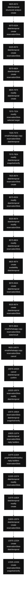

# bodyLLM internal scan

Archivo: `lib/handlers/messageHandler.ts`
Rango analizado: L5825-L12434
Tamaño estimado: 6610 líneas
Bucket size: 250

> Scan estático readonly. Sirve para mapear densidad interna de `bodyLLM`, no para modificar código.

---

## 1. Buckets internos de bodyLLM

| Rango | Top markers | returns | awaits | decisions | temporal/check markers |
| --- | --- | ---: | ---: | ---: | ---: |
| 5825-6074 | `date/temporal:77`, `structured analyze:52`, `create:25`, `graph/classifier/policy:24`, `state/result:20`, `reservationSlots:20`, `reply builders:16`, `faq/policies/amenities:13` | 7 | 3 | 13 | 26 |
| 6075-6324 | `date/temporal:71`, `create:51`, `reservationSlots:47`, `modify:44`, `availability:27`, `state/result:19`, `graph/classifier/policy:17`, `reply builders:16` | 10 | 9 | 16 | 24 |
| 6325-6574 | `date/temporal:121`, `create:79`, `reservationSlots:57`, `state/result:36`, `modify:21`, `availability:16`, `structured analyze:11`, `graph/classifier/policy:8` | 3 | 6 | 17 | 64 |
| 6575-6824 | `date/temporal:54`, `create:48`, `reservationSlots:44`, `state/result:38`, `modify:27`, `availability:24`, `reply builders:20`, `graph/classifier/policy:15` | 10 | 10 | 18 | 18 |
| 6825-7074 | `modify:84`, `date/temporal:68`, `create:33`, `reservationSlots:30`, `state/result:20`, `reply builders:16`, `email/whatsapp copy:14`, `conversationFocus:10` | 8 | 10 | 11 | 10 |
| 7075-7324 | `modify:73`, `reservationSlots:66`, `selected target:60`, `date/temporal:52`, `reply builders:28`, `email/whatsapp copy:23`, `state/result:21`, `snapshot/verify:10` | 8 | 7 | 15 | 17 |
| 7325-7574 | `email/whatsapp copy:122`, `reservationSlots:50`, `date/temporal:37`, `state/result:27`, `modify:22`, `structured analyze:20`, `snapshot/verify:16`, `graph/classifier/policy:15` | 10 | 18 | 17 | 8 |
| 7575-7824 | `modify:79`, `date/temporal:58`, `snapshot/verify:50`, `reservationSlots:36`, `confirm:23`, `reply builders:21`, `structured analyze:18`, `availability:15` | 11 | 12 | 12 | 11 |
| 7825-8074 | `date/temporal:121`, `reservationSlots:76`, `create:35`, `modify:33`, `snapshot/verify:33`, `state/result:25`, `reply builders:19`, `confirm:14` | 7 | 6 | 10 | 41 |
| 8075-8324 | `modify:97`, `date/temporal:88`, `reservationSlots:70`, `selected target:38`, `reply builders:31`, `state/result:25`, `email/whatsapp copy:22`, `snapshot/verify:19` | 8 | 11 | 14 | 22 |
| 8325-8574 | `date/temporal:160`, `modify:120`, `reservationSlots:104`, `reply builders:20`, `selected target:19`, `state/result:17`, `email/whatsapp copy:12`, `snapshot/verify:10` | 7 | 7 | 8 | 48 |
| 8575-8824 | `modify:136`, `date/temporal:101`, `reservationSlots:92`, `reply builders:45`, `state/result:39`, `early return:21`, `graph/classifier/policy:21`, `email/whatsapp copy:12` | 21 | 10 | 22 | 33 |
| 8825-9074 | `create:58`, `availability:56`, `date/temporal:56`, `reservationSlots:37`, `reply builders:25`, `state/result:19`, `graph/classifier/policy:16`, `early return:10` | 10 | 8 | 12 | 24 |
| 9075-9324 | `create:184`, `date/temporal:175`, `reservationSlots:43`, `reply builders:42`, `snapshot/verify:20`, `state/result:17`, `confirm:17`, `early return:11` | 11 | 8 | 12 | 29 |
| 9325-9574 | `create:127`, `date/temporal:94`, `reservationSlots:53`, `email/whatsapp copy:37`, `state/result:20`, `reply builders:17`, `early return:11`, `snapshot/verify:10` | 11 | 12 | 16 | 43 |
| 9575-9824 | `email/whatsapp copy:192`, `reservationSlots:86`, `state/result:38`, `date/temporal:34`, `snapshot/verify:13`, `early return:12`, `graph/classifier/policy:10`, `structured analyze:2` | 11 | 24 | 28 | 14 |
| 9825-10074 | `email/whatsapp copy:136`, `reservationSlots:79`, `cancel:55`, `date/temporal:35`, `state/result:31`, `confirm:18`, `create:15`, `early return:10` | 10 | 25 | 19 | 14 |
| 10075-10324 | `cancel:67`, `date/temporal:41`, `confirm:24`, `create:23`, `selected target:22`, `reservationSlots:21`, `reply builders:19`, `snapshot/verify:15` | 13 | 11 | 11 | 11 |
| 10325-10574 | `reservationSlots:75`, `modify:59`, `date/temporal:52`, `snapshot/verify:33`, `state/result:31`, `create:31`, `reply builders:27`, `early return:21` | 21 | 12 | 24 | 13 |
| 10575-10824 | `reservationSlots:73`, `date/temporal:71`, `snapshot/verify:70`, `reply builders:46`, `create:40`, `state/result:23`, `modify:18`, `confirm:17` | 11 | 12 | 15 | 23 |
| 10825-11074 | `date/temporal:48`, `reservationSlots:38`, `reply builders:24`, `snapshot/verify:23`, `canonical state:21`, `billing:21`, `confirm:18`, `state/result:14` | 10 | 6 | 12 | 22 |
| 11075-11324 | `graph/classifier/policy:56`, `reply builders:36`, `reservationSlots:27`, `state/result:18`, `create:13`, `billing:13`, `fallback:13`, `email/whatsapp copy:10` | 6 | 7 | 11 | 8 |
| 11325-11574 | `date/temporal:77`, `modify:55`, `reservationSlots:41`, `fallback:30`, `state/result:28`, `email/whatsapp copy:23`, `reply builders:23`, `create:21` | 1 | 8 | 14 | 14 |
| 11575-11824 | `date/temporal:165`, `modify:74`, `create:62`, `reservationSlots:57`, `reply builders:17`, `state/result:16`, `availability:9`, `email/whatsapp copy:8` | 4 | 5 | 8 | 45 |
| 11825-12074 | `date/temporal:158`, `create:45`, `reservationSlots:34`, `modify:27`, `state/result:19`, `confirm:19`, `reply builders:15`, `structured analyze:12` | 7 | 4 | 28 | 43 |
| 12075-12324 | `create:83`, `reservationSlots:62`, `date/temporal:54`, `modify:32`, `availability:30`, `state/result:25`, `reply builders:25`, `email/whatsapp copy:13` | 8 | 10 | 24 | 21 |
| 12325-12434 | `create:45`, `reservationSlots:22`, `snapshot/verify:20`, `date/temporal:12`, `modify:9`, `graph/classifier/policy:8`, `reply builders:8`, `state/result:7` | 1 | 4 | 8 | 6 |

---

## 2. Diagrama tentativo por buckets

```mermaid
flowchart TD
  B0["5825-6074<br/>date/temporal<br/>structured analyze<br/>create"]
  B1["6075-6324<br/>date/temporal<br/>create<br/>reservationSlots"]
  B2["6325-6574<br/>date/temporal<br/>create<br/>reservationSlots"]
  B3["6575-6824<br/>date/temporal<br/>create<br/>reservationSlots"]
  B4["6825-7074<br/>modify<br/>date/temporal<br/>create"]
  B5["7075-7324<br/>modify<br/>reservationSlots<br/>selected target"]
  B6["7325-7574<br/>email/whatsapp copy<br/>reservationSlots<br/>date/temporal"]
  B7["7575-7824<br/>modify<br/>date/temporal<br/>snapshot/verify"]
  B8["7825-8074<br/>date/temporal<br/>reservationSlots<br/>create"]
  B9["8075-8324<br/>modify<br/>date/temporal<br/>reservationSlots"]
  B10["8325-8574<br/>date/temporal<br/>modify<br/>reservationSlots"]
  B11["8575-8824<br/>modify<br/>date/temporal<br/>reservationSlots"]
  B12["8825-9074<br/>create<br/>availability<br/>date/temporal"]
  B13["9075-9324<br/>create<br/>date/temporal<br/>reservationSlots"]
  B14["9325-9574<br/>create<br/>date/temporal<br/>reservationSlots"]
  B15["9575-9824<br/>email/whatsapp copy<br/>reservationSlots<br/>state/result"]
  B16["9825-10074<br/>email/whatsapp copy<br/>reservationSlots<br/>cancel"]
  B17["10075-10324<br/>cancel<br/>date/temporal<br/>confirm"]
  B18["10325-10574<br/>reservationSlots<br/>modify<br/>date/temporal"]
  B19["10575-10824<br/>reservationSlots<br/>date/temporal<br/>snapshot/verify"]
  B20["10825-11074<br/>date/temporal<br/>reservationSlots<br/>reply builders"]
  B21["11075-11324<br/>graph/classifier/policy<br/>reply builders<br/>reservationSlots"]
  B22["11325-11574<br/>date/temporal<br/>modify<br/>reservationSlots"]
  B23["11575-11824<br/>date/temporal<br/>modify<br/>create"]
  B24["11825-12074<br/>date/temporal<br/>create<br/>reservationSlots"]
  B25["12075-12324<br/>create<br/>reservationSlots<br/>date/temporal"]
  B26["12325-12434<br/>create<br/>reservationSlots<br/>snapshot/verify"]

  B0 --> B1
  B1 --> B2
  B2 --> B3
  B3 --> B4
  B4 --> B5
  B5 --> B6
  B6 --> B7
  B7 --> B8
  B8 --> B9
  B9 --> B10
  B10 --> B11
  B11 --> B12
  B12 --> B13
  B13 --> B14
  B14 --> B15
  B15 --> B16
  B16 --> B17
  B17 --> B18
  B18 --> B19
  B19 --> B20
  B20 --> B21
  B21 --> B22
  B22 --> B23
  B23 --> B24
  B24 --> B25
  B25 --> B26

  classDef darkBox fill:#111111,stroke:#d1d5db,stroke-width:1px,color:#ffffff;
  class B0 darkBox;
  class B1 darkBox;
  class B2 darkBox;
  class B3 darkBox;
  class B4 darkBox;
  class B5 darkBox;
  class B6 darkBox;
  class B7 darkBox;
  class B8 darkBox;
  class B9 darkBox;
  class B10 darkBox;
  class B11 darkBox;
  class B12 darkBox;
  class B13 darkBox;
  class B14 darkBox;
  class B15 darkBox;
  class B16 darkBox;
  class B17 darkBox;
  class B18 darkBox;
  class B19 darkBox;
  class B20 darkBox;
  class B21 darkBox;
  class B22 darkBox;
  class B23 darkBox;
  class B24 darkBox;
  class B25 darkBox;
  class B26 darkBox;
```

---

## 3. Returns por bucket

### 5825-6074

- L5852: `return { finalText, nextCategory, nextSlots, needsSupervision, graphResult: null };`
- L5905: `return { finalText, nextCategory, nextSlots, needsSupervision, graphResult: null };`
- L5965: `return { finalText, nextCategory, nextSlots, needsSupervision, graphResult: null };`
- L5992: `return { finalText, nextCategory, nextSlots, needsSupervision, graphResult: null };`
- L6009: `return {`
- L6020: `return {`
- L6041: `return {`

### 6075-6324

- L6116: `return { finalText, nextCategory, nextSlots, needsSupervision, graphResult: null };`
- L6180: `return {`
- L6188: `return {`
- L6210: `return {`
- L6238: `return {`
- L6250: `return {`
- L6261: `return {`
- L6274: `return {`
- L6300: `return {`
- L6321: `return {`

### 6325-6574

- L6379: `return {`
- L6426: `return {`
- L6556: `return {`

### 6575-6824

- L6580: `return {`
- L6609: `return {`
- L6628: `return {`
- L6639: `return {`
- L6676: `return {`
- L6690: `return {`
- L6721: `return {`
- L6757: `return {`
- L6788: `return {`
- L6800: `return { finalText, nextCategory: modifyContextActiveFast ? "modify_reservation" : (pre.prevCategory ?? null), nextSlots, needsSupervision, graphResult: null };`

### 6825-7074

- L6833: `return {`
- L6844: `return {`
- L6881: `return {`
- L6894: `return {`
- L6920: `return {`
- L6955: `return { finalText, nextCategory: modifyContextActiveFast ? "modify_reservation" : (pre.prevCategory ?? null), nextSlots, needsSupervision, graphResult: null };`
- L6995: `return {`
- L7031: `return { finalText, nextCategory: "retrieval_based", nextSlots, needsSupervision, graphResult: null };`

### 7075-7324

- L7084: `return { finalText, nextCategory: "modify_reservation", nextSlots, needsSupervision, graphResult: null };`
- L7120: `return { finalText, nextCategory: "modify_reservation", nextSlots: holderGuardSlots, needsSupervision, graphResult: null };`
- L7146: `return { finalText, nextCategory: "reservation", nextSlots, needsSupervision, graphResult: null };`
- L7176: `return {`
- L7184: `return {`
- L7228: `return {`
- L7259: `return {`
- L7309: `return { finalText, nextCategory: "modify_reservation", nextSlots: knownSlots, needsSupervision, graphResult: null };`

### 7325-7574

- L7360: `return { finalText: finalTextWA, nextCategory: 'send_whatsapp_copy', nextSlots: pre.currSlots, needsSupervision: false, graphResult: null };`
- L7369: `return { finalText: failText, nextCategory: 'send_whatsapp_copy', nextSlots: pre.currSlots, needsSupervision: code && code !== 'WA_NOT_READY', graphResult: null };`
- L7379: `return { finalText: askNum, nextCategory: 'send_whatsapp_copy', nextSlots: pre.currSlots, needsSupervision: false, graphResult: null };`
- L7395: `return { finalText, nextCategory: 'send_email_copy', nextSlots, needsSupervision, graphResult };`
- L7404: `return { finalText, nextCategory: 'send_email_copy', nextSlots, needsSupervision, graphResult };`
- L7407: `const toDDMMYYYY = (iso?: string) => { if (!iso) return iso; const m = iso.match(/(\d{4})-(\d{2})-(\d{2})/); return m ? '${m[3]}/${m[2]}/${m[1]}' : iso; };`
- L7450: `return { finalText, nextCategory: 'send_email_copy', nextSlots, needsSupervision, graphResult };`
- L7467: `return { finalText, nextCategory: 'send_email_copy', nextSlots, needsSupervision, graphResult };`
- L7489: `return { finalText, nextCategory: 'send_email_copy', nextSlots, needsSupervision, graphResult };`
- L7498: `return { finalText, nextCategory: 'send_email_copy', nextSlots, needsSupervision, graphResult };`

### 7575-7824

- L7614: `return { finalText, nextCategory: "modify_reservation", nextSlots, needsSupervision, graphResult };`
- L7652: `return { finalText, nextCategory: "modify_reservation", nextSlots: currentPreviewSnapshot, needsSupervision, graphResult };`
- L7665: `return { finalText, nextCategory: "modify_reservation", nextSlots: updatedPreviewSnapshot, needsSupervision, graphResult };`
- L7668: `return { finalText, nextCategory: "modify_reservation", nextSlots: updatedPreviewSnapshot, needsSupervision, graphResult };`
- L7673: `return { finalText, nextCategory: "modify_reservation", nextSlots: currentPreviewSnapshot, needsSupervision, graphResult };`
- L7685: `return { finalText, nextCategory: "modify_reservation", nextSlots: currentPreviewSnapshot, needsSupervision, graphResult };`
- L7689: `return { finalText, nextCategory: "modify_reservation", nextSlots: currentPreviewSnapshot, needsSupervision, graphResult };`
- L7702: `return { finalText, nextCategory: "modify_reservation", nextSlots: currentPreviewSnapshot, needsSupervision, graphResult };`
- L7721: `return {`
- L7766: `return { finalText, nextCategory, nextSlots, needsSupervision, graphResult };`
- L7809: `return { finalText, nextCategory: "modify_reservation", nextSlots, needsSupervision, graphResult };`

### 7825-8074

- L7828: `return { finalText, nextCategory, nextSlots, needsSupervision, graphResult };`
- L7900: `return { finalText, nextCategory, nextSlots, needsSupervision, graphResult };`
- L7912: `return { finalText, nextCategory, nextSlots, needsSupervision, graphResult };`
- L7952: `return { finalText, nextCategory, nextSlots, needsSupervision, graphResult };`
- L7976: `return { finalText, nextCategory, nextSlots, needsSupervision, graphResult };`
- L7985: `return { finalText, nextCategory, nextSlots, needsSupervision, graphResult };`
- L8059: `return { finalText, nextCategory, nextSlots, needsSupervision, graphResult };`

### 8075-8324

- L8084: `return { finalText, nextCategory, nextSlots, needsSupervision, graphResult };`
- L8132: `return { finalText, nextCategory, nextSlots, needsSupervision, graphResult };`
- L8162: `return { finalText, nextCategory, nextSlots, needsSupervision, graphResult };`
- L8181: `return { finalText, nextCategory: "modify_reservation", nextSlots, needsSupervision, graphResult };`
- L8232: `return { finalText, nextCategory: "modify_reservation", nextSlots, needsSupervision, graphResult };`
- L8249: `return { finalText, nextCategory: "modify_reservation", nextSlots, needsSupervision, graphResult };`
- L8273: `return { finalText, nextCategory: "modify_reservation", nextSlots: holderGuardSlots, needsSupervision, graphResult };`
- L8321: `return { finalText, nextCategory: "modify_reservation", nextSlots, needsSupervision, graphResult };`

### 8325-8574

- L8336: `return { finalText, nextCategory: "modify_reservation", nextSlots, needsSupervision, graphResult };`
- L8354: `return { finalText, nextCategory: "modify_reservation", nextSlots: snapshot, needsSupervision, graphResult };`
- L8359: `return { finalText, nextCategory: "modify_reservation", nextSlots: snapshot, needsSupervision, graphResult };`
- L8372: `return { finalText, nextCategory: "modify_reservation", nextSlots, needsSupervision, graphResult };`
- L8397: `return { finalText, nextCategory: "modify_reservation", nextSlots, needsSupervision, graphResult };`
- L8409: `return { finalText, nextCategory: "modify_reservation", nextSlots, needsSupervision, graphResult };`
- L8451: `return { finalText, nextCategory: "modify_reservation", nextSlots, needsSupervision, graphResult };`

### 8575-8824

- L8582: `return { finalText, nextCategory: "modify_reservation", nextSlots, needsSupervision, graphResult };`
- L8588: `return { finalText, nextCategory: "modify_reservation", nextSlots, needsSupervision, graphResult };`
- L8608: `return { finalText, nextCategory: "modify_reservation", nextSlots, needsSupervision, graphResult };`
- L8639: `return { finalText, nextCategory: "modify_reservation", nextSlots, needsSupervision, graphResult };`
- L8645: `return { finalText, nextCategory: "modify_reservation", nextSlots, needsSupervision, graphResult };`
- L8651: `return { finalText, nextCategory: "modify_reservation", nextSlots, needsSupervision, graphResult };`
- L8657: `return { finalText, nextCategory: "modify_reservation", nextSlots, needsSupervision, graphResult };`
- L8679: `return { finalText, nextCategory: "modify_reservation", nextSlots, needsSupervision, graphResult };`
- L8700: `return { finalText, nextCategory: "modify_reservation", nextSlots, needsSupervision, graphResult };`
- L8714: `return { finalText, nextCategory: "modify_reservation", nextSlots, needsSupervision, graphResult };`
- L8718: `return { finalText, nextCategory: "modify_reservation", nextSlots, needsSupervision, graphResult };`
- L8724: `return { finalText, nextCategory: "modify_reservation", nextSlots, needsSupervision, graphResult };`
- L8744: `return { finalText, nextCategory: "modify_reservation", nextSlots, needsSupervision, graphResult };`
- L8758: `return { finalText, nextCategory: "modify_reservation", nextSlots, needsSupervision, graphResult };`
- L8762: `return { finalText, nextCategory: "modify_reservation", nextSlots, needsSupervision, graphResult };`
- L8768: `return { finalText, nextCategory: "modify_reservation", nextSlots, needsSupervision, graphResult };`
- L8773: `return { finalText, nextCategory: "modify_reservation", nextSlots, needsSupervision, graphResult };`
- L8794: `return { finalText, nextCategory: "modify_reservation", nextSlots, needsSupervision, graphResult };`
- L8808: `return { finalText, nextCategory: "modify_reservation", nextSlots, needsSupervision, graphResult };`
- L8814: `return { finalText, nextCategory: "modify_reservation", nextSlots, needsSupervision, graphResult };`
- L8822: `return { finalText, nextCategory: "modify_reservation", nextSlots, needsSupervision, graphResult };`

### 8825-9074

- L8871: `return { finalText, nextCategory: "reservation", nextSlots, needsSupervision, graphResult };`
- L8879: `return { finalText, nextCategory: "reservation", nextSlots, needsSupervision, graphResult };`
- L8889: `return { finalText, nextCategory: "reservation", nextSlots, needsSupervision, graphResult };`
- L8917: `return {`
- L8931: `return { finalText, nextCategory: "reservation", nextSlots, needsSupervision, graphResult };`
- L8966: `return {`
- L8981: `return { finalText, nextCategory: "availability_inquiry", nextSlots, needsSupervision, graphResult };`
- L9005: `return { finalText, nextCategory, nextSlots, needsSupervision, graphResult };`
- L9010: `return {`
- L9065: `return {`

### 9075-9324

- L9127: `return {`
- L9173: `return {`
- L9187: `return {`
- L9209: `return { finalText, nextCategory: "reservation", nextSlots, needsSupervision, graphResult };`
- L9239: `return { finalText, nextCategory: "reservation", nextSlots, needsSupervision: needsSupervision \|\| readyCreateResult.needsHandoff, graphResult };`
- L9255: `return { finalText, nextCategory: "reservation", nextSlots: pausedDraft, needsSupervision, graphResult };`
- L9260: `return { finalText, nextCategory: "reservation", nextSlots, needsSupervision, graphResult };`
- L9269: `return { finalText, nextCategory: "reservation", nextSlots, needsSupervision, graphResult };`
- L9295: `if (!quotedTurnDirectWeekdayMatch) return {} as { checkIn?: string; checkOut?: string };`
- L9298: `if (typeof startWeekday !== "number" \|\| typeof endWeekday !== "number") return {};`
- L9302: `return checkIn && checkOut ? { checkIn, checkOut } : {};`

### 9325-9574

- L9364: `return {`
- L9378: `return {`
- L9393: `return { finalText, nextCategory: "reservation", nextSlots, needsSupervision, graphResult };`
- L9423: `return { finalText, nextCategory: "reservation", nextSlots, needsSupervision, graphResult };`
- L9444: `return {`
- L9474: `return {`
- L9492: `return {`
- L9529: `return { finalText: buildAskGuestName(pre.lang), nextCategory, nextSlots, needsSupervision, graphResult };`
- L9543: `return { finalText, nextCategory: "send_email_copy", nextSlots, needsSupervision, graphResult };`
- L9546: `if (!iso) return iso;`
- L9547: `const m = iso.match(/(\d{4})-(\d{2})-(\d{2})/); return m ? '${m[3]}/${m[2]}/${m[1]}' : iso;`

### 9575-9824

- L9576: `return { finalText, nextCategory: "send_email_copy", nextSlots, needsSupervision, graphResult };`
- L9593: `return { finalText, nextCategory: 'send_email_copy', nextSlots, needsSupervision, graphResult };`
- L9614: `return { finalText: ask, nextCategory: 'send_email_copy', nextSlots, needsSupervision, graphResult };`
- L9617: `if (!iso) return iso; const m = iso.match(/(\d{4})-(\d{2})-(\d{2})/); return m ? '${m[3]}/${m[2]}/${m[1]}' : iso;`
- L9644: `return { finalText: ok, nextCategory: 'send_email_copy', nextSlots, needsSupervision, graphResult };`
- L9660: `return { finalText: fail, nextCategory: 'send_email_copy', nextSlots, needsSupervision, graphResult };`
- L9719: `return { finalText, nextCategory: 'send_whatsapp_copy', nextSlots, needsSupervision, graphResult };`
- L9731: `return { finalText, nextCategory: 'send_whatsapp_copy', nextSlots, needsSupervision, graphResult };`
- L9740: `return { finalText, nextCategory: 'send_whatsapp_copy', nextSlots, needsSupervision, graphResult };`
- L9775: `return { finalText, nextCategory: 'send_whatsapp_copy', nextSlots, needsSupervision, graphResult };`
- L9787: `return { finalText, nextCategory: 'send_whatsapp_copy', nextSlots, needsSupervision, graphResult };`

### 9825-10074

- L9840: `return { finalText, nextCategory: "send_whatsapp_copy", nextSlots, needsSupervision, graphResult };`
- L9852: `return { finalText, nextCategory: "send_whatsapp_copy", nextSlots, needsSupervision, graphResult };`
- L9862: `return { finalText, nextCategory: "send_whatsapp_copy", nextSlots, needsSupervision, graphResult };`
- L9897: `return { finalText, nextCategory: "send_whatsapp_copy", nextSlots, needsSupervision, graphResult };`
- L9909: `return { finalText, nextCategory: "send_whatsapp_copy", nextSlots, needsSupervision, graphResult };`
- L9954: `return { finalText, nextCategory: "send_whatsapp_copy", nextSlots, needsSupervision, graphResult };`
- L9966: `return { finalText, nextCategory: "send_whatsapp_copy", nextSlots, needsSupervision, graphResult };`
- L10025: `return { finalText, nextCategory: "cancel_reservation", nextSlots, needsSupervision, graphResult };`
- L10040: `return { finalText, nextCategory: "cancel_reservation", nextSlots, needsSupervision, graphResult };`
- L10053: `return { finalText, nextCategory: "cancel_reservation", nextSlots, needsSupervision, graphResult };`

### 10075-10324

- L10098: `return { finalText, nextCategory: "cancel_reservation", nextSlots, needsSupervision, graphResult };`
- L10111: `return { finalText, nextCategory: "cancel_reservation", nextSlots, needsSupervision, graphResult };`
- L10146: `return { finalText, nextCategory: "cancel_reservation", nextSlots: {}, needsSupervision, graphResult };`
- L10151: `return { finalText, nextCategory: "cancel_reservation", nextSlots, needsSupervision, graphResult };`
- L10162: `return { finalText, nextCategory: "cancel_reservation", nextSlots, needsSupervision, graphResult };`
- L10174: `return { finalText, nextCategory: "cancel_reservation", nextSlots, needsSupervision, graphResult };`
- L10194: `return { finalText, nextCategory: "cancel_reservation", nextSlots, needsSupervision, graphResult };`
- L10239: `return { finalText, nextCategory: "cancel_reservation", nextSlots, needsSupervision, graphResult };`
- L10252: `return { finalText, nextCategory: "cancel_reservation", nextSlots, needsSupervision, graphResult };`
- L10279: `return { finalText, nextCategory, nextSlots, needsSupervision, graphResult };`
- L10287: `return { finalText, nextCategory, nextSlots, needsSupervision, graphResult };`
- L10299: `return {`
- L10317: `return { finalText, nextCategory: "reservation", nextSlots, needsSupervision, graphResult };`

### 10325-10574

- L10332: `return { finalText, nextCategory: "reservation", nextSlots, needsSupervision, graphResult };`
- L10344: `return { finalText, nextCategory: "reservation", nextSlots, needsSupervision, graphResult };`
- L10350: `return { finalText, nextCategory, nextSlots, needsSupervision, graphResult };`
- L10353: `return { finalText, nextCategory, nextSlots, needsSupervision, graphResult };`
- L10373: `return { finalText, nextCategory, nextSlots, needsSupervision, graphResult };`
- L10389: `return { finalText, nextCategory: "modify_reservation", nextSlots, needsSupervision, graphResult };`
- L10424: `return { finalText, nextCategory: "modify_reservation", nextSlots, needsSupervision, graphResult };`
- L10437: `return { finalText, nextCategory: "modify_reservation", nextSlots: updatedPreviewSnapshot, needsSupervision, graphResult };`
- L10440: `return { finalText, nextCategory: "modify_reservation", nextSlots: updatedPreviewSnapshot, needsSupervision, graphResult };`
- L10445: `return { finalText, nextCategory: "modify_reservation", nextSlots: currentPreviewSnapshot, needsSupervision, graphResult };`
- L10457: `return { finalText, nextCategory: "modify_reservation", nextSlots: currentPreviewSnapshot, needsSupervision, graphResult };`
- L10461: `return { finalText, nextCategory: "modify_reservation", nextSlots: currentPreviewSnapshot, needsSupervision, graphResult };`
- L10474: `return { finalText, nextCategory: "modify_reservation", nextSlots: currentPreviewSnapshot, needsSupervision, graphResult };`
- L10515: `return { finalText, nextCategory: "reservation", nextSlots, needsSupervision, graphResult };`
- L10522: `return { finalText, nextCategory: "reservation", nextSlots, needsSupervision, graphResult };`
- L10545: `return { finalText, nextCategory: "reservation", nextSlots, needsSupervision, graphResult };`
- L10550: `return { finalText, nextCategory: "modify_reservation", nextSlots, needsSupervision, graphResult };`
- L10553: `return { finalText, nextCategory: "modify_reservation", nextSlots, needsSupervision, graphResult };`
- L10559: `return { finalText, nextCategory: "modify_reservation", nextSlots, needsSupervision, graphResult };`
- L10564: `return { finalText, nextCategory: "modify_reservation", nextSlots, needsSupervision, graphResult };`
- L10569: `return { finalText, nextCategory: "modify_reservation", nextSlots, needsSupervision, graphResult };`

### 10575-10824

- L10593: `return { finalText, nextCategory: "modify_reservation", nextSlots: snapshot, needsSupervision, graphResult };`
- L10597: `return { finalText, nextCategory: "modify_reservation", nextSlots: snapshot, needsSupervision, graphResult };`
- L10610: `return { finalText, nextCategory: "modify_reservation", nextSlots, needsSupervision, graphResult };`
- L10622: `return {`
- L10635: `return { finalText, nextCategory: "reservation", nextSlots, needsSupervision, graphResult };`
- L10640: `return { finalText, nextCategory: "reservation", nextSlots, needsSupervision, graphResult };`
- L10645: `return { finalText, nextCategory: "reservation", nextSlots, needsSupervision, graphResult };`
- L10727: `return {`
- L10741: `return { finalText, nextCategory: "reservation", nextSlots, needsSupervision, graphResult };`
- L10752: `return toBodyLLMResult(state);`
- L10803: `return { finalText, nextCategory, nextSlots, needsSupervision, graphResult: null, rich: undefined };`

### 10825-11074

- L10828: `return { finalText, nextCategory, nextSlots, needsSupervision, graphResult: null, rich: undefined };`
- L10844: `return { finalText, nextCategory, nextSlots, needsSupervision, graphResult: null, rich: undefined };`
- L10854: `return { finalText, nextCategory, nextSlots, needsSupervision, graphResult: null, rich: undefined };`
- L10863: `return { finalText, nextCategory, nextSlots, needsSupervision, graphResult: null, rich: undefined };`
- L10921: `return { finalText, nextCategory, nextSlots, needsSupervision, graphResult: null, rich: undefined };`
- L10926: `return { finalText, nextCategory, nextSlots, needsSupervision, graphResult: null, rich: undefined };`
- L10936: `return { finalText, nextCategory, nextSlots, needsSupervision, graphResult: null, rich: undefined };`
- L10956: `return { finalText, nextCategory, nextSlots, needsSupervision, graphResult: null, rich: undefined };`
- L10964: `return { finalText, nextCategory, nextSlots, needsSupervision, graphResult: null, rich: undefined };`
- L10983: `return keys.some((k) => hay.includes(k));`

### 11075-11324

- L11082: `return { finalText, nextCategory, nextSlots, needsSupervision, graphResult };`
- L11107: `return { finalText, nextCategory, nextSlots, needsSupervision, graphResult };`
- L11143: `return { finalText, nextCategory, nextSlots, needsSupervision, graphResult, rich: explicitRich };`
- L11165: `debugLog("[KB] fastpath return", { ok: kb.ok, safeCat, hasText: Boolean(text) });`
- L11217: `return { finalText, nextCategory, nextSlots, needsSupervision, graphResult };`
- L11245: `return { finalText, nextCategory, nextSlots, needsSupervision, graphResult };`

### 11325-11574

- L11559: `return { finalText, nextCategory: "modify_reservation", nextSlots, needsSupervision, graphResult };`

### 11575-11824

- L11599: `return { finalText, nextCategory: "modify_reservation", nextSlots, needsSupervision, graphResult };`
- L11611: `return { finalText, nextCategory: "modify_reservation", nextSlots, needsSupervision, graphResult };`
- L11632: `return { finalText, nextCategory: "modify_reservation", nextSlots, needsSupervision, graphResult };`
- L11658: `return { finalText, nextCategory: "modify_reservation", nextSlots, needsSupervision, graphResult };`

### 11825-12074

- L11828: `return { finalText, nextCategory, nextSlots, needsSupervision, graphResult };`
- L11837: `return { finalText, nextCategory, nextSlots, needsSupervision, graphResult };`
- L11863: `return { finalText, nextCategory, nextSlots, needsSupervision, graphResult };`
- L11871: `return { finalText, nextCategory, nextSlots, needsSupervision, graphResult };`
- L11986: `if (!iso) return iso \|\| '';`
- L11988: `return m ? '${m[3]}/${m[2]}/${m[1]}' : iso;`
- L12027: `const [dd, mm, yyyy] = d.split(/[\/\-]/); return '${yyyy}-${mm}-${dd}';`

### 12075-12324

- L12078: `return {`
- L12092: `return { finalText, nextCategory: "reservation", nextSlots, needsSupervision, graphResult };`
- L12101: `return { finalText, nextCategory: "reservation", nextSlots, needsSupervision, graphResult };`
- L12112: `return { finalText, nextCategory: "modify_reservation", nextSlots, needsSupervision, graphResult };`
- L12179: `return {`
- L12214: `return {`
- L12228: `return { finalText, nextCategory: "reservation", nextSlots, needsSupervision, graphResult };`
- L12235: `return { finalText, nextCategory: "reservation", nextSlots, needsSupervision, graphResult };`

### 12325-12434

- L12433: `return { finalText, nextCategory, nextSlots, needsSupervision, graphResult, rich };`

---

## 4. Awaits por bucket

### 5825-6074

- L5856: `const stableIntent = await runStableIntentsGuard({`
- L5944: `await updateConversationState(pre.msg.hotelId, pre.conversationId, {`
- L5975: `const hotel = await getHotelConfigSafe(pre.msg.hotelId);`

### 6075-6324

- L6170: `await updateConversationState(pre.msg.hotelId, pre.conversationId, {`
- L6189: `finalText: await persistModifyPreviewContext(pre, resolvedModifyTarget0, snapshot),`
- L6198: `await persistAvailabilityInquiry(pre, fastPathSlots);`
- L6218: `const availabilityResult = await runAvailabilityCheck(availabilityPre, fastPathSlots, dr0.checkIn, dr0.checkOut, {`
- L6227: `await persistAvailabilityInquiry(pre, nextSlots);`
- L6249: `await persistCreateDraftSnapshot(pre, createDraftConsistency.sanitizedSlots);`
- L6260: `await persistCreateDraft(pre, fastPathSlots);`
- L6273: `const previewResult = await buildModifyDatesPreviewWithAvailability(pre, previewTarget, fastPathSlots);`
- L6291: `await updateConversationState(pre.msg.hotelId, pre.conversationId, {`

### 6325-6574

- L6329: `const supportedDrFastRaw = await extractSupportedTemporalDateRange(userTxtFast, pre.lang);`
- L6378: `await persistCreateDraftSnapshot(pre, createDraftConsistency.sanitizedSlots);`
- L6389: `const readyCreateResult = await runAvailabilityCheck(`
- L6401: `await updateConversationState(pre.msg.hotelId, pre.conversationId, {`
- L6555: `await persistCreateDraftSnapshot(pre, sanitizedCreateSlots);`
- L6568: `await persistAvailabilityInquiry(pre, normalizedFastPathSlots);`

### 6575-6824

- L6589: `const availabilityResult = await runAvailabilityCheck(availabilityPre, fastPathSlots, ciISO, coISO, {`
- L6598: `await persistAvailabilityInquiry(pre, nextSlots);`
- L6627: `await persistCreateDraftSnapshot(pre, createDraftConsistency.sanitizedSlots);`
- L6637: `await persistCreateDraft(pre, normalizedFastPathSlots);`
- L6648: `const readyCreateResult = await runAvailabilityCheck(`
- L6658: `await updateConversationState(pre.msg.hotelId, pre.conversationId, {`
- L6689: `const previewResult = await buildModifyDatesPreviewWithAvailability(pre, previewTarget, fastPathSlots);`
- L6707: `await updateConversationState(pre.msg.hotelId, pre.conversationId, {`
- L6741: `await updateConversationState(pre.msg.hotelId, pre.conversationId, {`
- L6786: `await persistCreateDraftSnapshot(pre, sanitizedCreateSlots);`

### 6825-7074

- L6832: `await persistCreateDraftSnapshot(pre, createDraftConsistency.sanitizedSlots);`
- L6843: `await persistCreateDraft(pre, fastPathSlots);`
- L6853: `const readyCreateResult = await runAvailabilityCheck(`
- L6863: `await updateConversationState(pre.msg.hotelId, pre.conversationId, {`
- L6893: `const previewResult = await buildModifyDatesPreviewWithAvailability(pre, previewTarget, fastPathSlots);`
- L6911: `await updateConversationState(pre.msg.hotelId, pre.conversationId, {`
- L6932: `await updateConversationState(pre.msg.hotelId, pre.conversationId, {`
- L6982: `await updateConversationState(pre.msg.hotelId, pre.conversationId, {`
- L7017: `await updateConversationState(pre.msg.hotelId, pre.conversationId, {`
- L7060: `const userDatesFast = await extractSupportedTemporalDateRange(userTxt, pre.lang);`

### 7075-7324

- L7108: `await updateConversationState(pre.msg.hotelId, pre.conversationId, {`
- L7129: `await updateConversationState(pre.msg.hotelId, pre.conversationId, {`
- L7166: `await updateConversationState(pre.msg.hotelId, pre.conversationId, {`
- L7185: `finalText: await persistModifyPreviewContext(pre, resolvedFastReservationTarget, snapshot),`
- L7205: `await updateConversationState(pre.msg.hotelId, pre.conversationId, {`
- L7254: `await persistModifyExecutionContext(pre, resolvedFastReservationTarget.reservationId, {`
- L7307: `await updateConversationState(pre.msg.hotelId, pre.conversationId, modifyMenuPatch as any);`

### 7325-7574

- L7327: `const { sendReservationCopyWA } = await import('@/lib/whatsapp/sendReservationCopyWA');`
- L7328: `const { isWhatsAppReady } = await import('@/lib/adapters/whatsappBaileysAdapter');`
- L7329: `const { publishSendReservationCopy } = await import('@/lib/whatsapp/dispatch');`
- L7340: `await sendReservationCopyWA({ hotelId: pre.msg.hotelId, toJid: jid, summary, conversationId: pre.conversationId, channel: pre.msg.channel });`
- L7342: `const { published, requestId } = await publishSendReservationCopy({ hotelId: pre.msg.hotelId, toJid: jid, conversationId: pre.conversationId, channel: pre.msg.channel, summary });`
- L7345: `const { redis } = await import('@/lib/services/redis');`
- L7348: `const ack = await redis.get('wa:ack:${requestId}');`
- L7350: `await new Promise(r => setTimeout(r, 120));`
- L7389: `await updateConversationState(pre.msg.hotelId, pre.conversationId, { supervised: true, desiredAction: 'notify_reception', updatedBy: 'ai' } as any);`
- L7409: `const { sendReservationCopy } = await import('@/lib/email/sendReservationCopy');`
- L7424: `await sendReservationCopy({ hotelId: pre.msg.hotelId, to: lastEmail, summary, conversationId: pre.conversationId, channel: pre.msg.channel });`
- L7432: `const { classifyEmailError } = await import('@/lib/email/classifyEmailError');`
- L7440: `if (attempt < 2 && !sent) await new Promise(r => setTimeout(r, 150));`
- L7444: `await updateConversationState(pre.msg.hotelId, pre.conversationId, { lastEmailCopyAttempt: { to: lastEmail, failures: 0, updatedAt: new Date().toISOString(), lastErrorType: undefined }, lastCategory: `
- L7453: `const { classifyEmailError } = await import('@/lib/email/classifyEmailError');`
- L7461: `await updateConversationState(pre.msg.hotelId, pre.conversationId, { supervised: true, desiredAction: 'notify_reception', lastEmailCopyAttempt: { to: lastEmail, failures: prevFailures, updatedAt: new `
- L7469: `await updateConversationState(pre.msg.hotelId, pre.conversationId, { lastEmailCopyAttempt: { to: lastEmail, failures: prevFailures, updatedAt: new Date().toISOString(), lastError: rawMsg, lastErrorTyp`
- L7558: `await updateConversationState(pre.msg.hotelId, pre.conversationId, {`

### 7575-7824

- L7608: `await persistModifyExecutionContext(pre, pendingModifyPatchEarly.reservationId, {`
- L7628: `const correctionDates = await extractSupportedTemporalDateRange(userTxtRaw, pre.lang);`
- L7645: `await persistModifyExecutionContext(pre, pendingTarget.reservationId, {`
- L7658: `await persistModifyExecutionContext(pre, pendingTarget.reservationId, {`
- L7667: `finalText = await persistModifyPreviewContext(pre, pendingTarget, updatedPreviewSnapshot);`
- L7678: `await persistModifyExecutionContext(pre, pendingTarget.reservationId, {`
- L7688: `finalText = await executeModifyReservationWithSnapshot(pre, pendingTarget.reservationId, currentPreviewSnapshot);`
- L7692: `await updateConversationState(pre.msg.hotelId, pre.conversationId, {`
- L7745: `await updateConversationState(pre.msg.hotelId, pre.conversationId, {`
- L7774: `const earlyModifyDates = await extractSupportedTemporalDateRange(userTxtRaw, pre.lang);`
- L7792: `await updateConversationState(pre.msg.hotelId, pre.conversationId, {`
- L7813: `await updateConversationState(pre.msg.hotelId, pre.conversationId, {`

### 7825-8074

- L7842: `const createDraftTemporalDates = await extractSupportedTemporalDateRange(userTxtRaw, pre.lang);`
- L7927: `await updateConversationState(pre.msg.hotelId, pre.conversationId, {`
- L7956: `await updateConversationState(pre.msg.hotelId, pre.conversationId, {`
- L8053: `await updateConversationState(pre.msg.hotelId, pre.conversationId, {`
- L8063: `const reservationListSource = await resolveReservationListSource(pre);`
- L8073: `await updateConversationState(pre.msg.hotelId, pre.conversationId, {`

### 8075-8324

- L8089: `const reservationListSource = await resolveReservationListSource(pre);`
- L8108: `await updateConversationState(pre.msg.hotelId, pre.conversationId, {`
- L8120: `await updateConversationState(pre.msg.hotelId, pre.conversationId, {`
- L8127: `await updateConversationState(pre.msg.hotelId, pre.conversationId, {`
- L8147: `await updateConversationState(pre.msg.hotelId, pre.conversationId, {`
- L8173: `await updateConversationState(pre.msg.hotelId, pre.conversationId, {`
- L8207: `const directModifyUserDates = await extractSupportedTemporalDateRange(userTxtRaw, pre.lang);`
- L8236: `await updateConversationState(pre.msg.hotelId, pre.conversationId, {`
- L8261: `await updateConversationState(pre.msg.hotelId, pre.conversationId, {`
- L8281: `await updateConversationState(pre.msg.hotelId, pre.conversationId, {`
- L8312: `await updateConversationState(pre.msg.hotelId, pre.conversationId, {`

### 8325-8574

- L8344: `await updateConversationState(pre.msg.hotelId, pre.conversationId, {`
- L8358: `finalText = await persistModifyPreviewContext(pre, target, snapshot);`
- L8362: `await updateConversationState(pre.msg.hotelId, pre.conversationId, {`
- L8385: `await updateConversationState(pre.msg.hotelId, pre.conversationId, {`
- L8419: `await updateConversationState(pre.msg.hotelId, pre.conversationId, {`
- L8493: `? await extractSupportedTemporalDateRange(userTxtRaw, pre.lang)`
- L8566: `await updateConversationState(pre.msg.hotelId, pre.conversationId, {`

### 8575-8824

- L8584: `const previewResult = await buildModifyDatesPreviewWithAvailability(pre, previewTarget, ingestedSlots);`
- L8623: `await updateConversationState(pre.msg.hotelId, pre.conversationId, {`
- L8641: `const previewResult = await buildModifyDatesPreviewWithAvailability(pre, previewTarget, correctedSlots);`
- L8664: `await updateConversationState(pre.msg.hotelId, pre.conversationId, {`
- L8689: `await updateConversationState(pre.msg.hotelId, pre.conversationId, {`
- L8716: `finalText = await persistModifyPreviewContext(pre, previewTarget, snapshot);`
- L8733: `await updateConversationState(pre.msg.hotelId, pre.conversationId, {`
- L8760: `finalText = await persistModifyPreviewContext(pre, previewTarget, snapshot);`
- L8783: `await updateConversationState(pre.msg.hotelId, pre.conversationId, {`
- L8810: `const previewResult = await buildModifyDatesPreviewWithAvailability(pre, previewTarget, snapshot);`

### 8825-9074

- L8844: `await updateConversationState(pre.msg.hotelId, pre.conversationId, {`
- L8891: `const availabilityResult = await runAvailabilityCheck(`
- L8900: `await updateConversationState(pre.msg.hotelId, pre.conversationId, {`
- L8954: `await persistAvailabilityInquiry(pre, availabilityInquirySlots);`
- L8983: `const availabilityResult = await runAvailabilityCheck(availabilityPre, availabilityInquirySlots, inquiryCheckIn, inquiryCheckOut, {`
- L8992: `await persistAvailabilityInquiry(pre, nextSlots);`
- L9009: `await persistAvailabilityInquiry(pre, availabilityInquirySlots);`
- L9063: `await persistCreateDraftSnapshot(pre, createDraftConsistency.sanitizedSlots);`

### 9075-9324

- L9113: `await updateConversationState(pre.msg.hotelId, pre.conversationId, {`
- L9146: `const holderQuoteResult = await runAvailabilityCheck(`
- L9156: `await updateConversationState(pre.msg.hotelId, pre.conversationId, {`
- L9182: `await persistCreateDraft(pre, updatedHolderSnapshot);`
- L9211: `const readyCreateResult = await runAvailabilityCheck(`
- L9221: `await updateConversationState(pre.msg.hotelId, pre.conversationId, {`
- L9253: `await persistCreateDraft(pre, pausedDraft);`
- L9304: `const quotedTurnSupportedDates = await extractSupportedTemporalDateRange(trimmedQuotedReply, pre.lang);`

### 9325-9574

- L9362: `await persistCreateDraftSnapshot(pre, quotedDraftConsistency.sanitizedSlots);`
- L9374: `await persistCreateDraft(pre, quotedDraftConsistency.sanitizedSlots);`
- L9395: `const requoteResult = await runAvailabilityCheck(`
- L9405: `await updateConversationState(pre.msg.hotelId, pre.conversationId, {`
- L9426: `await persistCreateDraft(pre, quotedDraftConsistency.sanitizedSlots);`
- L9442: `await persistCreateDraft(pre, createDraftConsistency.sanitizedSlots);`
- L9472: `await persistCreateDraft(pre, createDraftConsistency.sanitizedSlots);`
- L9490: `await persistCreateDraft(pre, createDraftConsistency.sanitizedSlots);`
- L9511: `await updateConversationState(pre.msg.hotelId, pre.conversationId, {`
- L9549: `const { sendReservationCopy } = await import("@/lib/email/sendReservationCopy");`
- L9564: `await sendReservationCopy({ hotelId: pre.msg.hotelId, to: email, summary, conversationId: pre.conversationId, channel: pre.msg.channel });`
- L9567: `lastErr = err; attempt++; if (attempt < 2) await new Promise(r => setTimeout(r, 150));`

### 9575-9824

- L9619: `const { sendReservationCopy } = await import('@/lib/email/sendReservationCopy');`
- L9634: `await sendReservationCopy({ hotelId: pre.msg.hotelId, to: explicitEmail, summary, conversationId: pre.conversationId, channel: pre.msg.channel });`
- L9636: `} catch (err) { lastErr = err; attempt++; if (attempt < 2) await new Promise(r => setTimeout(r, 150)); }`
- L9685: `const { sendReservationCopyWA } = await import('@/lib/whatsapp/sendReservationCopyWA');`
- L9686: `const { isWhatsAppReady } = await import('@/lib/adapters/whatsappBaileysAdapter');`
- L9687: `const { publishSendReservationCopy } = await import('@/lib/whatsapp/dispatch');`
- L9698: `await sendReservationCopyWA({ hotelId: pre.msg.hotelId, toJid: jidInline, summary, conversationId: pre.conversationId, channel: pre.msg.channel });`
- L9700: `const { published, requestId } = await publishSendReservationCopy({ hotelId: pre.msg.hotelId, toJid: jidInline, conversationId: pre.conversationId, channel: pre.msg.channel, summary });`
- L9704: `const { redis } = await import('@/lib/services/redis');`
- L9707: `const ack = await redis.get('wa:ack:${requestId}');`
- L9709: `await new Promise(r => setTimeout(r, 120));`
- L9743: `const { sendReservationCopyWA } = await import('@/lib/whatsapp/sendReservationCopyWA');`
- L9744: `const { isWhatsAppReady } = await import('@/lib/adapters/whatsappBaileysAdapter');`
- L9745: `const { publishSendReservationCopy } = await import('@/lib/whatsapp/dispatch');`
- L9756: `await sendReservationCopyWA({ hotelId: pre.msg.hotelId, toJid: jid, summary, conversationId: pre.conversationId, channel: pre.msg.channel });`
- L9758: `const { published, requestId } = await publishSendReservationCopy({ hotelId: pre.msg.hotelId, toJid: jid, conversationId: pre.conversationId, channel: pre.msg.channel, summary });`
- L9761: `const { redis } = await import('@/lib/services/redis');`
- L9764: `const ack = await redis.get('wa:ack:${requestId}');`
- L9766: `await new Promise(r => setTimeout(r, 120));`
- L9807: `const { sendReservationCopyWA } = await import("@/lib/whatsapp/sendReservationCopyWA");`
- L9808: `const { isWhatsAppReady } = await import('@/lib/adapters/whatsappBaileysAdapter');`
- L9809: `const { publishSendReservationCopy } = await import('@/lib/whatsapp/dispatch');`
- L9820: `await sendReservationCopyWA({ hotelId: pre.msg.hotelId, toJid: jidInline, summary, conversationId: pre.conversationId, channel: pre.msg.channel });`
- L9822: `const { published, requestId } = await publishSendReservationCopy({ hotelId: pre.msg.hotelId, toJid: jidInline, conversationId: pre.conversationId, channel: pre.msg.channel, summary });`

### 9825-10074

- L9825: `const { redis } = await import('@/lib/services/redis');`
- L9828: `const ack = await redis.get('wa:ack:${requestId}');`
- L9830: `await new Promise(r => setTimeout(r, 120));`
- L9865: `const { sendReservationCopyWA } = await import("@/lib/whatsapp/sendReservationCopyWA");`
- L9866: `const { isWhatsAppReady } = await import('@/lib/adapters/whatsappBaileysAdapter');`
- L9867: `const { publishSendReservationCopy } = await import('@/lib/whatsapp/dispatch');`
- L9878: `await sendReservationCopyWA({ hotelId: pre.msg.hotelId, toJid: jid, summary, conversationId: pre.conversationId, channel: pre.msg.channel });`
- L9880: `const { published, requestId } = await publishSendReservationCopy({ hotelId: pre.msg.hotelId, toJid: jid, conversationId: pre.conversationId, channel: pre.msg.channel, summary });`
- L9883: `const { redis } = await import('@/lib/services/redis');`
- L9886: `const ack = await redis.get('wa:ack:${requestId}');`
- L9888: `await new Promise(r => setTimeout(r, 120));`
- L9921: `const { sendReservationCopyWA } = await import("@/lib/whatsapp/sendReservationCopyWA");`
- L9922: `const { isWhatsAppReady } = await import('@/lib/adapters/whatsappBaileysAdapter');`
- L9923: `const { publishSendReservationCopy } = await import('@/lib/whatsapp/dispatch');`
- L9934: `await sendReservationCopyWA({ hotelId: pre.msg.hotelId, toJid: jid, summary, conversationId: pre.conversationId, channel: pre.msg.channel });`
- L9936: `const { published, requestId } = await publishSendReservationCopy({ hotelId: pre.msg.hotelId, toJid: jid, conversationId: pre.conversationId, channel: pre.msg.channel, summary });`
- L9939: `const { redis } = await import('@/lib/services/redis');`
- L9942: `const ack = await redis.get('wa:ack:${requestId}');`
- L9944: `await new Promise(r => setTimeout(r, 120));`
- L10017: `await updateConversationState(pre.msg.hotelId, pre.conversationId, {`
- L10027: `await updateConversationState(pre.msg.hotelId, pre.conversationId, {`
- L10045: `await updateConversationState(pre.msg.hotelId, pre.conversationId, {`
- L10056: `const { cancelReservation } = await import("@/lib/agents/reservations");`
- L10057: `const r = await cancelReservation(pre.msg.hotelId, pendingCancellation.reservationId);`
- L10064: `await updateConversationState(pre.msg.hotelId, pre.conversationId, {`

### 10075-10324

- L10101: `await updateConversationState(pre.msg.hotelId, pre.conversationId, {`
- L10129: `await updateConversationState(pre.msg.hotelId, pre.conversationId, {`
- L10153: `await updateConversationState(pre.msg.hotelId, pre.conversationId, {`
- L10166: `await updateConversationState(pre.msg.hotelId, pre.conversationId, {`
- L10177: `await updateConversationState(pre.msg.hotelId, pre.conversationId, {`
- L10197: `const { cancelReservation } = await import("@/lib/agents/reservations");`
- L10198: `const r = await cancelReservation(pre.msg.hotelId, resolvedCancelCode);`
- L10205: `await updateConversationState(pre.msg.hotelId, pre.conversationId, {`
- L10242: `await updateConversationState(pre.msg.hotelId, pre.conversationId, {`
- L10260: `const hotel = await getHotelConfigSafe(pre.msg.hotelId);`
- L10297: `await persistCreateDraft(pre, createDraftSlots);`

### 10325-10574

- L10335: `await persistCreateDraft(pre, createDraftSlots);`
- L10348: `await persistCreateDraft(pre, createDraftSlots);`
- L10357: `await updateConversationState(pre.msg.hotelId, pre.conversationId, {`
- L10383: `await persistModifyExecutionContext(pre, pendingModifyPatch.reservationId, {`
- L10417: `await persistModifyExecutionContext(pre, pendingTarget.reservationId, {`
- L10430: `await persistModifyExecutionContext(pre, pendingTarget.reservationId, {`
- L10439: `finalText = await persistModifyPreviewContext(pre, pendingTarget, updatedPreviewSnapshot);`
- L10450: `await persistModifyExecutionContext(pre, pendingTarget.reservationId, {`
- L10460: `finalText = await executeModifyReservationWithSnapshot(pre, pendingTarget.reservationId, currentPreviewSnapshot);`
- L10464: `await updateConversationState(pre.msg.hotelId, pre.conversationId, {`
- L10506: `await updateConversationState(pre.msg.hotelId, pre.conversationId, {`
- L10524: `await updateConversationState(pre.msg.hotelId, pre.conversationId, {`

### 10575-10824

- L10582: `await updateConversationState(pre.msg.hotelId, pre.conversationId, {`
- L10596: `finalText = await persistModifyPreviewContext(pre, genericModifyTarget, snapshot);`
- L10600: `await updateConversationState(pre.msg.hotelId, pre.conversationId, {`
- L10620: `await persistCreateDraftSnapshot(pre, createDraftConsistency.sanitizedSlots);`
- L10633: `await persistCreateDraft(pre, snapshot as ReservationSlotsStrict);`
- L10648: `const { confirmAndCreate } = await import("@/lib/agents/reservations");`
- L10649: `const result = await confirmAndCreate(pre.msg.hotelId, snapshot as any, pre.msg.channel);`
- L10682: `await updateConversationState(pre.msg.hotelId, pre.conversationId, {`
- L10751: `if (await tryConversationalGuestNameCapture(pre, state)) {`
- L10785: `const reservationListSource = await resolveReservationListSource(pre);`
- L10796: `await updateConversationState(pre.msg.hotelId, pre.conversationId, {`
- L10821: `await updateConversationState(pre.msg.hotelId, pre.conversationId, {`

### 10825-11074

- L10837: `await updateConversationState(pre.msg.hotelId, pre.conversationId, {`
- L10929: `const hotel = await getHotelConfigSafe(pre.msg.hotelId);`
- L10940: `const hotel = await getHotelConfigSafe(pre.msg.hotelId);`
- L11043: `const kbForced = await answerWithKnowledge({`
- L11052: `finalText = await harmonizeBillingCurrencyAnswer(finalText, kbUserText, pre.msg.hotelId, pre.lang);`
- L11058: `finalText = await buildDeterministicBillingReply(pre.msg.hotelId, pre.lang, kbUserText);`

### 11075-11324

- L11088: `finalText = await buildDeterministicBillingReply(pre.msg.hotelId, pre.lang, kbUserText);`
- L11121: `hasRoomImages: await hotelHasRenderableRoomInventoryVisuals(pre),`
- L11126: `const richResolved = await runKbPrecedenceRichPath(pre, kbPrecedence.promptKey);`
- L11146: `const kb = await answerWithKnowledge({`
- L11194: `await persistCreateLateralCategoryIfNeeded(pre, kbUserText, dominantTurnDomain, nextCategory);`
- L11229: `await persistCreateLateralCategoryIfNeeded(pre, kbUserText, dominantTurnDomain, nextCategory);`
- L11261: `graphResult = await withTimeout(`

### 11325-11574

- L11332: `const rbState = await retrievalBased({`
- L11363: `await tryBodyLLMStructuredEnrichment(pre, state);`
- L11379: `await tryBodyLLMStructuredFallback(pre, state);`
- L11414: `await persistCreateDraft(pre, createGatingSlots);`
- L11426: `await updateConversationState(pre.msg.hotelId, pre.conversationId, {`
- L11458: `await persistCreateLateralCategoryIfNeeded(pre, rawTurnText, dominantTurnDomain, nextCategory);`
- L11514: `const temporalUserDates = await extractSupportedTemporalDateRange(userTxt, pre.lang);`
- L11543: `await updateConversationState(pre.msg.hotelId, pre.conversationId, {`

### 11575-11824

- L11583: `await updateConversationState(pre.msg.hotelId, pre.conversationId, {`
- L11607: `const previewResult = await buildModifyDatesPreviewWithAvailability(pre, previewTarget, ingestedSlots);`
- L11634: `await updateConversationState(pre.msg.hotelId, pre.conversationId, {`
- L11696: `await updateConversationState(pre.msg.hotelId, pre.conversationId, {`
- L11712: `const userDates = await extractSupportedTemporalDateRange(String(pre.msg.content \|\| ""), pre.lang);`

### 11825-12074

- L11830: `const hotel = await getHotelConfigSafe(pre.msg.hotelId);`
- L11845: `const hotel = await getHotelConfigSafe(pre.msg.hotelId);`
- L11902: `await updateConversationState(pre.msg.hotelId, pre.conversationId, {`
- L11935: `const cons = (await import('./pipeline/dateConsolidation')).consolidateDates({`

### 12075-12324

- L12076: `await persistCreateDraftSnapshot(pre, createDraftConsistency.sanitizedSlots);`
- L12090: `await persistCreateDraft(pre, createQuoteSlots);`
- L12122: `const previewResult = await buildModifyDatesPreviewWithAvailability(pre, modifyTarget, modifySnapshot);`
- L12135: `const res = await runAvailabilityCheck(availabilityPre, nextSlots, ciISO!, coISO!);`
- L12145: `await updateConversationState(pre.msg.hotelId, pre.conversationId, {`
- L12212: `await persistCreateDraftSnapshot(pre, createDraftConsistency.sanitizedSlots);`
- L12226: `await persistCreateDraft(pre, createQuoteSlots);`
- L12237: `const res = await runAvailabilityCheck(availabilityPre, { ...nextSlots }, ciISO, coISO);`
- L12242: `await persistModifyExecutionContext(pre, modifyReservationId, {`
- L12290: `finalText = await harmonizeBillingCurrencyAnswer(`

### 12325-12434

- L12335: `await updateConversationState(pre.msg.hotelId, pre.conversationId, {`
- L12357: `await persistCreateDraftSnapshot(pre, createDraftConsistency.sanitizedSlots);`
- L12363: `await persistCreateDraft(pre, quotedReservationSnapshot as ReservationSlotsStrict);`
- L12389: `await updateConversationState(pre.msg.hotelId, pre.conversationId, {`

---

## 5. Decisiones por bucket

### 5825-6074

- L5838: `if (correctedGuestName) {`
- L5880: `if (stableIntent.matched && stableIntent.response && !shouldSuppressStableIntent) {`
- L5890: `if (stableIntent.intentKey === "farewell") {`
- L5922: `if (`
- L5930: `if (continuation) finalText = '${String(finalText \|\| "").trim()} ${continuation}'.trim();`
- L5932: `if (shouldClearSelectedReservationTargetForCategory(nextCategory, null)) {`
- L5943: `if (!shouldPreserveModifyTarget) {`
- L5968: `if (`
- L5995: `if (rawCreateDateIssue) {`
- L6008: `if (!isNonReservationFollowup && rawCreateSubFlow === "create" && rawCreateIntent.kind !== "modify" && rawCreateIntent.kind !== "cancel" && hasExplicitCreateContext) {`
- L6018: `if (dominantTurnDomain.dominant === "pricing" && !dominantTurnDomain.hasReservation) {`
- L6039: `if (vagueWeekendReservationIntent) {`
- L6049: `// Fast-path 0: if the user provides an explicit full date range in the same message, confirm immediately`

### 6075-6324

- L6107: `if (dr0.checkIn && dr0.checkOut && !isEventLikeMessage && !hasCompleteRichCreatePayloadInTurn0) {`
- L6113: `if (dr0Coherence && !dr0Coherence.ok) {`
- L6149: `if (shouldBypassRichCreateFastPath \|\| shouldBypassRichModifyFastPath) {`
- L6153: `if (`
- L6168: `if (!fastModifyValidation.ok) {`
- L6169: `if (fastModifyValidation.nextField) {`
- L6196: `if (availabilityInquiryPolicy0) {`
- L6199: `if (inquiryMissingField) {`
- L6223: `if (!availabilityResult.needsHandoff) {`
- L6246: `if (fastPathSubFlow === "create") {`
- L6248: `if (!createDraftConsistency.valid) {`
- L6259: `if (missingField) {`
- L6270: `if (fastPathSubFlow === "modify") {`
- L6272: `if (previewTarget?.reservationId) {`
- L6290: `if (fastPathSubFlow === "modify") {`
- L6320: `if (ambiguousQuotedProposalConfirmationFast) {`

### 6325-6574

- L6354: `if (fastPathSubFlow === "create" && !explicitTurnSlotsFast.guestName) {`
- L6356: `if (safeLeadGuestName) explicitTurnSlotsFast.guestName = safeLeadGuestName;`
- L6372: `if (currentTurnReadyCreateFast) {`
- L6377: `if (!createDraftConsistency.valid) {`
- L6493: `if (hasOneDateOnly && hasContext && !shouldDeferSingleDateFastPath) {`
- L6494: `if (singleFastISO && reservationContextualMissingSideFast) {`
- L6504: `if (`
- L6512: `if (!normalizedFastPathSlots.numGuests) {`
- L6514: `if (explicitGuestCount) normalizedFastPathSlots.numGuests = explicitGuestCount;`
- L6517: `if (`
- L6529: `if (inheritedCheckOutCoherence && !inheritedCheckOutCoherence.ok) {`
- L6535: `if (`
- L6543: `if (isPastReservationDateISO(coISO) \|\| (checkOutCoherence && !checkOutCoherence.ok)) {`
- L6549: `if (!sanitizedCreateSlots.numGuests) {`
- L6551: `if (explicitGuestCount) sanitizedCreateSlots.numGuests = explicitGuestCount;`
- L6566: `if (availabilityInquiryPolicyFast) {`
- L6569: `if (inquiryMissingField) {`

### 6575-6824

- L6588: `if (ciISO && coISO) {`
- L6594: `if (!availabilityResult.needsHandoff) {`
- L6618: `if (fastPathSubFlow === "create") {`
- L6626: `if (!createDraftConsistency.valid) {`
- L6638: `if (missingField) {`
- L6647: `if (canAutoQuoteCreateFast && isCreateStateReadyForQuote(normalizedFastPathSlots) && ciISO && coISO) {`
- L6685: `if (ciISO && coISO) {`
- L6686: `if (fastPathSubFlow === "modify") {`
- L6688: `if (previewTarget?.reservationId) {`
- L6706: `if (fastPathSubFlow === "modify") {`
- L6730: `if (singleFastISO && fastPathSubFlow === "modify" && fastTemporalSideIntent) {`
- L6766: `if (`
- L6779: `if (`
- L6796: `if (drFast.checkIn && !explicitCheckOutFast && !isConfirmedBooking && isPastReservationCheckInISO(drFast.checkIn)) {`
- L6805: `if (last instanceof HumanMessage) {`
- L6807: `if (lastTxt.trim() === userTxtFast.trim()) hist.pop();`
- L6812: `if (prevISO && currISO) {`
- L6823: `if (fastPathSubFlow === "create") {`

### 6825-7074

- L6831: `if (!createDraftConsistency.valid) {`
- L6842: `if (missingField) {`
- L6852: `if (canAutoQuoteCreateFast) {`
- L6890: `if (fastPathSubFlow === "modify") {`
- L6892: `if (previewTarget?.reservationId) {`
- L6910: `if (fastPathSubFlow === "modify") {`
- L6931: `if (modifyContextActiveFast) {`
- L6961: `if (`
- L6978: `if (hasValueForQueuedField) {`
- L6981: `if (nextQueuedModifyState) {`
- L7016: `if (explicitModifyExitFast) {`

### 7075-7324

- L7082: `if (genericModify && (resolutionFast.status === "ambiguous" \|\| resolutionFast.status === "out_of_range")) {`
- L7094: `if (`
- L7122: `if (`
- L7148: `if (`
- L7164: `if (!fastInlineValidation.ok) {`
- L7165: `if (fastInlineValidation.nextField) {`
- L7192: `if (`
- L7204: `if (activeFieldFast) {`
- L7237: `if (`
- L7276: `if (canOpenModifyMenu) {`
- L7299: `if (resolvedFastReservationTarget?.reservationId) {`
- L7313: `if (pre.prevCategory === 'send_email_copy') {`
- L7317: `if (wantsWhatsApp) {`
- L7320: `if (phoneMatchWA) {`
- L7323: `if (norm.normalized) {`

### 7325-7574

- L7339: `if (isWhatsAppReady()) {`
- L7343: `if (!published) throw Object.assign(new Error('Remote dispatch publish failed'), { code: 'WA_REMOTE_DISPATCH_FAILED' });`
- L7344: `if (requestId) {`
- L7349: `if (ack) break;`
- L7387: `if (wantsEscalate) {`
- L7397: `if (emailInMsg \|\| wantsRetry) {`
- L7398: `if (!lastEmail) {`
- L7407: `const toDDMMYYYY = (iso?: string) => { if (!iso) return iso; const m = iso.match(/(\d{4})-(\d{2})-(\d{2})/); return m ? '${m[3]}/${m[2]}/${m[1]}' : iso; };`
- L7419: `if (summary.checkIn) summary.displayCheckIn = toDDMMYYYY(summary.checkIn);`
- L7420: `if (summary.checkOut) summary.displayCheckOut = toDDMMYYYY(summary.checkOut);`
- L7435: `if (cLoop.isNotConfigured \|\| cLoop.isQuota) {`
- L7440: `if (attempt < 2 && !sent) await new Promise(r => setTimeout(r, 150));`
- L7443: `if (sent) {`
- L7459: `if (prevFailures >= escalationThreshold) {`
- L7470: `if (isNotConfigured) {`
- L7476: `} else if (isQuota) {`
- L7557: `if (looksNonReservationDomainTurn && pre.st?.selectedReservationTarget && !shouldPreserveReservationSelectionForOverride) {`

### 7575-7824

- L7605: `if (awaitingModifyPreviewConfirmationEarly && pendingModifyPatchEarly?.reservationId) {`
- L7607: `if (!pendingTarget?.reservationId \|\| pendingTarget.reservationStatus === "cancelled" \|\| pendingTarget.reservationStatus === "error") {`
- L7644: `if (previewReject) {`
- L7655: `if (hasPreviewCorrections && !previewConfirm) {`
- L7657: `if (!previewValidation.ok) {`
- L7671: `if (!previewConfirm) {`
- L7677: `if (!previewValidation.ok) {`
- L7714: `if (`
- L7729: `if (`
- L7768: `if (`
- L7776: `if (`
- L7812: `if (explicitModifyExit) {`

### 7825-8074

- L7891: `if (`
- L7902: `if (`
- L7915: `if (`
- L7946: `if (`
- L7954: `if (ambiguousReservationAction) {`
- L7955: `if (ambiguousReservationAction === "modify") {`
- L7978: `if (`
- L8022: `if (`
- L8037: `if (targetId && target) {`
- L8062: `if (effectiveSnapshotQueryKind === "list") {`

### 8075-8324

- L8086: `if (effectiveSnapshotQueryKind && !resolvedSnapshotTarget) {`
- L8088: `if (localConfirmed.length === 0) {`
- L8092: `if (candidates.length === 1) {`
- L8113: `} else if (candidates.length > 1) {`
- L8126: `if (finalText) {`
- L8136: `if (effectiveSnapshotQueryKind && resolvedSnapshotTarget) {`
- L8171: `if (modifyFocusActiveEarly && explicitReservationCode && !explicitIdReservationTarget && !explicitOrdinalReservationTarget) {`
- L8225: `if (`
- L8230: `if (!target?.reservationId) {`
- L8234: `if (target.reservationStatus === "cancelled" \|\| target.reservationStatus === "error") {`
- L8251: `if (wantsConfirmedHolderChange) {`
- L8304: `if (!hasImmediateModifyValue && hasExplicitModifyFieldRequest && hasExplicitModifyTarget) {`
- L8311: `if (activeField) {`
- L8324: `if (hasImmediateModifyValue && hasExplicitModifyTarget && target.reservationId && directImmediateModifyFields.length > 0) {`

### 8325-8574

- L8334: `if (modifyDateCoherence && !modifyDateCoherence.ok) {`
- L8341: `if (nextRoomTypeForCapacity && hasValidGuestCount) {`
- L8343: `if (capacity > 0 && nextGuestCountNumber > capacity) {`
- L8375: `if (!hasImmediateModifyValue && hasTemporalModifySignal) {`
- L8399: `if (!hasImmediateModifyValue) {`
- L8412: `if (`
- L8453: `if (`
- L8544: `if (`

### 8575-8824

- L8580: `if (!previewTarget?.reservationId) {`
- L8591: `if (activeModifyField === "dates" && hasModifyDateCorrection) {`
- L8601: `if (correctedTemporalISO) {`
- L8606: `if (modifyDateCoherence && !modifyDateCoherence.ok) {`
- L8637: `if (!previewTarget?.reservationId) {`
- L8649: `if (!hasTurnLevelModifyValue && !awaitingModifyExecutionContinuation) {`
- L8654: `if (activeModifyField === "guests" && nextGuestCount) {`
- L8655: `if (!codeFromModifySubstate) {`
- L8661: `if (baseRoomType && hasValidGuestCount) {`
- L8663: `if (capacity > 0 && nextGuestCountNumber > capacity) {`
- L8683: `if (queuedModifyState) {`
- L8712: `if (!previewTarget?.reservationId) {`
- L8721: `if (activeModifyField === "roomType" && nextRoomType && String(nextRoomType) !== String(pre.st?.reservationSlots?.roomType \|\| "")) {`
- L8722: `if (!codeFromModifySubstate) {`
- L8727: `if (queuedModifyState) {`
- L8756: `if (!previewTarget?.reservationId) {`
- L8765: `if (activeModifyField === "dates" && hasExplicitDateRange && nextCheckIn && nextCheckOut) {`
- L8766: `if (!codeFromModifySubstate) {`
- L8771: `if (modifyDateCoherence && !modifyDateCoherence.ok) {`
- L8776: `if (queuedModifyState) {`
- L8806: `if (!previewTarget?.reservationId) {`
- L8817: `if (awaitingModifyExecutionContinuation) {`

### 8825-9074

- L8836: `if (additionalReservationIntent && hasConfirmedBookingContext) {`
- L8865: `if (hasCheckIn && !hasCheckOut) {`
- L8873: `if (!hasCheckIn && hasCheckOut) {`
- L8881: `if (hasCheckIn && hasCheckOut) {`
- L8883: `if (missingField) {`
- L8951: `if (shouldHandleAvailabilityInquiry) {`
- L8953: `if (inquiryMissingField) {`
- L8977: `if (inquiryCheckIn && inquiryCheckOut) {`
- L8979: `if (inquiryDateCoherence && !inquiryDateCoherence.ok) {`
- L8988: `if (!availabilityResult.needsHandoff) {`
- L9008: `if (availabilityInquiryAmbiguousAdvance) {`
- L9062: `if (!createDraftConsistency.valid) {`

### 9075-9324

- L9108: `if (draftHolderCorrectionActive) {`
- L9112: `if (!holderCandidate) {`
- L9145: `if (shouldQuoteUpdatedHolder) {`
- L9195: `if (`
- L9207: `if (readyCreateDateCoherence && !readyCreateDateCoherence.ok) {`
- L9241: `if (pendingCreateProposal && !modifyExecutionActive) {`
- L9251: `if (quotedReplyIsNegative) {`
- L9258: `if (!strictQuotedConfirmation && quotedReplyHasConfirmWord) {`
- L9263: `if (!strictQuotedConfirmation && quotedReplyIsBareAffirmative) {`
- L9272: `if (!strictQuotedConfirmation) {`
- L9295: `if (!quotedTurnDirectWeekdayMatch) return {} as { checkIn?: string; checkOut?: string };`
- L9298: `if (typeof startWeekday !== "number" \|\| typeof endWeekday !== "number") return {};`

### 9325-9574

- L9359: `if (hasQuotedProposalCorrection) {`
- L9361: `if (!quotedDraftConsistency.valid) {`
- L9372: `if (!isCreateStateReadyForQuote(quotedDraftConsistency.sanitizedSlots)) {`
- L9389: `if (hasQuotedProposalDateCorrection && requoteCheckIn && requoteCheckOut) {`
- L9391: `if (requoteCoherence && !requoteCoherence.ok) {`
- L9431: `if (`
- L9466: `if (`
- L9482: `if (`
- L9500: `if (`
- L9534: `if (emailAskRE.test(userTxtRaw)) {`
- L9537: `if (!email) {`
- L9546: `if (!iso) return iso;`
- L9559: `if (summary.checkIn) summary.displayCheckIn = toDDMMYYYY(summary.checkIn);`
- L9560: `if (summary.checkOut) summary.displayCheckOut = toDDMMYYYY(summary.checkOut);`
- L9567: `lastErr = err; attempt++; if (attempt < 2) await new Promise(r => setTimeout(r, 150));`
- L9570: `if (sentOK) {`

### 9575-9824

- L9606: `if (!emailAskRE.test(userTxtRaw) && recentReservationMention && lightVerb && (hasEmailAddr \|\| mentionsEmailWord)) {`
- L9608: `if (!explicitEmail) {`
- L9617: `if (!iso) return iso; const m = iso.match(/(\d{4})-(\d{2})-(\d{2})/); return m ? '${m[3]}/${m[2]}/${m[1]}' : iso;`
- L9629: `if (summary.checkIn) summary.displayCheckIn = toDDMMYYYY(summary.checkIn);`
- L9630: `if (summary.checkOut) summary.displayCheckOut = toDDMMYYYY(summary.checkOut);`
- L9636: `} catch (err) { lastErr = err; attempt++; if (attempt < 2) await new Promise(r => setTimeout(r, 150)); }`
- L9638: `if (sentOK) {`
- L9672: `if (!waAskRE.test(userTxtRaw) && waLightAskRE.test(userTxtRaw) && (pre.st?.lastReservation \|\| recentReservationMention)) {`
- L9677: `if (!jid) {`
- L9679: `if (phoneInline) {`
- L9681: `if (attempt.normalized) {`
- L9697: `if (isWhatsAppReady()) {`
- L9701: `if (!published) throw Object.assign(new Error('Remote dispatch publish failed'), { code: 'WA_REMOTE_DISPATCH_FAILED' });`
- L9703: `if (requestId) {`
- L9708: `if (ack) break;`
- L9723: `if (code !== 'WA_NOT_READY') {`
- L9755: `if (isWhatsAppReady()) {`
- L9759: `if (!published) throw Object.assign(new Error('Remote dispatch publish failed'), { code: 'WA_REMOTE_DISPATCH_FAILED' });`
- L9760: `if (requestId) {`
- L9765: `if (ack) break;`
- L9779: `if (code !== 'WA_NOT_READY') {`
- L9792: `if (waAskRE.test(userTxtRaw)) {`
- L9798: `if (!jid) {`
- L9801: `if (phoneInline) {`
- L9803: `if (attempt.normalized) {`
- L9819: `if (isWhatsAppReady()) {`
- L9823: `if (!published) throw Object.assign(new Error('Remote dispatch publish failed'), { code: 'WA_REMOTE_DISPATCH_FAILED' });`
- L9824: `if (requestId) {`

### 9825-10074

- L9829: `if (ack) break;`
- L9844: `if (code !== 'WA_NOT_READY') {`
- L9877: `if (isWhatsAppReady()) {`
- L9881: `if (!published) throw Object.assign(new Error('Remote dispatch publish failed'), { code: 'WA_REMOTE_DISPATCH_FAILED' });`
- L9882: `if (requestId) {`
- L9887: `if (ack) break;`
- L9901: `if (code !== 'WA_NOT_READY') {`
- L9914: `if (pre.prevCategory === "send_whatsapp_copy") {`
- L9916: `if (phoneMatch) {`
- L9918: `if (digits.length >= 6) {`
- L9933: `if (isWhatsAppReady()) {`
- L9937: `if (!published) throw Object.assign(new Error('Remote dispatch publish failed'), { code: 'WA_REMOTE_DISPATCH_FAILED' });`
- L9938: `if (requestId) {`
- L9943: `if (ack) break;`
- L9958: `if (code !== 'WA_NOT_READY') {`
- L10014: `if (inCancelFlow && cancelCodeFromUser && !isPureConfirm(userTxtRaw)) {`
- L10016: `if (canonicalCancelTarget && canonicalCancelTarget.canonicalStatus !== "active") {`
- L10042: `if (pendingCancellation?.reservationId && pendingCancellation.awaitingConfirmation && isPureConfirm(userTxtRaw)) {`
- L10044: `if (canonicalCancelTarget && canonicalCancelTarget.canonicalStatus !== "active") {`

### 10075-10324

- L10114: `if (wantsCancel) {`
- L10115: `if (`
- L10148: `if (!resolvedCancelCode) {`
- L10149: `if (reservationReference.status === "ambiguous" \|\| reservationReference.status === "out_of_range") {`
- L10165: `if (canonicalCancelTarget && canonicalCancelTarget.canonicalStatus !== "active") {`
- L10176: `if (!(isPureConfirm(userTxtRaw) \|\| hasInlineCancelConfirmation)) {`
- L10257: `if (offeredTimeSide && isPureAffirmative(userTxtRaw, pre.lang)) {`
- L10263: `if (time && typeof time === "string") {`
- L10290: `if (`
- L10307: `if (`
- L10319: `if (`

### 10325-10574

- L10325: `if (!isReservationConfirmable && !modifyExecutionActive && !hasCreateQuoteConfirmationContext) {`
- L10326: `if (reservationFlow === "confirmed") {`
- L10331: `: "There is already a confirmed booking on this conversation. Tell me if you want to modify or cancel it.";`
- L10334: `if (activeCreateFlow && nextCreateMissingField) {`
- L10346: `if (!hasGuests) {`
- L10347: `if (activeCreateFlow && pre.msg.channel === "email" && nextCreateMissingField) {`
- L10355: `if (!hasGuestName) {`
- L10356: `if (!modifyExecutionActive) {`
- L10376: `if (modifyExecutionActive) {`
- L10380: `if (awaitingModifyPreviewConfirmation && pendingModifyPatch?.reservationId) {`
- L10382: `if (!pendingTarget?.reservationId \|\| pendingTarget.reservationStatus === "cancelled" \|\| pendingTarget.reservationStatus === "error") {`
- L10416: `if (previewReject) {`
- L10427: `if (hasPreviewCorrections && !previewConfirm) {`
- L10429: `if (!previewValidation.ok) {`
- L10443: `if (!previewConfirm) {`
- L10449: `if (!previewValidation.ok) {`
- L10496: `if (`
- L10504: `if (!hasChanges) {`
- L10505: `if (hasDraftHolderCorrectionIntent(userTxtRaw)) {`
- L10547: `if (!codeFromUser) {`
- L10548: `if (reservationReference.status === "ambiguous" \|\| reservationReference.status === "out_of_range") {`
- L10555: `if (!hasChanges) {`
- L10562: `if (modifyDateCoherence && !modifyDateCoherence.ok) {`
- L10567: `if (!genericModifyTarget?.reservationId \|\| genericModifyTarget.reservationStatus === "cancelled" \|\| genericModifyTarget.reservationStatus === "error") {`

### 10575-10824

- L10580: `if (!genericModifyValidation.ok) {`
- L10581: `if (genericModifyValidation.nextField) {`
- L10613: `if (hasCreateQuoteConfirmationContext) {`
- L10619: `if (!createDraftConsistency.valid) {`
- L10630: `if (!isCreateStateReadyForQuote(snapshot as ReservationSlotsStrict)) {`
- L10632: `if (missingField) {`
- L10638: `if (!snapshot.roomType \|\| !snapshot.checkIn \|\| !snapshot.checkOut) {`
- L10643: `if (createDateCoherence && !createDateCoherence.ok) {`
- L10653: `if (result.ok && hasReservationId && providerReservation) {`
- L10703: `if (canonicalRecordForReply) {`
- L10751: `if (await tryConversationalGuestNameCapture(pre, state)) {`
- L10755: `if (!tryBodyLLMTestGreetingFastpath(pre, state)) {`
- L10779: `if (`
- L10788: `if (postBookingSnapshotQ === "list") {`
- L10805: `if (candidates.length === 1) {`

### 10825-11074

- L10830: `if (candidates.length > 1) {`
- L10847: `if (postBookingSnapshotQ && !hasConfirmedBookingContext) {`
- L10856: `if (`
- L10865: `if (`
- L10871: `if (postBookingSnapshotQ === "list") {`
- L10923: `if (postBookingLateCheckoutQ && hasConfirmedBookingContext) {`
- L10928: `if (postBookingEarlyCheckinQ && hasConfirmedBookingContext) {`
- L10938: `if (postBookingTimeQ && hasConfirmedBookingContext) {`
- L11036: `if (wantsNearby) {`
- L11039: `if (looksBillingByRule) {`
- L11050: `if (kbForced.ok && forcedText) {`
- L11057: `if (/(actividad\|actividades\|zona\|lugares para visitar\|restaurants? cercanos\|atracciones)/i.test(finalText)) {`

### 11075-11324

- L11087: `if (!forcedBillingResolved) {`
- L11110: `if (!hasReservationContext && !wantsNearby && !looksEventIntent && !looksTransactionalPricing) {`
- L11112: `if (skipKbFastpath) {`
- L11125: `if (kbPrecedence?.promptKey === "room_info_img" && !kbPrecedence.defersToRuntimeAction) {`
- L11127: `if (richResolved) {`
- L11163: `if (kb.ok && safeCat && text) {`
- L11178: `if (`
- L11190: `if (continuation) {`
- L11223: `if (pureCreateLateralTurn && !pureCreateLateralKbResolved) {`
- L11225: `if (failsafeReply) {`
- L11311: `if (typeof merged.numGuests !== "undefined" && typeof merged.numGuests !== "string") {`

### 11325-11574

- L11329: `if (noContent && isNearby) {`
- L11345: `if (rbRich) explicitRich = rbRich;`
- L11346: `if (rbText) {`
- L11389: `if (!finalText) {`
- L11391: `if (!(pre as any).__orchestratorActive) {`
- L11413: `if (createFlowActive && createMissingField === "guestName" && nextCategory === "reservation") {`
- L11420: `if (reservationLocalFallbackNeeded) {`
- L11425: `if (Object.keys(fallbackSlots).length > 0) {`
- L11460: `if (pre.inModifyMode) {`
- L11462: `if (isContactHotelText(finalText, pre.lang)) {`
- L11473: `if (!ackedVerifyInThisReply && noNewChangeData && isQuoteOrConfirmText(finalText, pre.lang)) {`
- L11534: `if (`
- L11561: `if (!activeModifyField && (requestedChangeDates \|\| requestedChangeRoom \|\| requestedChangeGuests \|\| hasImplicitModifyValueFollowup)) {`
- L11562: `if ((pre.inModifyMode \|\| pre.prevCategory === "modify_reservation") && (hasBoundReservationTarget \|\| pre.prevCategory === "modify_reservation")) {`

### 11575-11824

- L11578: `if (hasImmediateFieldValue) {`
- L11596: `if (pendingRequestedFields.length > 0) {`
- L11601: `if (activeField === "dates" && ingestedSlots.checkIn && ingestedSlots.checkOut) {`
- L11606: `if (previewTarget?.reservationId) {`
- L11642: `if (activeField === "dates") {`
- L11644: `} else if (activeField === "guests") {`
- L11680: `if (pre.inModifyMode && wantsGenericModify(String(pre.msg.content \|\| ""), pre.lang) && (nextSlots.checkIn \|\| pre.st?.reservationSlots?.checkIn) && (nextSlots.checkOut \|\| pre.st?.reservationSlots?.chec`
- L11695: `if (resolvedModifyTarget?.reservationId) {`

### 11825-12074

- L11825: `if (lateCheckoutQ) {`
- L11829: `} else if (earlyCheckinQ) {`
- L11838: `} else if (timeQ) {`
- L11843: `if (hasConfirmedBookingContext) {`
- L11849: `if (time && typeof time === "string") {`
- L11876: `if (!nextCategory) nextCategory = "retrieval_based";`
- L11878: `} else if (triggerDateFlow) {`
- L11892: `if (shouldPersistPartialModifyDate && modifyTemporalSideIntent) {`
- L11919: `if (!hasDateTokenInMsg) {`
- L11921: `if (modifyTemporalSideIntent && (userDates.checkIn \|\| userDates.checkOut)) {`
- L11926: `} else if (sideIntent) {`
- L11928: `if (sideIntent === 'checkIn') preserveAskCheckIn = finalText; // preservar si luego se genera confirmación accidental`
- L11929: `} else if (mentionsNewDates \|\| mentionsDates) {`
- L11947: `if (cons.changed) {`
- L11951: `if (!userModifiesCheckInWithoutDate && (isEmpty \|\| cons.finalText)) {`
- L11953: `if (cons.finalText) finalText = cons.finalText;`
- L11955: `if (cons.preservedPrompt && /anot[eé] nuevas fechas\|anotei as novas datas\|noted the new dates/i.test(finalText \|\| '')) {`
- L11979: `if (newCI && newCO && (newCI !== prevCI \|\| newCO !== prevCO)) {`
- L11984: `if ((!txt \|\| genericAck \|\| !hasDatesMentioned)) {`
- L11986: `if (!iso) return iso \|\| '';`
- L11993: `if (!modifyExecutionActive && !createQuoteReady && !/¿cu[aá]l es la fecha de check\-?out\|what is the check\-?out date\|qual é a data de check\-?out/i.test(txt)) {`
- L12011: `if (hasDuplicateRange) {`
- L12018: `if (m instanceof HumanMessage) {`
- L12021: `if (dates.length === 1 && dates[0] !== currentDate) { previousSingle = dates[0]; break; }`
- L12024: `if (previousSingle && currentDate) {`
- L12038: `if (!modifyExecutionActive) {`
- L12056: `if (isVerifyAvailabilityAffirmative) {`
- L12073: `if (quoteGatedCreateFlow) {`

### 12075-12324

- L12075: `if (!createDraftConsistency.valid) {`
- L12087: `if (quoteGatedCreateFlow && !isCreateStateReadyForQuote(createQuoteSlots)) {`
- L12089: `if (missingField && (pre.msg.channel === "email" \|\| missingField === "checkIn" \|\| missingField === "checkOut" \|\| missingField === "roomType")) {`
- L12097: `if (ci && co) {`
- L12099: `if (availabilityDateCoherence && !availabilityDateCoherence.ok) {`
- L12105: `if (modifyExecutionActive) {`
- L12110: `if (!modifyTarget?.reservationId) {`
- L12163: `if (availabilityNeedsHandoff) {`
- L12177: `if (missing) finalText = buildAskMissingDate(pre.lang, missing as any, modifyExecutionActive ? "modify" : "create");`
- L12191: `if (isAskAvailabilityStatusQuery(String(pre.msg.content \|\| ""), pre.lang)) {`
- L12209: `if (quoteGatedCreateFlow) {`
- L12211: `if (!createDraftConsistency.valid) {`
- L12223: `if (quoteGatedCreateFlow && !isCreateStateReadyForQuote(createQuoteSlots)) {`
- L12225: `if (missingField && (pre.msg.channel === "email" \|\| missingField === "checkIn" \|\| missingField === "checkOut" \|\| missingField === "roomType")) {`
- L12231: `if (ciISO && coISO) {`
- L12233: `if (availabilityStatusDateCoherence && !availabilityStatusDateCoherence.ok) {`
- L12240: `if (modifyExecutionActive) {`
- L12257: `if (res.needsHandoff) {`
- L12285: `if (isAmenitiesTurn) {`
- L12289: `if (isBillingTurn) {`
- L12299: `if (isSupportTurn) {`
- L12312: `if (`
- L12319: `if (continuation) {`
- L12323: `if (shouldClearSelectedReservationTargetForCategory(nextCategory, promptKeyUsed)) {`

### 12325-12434

- L12334: `if (!shouldPreserveModifyTarget) {`
- L12349: `if (`
- L12356: `if (!createDraftConsistency.valid) {`
- L12360: `} else if (!isCreateStateReadyForQuote(quotedReservationSnapshot as ReservationSlotsStrict)) {`
- L12362: `if (missingField) {`
- L12369: `if (`
- L12380: `if (`
- L12417: `if (!(graphResult as any)?.meta?.debug?.route_source && finalText) {`

---

## 6. Líneas relevantes para temporal/checkIn/checkOut/numGuests

### 5825-6074

- L5886: `? "checkout_info"`
- L5888: `? "checkin_info"`
- L5910: `stableTurnSlots.checkIn \|\|`
- L5911: `stableTurnSlots.checkOut \|\|`
- L5913: `stableTurnSlots.numGuests \|\|`
- L5915: `extractRawOrderedDateRange(rawTurnText)?.checkIn`
- L5925: `isLateralTurn: nextCategory === "amenities_info" \|\| nextCategory === "checkin_info" \|\| nextCategory === "checkout_info",`
- L5967: `const earlyCheckinShortcutQ = detectEarlyCheckinQuestion(rawTurnText, pre.lang);`
- L5969: `earlyCheckinShortcutQ &&`
- L5976: `const { checkIn: confCheckIn } = getConfiguredCheckTimes(hotel);`
- L5977: `finalText = buildEarlyCheckinResponse(pre.lang, guestState, {`
- L5978: `checkInTime: confCheckIn,`
- L5981: `nextCategory = "checkin_info";`
- L5983: `decision_layer: "early_checkin_heuristic",`
- L5984: `route_source: "early_checkin_heuristic",`
- L5985: `route_match: "early_checkin",`
- L6035: `!extractSlotsFromText(rawTurnText, pre.lang).checkIn &&`
- L6036: `!extractSlotsFromText(rawTurnText, pre.lang).checkOut &&`
- L6064: `Boolean(explicitDr0.checkIn && explicitDr0.checkOut) &&`
- L6065: `assessReservationDateCoherence(explicitDr0.checkIn, explicitDr0.checkOut)?.ok === true;`
- L6067: `Boolean(rawDr0?.checkIn && rawDr0?.checkOut) &&`
- L6068: `assessReservationDateCoherence(rawDr0?.checkIn, rawDr0?.checkOut)?.ok === true;`
- L6070: `Boolean(lightDr0.checkIn && lightDr0.checkOut) &&`
- L6071: `assessReservationDateCoherence(lightDr0.checkIn, lightDr0.checkOut)?.ok === true;`
- L6073: `Boolean(relativeWeekendDr0.checkIn && relativeWeekendDr0.checkOut) &&`
- L6074: `assessReservationDateCoherence(relativeWeekendDr0.checkIn, relativeWeekendDr0.checkOut)?.ok === true;`

### 6075-6324

- L6076: `Boolean(relativeWeekdayRangeDr0.checkIn && relativeWeekdayRangeDr0.checkOut) &&`
- L6077: `assessReservationDateCoherence(relativeWeekdayRangeDr0.checkIn, relativeWeekdayRangeDr0.checkOut)?.ok === true;`
- L6079: `Boolean(anchoredCreateDr0.checkIn && anchoredCreateDr0.checkOut) &&`
- L6080: `assessReservationDateCoherence(anchoredCreateDr0.checkIn, anchoredCreateDr0.checkOut)?.ok === true;`
- L6094: `: explicitDr0.checkIn \|\| explicitDr0.checkOut`
- L6101: `turnCreateSlots0.checkIn &&`
- L6102: `turnCreateSlots0.checkOut &&`
- L6104: `turnCreateSlots0.numGuests &&`
- L6107: `if (dr0.checkIn && dr0.checkOut && !isEventLikeMessage && !hasCompleteRichCreatePayloadInTurn0) {`
- L6111: `assessReservationDateCoherence(rawDr0?.checkIn, rawDr0?.checkOut) \|\|`
- L6112: `assessReservationDateCoherence(dr0.checkIn, dr0.checkOut);`
- L6121: `checkIn: dr0.checkIn,`
- L6122: `checkOut: dr0.checkOut,`
- L6136: `fastPathSlots.checkIn &&`
- L6137: `fastPathSlots.checkOut &&`
- L6139: `fastPathSlots.numGuests &&`
- L6147: `Boolean(fastPathTurnSlots.roomType \|\| fastPathTurnSlots.numGuests);`
- L6157: `(fastPathTurnSlots.roomType \|\| fastPathTurnSlots.numGuests)`
- L6162: `numGuests: (fastPathTurnSlots.numGuests \|\| resolveAuthoritativeNumGuests(resolvedModifyTarget0, fastPathSlots.numGuests)) as string \| number \| undefined,`
- L6163: `checkIn: fastPathSlots.checkIn \|\| resolvedModifyTarget0.checkIn,`
- L6164: `checkOut: fastPathSlots.checkOut \|\| resolvedModifyTarget0.checkOut,`
- L6218: `const availabilityResult = await runAvailabilityCheck(availabilityPre, fastPathSlots, dr0.checkIn, dr0.checkOut, {`
- L6283: `const ciTxt = isoToDDMMYYYY(dr0.checkIn) \|\| dr0.checkIn;`
- L6284: `const coTxt = isoToDDMMYYYY(dr0.checkOut) \|\| dr0.checkOut;`

### 6325-6574

- L6329: `const supportedDrFastRaw = await extractSupportedTemporalDateRange(userTxtFast, pre.lang);`
- L6333: `supportedDrFastRaw.checkIn && supportedDrFastRaw.checkOut`
- L6335: `: relativeWeekdayRangeFast.checkIn && relativeWeekdayRangeFast.checkOut`
- L6337: `: supportedDrFastRaw.checkIn \|\| supportedDrFastRaw.checkOut`
- L6355: `const safeLeadGuestName = extractSafeCreateTemporalLeadGuestName(userTxtFast);`
- L6387: `const ciISO = createDraftConsistency.sanitizedSlots.checkIn;`
- L6388: `const coISO = createDraftConsistency.sanitizedSlots.checkOut;`
- L6434: `const fastTemporalSideIntent = detectModifyTemporalSideIntent(userTxtFast, drFast);`
- L6435: `const explicitCheckOutFast =`
- L6436: `fastTemporalSideIntent === "checkOut" \|\|`
- L6437: `Boolean(explicitTurnSlotsFast.checkOut && !explicitTurnSlotsFast.checkIn);`
- L6445: `? !inquiryKnownFastSlots.checkIn`
- L6446: `? "checkIn"`
- L6447: `: !inquiryKnownFastSlots.checkOut`
- L6448: `? "checkOut"`
- L6455: `const createCheckOutRepairContextFast =`
- L6457: `explicitCheckOutFast &&`
- L6458: `Boolean(pre.st?.reservationSlots?.checkIn \|\| nextSlots.checkIn) &&`
- L6459: `!Boolean(pre.st?.reservationSlots?.checkOut);`
- L6462: `(createCheckOutRepairContextFast ? "checkOut" : undefined) \|\|`
- L6464: `(inquiryMissingSideFast === "checkIn" \|\| inquiryMissingSideFast === "checkOut" ? inquiryMissingSideFast : undefined);`
- L6465: `const createCheckInRepairContextFast =`
- L6467: `!explicitCheckOutFast &&`
- L6468: `drFast.checkIn &&`
- L6469: `!drFast.checkOut &&`
- L6470: `!pre.st?.reservationSlots?.checkIn;`
- L6472: `createCheckInRepairContextFast`
- L6473: `? "checkIn"`
- L6475: `const singleFastISO = drFast.checkIn \|\| drFast.checkOut;`
- L6476: `const hasOneDateOnly = Boolean(singleFastISO) && !(drFast.checkIn && drFast.checkOut);`
- L6487: `Boolean((pre.st?.reservationSlots?.checkIn \|\| nextSlots.checkIn) && (pre.st?.reservationSlots?.checkOut \|\| nextSlots.checkOut));`
- L6492: `!fastTemporalSideIntent;`
- L6496: `fastPathSubFlow === "create" && explicitCheckOutFast`
- L6497: `? "checkOut"`
- L6499: `const contextualFastDates = createSingleDateSideFast === "checkIn"`
- L6500: `? { checkIn: singleFastISO }`
- L6501: `: { checkOut: singleFastISO };`
- L6506: `createSingleDateSideFast === "checkOut" &&`
- L6507: `explicitCheckOutFast`
- L6509: `const explicitCheckOutSlots = mergeReservationSlots(pre.currSlots, normalizedFastPathSlots);`

### 6575-6824

- L6730: `if (singleFastISO && fastPathSubFlow === "modify" && fastTemporalSideIntent) {`
- L6738: `fastTemporalSideIntent`
- L6755: `fastTemporalSideIntent === "checkIn" ? "checkOut" : "checkIn"`
- L6768: `drFast.checkIn &&`
- L6769: `!explicitCheckOutFast &&`
- L6771: `isPastReservationCheckInISO(drFast.checkIn)`
- L6778: `delete sanitizedCreateSlots.checkOut;`
- L6780: `sanitizedCreateSlots.checkIn &&`
- L6781: `isPastReservationCheckInISO(sanitizedCreateSlots.checkIn)`
- L6783: `delete sanitizedCreateSlots.checkIn;`
- L6787: `finalText = buildPastReservationCheckInPrompt(pre.lang, drFast.checkIn);`
- L6796: `if (drFast.checkIn && !explicitCheckOutFast && !isConfirmedBooking && isPastReservationCheckInISO(drFast.checkIn)) {`
- L6797: `finalText = buildPastReservationCheckInPrompt(pre.lang, drFast.checkIn);`
- L6798: `const { checkIn: _dropInvalidCheckIn, ...restNextSlots } = nextSlots;`
- L6810: `const prevISO = prevSingle.checkIn \|\| prevSingle.checkOut;`
- L6811: `const currISO = drFast.checkIn \|\| drFast.checkOut;`
- L6819: `checkIn: ciISO,`
- L6820: `checkOut: coISO,`

### 6825-7074

- L6929: `const missingSide = drFast.checkIn ? "checkOut" : "checkIn";`
- L6943: `fastTemporalSideIntent`
- L6976: `(activeQueuedModifyField === "guests" && Boolean(queuedTurnSlots.numGuests)) \|\|`
- L6977: `(activeQueuedModifyField === "dates" && Boolean(queuedDateRange?.checkIn && queuedDateRange?.checkOut));`
- L7060: `const userDatesFast = await extractSupportedTemporalDateRange(userTxt, pre.lang);`
- L7061: `const sideIntentFast = detectModifyTemporalSideIntent(userTxt, userDatesFast);`
- L7064: `const isDateTopicFast = Boolean(sideIntentFast \|\| userDatesFast.checkIn \|\| userDatesFast.checkOut \|\| hasAnyDateTokenFast \|\| mentionsDatesFast);`
- L7068: `const mentionsGuestsFieldFast = /\b(cantidad de huespedes\|cantidad de huéspedes\|huespedes\|huéspedes\|personas\|guests\|pessoas)\b/i.test(normalizedUserTxtFast);`
- L7071: `inlineModifyTurnSlotsFast.numGuests \|\|`
- L7072: `(inlineModifyDateRangeFast?.checkIn && inlineModifyDateRangeFast?.checkOut)`

### 7075-7324

- L7103: `numGuests: resolvedFastReservationTarget.numGuests,`
- L7104: `checkIn: resolvedFastReservationTarget.checkIn,`
- L7105: `checkOut: resolvedFastReservationTarget.checkOut,`
- L7158: `numGuests: (inlineModifyTurnSlotsFast.numGuests \|\| resolveAuthoritativeNumGuests(resolvedFastReservationTarget, pre.st?.reservationSlots?.numGuests)) as string \| number \| undefined,`
- L7159: `checkIn: inlineModifyDateRangeFast?.checkIn \|\| resolvedFastReservationTarget.checkIn,`
- L7160: `checkOut: inlineModifyDateRangeFast?.checkOut \|\| resolvedFastReservationTarget.checkOut,`
- L7210: `numGuests: resolvedFastReservationTarget.numGuests,`
- L7211: `checkIn: resolvedFastReservationTarget.checkIn,`
- L7212: `checkOut: resolvedFastReservationTarget.checkOut,`
- L7243: `!inlineModifyTurnSlotsFast.numGuests &&`
- L7244: `!(inlineModifyDateRangeFast?.checkIn && inlineModifyDateRangeFast?.checkOut)`
- L7249: `numGuests: resolveAuthoritativeNumGuests(resolvedFastReservationTarget, pre.st?.reservationSlots?.numGuests) as string \| number \| undefined,`
- L7250: `checkIn: resolvedFastReservationTarget.checkIn \|\| pre.st?.reservationSlots?.checkIn,`
- L7251: `checkOut: resolvedFastReservationTarget.checkOut \|\| pre.st?.reservationSlots?.checkOut,`
- L7284: `numGuests: resolvedFastReservationTarget.numGuests,`
- L7285: `checkIn: resolvedFastReservationTarget.checkIn,`
- L7286: `checkOut: resolvedFastReservationTarget.checkOut,`

### 7325-7574

- L7333: `checkIn: pre.st?.reservationSlots?.checkIn \|\| pre.currSlots.checkIn,`
- L7334: `checkOut: pre.st?.reservationSlots?.checkOut \|\| pre.currSlots.checkOut,`
- L7335: `numGuests: pre.st?.reservationSlots?.numGuests \|\| pre.currSlots.numGuests,`
- L7413: `checkIn: pre.st?.reservationSlots?.checkIn \|\| nextSlots.checkIn,`
- L7414: `checkOut: pre.st?.reservationSlots?.checkOut \|\| nextSlots.checkOut,`
- L7415: `numGuests: pre.st?.reservationSlots?.numGuests \|\| nextSlots.numGuests,`
- L7419: `if (summary.checkIn) summary.displayCheckIn = toDDMMYYYY(summary.checkIn);`
- L7420: `if (summary.checkOut) summary.displayCheckOut = toDDMMYYYY(summary.checkOut);`

### 7575-7824

- L7628: `const correctionDates = await extractSupportedTemporalDateRange(userTxtRaw, pre.lang);`
- L7632: `numGuests: correctionTurnSlots.numGuests \|\| correctionGuestCount \|\| currentPreviewSnapshot.numGuests,`
- L7633: `checkIn: correctionDates.checkIn \|\| currentPreviewSnapshot.checkIn,`
- L7634: `checkOut: correctionDates.checkOut \|\| currentPreviewSnapshot.checkOut,`
- L7640: `String(updatedPreviewSnapshot.numGuests \|\| "") !== String(currentPreviewSnapshot.numGuests \|\| "") \|\|`
- L7641: `String(updatedPreviewSnapshot.checkIn \|\| "") !== String(currentPreviewSnapshot.checkIn \|\| "") \|\|`
- L7642: `String(updatedPreviewSnapshot.checkOut \|\| "") !== String(currentPreviewSnapshot.checkOut \|\| "");`
- L7774: `const earlyModifyDates = await extractSupportedTemporalDateRange(userTxtRaw, pre.lang);`
- L7775: `const earlyModifySideIntent = detectModifyTemporalSideIntent(userTxtRaw, earlyModifyDates);`
- L7778: `(earlyModifyDates.checkIn \|\| earlyModifyDates.checkOut) &&`
- L7806: `earlyModifySideIntent === "checkIn" ? "checkOut" : "checkIn"`

### 7825-8074

- L7833: `const reservationCheckIn = nextSlots.checkIn \|\| pre.currSlots.checkIn \|\| pre.st?.reservationSlots?.checkIn;`
- L7834: `const reservationCheckOut = nextSlots.checkOut \|\| pre.currSlots.checkOut \|\| pre.st?.reservationSlots?.checkOut;`
- L7835: `const reservationGuests = nextSlots.numGuests \|\| pre.currSlots.numGuests \|\| pre.st?.reservationSlots?.numGuests;`
- L7842: `const createDraftTemporalDates = await extractSupportedTemporalDateRange(userTxtRaw, pre.lang);`
- L7847: `turnCreateSlots.checkIn \|\|`
- L7848: `turnCreateSlots.checkOut \|\|`
- L7850: `turnCreateSlots.numGuests \|\|`
- L7852: `createDraftTemporalDates.checkIn \|\|`
- L7853: `createDraftTemporalDates.checkOut \|\|`
- L7854: `createDraftRawOrderedDates?.checkIn \|\|`
- L7855: `createDraftRawOrderedDates?.checkOut \|\|`
- L7856: `createDraftRelativeWeekendRange.checkIn \|\|`
- L7857: `createDraftRelativeWeekendRange.checkOut`
- L7859: `const createDraftCheckIn =`
- L7860: `reservationCheckIn \|\|`
- L7861: `createDraftTemporalDates.checkIn \|\|`
- L7862: `createDraftRawOrderedDates?.checkIn \|\|`
- L7863: `createDraftRelativeWeekendRange.checkIn;`
- L7864: `const createDraftCheckOut =`
- L7865: `reservationCheckOut \|\|`
- L7866: `createDraftTemporalDates.checkOut \|\|`
- L7867: `createDraftRawOrderedDates?.checkOut \|\|`
- L7868: `createDraftRelativeWeekendRange.checkOut;`
- L7872: `Boolean(turnCreateSlots.checkIn && turnCreateSlots.checkOut) &&`
- L7873: `Boolean(turnCreateSlots.roomType \|\| turnCreateSlots.numGuests \|\| isSafeGuestName(turnCreateSlots.guestName \|\| ""));`
- L7876: `const explicitTurnDateCoherence = assessReservationDateCoherence(rawOrderedDateRange?.checkIn, rawOrderedDateRange?.checkOut);`
- L7877: `const reservationDateCoherence = assessReservationDateCoherence(reservationCheckIn, reservationCheckOut);`
- L7879: `pre.currSlots.checkIn !== pre.prevSlotsStrict?.checkIn \|\|`
- L7880: `pre.currSlots.checkOut !== pre.prevSlotsStrict?.checkOut \|\|`
- L7881: `Boolean(extractDateRangeFromText(userTxtRaw).checkIn \|\| extractDateRangeFromText(userTxtRaw).checkOut);`
- L7921: `reservationCheckIn &&`
- L7922: `reservationCheckOut &&`
- L7931: `checkIn: reservationCheckIn,`
- L7932: `checkOut: reservationCheckOut,`
- L7933: `numGuests: String(reservationGuests),`
- L8006: `numGuests: confirmedSnapshotFallback.slots.numGuests,`
- L8007: `checkIn: confirmedSnapshotFallback.slots.checkIn,`
- L8008: `checkOut: confirmedSnapshotFallback.slots.checkOut,`
- L8046: `numGuests: target.numGuests,`
- L8047: `checkIn: target.checkIn,`

### 8075-8324

- L8101: `numGuests: target.numGuests,`
- L8102: `checkIn: target.checkIn,`
- L8103: `checkOut: target.checkOut,`
- L8143: `numGuests: target.numGuests,`
- L8144: `checkIn: target.checkIn,`
- L8145: `checkOut: target.checkOut,`
- L8184: `const mentionsModifyDatesField = /\b(fechas\|fecha\|dates\|date\|datas\|data\|check-in\|check out\|check-out\|entrada\|salida\|ingreso)\b/i.test(normalizedUserTxtForModify);`
- L8186: `const mentionsModifyGuestsField = /\b(cantidad de huespedes\|cantidad de huéspedes\|huespedes\|huéspedes\|personas\|guests\|pessoas)\b/i.test(normalizedUserTxtForModify);`
- L8203: `Boolean(rawOrderedDateRange?.checkIn && rawOrderedDateRange?.checkOut) \|\|`
- L8204: `Boolean(directModifyTurnSlots.numGuests) \|\|`
- L8207: `const directModifyUserDates = await extractSupportedTemporalDateRange(userTxtRaw, pre.lang);`
- L8208: `const directModifySideIntent = detectModifyTemporalSideIntent(userTxtRaw, directModifyUserDates);`
- L8209: `const hasTemporalModifySignal = hasModifyDatesEntrySignal(`
- L8222: `(hasExplicitModifyFieldRequest \|\| hasImmediateModifyValue \|\| hasTemporalModifySignal \|\| Boolean(explicitReservationCode))`
- L8256: `numGuests: resolveAuthoritativeNumGuests(target, pre.currSlots.numGuests \|\| nextSlots.numGuests),`
- L8257: `checkIn: pre.currSlots.checkIn \|\| nextSlots.checkIn \|\| target.checkIn,`
- L8258: `checkOut: pre.currSlots.checkOut \|\| nextSlots.checkOut \|\| target.checkOut,`
- L8277: `rawOrderedDateRange?.checkIn && rawOrderedDateRange?.checkOut ? "dates" : null,`
- L8278: `directModifyTurnSlots.numGuests ? "guests" : null,`
- L8286: `numGuests: resolveAuthoritativeNumGuests(target, pre.currSlots.numGuests \|\| nextSlots.numGuests),`
- L8287: `checkIn: pre.currSlots.checkIn \|\| nextSlots.checkIn \|\| target.checkIn,`
- L8288: `checkOut: pre.currSlots.checkOut \|\| nextSlots.checkOut \|\| target.checkOut,`

### 8325-8574

- L8328: `numGuests: (directModifyTurnSlots.numGuests \|\| resolveAuthoritativeNumGuests(target, reservationGuests ? String(reservationGuests) : undefined)) as string \| number \| undefined,`
- L8329: `checkIn: rawOrderedDateRange?.checkIn \|\| reservationCheckIn \|\| target.checkIn,`
- L8330: `checkOut: rawOrderedDateRange?.checkOut \|\| reservationCheckOut \|\| target.checkOut,`
- L8333: `const modifyDateCoherence = assessReservationDateCoherence(snapshot.checkIn, snapshot.checkOut);`
- L8338: `const nextGuestCountNumber = Number.parseInt(String(snapshot.numGuests \|\| ""), 10);`
- L8375: `if (!hasImmediateModifyValue && hasTemporalModifySignal) {`
- L8380: `numGuests: resolveAuthoritativeNumGuests(target, reservationGuests),`
- L8381: `checkIn: reservationCheckIn \|\| target.checkIn,`
- L8382: `checkOut: reservationCheckOut \|\| target.checkOut,`
- L8395: `? buildAskMissingDate(pre.lang, directModifySideIntent === "checkIn" ? "checkOut" : "checkIn")`
- L8404: `numGuests: resolveAuthoritativeNumGuests(target, reservationGuests),`
- L8405: `checkIn: reservationCheckIn \|\| target.checkIn,`
- L8406: `checkOut: reservationCheckOut \|\| target.checkOut,`
- L8424: `numGuests: target?.numGuests,`
- L8425: `checkIn: target?.checkIn,`
- L8426: `checkOut: target?.checkOut,`
- L8446: `numGuests: target?.numGuests,`
- L8447: `checkIn: target?.checkIn,`
- L8448: `checkOut: target?.checkOut,`
- L8471: `const rawGuestCount = extractSlotsFromText(userTxtRaw, pre.lang).numGuests \|\| extractGuests(userTxtRaw);`
- L8480: `const hasExplicitDateRange = Boolean(rawOrderedDateRange?.checkIn && rawOrderedDateRange?.checkOut);`
- L8484: `const baseGuests = resolveAuthoritativeNumGuests(baseModifyTarget, reservationGuests);`
- L8485: `const baseCheckIn = baseModifyTarget?.checkIn \|\| reservationCheckIn;`
- L8486: `const baseCheckOut = baseModifyTarget?.checkOut \|\| reservationCheckOut;`
- L8487: `const currentModifyCheckIn = nextSlots.checkIn \|\| pre.st?.reservationSlots?.checkIn \|\| baseCheckIn;`
- L8488: `const currentModifyCheckOut = nextSlots.checkOut \|\| pre.st?.reservationSlots?.checkOut \|\| baseCheckOut;`
- L8489: `const nextCheckIn = hasExplicitDateRange ? rawOrderedDateRange?.checkIn : baseCheckIn;`
- L8490: `const nextCheckOut = hasExplicitDateRange ? rawOrderedDateRange?.checkOut : baseCheckOut;`
- L8491: `const modifyTemporalDatesRaw =`
- L8493: `? await extractSupportedTemporalDateRange(userTxtRaw, pre.lang)`
- L8495: `const modifyTemporalDates =`
- L8497: `? anchorModifyRelativeDateToContext(pre, userTxtRaw, modifyTemporalDatesRaw, nextSlots)`
- L8498: `: modifyTemporalDatesRaw;`
- L8504: `checkIn: nextCheckIn,`
- L8505: `checkOut: nextCheckOut,`
- L8508: `const modifySingleTemporalISO =`
- L8509: `modifyTemporalDates.checkIn \|\| modifyTemporalDates.checkOut;`
- L8512: `Boolean(currentModifyCheckIn && currentModifyCheckOut) &&`
- L8514: `Boolean(modifySingleTemporalISO) &&`
- L8519: `Boolean(modifySingleTemporalISO) &&`

### 8575-8824

- L8592: `const correctionSideIntent = detectModifyTemporalSideIntent(userTxtRaw, modifyTemporalDates) \|\| "checkOut";`
- L8593: `const correctionTemporalDates =`
- L8594: `correctionSideIntent === "checkOut"`
- L8595: `? anchorRelativeWeekdayToCheckOutAfterCheckIn(userTxtRaw, modifyTemporalDates, currentModifyCheckIn)`
- L8596: `: modifyTemporalDates;`
- L8597: `const correctedTemporalISO =`
- L8598: `correctionSideIntent === "checkIn"`
- L8599: `? (correctionTemporalDates.checkIn \|\| correctionTemporalDates.checkOut)`
- L8600: `: (correctionTemporalDates.checkOut \|\| correctionTemporalDates.checkIn);`
- L8601: `if (correctedTemporalISO) {`
- L8602: `const correctedDates = correctionSideIntent === "checkIn"`
- L8603: `? { checkIn: correctedTemporalISO, checkOut: currentModifyCheckOut }`
- L8604: `: { checkIn: currentModifyCheckIn, checkOut: correctedTemporalISO };`
- L8605: `const modifyDateCoherence = assessReservationDateCoherence(correctedDates.checkIn, correctedDates.checkOut);`
- L8615: `numGuests: baseGuests,`
- L8616: `checkIn: currentModifyCheckIn,`
- L8617: `checkOut: currentModifyCheckOut,`
- L8668: `numGuests: String(nextGuestCountNumber),`
- L8686: `numGuests: nextGuestCount,`
- L8705: `numGuests: nextGuestCount,`
- L8706: `checkIn: nextCheckIn,`
- L8707: `checkOut: nextCheckOut,`
- L8717: `nextSlots = { ...nextSlots, numGuests: nextGuestCount } as ReservationSlotsStrict;`
- L8749: `numGuests: baseGuests,`
- L8750: `checkIn: baseCheckIn,`
- L8751: `checkOut: baseCheckOut,`
- L8765: `if (activeModifyField === "dates" && hasExplicitDateRange && nextCheckIn && nextCheckOut) {`
- L8770: `const modifyDateCoherence = assessReservationDateCoherence(nextCheckIn, nextCheckOut);`
- L8779: `checkIn: nextCheckIn,`
- L8780: `checkOut: nextCheckOut,`
- L8799: `numGuests: baseGuests,`
- L8800: `checkIn: nextCheckIn,`
- L8801: `checkOut: nextCheckOut,`

### 8825-9074

- L8831: `checkIn: createDraftCheckIn,`
- L8832: `checkOut: createDraftCheckOut,`
- L8833: `numGuests: reservationGuests ? String(reservationGuests) : undefined,`
- L8863: `const hasCheckIn = Boolean(additionalReservationDraft.checkIn);`
- L8864: `const hasCheckOut = Boolean(additionalReservationDraft.checkOut);`
- L8865: `if (hasCheckIn && !hasCheckOut) {`
- L8867: `? 'Perfecto, mantenemos la reserva anterior y abrimos una nueva. ${buildAskMissingDate(pre.lang, "checkOut", "create")}'`
- L8869: `? 'Perfeito, mantemos a reserva anterior e abrimos uma nova. ${buildAskMissingDate(pre.lang, "checkOut", "create")}'`
- L8870: `: 'Perfect, we will keep the previous booking and open a new one. ${buildAskMissingDate(pre.lang, "checkOut", "create")}';`
- L8873: `if (!hasCheckIn && hasCheckOut) {`
- L8875: `? 'Perfecto, mantenemos la reserva anterior y abrimos una nueva. ${buildAskMissingDate(pre.lang, "checkIn", "create")}'`
- L8877: `? 'Perfeito, mantemos a reserva anterior e abrimos uma nova. ${buildAskMissingDate(pre.lang, "checkIn", "create")}'`
- L8878: `: 'Perfect, we will keep the previous booking and open a new one. ${buildAskMissingDate(pre.lang, "checkIn", "create")}';`
- L8881: `if (hasCheckIn && hasCheckOut) {`
- L8894: `additionalReservationDraft.checkIn!,`
- L8895: `additionalReservationDraft.checkOut!,`
- L8947: `checkIn: reservationCheckIn,`
- L8948: `checkOut: reservationCheckOut,`
- L8949: `numGuests: reservationGuests ? String(reservationGuests) : undefined,`
- L8975: `const inquiryCheckIn = availabilityInquirySlots.checkIn;`
- L8976: `const inquiryCheckOut = availabilityInquirySlots.checkOut;`
- L8977: `if (inquiryCheckIn && inquiryCheckOut) {`
- L8978: `const inquiryDateCoherence = assessReservationDateCoherence(inquiryCheckIn, inquiryCheckOut);`
- L8983: `const availabilityResult = await runAvailabilityCheck(availabilityPre, availabilityInquirySlots, inquiryCheckIn, inquiryCheckOut, {`

### 9075-9324

- L9078: `createDraftTemporalDates.checkIn \|\|`
- L9079: `createDraftTemporalDates.checkOut \|\|`
- L9080: `createDraftRawOrderedDates?.checkIn \|\|`
- L9081: `createDraftRawOrderedDates?.checkOut \|\|`
- L9082: `createDraftRelativeWeekendRange.checkIn \|\|`
- L9083: `createDraftRelativeWeekendRange.checkOut \|\|`
- L9084: `(pre.currSlots.checkIn && pre.currSlots.checkIn !== pre.prevSlotsStrict?.checkIn) \|\|`
- L9085: `(pre.currSlots.checkOut && pre.currSlots.checkOut !== pre.prevSlotsStrict?.checkOut)`
- L9088: `createDraftConsistency.sanitizedSlots.checkIn &&`
- L9089: `createDraftConsistency.sanitizedSlots.checkOut &&`
- L9091: `createDraftConsistency.sanitizedSlots.numGuests &&`
- L9142: `Boolean(updatedHolderSnapshot.checkIn && updatedHolderSnapshot.checkOut && updatedHolderSnapshot.roomType && updatedHolderSnapshot.numGuests) &&`
- L9149: `updatedHolderSnapshot.checkIn!,`
- L9150: `updatedHolderSnapshot.checkOut!`
- L9204: `const readyCreateCheckIn = createDraftConsistency.sanitizedSlots.checkIn;`
- L9205: `const readyCreateCheckOut = createDraftConsistency.sanitizedSlots.checkOut;`
- L9206: `const readyCreateDateCoherence = assessReservationDateCoherence(readyCreateCheckIn, readyCreateCheckOut);`
- L9214: `readyCreateCheckIn!,`
- L9215: `readyCreateCheckOut!`
- L9295: `if (!quotedTurnDirectWeekdayMatch) return {} as { checkIn?: string; checkOut?: string };`
- L9300: `const checkIn = firstWeekdayOnOrAfter(baseIso, startWeekday);`
- L9301: `const checkOut = checkIn ? firstWeekdayStrictlyAfter(checkIn, endWeekday) : undefined;`
- L9302: `return checkIn && checkOut ? { checkIn, checkOut } : {};`
- L9304: `const quotedTurnSupportedDates = await extractSupportedTemporalDateRange(trimmedQuotedReply, pre.lang);`
- L9309: `quotedTurnSupportedDates.checkIn && quotedTurnSupportedDates.checkOut`
- L9311: `: quotedTurnRelativeWeekendRange.checkIn && quotedTurnRelativeWeekendRange.checkOut`
- L9313: `: quotedTurnDirectWeekdayRange.checkIn && quotedTurnDirectWeekdayRange.checkOut`
- L9315: `: quotedTurnRelativeWeekdayRange.checkIn && quotedTurnRelativeWeekdayRange.checkOut`
- L9317: `: quotedTurnSupportedDates.checkIn \|\| quotedTurnSupportedDates.checkOut`

### 9325-9574

- L9334: `quotedTurnSlots.numGuests \|\|`
- L9335: `quotedTurnSupportedDates.checkIn \|\|`
- L9336: `quotedTurnSupportedDates.checkOut \|\|`
- L9337: `quotedTurnRelativeWeekendRange.checkIn \|\|`
- L9338: `quotedTurnRelativeWeekendRange.checkOut \|\|`
- L9339: `quotedTurnDirectWeekdayRange.checkIn \|\|`
- L9340: `quotedTurnDirectWeekdayRange.checkOut \|\|`
- L9341: `quotedTurnRelativeWeekdayRange.checkIn \|\|`
- L9342: `quotedTurnRelativeWeekdayRange.checkOut \|\|`
- L9343: `quotedTurnSingleRelativeDate.checkIn \|\|`
- L9344: `quotedTurnSingleRelativeDate.checkOut`
- L9347: `quotedTurnSupportedDates.checkIn \|\|`
- L9348: `quotedTurnSupportedDates.checkOut \|\|`
- L9349: `quotedTurnRelativeWeekendRange.checkIn \|\|`
- L9350: `quotedTurnRelativeWeekendRange.checkOut \|\|`
- L9351: `quotedTurnDirectWeekdayRange.checkIn \|\|`
- L9352: `quotedTurnDirectWeekdayRange.checkOut \|\|`
- L9353: `quotedTurnRelativeWeekdayRange.checkIn \|\|`
- L9354: `quotedTurnRelativeWeekdayRange.checkOut \|\|`
- L9355: `quotedTurnSingleRelativeDate.checkIn \|\|`
- L9356: `quotedTurnSingleRelativeDate.checkOut`
- L9387: `const requoteCheckIn = quotedDraftConsistency.sanitizedSlots.checkIn;`
- L9388: `const requoteCheckOut = quotedDraftConsistency.sanitizedSlots.checkOut;`
- L9389: `if (hasQuotedProposalDateCorrection && requoteCheckIn && requoteCheckOut) {`
- L9390: `const requoteCoherence = assessReservationDateCoherence(requoteCheckIn, requoteCheckOut);`
- L9398: `requoteCheckIn,`
- L9399: `requoteCheckOut`
- L9436: `createDraftConsistency.sanitizedSlots.checkIn \|\|`
- L9437: `createDraftConsistency.sanitizedSlots.checkOut \|\|`
- L9438: `createDraftConsistency.sanitizedSlots.numGuests \|\|`
- L9454: `turnExtractedCreateSlots.checkIn \|\|`
- L9455: `turnExtractedCreateSlots.checkOut \|\|`
- L9457: `turnExtractedCreateSlots.numGuests \|\|`
- L9506: `reservationCheckIn &&`
- L9507: `reservationCheckOut &&`
- L9515: `checkIn: reservationCheckIn,`
- L9516: `checkOut: reservationCheckOut,`
- L9517: `numGuests: String(reservationGuests),`
- L9553: `checkIn: pre.st?.reservationSlots?.checkIn \|\| nextSlots.checkIn,`
- L9554: `checkOut: pre.st?.reservationSlots?.checkOut \|\| nextSlots.checkOut,`

### 9575-9824

- L9623: `checkIn: pre.st?.reservationSlots?.checkIn \|\| nextSlots.checkIn,`
- L9624: `checkOut: pre.st?.reservationSlots?.checkOut \|\| nextSlots.checkOut,`
- L9625: `numGuests: pre.st?.reservationSlots?.numGuests \|\| nextSlots.numGuests,`
- L9629: `if (summary.checkIn) summary.displayCheckIn = toDDMMYYYY(summary.checkIn);`
- L9630: `if (summary.checkOut) summary.displayCheckOut = toDDMMYYYY(summary.checkOut);`
- L9691: `checkIn: pre.st?.reservationSlots?.checkIn \|\| nextSlots.checkIn,`
- L9692: `checkOut: pre.st?.reservationSlots?.checkOut \|\| nextSlots.checkOut,`
- L9693: `numGuests: pre.st?.reservationSlots?.numGuests \|\| nextSlots.numGuests,`
- L9749: `checkIn: pre.st?.reservationSlots?.checkIn \|\| nextSlots.checkIn,`
- L9750: `checkOut: pre.st?.reservationSlots?.checkOut \|\| nextSlots.checkOut,`
- L9751: `numGuests: pre.st?.reservationSlots?.numGuests \|\| nextSlots.numGuests,`
- L9813: `checkIn: pre.st?.reservationSlots?.checkIn \|\| nextSlots.checkIn,`
- L9814: `checkOut: pre.st?.reservationSlots?.checkOut \|\| nextSlots.checkOut,`
- L9815: `numGuests: pre.st?.reservationSlots?.numGuests \|\| nextSlots.numGuests,`

### 9825-10074

- L9871: `checkIn: pre.st?.reservationSlots?.checkIn \|\| nextSlots.checkIn,`
- L9872: `checkOut: pre.st?.reservationSlots?.checkOut \|\| nextSlots.checkOut,`
- L9873: `numGuests: pre.st?.reservationSlots?.numGuests \|\| nextSlots.numGuests,`
- L9927: `checkIn: pre.st?.reservationSlots?.checkIn \|\| nextSlots.checkIn,`
- L9928: `checkOut: pre.st?.reservationSlots?.checkOut \|\| nextSlots.checkOut,`
- L9929: `numGuests: pre.st?.reservationSlots?.numGuests \|\| nextSlots.numGuests,`
- L9973: `const hasGuests = Boolean(pre.currSlots?.numGuests \|\| pre.st?.reservationSlots?.numGuests);`
- L9979: `(pre.currSlots?.checkIn \|\| pre.st?.reservationSlots?.checkIn) &&`
- L9980: `(pre.currSlots?.checkOut \|\| pre.st?.reservationSlots?.checkOut) &&`
- L9981: `(pre.currSlots?.numGuests \|\| pre.st?.reservationSlots?.numGuests) &&`
- L9984: `const pendingAvailabilityVerification = (pre.st as any)?.pendingAvailabilityVerification as { checkIn?: string; checkOut?: string } \| undefined;`
- L10069: `checkIn: cancelledReservation.checkIn,`
- L10070: `checkOut: cancelledReservation.checkOut,`
- L10071: `numGuests: cancelledReservation.numGuests,`

### 10075-10324

- L10210: `checkIn: cancelledReservation.checkIn,`
- L10211: `checkOut: cancelledReservation.checkOut,`
- L10212: `numGuests: cancelledReservation.numGuests,`
- L10261: `const { checkIn: confCheckIn, checkOut: confCheckOut } = getConfiguredCheckTimes(hotel);`
- L10262: `const time = offeredTimeSide === "checkin" ? confCheckIn : confCheckOut;`
- L10265: `? (offeredTimeSide === "checkin" ? 'El check-in comienza a las ${time}.' : 'El check-out es hasta las ${time}.')`
- L10267: `? (offeredTimeSide === "checkin" ? 'O check-in começa às ${time}.' : 'O check-out vai até ${time}.')`
- L10268: `: (offeredTimeSide === "checkin" ? 'Check-in starts at ${time}.' : 'Check-out is until ${time}.');`
- L10269: `nextCategory = offeredTimeSide === "checkin" ? "checkin_info" : "checkout_info";`
- L10277: `nextCategory = offeredTimeSide === "checkin" ? "checkin_info" : "checkout_info";`
- L10286: `nextCategory = offeredTimeSide === "checkin" ? "checkin_info" : "checkout_info";`

### 10325-10574

- L10404: `numGuests: nextSlots.numGuests \|\| currentPreviewSnapshot.numGuests,`
- L10405: `checkIn: nextSlots.checkIn \|\| currentPreviewSnapshot.checkIn,`
- L10406: `checkOut: nextSlots.checkOut \|\| currentPreviewSnapshot.checkOut,`
- L10412: `String(updatedPreviewSnapshot.numGuests \|\| "") !== String(currentPreviewSnapshot.numGuests \|\| "") \|\|`
- L10413: `String(updatedPreviewSnapshot.checkIn \|\| "") !== String(currentPreviewSnapshot.checkIn \|\| "") \|\|`
- L10414: `String(updatedPreviewSnapshot.checkOut \|\| "") !== String(currentPreviewSnapshot.checkOut \|\| "");`
- L10491: `const ci = nextSlots.checkIn \|\| pre.st?.reservationSlots?.checkIn;`
- L10492: `const co = nextSlots.checkOut \|\| pre.st?.reservationSlots?.checkOut;`
- L10494: `const ng = nextSlots.numGuests \|\| pre.st?.reservationSlots?.numGuests;`
- L10528: `numGuests: ng,`
- L10529: `checkIn: ci,`
- L10530: `checkOut: co,`
- L10574: `numGuests: ng,`

### 10575-10824

- L10575: `checkIn: ci,`
- L10576: `checkOut: co,`
- L10638: `if (!snapshot.roomType \|\| !snapshot.checkIn \|\| !snapshot.checkOut) {`
- L10639: `finalText = buildAskMissingDate(pre.lang, !snapshot.checkIn ? "checkIn" : "checkOut");`
- L10642: `const createDateCoherence = assessReservationDateCoherence(snapshot.checkIn, snapshot.checkOut);`
- L10661: `checkIn: normalizeReservationCalendarDate(providerReservation.checkInDate) \|\| providerReservation.checkInDate,`
- L10662: `checkOut: normalizeReservationCalendarDate(providerReservation.checkOutDate) \|\| providerReservation.checkOutDate,`
- L10663: `numGuests: providerReservation.numGuests,`
- L10686: `checkIn: createdReservation.checkIn,`
- L10687: `checkOut: createdReservation.checkOut,`
- L10688: `numGuests: createdReservation.numGuests,`
- L10707: `checkIn: canonicalRecordForReply.checkIn,`
- L10708: `checkOut: canonicalRecordForReply.checkOut,`
- L10709: `numGuests: canonicalRecordForReply.numGuests,`
- L10716: `? '✅ ¡Reserva confirmada! Código **${result.reservationId ?? "pendiente"}**.\nHabitación **${localizeRoomType(replySnapshot.roomType, pre.lang)}**, Fechas **${replySnapshot.checkIn} → ${replySnapshot.checkOut}**${replySn`
- L10718: `? '✅ Reserva confirmada! Código **${result.reservationId ?? "pendente"}**.\nQuarto **${localizeRoomType(replySnapshot.roomType, pre.lang)}**, Datas **${replySnapshot.checkIn} → ${replySnapshot.checkOut}**${replySnapshot.`
- L10719: `: '✅ Booking confirmed! Code **${result.reservationId ?? "pending"}**.\nRoom **${localizeRoomType(replySnapshot.roomType, pre.lang)}**, Dates **${replySnapshot.checkIn} → ${replySnapshot.checkOut}**${replySnapshot.numGue`
- L10769: `const postBookingLateCheckoutQ = detectLateCheckoutQuestion(kbUserText, pre.lang);`
- L10770: `const postBookingEarlyCheckinQ = detectEarlyCheckinQuestion(kbUserText, pre.lang);`
- L10771: `const postBookingTimeQ = detectCheckinOrCheckoutTimeQuestion(kbUserText, pre.lang);`
- L10814: `numGuests: target.numGuests,`
- L10815: `checkIn: target.checkIn,`
- L10816: `checkOut: target.checkOut,`

### 10825-11074

- L10890: `checkIn: canonicalRecord.checkIn,`
- L10891: `checkOut: canonicalRecord.checkOut,`
- L10892: `numGuests: canonicalRecord.numGuests,`
- L10904: `checkIn: persistedSlots.checkIn \|\| supplementalSlots.checkIn \|\| canonicalSlots.checkIn,`
- L10905: `checkOut: persistedSlots.checkOut \|\| supplementalSlots.checkOut \|\| canonicalSlots.checkOut,`
- L10906: `numGuests: canonicalSlots.numGuests,`
- L10923: `if (postBookingLateCheckoutQ && hasConfirmedBookingContext) {`
- L10924: `finalText = buildLateCheckoutResponse(pre.lang, kbGuestState);`
- L10925: `nextCategory = "checkout_info";`
- L10928: `if (postBookingEarlyCheckinQ && hasConfirmedBookingContext) {`
- L10930: `const { checkIn: confCheckIn } = getConfiguredCheckTimes(hotel);`
- L10931: `finalText = buildEarlyCheckinResponse(pre.lang, kbGuestState, {`
- L10932: `checkInTime: confCheckIn,`
- L10935: `nextCategory = "checkin_info";`
- L10941: `const { checkIn: confCheckIn, checkOut: confCheckOut } = getConfiguredCheckTimes(hotel);`
- L10942: `const asksCheckOut = detectDateSideFromText(kbUserText) === "checkOut" \|\| /check\s*-?out\|salida\|egreso\|retirada\|partida\|sa[ií]da/i.test(kbUserText);`
- L10943: `const time = asksCheckOut ? confCheckOut : confCheckIn;`
- L10946: `? (asksCheckOut ? 'El check-out es hasta las ${time}.' : 'El check-in comienza a las ${time}.')`
- L10948: `? (asksCheckOut ? 'O check-out vai até ${time}.' : 'O check-in começa às ${time}.')`
- L10949: `: (asksCheckOut ? 'Check-out is until ${time}.' : 'Check-in starts at ${time}.'))`
- L10955: `nextCategory = asksCheckOut ? "checkout_info" : "checkin_info";`
- L10963: `nextCategory = /check\s*-?out\|salida\|egreso\|retirada\|partida\|sa[ií]da/i.test(kbUserText) ? "checkout_info" : "checkin_info";`

### 11075-11324

- L11171: `extractSlotsFromText(kbUserText, pre.lang).checkIn \|\|`
- L11172: `extractSlotsFromText(kbUserText, pre.lang).checkOut \|\|`
- L11174: `extractSlotsFromText(kbUserText, pre.lang).numGuests \|\|`
- L11176: `extractRawOrderedDateRange(kbUserText)?.checkIn`
- L11182: `nextCategory === "checkin_info" \|\|`
- L11183: `nextCategory === "checkout_info" \|\|`
- L11311: `if (typeof merged.numGuests !== "undefined" && typeof merged.numGuests !== "string") {`
- L11312: `merged.numGuests = String((merged as any).numGuests);`

### 11325-11574

- L11472: `const noNewChangeData = !userDatesNow.checkIn && !userDatesNow.checkOut && !userMentionedSide && !userAffirmAfterVerify;`
- L11482: `const mentionsChangeDates = /\b(fechas\|fecha\|dates\|date\|datas\|data\|check-in\|check out\|check-out\|entrada\|salida\|ingreso)\b/i.test(normalizedUserTxt);`
- L11484: `const mentionsChangeGuests = /\b(cantidad de huespedes\|cantidad de huéspedes\|huespedes\|huéspedes\|personas\|guests\|pessoas)\b/i.test(normalizedUserTxt);`
- L11511: `const hasImmediateDateValue = Boolean(immediateDateRange?.checkIn && immediateDateRange?.checkOut);`
- L11512: `const hasImmediateGuestValue = Boolean(immediateTurnSlots.numGuests);`
- L11514: `const temporalUserDates = await extractSupportedTemporalDateRange(userTxt, pre.lang);`
- L11515: `const temporalSideIntent = detectModifyTemporalSideIntent(userTxt, temporalUserDates);`
- L11516: `const hasTemporalModifySignal = hasModifyDatesEntrySignal(`
- L11517: `temporalSideIntent,`
- L11518: `temporalUserDates,`
- L11538: `hasTemporalModifySignal &&`
- L11542: `const partialModifySlots = buildModifyPartialDateSlots(knownSlots, temporalUserDates, temporalSideIntent);`
- L11555: `finalText = temporalSideIntent`
- L11556: `? buildAskMissingDate(pre.lang, temporalSideIntent === "checkIn" ? "checkOut" : "checkIn")`

### 11575-11824

- L11601: `if (activeField === "dates" && ingestedSlots.checkIn && ingestedSlots.checkOut) {`
- L11669: `const guestsFromText = extractSlotsFromText(String(pre.msg.content \|\| ""), pre.lang).numGuests;`
- L11673: `const prevGuestsVal = pre.prevSlotsStrict?.numGuests \|\| pre.st?.reservationSlots?.numGuests \|\| "";`
- L11675: `const haveDatesNow = Boolean((nextSlots.checkIn \|\| pre.st?.reservationSlots?.checkIn) && (nextSlots.checkOut \|\| pre.st?.reservationSlots?.checkOut));`
- L11680: `if (pre.inModifyMode && wantsGenericModify(String(pre.msg.content \|\| ""), pre.lang) && (nextSlots.checkIn \|\| pre.st?.reservationSlots?.checkIn) && (nextSlots.checkOut \|\| pre.st?.reservationSlots?.checkOut)) {`
- L11689: `numGuests: resolvedModifyTarget.numGuests,`
- L11690: `checkIn: resolvedModifyTarget.checkIn,`
- L11691: `checkOut: resolvedModifyTarget.checkOut,`
- L11712: `const userDates = await extractSupportedTemporalDateRange(String(pre.msg.content \|\| ""), pre.lang);`
- L11724: `const lateCheckoutQ = detectLateCheckoutQuestion(String(pre.msg.content \|\| ""), pre.lang);`
- L11725: `const earlyCheckinQ = detectEarlyCheckinQuestion(String(pre.msg.content \|\| ""), pre.lang);`
- L11727: `const timeQ = detectCheckinOrCheckoutTimeQuestion(String(pre.msg.content \|\| ""), pre.lang);`
- L11741: `const currentTurnCreateSlots = attributeSingleWordDateToPendingCreateCheckout(`
- L11748: `const shouldMergeCreateTemporalDates =`
- L11753: `const currentTurnCreateTemporalSlots = shouldMergeCreateTemporalDates`
- L11757: `checkIn: currentTurnCreateTemporalSlots.checkIn,`
- L11758: `checkOut: currentTurnCreateTemporalSlots.checkOut,`
- L11759: `roomType: currentTurnCreateTemporalSlots.roomType,`
- L11760: `numGuests: currentTurnCreateTemporalSlots.numGuests,`
- L11761: `guestName: currentTurnCreateTemporalSlots.guestName,`
- L11766: `currentTurnCreateTemporalSlots.checkIn &&`
- L11767: `currentTurnCreateTemporalSlots.checkOut &&`
- L11768: `currentTurnCreateTemporalSlots.roomType &&`
- L11769: `currentTurnCreateTemporalSlots.numGuests &&`
- L11770: `isSafeGuestName(currentTurnCreateTemporalSlots.guestName \|\| "")`
- L11774: `userDates.checkIn \|\|`
- L11775: `userDates.checkOut \|\|`
- L11776: `currentTurnCreateTemporalSlots.checkIn \|\|`
- L11777: `currentTurnCreateTemporalSlots.checkOut \|\|`
- L11778: `currentTurnRelativeWeekendRange.checkIn \|\|`
- L11779: `currentTurnRelativeWeekendRange.checkOut`
- L11793: `Boolean(currentTurnRelativeWeekendRange.checkIn && currentTurnRelativeWeekendRange.checkOut) \|\|`
- L11800: `currentTurnCreateTemporalSlots.checkIn &&`
- L11801: `currentTurnCreateTemporalSlots.checkOut &&`
- L11802: `currentTurnCreateTemporalSlots.roomType &&`
- L11803: `currentTurnCreateTemporalSlots.numGuests &&`
- L11804: `isSafeGuestName(currentTurnCreateTemporalSlots.guestName \|\| "")`
- L11809: `checkIn: currentTurnCreateTemporalSlots.checkIn,`
- L11810: `checkOut: currentTurnCreateTemporalSlots.checkOut,`
- L11811: `roomType: currentTurnCreateTemporalSlots.roomType,`

### 11825-12074

- L11825: `if (lateCheckoutQ) {`
- L11826: `finalText = buildLateCheckoutResponse(pre.lang, guestState);`
- L11827: `nextCategory = "checkout_info";`
- L11829: `} else if (earlyCheckinQ) {`
- L11831: `const { checkIn: confCheckIn } = getConfiguredCheckTimes(hotel);`
- L11832: `finalText = buildEarlyCheckinResponse(pre.lang, guestState, {`
- L11833: `checkInTime: confCheckIn,`
- L11836: `nextCategory = "checkin_info";`
- L11846: `const { checkIn: confCheckIn, checkOut: confCheckOut } = getConfiguredCheckTimes(hotel);`
- L11847: `const asksCheckOut = detectDateSideFromText(String(pre.msg.content \|\| "")) === "checkOut" \|\| /check\s*-?out\|salida\|egreso\|retirada\|partida\|sa[ií]da/i.test(String(pre.msg.content \|\| ""));`
- L11848: `const time = asksCheckOut ? confCheckOut : confCheckIn;`
- L11851: `? (asksCheckOut ? 'El check-out es hasta las ${time}.' : 'El check-in comienza a las ${time}.')`
- L11853: `? (asksCheckOut ? 'O check-out vai até ${time}.' : 'O check-in começa às ${time}.')`
- L11854: `: (asksCheckOut ? 'Check-out is until ${time}.' : 'Check-in starts at ${time}.');`
- L11862: `nextCategory = asksCheckOut ? "checkout_info" : "checkin_info";`
- L11870: `nextCategory = /check\s*-?out\|salida\|egreso\|retirada\|partida\|sa[ií]da/i.test(String(pre.msg.content \|\| "")) ? "checkout_info" : "checkin_info";`
- L11879: `const modifyTemporalSideIntent = detectModifyTemporalSideIntent(String(pre.msg.content \|\| ""), userDates);`
- L11891: `Boolean(modifyTemporalSideIntent && (userDates.checkIn \|\| userDates.checkOut));`
- L11892: `if (shouldPersistPartialModifyDate && modifyTemporalSideIntent) {`
- L11900: `modifyTemporalSideIntent`
- L11918: `let preserveAskCheckIn: string \| null = null;`
- L11921: `if (modifyTemporalSideIntent && (userDates.checkIn \|\| userDates.checkOut)) {`
- L11924: `modifyTemporalSideIntent === "checkIn" ? "checkOut" : "checkIn"`
- L11928: `if (sideIntent === 'checkIn') preserveAskCheckIn = finalText; // preservar si luego se genera confirmación accidental`
- L11942: `prevSlots: { checkIn: pre.prevSlotsStrict?.checkIn, checkOut: pre.prevSlotsStrict?.checkOut },`
- L11945: `preserveAskCheckInPrompt: preserveAskCheckIn,`
- L11949: `const userModifiesCheckInWithoutDate = !userProvidedSomeDate && /modificar\s+.*check\s*-?in\|change\s+.*check-?in/i.test(String(pre.msg.content \|\| ''));`
- L11951: `if (!userModifiesCheckInWithoutDate && (isEmpty \|\| cons.finalText)) {`
- L11961: `// Salvaguarda adicional: si tras la consolidación tenemos un rango NUEVO (checkIn+checkOut)`
- L11966: `const prevCI = pre.prevSlotsStrict?.checkIn;`
- L11967: `const prevCO = pre.prevSlotsStrict?.checkOut;`
- L11968: `const newCI = nextSlots.checkIn;`
- L11969: `const newCO = nextSlots.checkOut;`
- L11970: `const createQuoteReadySlots = mergeReservationSlots(pre.st?.reservationSlots, currentTurnCreateTemporalSlots, nextSlots);`
- L11973: `Boolean(currentTurnRelativeWeekendRange.checkIn && currentTurnRelativeWeekendRange.checkOut) \|\|`
- L12037: `nextSlots.checkIn = ciISO; nextSlots.checkOut = coISO;`
- L12058: `const ciISO = pendingAvailabilityVerification?.checkIn \|\| proposed.checkIn \|\| nextSlots.checkIn \|\| pre.st?.reservationSlots?.checkIn;`
- L12059: `const coISO = pendingAvailabilityVerification?.checkOut \|\| proposed.checkOut \|\| nextSlots.checkOut \|\| pre.st?.reservationSlots?.checkOut;`
- L12061: `checkIn: ciISO,`
- L12062: `checkOut: coISO,`

### 12075-12324

- L12089: `if (missingField && (pre.msg.channel === "email" \|\| missingField === "checkIn" \|\| missingField === "checkOut" \|\| missingField === "roomType")) {`
- L12117: `numGuests: resolveAuthoritativeNumGuests(modifyTarget, nextSlots.numGuests \|\| pre.st?.reservationSlots?.numGuests),`
- L12118: `checkIn: ciISO,`
- L12119: `checkOut: coISO,`
- L12140: `checkIn: ciISO,`
- L12141: `checkOut: coISO,`
- L12176: `const missing = !ciISO ? "checkIn" : !coISO ? "checkOut" : undefined;`
- L12194: `const ciISO = proposed.checkIn \|\| nextSlots.checkIn \|\| pre.st?.reservationSlots?.checkIn;`
- L12195: `const coISO = proposed.checkOut \|\| nextSlots.checkOut \|\| pre.st?.reservationSlots?.checkOut;`
- L12197: `checkIn: ciISO,`
- L12198: `checkOut: coISO,`
- L12203: `checkIn: createQuoteSlots.checkIn,`
- L12204: `checkOut: createQuoteSlots.checkOut,`
- L12206: `numGuests: createQuoteSlots.numGuests,`
- L12225: `if (missingField && (pre.msg.channel === "email" \|\| missingField === "checkIn" \|\| missingField === "checkOut" \|\| missingField === "roomType")) {`
- L12262: `const missing = !ciISO ? "checkIn" : "checkOut";`
- L12271: `: "I had an issue checking availability. Could you try again?";`
- L12305: `focusTurnExtractedSlots.checkIn \|\|`
- L12306: `focusTurnExtractedSlots.checkOut \|\|`
- L12308: `focusTurnExtractedSlots.numGuests \|\|`
- L12310: `extractRawOrderedDateRange(String(pre.msg.content \|\| ""))?.checkIn`

### 12325-12434

- L12373: `quotedReservationSnapshot.checkIn &&`
- L12374: `quotedReservationSnapshot.checkOut &&`
- L12375: `quotedReservationSnapshot.numGuests &&`
- L12384: `quotedReservationSnapshot.checkIn &&`
- L12385: `quotedReservationSnapshot.checkOut &&`
- L12386: `quotedReservationSnapshot.numGuests &&`
