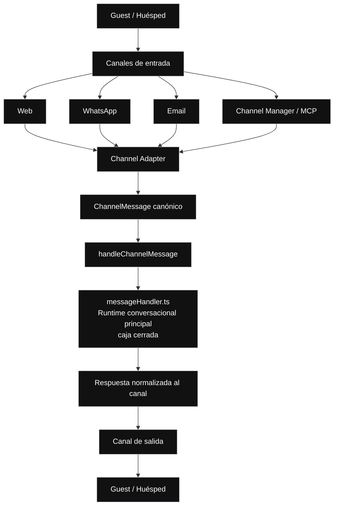

// Path: .runtime-analysis/runtime-map-v1/00-runtime-map-level-0.md

# Runtime Map V1 — Nivel 0

## Propósito

Este mapa representa el sistema conversacional completo en su nivel más alto.

No es un refactor.  
No es una propuesta de migración.  
No modifica arquitectura.  
No autoriza extracción de módulos.

Sirve para entender:

```text
cómo entra un mensaje al sistema
cómo se normaliza
cómo llega al runtime principal
cómo vuelve una respuesta al canal
```

En este nivel, `messageHandler.ts` se muestra como una caja cerrada.  
Su interior se abre recién en el Nivel 1.

---

## Regla del Nivel 0

```text
Nivel 0 = sistema completo.

Muestra:
- huésped
- canales de entrada
- adapters de canal
- ChannelMessage canónico
- handleChannelMessage
- messageHandler.ts como runtime cerrado
- respuesta normalizada al canal
- canal de salida
- huésped

No muestra:
- dominios internos del runtime
- create / modify / cancel / snapshot
- availability inquiry
- FAQ / billing / support
- graph / classifier / policy
- preLLM / bodyLLM / posLLM
- persistencia interna
- corredores operacionales
- compuertas de decisión
```

---

## Nivel 0 — Sistema completo



---

## Lectura del Nivel 0

```text
El huésped entra por un canal.

El canal puede ser:
- Web
- WhatsApp
- Email
- Channel Manager / MCP

Cada canal pasa por un adapter.

El adapter normaliza el mensaje a un ChannelMessage canónico.

ChannelMessage entra por handleChannelMessage.

handleChannelMessage entrega el turno al runtime principal:
messageHandler.ts

En este nivel, messageHandler.ts se trata como caja cerrada.

El runtime produce una salida conversacional normalizada.

Luego el sistema entrega esa salida al canal correspondiente.

El huésped recibe la respuesta.
```

---

## Caja principal linkeable

```text
messageHandler.ts
```

Esta caja explota en el Nivel 1:

```text
./01-messagehandler-level-1.md
```

---

## Qué no aparece en este nivel

```text
handleIncomingMessage
preLLM
bodyLLM
posLLM
reservation.create
reservation.modify
reservation.cancel
reservation.snapshot
availability inquiry
FAQ
billing
support
fallback
graph
classifier
policy
persistencia interna
reply composition
corredores operacionales
compuertas de decisión
```

Todo eso pertenece al Nivel 1 o niveles inferiores.

---

## Diferencia con Nivel 1

En este nivel aparece:

```text
respuesta normalizada al canal
```

En el Nivel 1 aparecerá:

```text
persistencia + reply
```

La diferencia es:

```text
Nivel 0:
vista externa del sistema

Nivel 1:
vista interna del runtime principal
```

---

## Evidencia actual del snapshot

```yaml
repo: /home/marcelo/begasist
base_file: lib/handlers/messageHandler.ts
commit_base: e67ba49
messageHandler_lines: 11683
working_tree_status: clean
analysis_scope: commit_e67ba4968d2275211fe63673cf64224bcae07fc8
baseline_status: committed_fix_pushed_runtime_map_refresh_applied_v20
known_manual_bug: none
```

---

## Notas arquitectónicas

- `messageHandler.ts` sigue siendo el runtime principal vigente.
- El graph existe como capa de interpretación/routing, pero no reemplaza al runtime principal.
- El sistema es híbrido: combina determinismo, heurísticas, estado persistido, classifier/policy/graph y ejecutores de dominio.
- Este mapa no autoriza refactor.
- Identificar cajas no significa extraer cajas.

---

## Referencia histórica sustituida

La baseline siguiente ya no es vigente.  
Se conserva solo como histórico de análisis previo:

```yaml
historical_baseline_only:
  commit_base: ba6e4a8
  messageHandler_lines: 10133
  working_tree_status: dirty
  baseline_status: suite_green_with_known_manual_bug_and_uncommitted_changes
```

---

## Próximo nivel

```text
Nivel 1:
Explota messageHandler.ts.

Ahí aparecen:
- handleIncomingMessage
- preLLM
- bodyLLM como caja cerrada
- persistencia + reply
- posLLM
- respuesta final al canal
```
