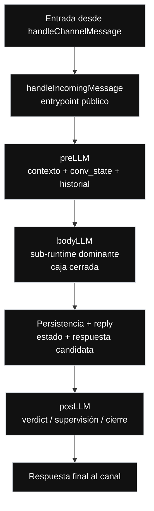

// Path: .runtime-analysis/runtime-map-v1/01-messagehandler-level-1.md

# Runtime Map V1 — Nivel 1

## Propósito

Este mapa abre la caja:

```text
messageHandler.ts
```

del Nivel 0.

En este nivel, `messageHandler.ts` deja de verse como caja cerrada y se muestra como el runtime conversacional principal vigente.

No es un refactor.  
No es una propuesta de migración.  
No modifica arquitectura.  
No autoriza extracción de módulos.

---

## Regla del Nivel 1

```text
Nivel 1 = messageHandler.ts abierto.

Muestra:
- handleIncomingMessage
- preLLM
- bodyLLM como caja cerrada
- persistencia + reply
- posLLM
- respuesta final al canal

No muestra todavía:
- create
- modify
- cancel
- snapshot
- availability inquiry
- FAQ / billing / support
- graph / classifier / policy
- fallback local
- compuertas internas de bodyLLM
- corredores internos de bodyLLM
```

Todo eso pertenece al Nivel 2 o niveles inferiores.

---

## Nivel 1 — messageHandler.ts abierto



---

## Lectura del Nivel 1

```text
handleChannelMessage entrega un mensaje normalizado.

handleIncomingMessage actúa como entrypoint público del runtime.

preLLM prepara contexto, estado conversacional, historial y señales previas.

bodyLLM concentra la decisión operacional dominante del turno.

Persistencia + reply representa la frontera conceptual donde se actualiza estado
y se prepara la respuesta observable.

posLLM aplica cierre, verdict, supervisión o verificación final.

La respuesta final vuelve hacia el canal.
```

---

## Caja principal de este nivel

```text
bodyLLM
```

En este nivel, `bodyLLM` sigue siendo una caja cerrada.  
Se explota recién en Nivel 2:

```text
./02-bodyllm-level-2.md
```

---

## Evidencia actual de código

```yaml
repo: /home/marcelo/begasist
base_file: lib/handlers/messageHandler.ts
commit_base: e67ba49
messageHandler_lines: 11683
working_tree_status: clean
analysis_scope: commit_e67ba4968d2275211fe63673cf64224bcae07fc8
baseline_status: committed_fix_pushed_runtime_map_refresh_applied_v20
known_manual_bug: none
```

---

## Rangos actuales detectados

```text
preLLM:                L4106-L4348   243 líneas
bodyLLM:               L4861-L11313  6453 líneas
posLLM:                L11314-L11358 45 líneas
handleIncomingMessage: L11359-L11683 325 líneas
```

---

## Funciones auxiliares relevantes detectadas

```text
buildReservationCanonicalState:     L1950-L2450
resolveReservationReference:        L2451-L2790
detectDominantTurnDomain:           L2791-L3074
getReservationDomainLockSignal:     L3075-L3246
shouldUseReservationLocalFallback:  L3247-L3299
buildReservationLocalFallbackReply: L3300-L3436
assessReservationDateCoherence:     L3437-L3916
tryStructuredAnalyze:               L3917-L4105
getObjectiveContext:                L585-L649
toStrictSlots:                      L2578-L2588
mergeReservationSlots:              L2589-L2604
```

---

## Responsabilidades por caja

### handleIncomingMessage

```text
Entrypoint público del runtime conversacional.
```

Rango actual:

```text
L11359-L11683
```

Nota:

```text
Aunque ya no es pequeño, sigue siendo la puerta pública hacia el runtime.
No debe confundirse con bodyLLM ni con handleChannelMessage.
```

### preLLM

```text
Etapa de preparación.
```

Responsabilidades conceptuales:

```text
- preparar contexto
- recuperar estado conversacional
- preparar historial
- construir señales previas
- fijar idioma operativo inicial
- entregar input enriquecido a bodyLLM
```

Rango actual:

```text
L4106-L4348
```

### bodyLLM

```text
Sub-runtime dominante.
```

Responsabilidades conceptuales:

```text
- decidir la ruta operacional del turno
- interpretar estado conversacional
- aplicar compuertas de decisión
- coordinar corredores internos
- generar respuesta candidata
- activar fallback o graph/classifier/policy cuando corresponde
```

Rango actual:

```text
L4861-L11313
```

Nota:

```text
bodyLLM no es solamente “la parte LLM”.
bodyLLM funciona como un sub-runtime operacional.
```

### Persistencia + reply

```text
Frontera interna de salida.
```

Responsabilidades conceptuales:

```text
- preservar estado relevante
- actualizar estado si corresponde
- preparar respuesta observable
- mantener continuidad conversacional
```

Nota:

```text
Esta caja es conceptual.
No necesariamente corresponde a una única función física.
```

### posLLM

```text
Etapa de cierre y verificación.
```

Responsabilidades conceptuales:

```text
- aplicar verdict final
- supervisar o endurecer salida cuando haga falta
- cerrar el turno antes de devolverlo al canal
```

Rango actual:

```text
L11314-L11358
```

---

## Qué no aparece todavía en este nivel

```text
reservation.create
reservation.modify
reservation.cancel
reservation.snapshot
availability inquiry
FAQ / amenities / policies
billing / support
graph / classifier / policy
fallback local
compuertas internas de bodyLLM
corredores operacionales de bodyLLM
```

Todo eso pertenece al Nivel 2 y al Nivel 3.

---

## Hotspot principal

```text
bodyLLM tiene 6453 líneas sobre un archivo total de 11683 líneas.
```

Lectura:

```text
messageHandler.ts no está repartido de forma homogénea.

bodyLLM concentra la mayor parte del comportamiento operacional,
por eso debe tratarse como sub-runtime dominante y no como helper grande.
```

---

## Regla operativa del Nivel 1

Antes de corregir un bug en `messageHandler.ts`, identificar:

```text
1. si el bug vive en entrypoint, preLLM, bodyLLM o posLLM
2. si afecta lectura de estado, precedencia o salida observable
3. si la caja afectada es runtime host o sub-runtime interno
4. si el cambio toca solo code_refs o también contracts observables
```

---

## Próximo nivel

```text
Nivel 2:
Explota bodyLLM.

Ahí aparecen:
- decisión de turno
- corredores operacionales
- resultado bodyLLM
- retorno hacia persistencia + reply
```
