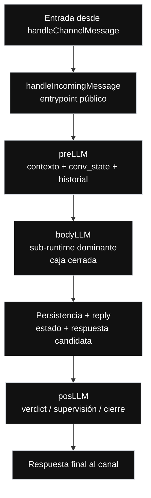

// Path: .runtime-analysis/runtime-map-v1/01-messagehandler-level-1.md

# Runtime Map V1 — Nivel 1

## Propósito

Este mapa explota la caja:

```text
messageHandler.ts
```

del Nivel 0.

En este nivel, `messageHandler.ts` deja de verse como caja cerrada y se muestra como el **runtime conversacional principal vigente**.

No es un refactor.  
No es una propuesta de migración.  
No modifica arquitectura.  
No autoriza extracción de módulos.

---

## Regla del Nivel 1

```text
Nivel 1 = messageHandler.ts abierto.

Muestra:
- handleIncomingMessage
- preLLM
- bodyLLM como caja cerrada
- persistencia + reply
- posLLM
- respuesta final al canal

No muestra todavía:
- create
- modify
- cancel
- snapshot
- availability inquiry
- FAQ / Policies / Amenities
- Billing / Support
- Graph / Classifier / Policy
- Fallback local
- compuertas internas de bodyLLM
- corredores internos de bodyLLM

Todo eso pertenece al Nivel 2 o niveles inferiores.
```

---

## Nivel 1 — messageHandler.ts abierto



---

## Lectura del Nivel 1

El flujo interno de `messageHandler.ts` se lee así:

```text
handleChannelMessage entrega un mensaje normalizado.

handleIncomingMessage actúa como entrypoint público del runtime.

preLLM prepara contexto, estado conversacional, historial y señales previas.

bodyLLM concentra la decisión operacional dominante del turno.

Persistencia + reply representa la etapa interna donde se actualiza estado
y se prepara la respuesta observable.

posLLM aplica cierre, verdict, supervisión o verificación final.

La respuesta final vuelve hacia el canal.
```

---

## Caja principal de este nivel

```text
bodyLLM
```

En este nivel, `bodyLLM` sigue siendo una caja cerrada.

Se explota recién en Nivel 2:

```text
./02-bodyllm-level-2.md
```

---

## Evidencia actual de código

```yaml
repo: /home/marcelo/begasist
base_file: lib/handlers/messageHandler.ts
commit_base: ba6e4a8
messageHandler_lines: 10133
working_tree_status: dirty
baseline_status: suite_green_with_known_manual_bug_and_uncommitted_changes
```

---

## Rangos actuales detectados

```text
preLLM:                L3572-L3763   192 líneas
bodyLLM:               L4314-L9367   5054 líneas
posLLM:                L9764-L9805   42 líneas
handleIncomingMessage: L9809-L9817   9 líneas
```

---

## Funciones auxiliares relevantes detectadas

```text
buildReservationCanonicalState:     L1465-L1502
resolveReservationReference:        L1929-L2036
detectDominantTurnDomain:           L2262-L2321
getReservationDomainLockSignal:     L2546-L2581
shouldUseReservationLocalFallback:  L2718-L2769
buildReservationLocalFallbackReply: L2771-L2906
assessReservationDateCoherence:     L2908-L2921
tryStructuredAnalyze:               L3384-L3511
```

---

## Responsabilidades por caja

### handleIncomingMessage

```text
Entry point público del runtime conversacional.
```

Rango actual:

```text
L9809-L9817
```

Nota:

```text
Aunque es pequeño, es la puerta pública hacia el runtime.
No debe confundirse con bodyLLM ni con handleChannelMessage.
```

---

### preLLM

```text
Etapa de preparación.
```

Responsabilidades conceptuales:

```text
- preparar contexto
- recuperar estado conversacional
- preparar historial
- construir señales previas
- entregar input enriquecido a bodyLLM
```

Rango actual:

```text
L3572-L3763
```

---

### bodyLLM

```text
Sub-runtime dominante.
```

Responsabilidades conceptuales:

```text
- decidir la ruta operacional del turno
- interpretar estado conversacional
- aplicar compuertas de decisión
- coordinar corredores internos
- generar respuesta candidata
- activar fallback o graph/classifier/policy cuando corresponde
```

Rango actual:

```text
L4314-L9367
```

Nota:

```text
bodyLLM no es solamente “la parte LLM”.
bodyLLM funciona como un sub-runtime operacional.
```

---

### Persistencia + reply

```text
Frontera interna de salida.
```

Responsabilidades conceptuales:

```text
- preservar estado relevante
- actualizar estado si corresponde
- preparar respuesta observable
- mantener continuidad conversacional
```

Nota:

```text
Esta caja es conceptual.
No necesariamente corresponde a una única función física.
```

---

### posLLM

```text
Etapa posterior de cierre.
```

Responsabilidades conceptuales:

```text
- verdict
- supervisión
- cierre final
- salida hacia canal
```

Rango actual:

```text
L9764-L9805
```

---

## Diferencia con Nivel 0

En Nivel 0 aparece:

```text
Respuesta normalizada al canal
```

Eso representa la salida externa del sistema.

En Nivel 1 aparece:

```text
Persistencia + reply
```

Eso representa una frontera interna de `messageHandler.ts`.

La diferencia es:

```text
Nivel 0:
sistema completo visto desde fuera

Nivel 1:
runtime principal visto desde dentro
```

---

## Qué NO aparece en este nivel

Este nivel no muestra:

```text
Reservation
Create
Modify
Cancel
Snapshot
Availability inquiry
FAQ / Policies / Amenities
Billing / Support
Graph / Classifier / Policy
Fallback local
date repair
quote gating
confirmation gating
reference resolution
domain lock
early returns
```

Todo eso pertenece al Nivel 2 o niveles inferiores.

---

## Hotspot principal

```text
bodyLLM
```

Evidencia:

```text
bodyLLM tiene 5054 líneas sobre un archivo total de 10133 líneas.
```

Lectura:

```text
El centro de gravedad del runtime actual está en bodyLLM.
```

Riesgo:

```text
Los fixes dentro de bodyLLM pueden afectar múltiples corredores,
porque allí conviven routing, estado, fechas, create, modify, cancel,
snapshot, graph, fallback y composición de respuesta.
```

---

## Regla operativa del Nivel 1

```text
No corregir “messageHandler.ts” de forma genérica.

Primero identificar:
- etapa afectada
- caja conceptual
- rango aproximado
- riesgo
- tests de paridad
```

Ejemplo:

```text
Incorrecto:
Corregir messageHandler.ts.

Correcto:
Corregir bodyLLM / turnDecision / temporalRepair,
sin tocar cancel ni snapshot,
con test de paridad.
```

---

## Próximo nivel

```text
Nivel 2:
Explota bodyLLM.

Ahí aparecen:
- Decisión de turno
- Corredores operacionales
- Resultado bodyLLM
```
