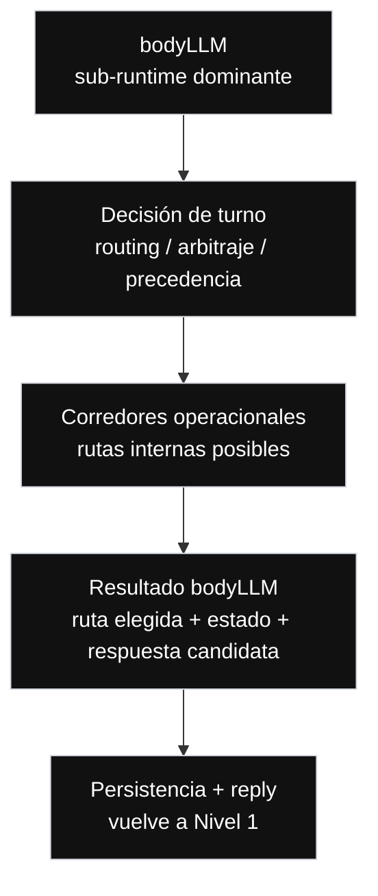

// Path: .runtime-analysis/runtime-map-v1/02-bodyllm-level-2.md

# Runtime Map V1 — Nivel 2

## Propósito

Este mapa explota la caja:

```text
bodyLLM
```

del Nivel 1.

En este nivel, `bodyLLM` deja de verse como caja cerrada y se muestra como el **sub-runtime dominante** dentro de `messageHandler.ts`.

No es un refactor.  
No es una propuesta de extracción inmediata.  
No modifica arquitectura.  
No autoriza mover código.

Sirve para visualizar las grandes responsabilidades internas de `bodyLLM` sin abrir todavía cada corredor específico.

---

## Regla del Nivel 2

```text
Nivel 2 = bodyLLM abierto.

Muestra:
- Decisión de turno
- Corredores operacionales
- Resultado bodyLLM
- retorno hacia Persistencia + reply

No muestra todavía:
- create
- modify
- cancel
- snapshot
- availability inquiry
- FAQ / policies / amenities
- billing / support
- graph / classifier / policy
- fallback local
- helpers concretos
- early returns individuales
- líneas exactas de código

Las rutas concretas pertenecen al Nivel 3:
03-bodyllm-operational-corridors-level-3.md
```

---

## Nivel 2 — bodyLLM como sub-runtime dominante



---

## Lectura del Nivel 2

`bodyLLM` se lee como un sub-runtime con tres grandes momentos:

```text
1. Decisión de turno
   Decide qué ruta domina.

2. Corredores operacionales
   Ejecutan o preparan la resolución del turno.

3. Resultado bodyLLM
   Devuelve una salida hacia persistencia + reply.
```

La separación conceptual importante es:

```text
Decidir la ruta
no es lo mismo que
ejecutar la ruta.

Ejecutar la ruta
no es lo mismo que
persistir estado.

Persistir estado
no es lo mismo que
componer la respuesta observable.
```

---

## Evidencia actual de código

```yaml
repo: /home/marcelo/begasist
base_file: lib/handlers/messageHandler.ts
commit_base: ba6e4a8
messageHandler_lines: 10133
working_tree_status: dirty
baseline_status: suite_green_with_known_manual_bug_and_uncommitted_changes
bodyLLM_range: L4314-L9367
bodyLLM_lines: 5054
```

---

## Evidencia desde FASE 1

El scan actualizado muestra que `bodyLLM` concentra múltiples zonas internas.

Hotspots principales:

```text
date/temporal
create
modify
cancel
snapshot/verify
availability
email/whatsapp copy
graph/classifier/policy
fallback
reservationSlots
selected target
reply builders
```

Lectura:

```text
bodyLLM no es una función lineal simple.

Es un sub-runtime con:
- lógica de decisión
- lógica de dominio
- lógica temporal
- estado compartido
- fallback
- graph/classifier/policy
- composición de respuestas
```

---

## Caja 1 — Decisión de turno

```text
Decisión de turno = router / árbitro / precedencia
```

Esta caja responde preguntas como:

```text
¿Qué está intentando hacer el huésped?
¿Qué estado previo importa?
¿Qué señal domina?
¿Qué ruta debe ganar?
¿Qué ruta debe bloquearse?
¿Se permite fallback?
¿Hay acción sensible?
¿Hay target suficiente?
```

Se explota en:

```text
./03-bodyllm-turn-decision-level-3.md
```

---

## Caja 2 — Corredores operacionales

```text
Corredores operacionales = rutas internas posibles dentro de bodyLLM
```

Ahí aparecen recién:

```text
Reservation
  Create
  Modify
  Cancel
  Snapshot

Availability inquiry

FAQ / Policies / Amenities

Billing / Support

Graph / Classifier / Policy

Fallback local
```

Se explota en:

```text
./03-bodyllm-operational-corridors-level-3.md
```

---

## Caja 3 — Resultado bodyLLM

El resultado conceptual de `bodyLLM` puede incluir:

```text
ruta elegida
estado actualizado
estado preservado
acción permitida
acción bloqueada
respuesta candidata
categoría resultante
necesidad de persistencia
necesidad de supervisión
```

No necesariamente existe así como objeto único en código hoy.

Este mapa lo expresa como frontera conceptual para auditar el runtime.

---

## Rangos tentativos internos de bodyLLM

Estos rangos son evidencia de FASE 1.  
No son fronteras físicas definitivas.  
Sirven para orientar lectura, prompts técnicos y auditoría.

| Zona                                                        |       Rango | Confianza | Lectura                                               |
| ----------------------------------------------------------- | ----------: | --------- | ----------------------------------------------------- |
| Fast paths iniciales / structured analyze / create temporal | L4314-L4813 | medium    | Entrada sensible; puede decidir demasiado temprano    |
| Modify corridor / selected target / reparación temporal     | L5064-L6313 | medium    | Modify, fechas y target están acoplados               |
| Create / availability / quote / proposal                    | L6314-L6813 | medium    | Corredor comercial principal de create                |
| Copy corridor / channel-specific replies                    | L6814-L7313 | medium    | Copy por canal mezclado con acciones de dominio       |
| Cancel corridor                                             | L7064-L7563 | medium    | Cancel más localizado, pero sensible                  |
| Snapshot / canonical reply                                  | L7814-L8063 | medium    | Post-booking, snapshot y canonical state              |
| Billing / Support / FAQ / Graph / Fallback                  | L8064-L8563 | medium    | Lateral domains, graph y fallback                     |
| Late temporal repair / final create cleanup                 | L8564-L9367 | low       | Zona final mezclada con temporalidad, create y modify |

---

## Hotspots de riesgo

### 1. Reparación temporal

```text
date/temporal aparece fuerte al inicio, medio y final de bodyLLM.
```

Riesgo:

```text
Un fix de fechas aplicado en una zona puede ser contradicho por otra zona posterior.
```

---

### 2. Create y modify superpuestos

```text
Create, modify, temporal repair y reservationSlots se superponen.
```

Riesgo:

```text
Una regla pensada para create puede capturar modify.
Una regla pensada para modify puede interferir con create.
```

---

### 3. Reply / copy dentro del sub-runtime

```text
email/whatsapp copy aparece dentro de bodyLLM.
```

Riesgo:

```text
Un fix funcional puede alterar UX/copy de canal sin buscarlo.
```

---

### 4. Fallback y graph/policy

```text
Graph/classifier/policy y fallback aparecen dentro del mismo sub-runtime.
```

Riesgo:

```text
Un guard determinista demasiado amplio puede impedir que graph o fallback resuelvan correctamente.
Un fallback demasiado temprano puede pisar rutas gobernadas.
```

---

## Por qué este nivel es importante

Este nivel explica tres problemas actuales del sistema:

```text
1. El sistema está grande y difícil de entender.

2. Los fixes pueden provocar regresiones porque tocan zonas que gobiernan más de una ruta.

3. Hay corredores que resuelven problemas similares en lugares distintos.
   Si se corrige uno y no otro, aparecen comportamientos inconsistentes.
```

---

## Regla operativa del Nivel 2

Antes de corregir un bug dentro de `bodyLLM`, identificar:

```text
1. Caja conceptual afectada.
2. Corredor operacional afectado.
3. Compuerta de decisión afectada.
4. Estado leído.
5. Estado escrito.
6. Precedencia alterada.
7. Rutas relacionadas.
8. Rutas prohibidas.
9. Tests de paridad requeridos.
```

---

## Regla de lectura

```text
Identificar cajas no significa extraer cajas.
```

Este mapa permite ver fronteras conceptuales.

No significa que deban extraerse ahora.

Antes de extraer cualquier caja se necesita:

```text
1. contrato claro
2. tests de paridad
3. comportamiento observable congelado
4. verificación de precedencia
5. control de estado leído/escrito
```

---

## Próximo nivel

```text
Nivel 3:
Explota cajas específicas de bodyLLM.

Archivos previstos:
- 03-bodyllm-turn-decision-level-3.md
- 03-bodyllm-operational-corridors-level-3.md
```
