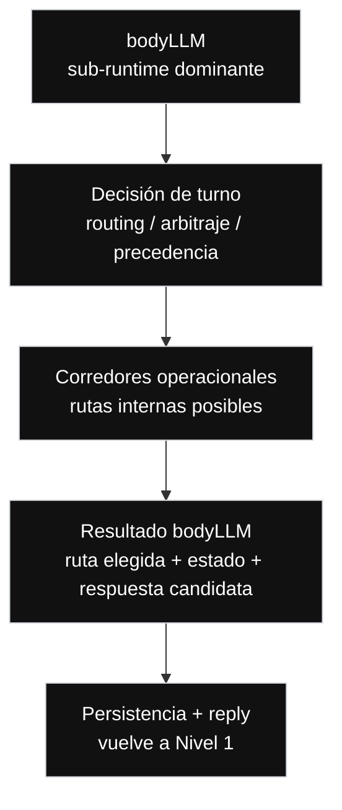

// Path: .runtime-analysis/runtime-map-v1/02-bodyllm-level-2.md

# Runtime Map V1 — Nivel 2

## Propósito

Este mapa explota la caja:

```text
bodyLLM
```

del Nivel 1.

En este nivel, `bodyLLM` deja de verse como caja cerrada y se muestra como el sub-runtime dominante dentro de `messageHandler.ts`.

No es un refactor.  
No es una propuesta de extracción inmediata.  
No modifica arquitectura.  
No autoriza mover código.

Sirve para visualizar las grandes responsabilidades internas de `bodyLLM` sin abrir todavía cada corredor específico.

---

## Regla del Nivel 2

```text
Nivel 2 = bodyLLM abierto.

Muestra:
- decisión de turno
- corredores operacionales
- resultado bodyLLM
- retorno hacia persistencia + reply

No muestra todavía:
- helpers concretos
- early returns individuales
- tests específicos
- micro-contratos por corredor
- diseño de refactor
```

Las rutas concretas pertenecen al Nivel 3.

---

## Nivel 2 — bodyLLM como sub-runtime dominante



---

## Lectura del Nivel 2

```text
bodyLLM se comporta como un sub-runtime con tres grandes momentos:

1. Decisión de turno
   Decide qué ruta domina.

2. Corredores operacionales
   Ejecutan o preparan la resolución del turno.

3. Resultado bodyLLM
   Devuelve una salida hacia persistencia + reply.
```

La separación conceptual importante es:

```text
decidir la ruta
no es lo mismo que
ejecutar la ruta

ejecutar la ruta
no es lo mismo que
persistir estado
```

---

## Evidencia actual de código

```yaml
repo: /home/marcelo/begasist
base_file: lib/handlers/messageHandler.ts
commit_base: e67ba49
messageHandler_lines: 11683
working_tree_status: clean
analysis_scope: commit_e67ba4968d2275211fe63673cf64224bcae07fc8
baseline_status: committed_fix_pushed_runtime_map_refresh_applied_v20
bodyLLM_range: L4861-L11313
bodyLLM_lines: 6453
known_manual_bug: none
```

---

## Evidencia desde FASE 1 y scans auxiliares

Los scans actualizados muestran que `bodyLLM` concentra múltiples zonas internas.

Hotspots principales:

```text
date/temporal
create
modify
cancel
snapshot/verify
availability
email/whatsapp copy
graph/classifier/policy
fallback
reservationSlots
selected target
reply builders
billing
```

Lectura:

```text
bodyLLM no es una función lineal simple.

Es un sub-runtime con:
- lógica de decisión
- lógica de dominio
- lógica temporal
- estado compartido
- fallback
- graph/classifier/policy
- composición de respuestas
```

---

## Caja 1 — Decisión de turno

```text
Decisión de turno = router / árbitro / precedencia
```

Esta caja responde preguntas como:

```text
¿Qué está intentando hacer el huésped?
¿Qué estado previo importa?
¿Qué señal domina?
¿Qué ruta debe ganar?
¿Qué ruta debe bloquearse?
¿Se permite fallback?
¿Hay acción sensible?
¿Hay target suficiente?
```

Se explota en:

```text
./03-bodyllm-turn-decision-level-3.md
```

---

## Caja 2 — Corredores operacionales

```text
Corredores operacionales = rutas internas posibles dentro de bodyLLM
```

Ahí aparecen:

```text
Reservation
  Create
  Modify
  Cancel
  Snapshot

Availability inquiry
FAQ / Policies / Amenities
Billing / Support
Graph / Classifier / Policy
Fallback local
Copy por canal como corredor transversal
```

Se explota en:

```text
./03-bodyllm-operational-corridors-level-3.md
```

---

## Caja 3 — Resultado bodyLLM

El resultado conceptual de `bodyLLM` puede incluir:

```text
ruta elegida
estado actualizado
estado preservado
acción permitida
acción bloqueada
respuesta candidata
categoría resultante
necesidad de persistencia
necesidad de supervisión
```

No necesariamente existe así como objeto único en código hoy.  
Este mapa lo expresa como frontera conceptual para auditar el runtime.

---

## Rangos tentativos internos de bodyLLM

Estos rangos son evidencia recalculable.  
No son fronteras físicas definitivas.  
Sirven para orientar lectura y auditoría.

| Zona | Rango | Confianza | Lectura |
| --- | ---: | --- | --- |
| Fast paths iniciales / structured analyze / create temporal | L4861-L5610 | medium | Entrada sensible; mezcla señales temporales, structured analyze y create temprano |
| Modify corridor / selected target / reparación temporal | L5861-L7610 | medium | Modify domina con fuerte solapamiento temporal y target |
| Create / availability / quote / proposal | L7611-L8110 | medium | Corredor comercial principal de create |
| Copy por canal / replies transversales | L8111-L8610 | medium | Copy por canal mezclado con acciones de dominio |
| Cancel corridor | L8611-L8860 | medium | Cancel localizado pero sensible |
| Snapshot / canonical reply / billing bridge | L8861-L9610 | medium | Snapshot, canonical reply y parte del puente hacia billing |
| Graph / classifier / policy / fallback | L9611-L9860 | medium | Capa semántica y último recurso seguro |
| Late temporal repair / final create cleanup / outbound endings | L9861-L11313 | low | Zona final mezclada con temporalidad, create, modify y early returns |

---

## Hotspots de riesgo

### 1. Reparación temporal

```text
date/temporal aparece fuerte al inicio, en modify, en create y también al final de bodyLLM.
```

Riesgo:

```text
Un fix de fechas aplicado en una zona puede ser contradicho por otra zona posterior.
```

### 2. Create y modify superpuestos

```text
Create, modify, temporal repair y reservationSlots se superponen.
```

Riesgo:

```text
Una regla pensada para create puede capturar modify.
Una regla pensada para modify puede interferir con create.
```

### 3. Reply / copy dentro del sub-runtime

```text
email/whatsapp copy aparece dentro de bodyLLM.
```

Riesgo:

```text
Un fix funcional puede alterar UX/copy de canal sin buscarlo.
```

### 4. Fallback y graph/policy

```text
Graph/classifier/policy y fallback aparecen dentro del mismo sub-runtime.
```

Riesgo:

```text
Un guard determinista demasiado amplio puede impedir que graph o fallback resuelvan correctamente.
Un fallback demasiado temprano puede pisar rutas gobernadas.
```

---

## Candidate slice orientation

Orientación conceptual solamente.  
No diseña refactor.

```yaml
candidate_orientation:
  safer:
    - reservation.create.quoteCopy
    - reservation.create.quote_gating
    - reservation.create.proposal_confirmation
  no_go_first_slice:
    - turnDecision
    - canonical state
    - reference resolution
    - persistencia transversal
    - graph/classifier/policy
    - fallback local
    - date repair
    - feature-flag-dependent branches
```

---

## Regla operativa del Nivel 2

Antes de corregir un bug dentro de `bodyLLM`, identificar:

```text
1. caja conceptual afectada
2. corredor operacional afectado
3. compuerta de decisión afectada
4. estado leído
5. estado escrito
6. precedencia alterada
7. rutas relacionadas
8. rutas prohibidas
9. tests de paridad requeridos
```

---

## Regla de lectura

```text
Identificar cajas no significa extraer cajas.
```

Antes de extraer cualquier caja se necesita:

```text
1. contrato claro
2. tests de paridad
3. comportamiento observable congelado
4. verificación de precedencia
5. control de estado leído/escrito
```

---

## Próximo nivel

```text
Nivel 3:
Explota cajas específicas de bodyLLM.

Archivos:
- 03-bodyllm-turn-decision-level-3.md
- 03-bodyllm-operational-corridors-level-3.md
```
