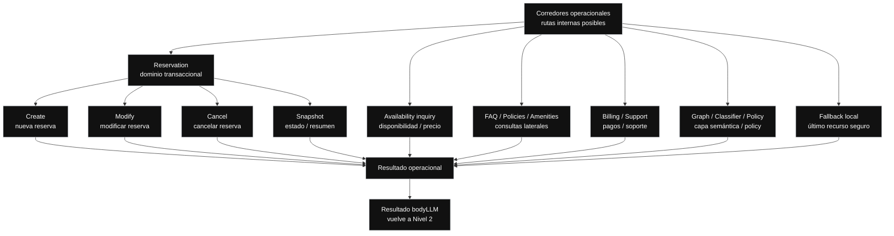

// Path: .runtime-analysis/runtime-map-v1/03-bodyllm-operational-corridors-level-3.md

# Runtime Map V1 — Nivel 3B

## Propósito

Este mapa explota la caja:

```text
Corredores operacionales
```

del Nivel 2 de `bodyLLM`.

Los corredores operacionales representan las rutas internas posibles que `bodyLLM` puede activar después de la **Decisión de turno**.

No son todavía funciones extraídas.  
No son módulos separados.  
No son una propuesta inmediata de refactor.

Son fronteras conceptuales para entender qué familias de comportamiento conviven dentro de `bodyLLM`.

---

## Regla del Nivel 3B

```text
Nivel 3B = Corredores operacionales abiertos.

Muestra:
- familias de rutas internas
- responsabilidad conceptual de cada corredor
- riesgos de solapamiento
- relación con rangos tentativos de código

No muestra todavía:
- líneas exactas de cada early return
- helpers concretos
- tests específicos
- contratos detallados de cada subflujo

Eso corresponde al Nivel 4 o al box-index machine-friendly.
```

---

## Nivel 3B — Corredores operacionales dentro de bodyLLM



---

## Lectura del Nivel 3B

Después de la **Decisión de turno**, `bodyLLM` puede activar uno de varios corredores operacionales.

Cada corredor representa una familia de comportamiento:

```text
Reservation
Availability inquiry
FAQ / Policies / Amenities
Billing / Support
Graph / Classifier / Policy
Fallback local
```

Estos corredores no son equivalentes.

Algunos son transaccionales.  
Otros son informativos.  
Otros son de interpretación semántica.  
Otros son de último recurso.

Por eso es riesgoso que compartan lógica parecida sin una frontera clara.

---

## Relación con Decisión de turno

Este archivo no decide qué ruta gana.

Eso pertenece a:

```text
03-bodyllm-turn-decision-level-3.md
```

Este archivo muestra qué rutas existen una vez que la decisión ya eligió o habilitó un camino.

La separación conceptual es:

```text
Decisión de turno
  decide qué ruta domina

Corredores operacionales
  ejecutan o preparan la resolución del turno
```

---

## Evidencia actual de código

```yaml
repo: /home/marcelo/begasist
base_file: lib/handlers/messageHandler.ts
commit_base: ba6e4a8
messageHandler_lines: 10133
working_tree_status: dirty
baseline_status: suite_green_with_known_manual_bug_and_uncommitted_changes
bodyLLM_range: L4314-L9367
bodyLLM_lines: 5054
```

---

## Rangos tentativos relacionados

Estos rangos vienen de FASE 1 y son orientativos.

```text
No son fronteras físicas definitivas.
No significan que cada corredor exista como módulo separado.
```

| Corredor / zona conceptual                                  | Rango tentativo | Confianza |
| ----------------------------------------------------------- | --------------: | --------- |
| Fast paths iniciales / structured analyze / create temporal |     L4314-L4813 | medium    |
| Modify corridor / selected target / reparación temporal     |     L5064-L6313 | medium    |
| Create / availability / quote / proposal                    |     L6314-L6813 | medium    |
| Copy corridor / channel-specific replies                    |     L6814-L7313 | medium    |
| Cancel corridor                                             |     L7064-L7563 | medium    |
| Snapshot / canonical reply                                  |     L7814-L8063 | medium    |
| Billing / Support / FAQ / Graph / Fallback                  |     L8064-L8563 | medium    |
| Late temporal repair / final create cleanup                 |     L8564-L9367 | low       |

---

## Corredor 1 — Reservation

`Reservation` agrupa las rutas más sensibles porque pueden afectar reservas reales o estado transaccional.

Incluye:

```text
create
modify
cancel
snapshot
```

### Responsabilidad conceptual

Resolver acciones y consultas vinculadas a reservas.

### Riesgo principal

```text
Create, modify, cancel y snapshot comparten estado,
pero no deberían compartir todas las reglas.
```

Ejemplos:

```text
Una reparación de fechas en create
no debería capturar una modificación activa.

Una confirmación de cancelación
no debería confundirse con confirmación de propuesta de reserva.

Un snapshot post-booking
no debería abrir create flow.
```

### Estado sensible compartido

```text
reservationSlots
conversationFocus
lastProposal
lastReservation
selectedReservationTarget
pendingCancellation
modifyState
reservationHistory
```

---

## Corredor 1.1 — Create

`Create` gestiona la creación de nuevas reservas.

Puede involucrar:

```text
guestName
roomType
checkIn
checkOut
numGuests
availability check
quote
proposal
CONFIRMAR
confirmAndCreate
```

### Responsabilidad conceptual

Completar slots mínimos, validar coherencia, consultar disponibilidad y permitir confirmación explícita.

### Rango tentativo principal

```yaml
range: L6314-L6813
confidence: medium
related_ranges:
  - L4314-L4813
  - L8564-L9367
```

### Riesgo principal

```text
Create suele ser el corredor que más fácilmente captura otros contextos.
```

Ejemplos de riesgo:

```text
Una consulta lateral puede ser tomada como slot faltante.
Una fecha de modify puede ser tomada como fecha de create.
Un "sí" genérico puede ser tomado como confirmación.
Un checkOut explícito puede ser malinterpretado como checkIn.
```

### Riesgos específicos

```text
slot attribution
date repair
quote gating
confirmation gating
availability
create vs modify contamination
```

### Candidatos a Nivel 4

```text
slot ingestion
date repair
availability check
quote gating
proposal confirmation
confirmAndCreate guard
```

---

## Corredor 1.2 — Modify

`Modify` gestiona cambios sobre una reserva existente.

Puede involucrar:

```text
target de reserva
campo a modificar
nuevo valor
fechas nuevas
validación de disponibilidad
confirmación de modificación
```

### Responsabilidad conceptual

Aplicar cambios a una reserva identificada o pedir desambiguación si no hay target claro.

### Rango tentativo principal

```yaml
range: L5064-L6313
confidence: medium
related_ranges:
  - L8564-L8813
```

### Riesgo principal

```text
Modify depende mucho de reference resolution y selectedReservationTarget.
```

Ejemplos de riesgo:

```text
Modificar la reserva equivocada.
Tratar una nueva reserva como modificación.
Aplicar date repair de create dentro de modify.
Perder el campo activo que se estaba modificando.
```

### Riesgos específicos

```text
target resolution
selected target
modify state
date repair
active field
create vs modify contamination
```

### Candidatos a Nivel 4

```text
reference resolution
selectedReservationTarget
modifyState
activeField
date modify repair
modify confirmation
```

---

## Corredor 1.3 — Cancel

`Cancel` gestiona cancelaciones de reservas.

Puede involucrar:

```text
target de reserva
motivo opcional
confirmación sensible
cancelReservation
estado post-cancelación
```

### Responsabilidad conceptual

Cancelar solo cuando exista target suficiente y confirmación adecuada.

### Rango tentativo principal

```yaml
range: L7064-L7563
confidence: medium
```

### Riesgo principal

```text
Cancel es una acción sensible.
No debe ejecutarse por ambigüedad.
```

Ejemplos de riesgo:

```text
Cancelar sin target.
Cancelar la reserva equivocada.
Interpretar "sí" como cancelación cuando el usuario confirmaba otra cosa.
Usar fallback para una acción sensible.
```

### Riesgos específicos

```text
sensitive action
target resolution
confirmation gate
destructive action
```

### Candidatos a Nivel 4

```text
cancel target resolution
pendingCancellation
cancel confirmation
cancel execution guard
post-cancel snapshot
```

---

## Corredor 1.4 — Snapshot

`Snapshot` muestra o resume el estado de una reserva o conversación.

Puede involucrar:

```text
reserva confirmada
draft activo
última propuesta
historial de reservas
resumen post-booking
```

### Responsabilidad conceptual

Responder consultas de estado sin abrir accidentalmente create, modify o cancel.

### Rango tentativo principal

```yaml
range: L7814-L8063
confidence: medium
related_ranges:
  - L5314-L5813
  - L6064-L6313
  - L9314-L9367
```

### Riesgo principal

```text
Snapshot puede ser secuestrado por create o date repair.
```

Ejemplos de riesgo:

```text
El usuario pregunta "¿quedó confirmada?"
y el sistema pide una fecha de check-in.

El usuario pide "mostrame mi reserva"
y el sistema abre create flow.

El usuario pregunta por late checkout
y se interpreta como modificación de fechas.
```

### Riesgos específicos

```text
post booking
canonical reply
reservation history
create capture risk
date repair contamination
```

### Candidatos a Nivel 4

```text
post-booking semantics
reservation snapshot
canonical reply
reservation history
reference display
```

---

## Corredor 2 — Availability inquiry

`Availability inquiry` gestiona consultas de disponibilidad que no necesariamente son una reserva activa.

Ejemplos:

```text
¿Tenés doble para mañana?
¿Hay disponibilidad para el fin de semana?
¿Cuánto sale una suite?
```

### Responsabilidad conceptual

Responder disponibilidad o precio sin convertir automáticamente toda consulta en create flow.

### Rango tentativo principal

```yaml
range: L6314-L6813
confidence: medium
related_ranges:
  - L4564-L4813
  - L9064-L9313
```

### Riesgo principal

```text
Confundir inquiry con create.
```

Ejemplo:

```text
"¿Hay disponibilidad?"
no siempre significa:
"Creá un draft de reserva".
```

### Riesgos específicos

```text
availability
quote gating
date range extraction
create capture risk
```

### Candidatos a Nivel 4

```text
availability intent
date range extraction
room type extraction
availability quote
transition to create
```

---

## Corredor 3 — FAQ / Policies / Amenities

Este corredor resuelve consultas informativas laterales.

Puede incluir:

```text
desayuno
wifi
parking
mascotas
check-in policy
check-out policy
amenities
ubicación
servicios del hotel
```

### Responsabilidad conceptual

Responder información del hotel sin romper continuidad conversacional.

### Rango tentativo principal

```yaml
range: L8064-L8563
confidence: medium
```

### Riesgo principal

```text
Una consulta lateral durante una reserva activa no debería destruir el foco.
```

Ejemplo:

```text
Guest:
Quiero reservar una doble del 10 al 12.

Bot:
¿A nombre de quién?

Guest:
¿El desayuno está incluido?

El sistema debería responder el lateral,
pero conservar el draft de reserva.
```

### Riesgos específicos

```text
lateral question
focus preservation
retrieval
reservation context contamination
```

### Candidatos a Nivel 4

```text
lateral question detection
reservation focus preservation
retrieval-based answer
policy answer
amenities answer
return to active flow
```

---

## Corredor 4 — Billing / Support

Este corredor resuelve consultas de facturación, pago o soporte.

Puede incluir:

```text
formas de pago
factura
cobros
seña
reembolso
problemas técnicos
contacto con recepción
```

### Responsabilidad conceptual

Atender consultas administrativas o de soporte sin confundirse con reserva transaccional.

### Rango tentativo principal

```yaml
range: L8064-L8563
confidence: medium
```

### Riesgo principal

```text
Billing puede solaparse con reservation cuando el huésped pregunta por precio,
seña, pago o confirmación.
```

Ejemplo:

```text
"¿Cuánto tengo que pagar?"
puede ser:
- billing general
- pregunta sobre una propuesta activa
- consulta sobre una reserva existente
```

### Riesgos específicos

```text
billing reservation overlap
support handoff
payment policy
supervised escalation
```

### Candidatos a Nivel 4

```text
billing intent
payment policy
support handoff
reservation-related billing
supervised escalation
```

---

## Corredor 5 — Graph / Classifier / Policy

Este corredor representa la capa semántica/probabilística o de policy.

Puede involucrar:

```text
classifier
graph
policy
structured analyze
semantic fallback
intent inference
```

### Responsabilidad conceptual

Resolver ambigüedad, enriquecer interpretación o derivar a una ruta cuando las señales deterministas no alcanzan.

### Rango tentativo principal

```yaml
range: L8314-L8563
confidence: medium
related_ranges:
  - L4314-L4563
  - L9314-L9367
```

### Riesgo principal

```text
La capa semántica no debe pisar contratos deterministas críticos.
```

Ejemplos de riesgo:

```text
Graph clasifica como create algo que era snapshot.
Classifier interpreta "confirmar" fuera del contexto de lastProposal.
Policy permite una ruta que un guard determinista debía bloquear.
```

### Riesgos específicos

```text
semantic override
policy gate
classifier misroute
deterministic contract violation
```

### Candidatos a Nivel 4

```text
structured analyze
classifier intent
graph path
policy gate
semantic fallback
agreement / disagreement
```

---

## Corredor 6 — Fallback local

Este corredor se usa cuando ninguna ruta principal domina con suficiente claridad.

### Responsabilidad conceptual

Responder de forma segura sin ejecutar acciones sensibles.

### Rango tentativo principal

```yaml
range: L8314-L8563
confidence: medium
```

### Riesgo principal

```text
Fallback no debe inventar acciones.
Fallback no debe confirmar reservas.
Fallback no debe cancelar reservas.
Fallback no debe romper estado activo.
```

Ejemplos de riesgo:

```text
Fallback responde como si hubiera disponibilidad.
Fallback confirma una reserva sin proposal.
Fallback pide checkIn cuando el usuario preguntaba por una reserva existente.
```

### Riesgos específicos

```text
fallback
last resort
state preservation
no sensitive action
domain leak
```

### Candidatos a Nivel 4

```text
safe fallback
local fallback reply
domain lock fallback
reservation fallback
retrieval fallback
handoff fallback
```

---

## Corredor transversal — Copy por canal

Aunque no es un dominio de negocio, aparece como corredor transversal dentro de `bodyLLM`.

Puede involucrar:

```text
email copy
WhatsApp copy
mensajes adaptados por canal
tono de respuesta
estructura visual
```

### Rango tentativo principal

```yaml
range: L6814-L7313
confidence: medium
related_ranges:
  - L5064-L5563
```

### Riesgo principal

```text
Un fix funcional puede alterar UX/copy de canal sin intención explícita.
```

### Riesgos específicos

```text
channel copy
email
whatsapp
reply composition
ux regression
```

### Nota

Este corredor debería ser tratado como transversal porque puede cruzar dominios como create, cancel, snapshot o fallback.

---

## Riesgos transversales entre corredores

### 1. Reglas duplicadas

El mismo tipo de problema puede resolverse en más de un corredor.

Ejemplo:

```text
date repair en create
date repair en modify
date repair en availability inquiry
```

Riesgo:

```text
Se corrige un corredor pero queda otro con lógica vieja.
```

---

### 2. Precedencia implícita

Un corredor puede ganar solo porque aparece antes en el flujo.

Riesgo:

```text
Un fix mueve el orden y cambia la ruta ganadora.
```

---

### 3. Estado compartido

Varios corredores leen o escriben:

```text
reservationSlots
conversationFocus
selectedReservationTarget
lastProposal
lastReservation
pendingCancellation
modifyState
```

Riesgo:

```text
Un corredor actualiza estado de forma válida para sí mismo,
pero inválida para otro corredor posterior.
```

---

### 4. Respuestas parecidas

Distintos corredores pueden generar respuestas similares.

Ejemplos:

```text
¿Cuál sería la fecha de check-in?
¿Cuál sería la fecha de check-out?
¿Deseás que verifique disponibilidad?
¿Confirmás la reserva?
```

Riesgo:

```text
El usuario ve una respuesta plausible,
pero generada por el corredor equivocado.
```

---

### 5. Acciones sensibles

Algunos corredores pueden ejecutar acciones reales:

```text
confirmAndCreate
modifyReservation
cancelReservation
send email copy
send WhatsApp copy
```

Riesgo:

```text
Una mala decisión de turno puede terminar en una acción real equivocada.
```

---

## Regla operativa

Antes de corregir un bug dentro de `bodyLLM`, identificar:

```text
¿Qué corredor lo está resolviendo?
¿Hay otro corredor que resuelve algo parecido?
¿El fix debe aplicarse solo aquí o en una frontera común?
¿Qué estado lee este corredor?
¿Qué estado escribe?
¿Qué precedencia puede alterar?
¿Qué respuesta observable cambia?
¿Qué test congela esta conducta?
```

---

## Regla de lectura

```text
Identificar cajas no significa extraer cajas.
```

Antes de extraer un corredor haría falta:

```text
1. contrato claro
2. tests de paridad
3. inventario de estado leído/escrito
4. control de early returns
5. snapshot de respuestas observables
6. validación de precedencia
```

---

## Vuelve a Nivel 2

```text
Nivel 2:
bodyLLM abierto

Este Nivel 3B explica la caja:
Corredores operacionales
```
