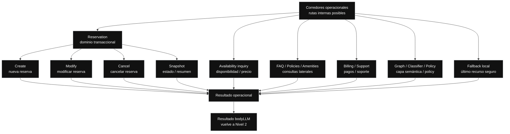

// Path: .runtime-analysis/runtime-map-v1/03-bodyllm-operational-corridors-level-3.md

# Runtime Map V1 — Nivel 3B

## Propósito

Este mapa explota la caja:

```text
Corredores operacionales
```

del Nivel 2 de `bodyLLM`.

Los corredores operacionales representan las rutas internas posibles que `bodyLLM` puede activar después de la decisión de turno.

No son funciones extraídas.  
No son módulos separados.  
No son una propuesta inmediata de refactor.

Son fronteras conceptuales para entender qué familias de comportamiento conviven dentro de `bodyLLM`.

---

## Regla del Nivel 3B

```text
Nivel 3B = corredores operacionales abiertos.

Muestra:
- familias de rutas internas
- responsabilidad conceptual de cada corredor
- riesgos de solapamiento
- relación con rangos tentativos de código

No muestra todavía:
- líneas exactas de cada early return
- helpers concretos
- tests específicos
- contratos detallados por subflujo
- diseño de primer micro-refactor
```

Eso corresponde al Nivel 4 o al box-index machine-friendly.

---

## Nivel 3B — Corredores operacionales dentro de bodyLLM



---

## Evidencia actual de código

```yaml
repo: /home/marcelo/begasist
base_file: lib/handlers/messageHandler.ts
commit_base: e67ba49
messageHandler_lines: 11683
working_tree_status: clean
analysis_scope: commit_e67ba4968d2275211fe63673cf64224bcae07fc8
baseline_status: committed_fix_pushed_runtime_map_refresh_applied_v20
bodyLLM_range: L4861-L11313
bodyLLM_lines: 6453
known_manual_bug: none
```

---

## Rangos tentativos relacionados

Estos rangos vienen del scan actualizado y son orientativos.

```text
No son fronteras físicas definitivas.
No significan que cada corredor exista como módulo separado.
```

| Corredor / zona conceptual | Rango tentativo | Confianza |
| --- | ---: | --- |
| Fast paths iniciales / structured analyze / create temporal | L4861-L5610 | medium |
| Modify corridor / selected target / reparación temporal | L5861-L7610 | medium |
| Create / availability / quote / proposal | L7611-L8110 | medium |
| Copy por canal / replies transversales | L8111-L8610 | medium |
| Cancel corridor | L8611-L8860 | medium |
| Snapshot / canonical reply / billing bridge | L8861-L9610 | medium |
| Graph / classifier / policy / fallback | L9611-L9860 | medium |
| Late temporal repair / final create cleanup / outbound endings | L9861-L11313 | low |

---

## Corredor 1 — Reservation

`Reservation` agrupa las rutas más sensibles porque pueden afectar reservas reales o estado transaccional.

Incluye:

```text
create
modify
cancel
snapshot
```

### Responsabilidad conceptual

Resolver acciones y consultas vinculadas a reservas.

### Riesgo principal

```text
Create, modify, cancel y snapshot comparten estado,
pero no deberían compartir todas las reglas.
```

### Estado sensible compartido

```text
reservationSlots
conversationFocus
lastProposal
lastReservation
selectedReservationTarget
pendingCancellation
modifyState
reservationHistory
```

---

## Corredor 1.1 — Create

`Create` gestiona la creación de nuevas reservas.

Puede involucrar:

```text
guestName
roomType
checkIn
checkOut
numGuests
availability check
quote
proposal
CONFIRMAR
confirmAndCreate
```

### Responsabilidad conceptual

Completar slots mínimos, validar coherencia, consultar disponibilidad y permitir confirmación explícita.

### Rango tentativo principal

```yaml
range: L7611-L8110
confidence: medium
related_ranges:
  - L4861-L5610
  - L9861-L11313
```

### Riesgo principal

```text
Create suele ser el corredor que más fácilmente captura otros contextos.
```

### Riesgos específicos

```text
slot attribution
date repair
quote gating
confirmation gating
availability
create vs modify contamination
language stickiness
quote copy
```

### Candidate slice orientation

```yaml
safer:
  - reservation.create.quoteCopy
  - reservation.create.quote_gating
  - reservation.create.proposal_confirmation
```

---

## Corredor 1.2 — Modify

`Modify` gestiona cambios sobre una reserva existente.

Puede involucrar:

```text
target de reserva
campo a modificar
nuevo valor
fechas nuevas
validación de disponibilidad
confirmación de modificación
```

### Responsabilidad conceptual

Aplicar cambios a una reserva identificada o pedir desambiguación si no hay target claro.

### Rango tentativo principal

```yaml
range: L5861-L7610
confidence: medium
related_ranges:
  - L9861-L10360
```

### Riesgo principal

```text
Modify depende mucho de reference resolution y selectedReservationTarget.
```

### Riesgos específicos

```text
target resolution
selected target
modify state
date repair
active field
create vs modify contamination
```

---

## Corredor 1.3 — Cancel

`Cancel` gestiona cancelaciones de reservas.

Puede involucrar:

```text
target de reserva
motivo opcional
confirmación sensible
cancelReservation
estado post-cancelación
```

### Responsabilidad conceptual

Cancelar solo cuando exista target suficiente y confirmación adecuada.

### Rango tentativo principal

```yaml
range: L8611-L8860
confidence: medium
```

### Riesgo principal

```text
Cancel es una acción sensible.
No debe ejecutarse por ambigüedad.
```

### Riesgos específicos

```text
sensitive action
target resolution
confirmation gate
destructive action
```

---

## Corredor 1.4 — Snapshot

`Snapshot` muestra o resume el estado de una reserva o conversación.

Puede involucrar:

```text
reserva confirmada
draft activo
última propuesta
historial de reservas
resumen post-booking
```

### Responsabilidad conceptual

Responder consultas de estado sin abrir accidentalmente create, modify o cancel.

### Rango tentativo principal

```yaml
range: L8861-L9610
confidence: medium
related_ranges:
  - L6361-L6610
  - L11111-L11313
```

### Riesgo principal

```text
Snapshot puede ser secuestrado por create o date repair.
```

### Riesgos específicos

```text
post booking
canonical reply
reservation history
create capture risk
date repair contamination
```

---

## Corredor 2 — Availability inquiry

`Availability inquiry` gestiona consultas de disponibilidad que no necesariamente son una reserva activa.

### Responsabilidad conceptual

Responder disponibilidad o precio sin convertir automáticamente toda consulta en create flow.

### Rango tentativo principal

```yaml
range: L7611-L8110
confidence: medium
related_ranges:
  - L5111-L5610
  - L10361-L10860
```

### Riesgo principal

```text
Confundir inquiry con create.
```

### Riesgos específicos

```text
availability
quote gating
date range extraction
create capture risk
```

---

## Corredor 3 — FAQ / Policies / Amenities

Este corredor resuelve consultas informativas laterales.

### Responsabilidad conceptual

Responder información del hotel sin romper continuidad conversacional.

### Rango tentativo principal

```yaml
range: L4861-L5110
confidence: low
related_ranges:
  - L9611-L9860
```

### Riesgo principal

```text
Una consulta lateral durante una reserva activa no debería destruir el foco.
```

### Riesgos específicos

```text
lateral question
focus preservation
retrieval
reservation context contamination
```

---

## Corredor 4 — Billing / Support

Este corredor resuelve consultas de facturación, pago o soporte.

### Responsabilidad conceptual

Atender consultas administrativas o de soporte sin confundirse con reserva transaccional.

### Rango tentativo principal

```yaml
range: L9361-L9610
confidence: medium
related_ranges:
  - L10861-L11110
```

### Riesgo principal

```text
Billing puede solaparse con reservation cuando el huésped pregunta por precio,
seña, pago o confirmación.
```

### Riesgos específicos

```text
billing reservation overlap
support handoff
payment policy
supervised escalation
```

---

## Corredor 5 — Graph / Classifier / Policy

Este corredor representa la capa semántica/probabilística o de policy.

### Responsabilidad conceptual

Resolver ambigüedad, enriquecer interpretación o derivar a una ruta cuando las señales deterministas no alcanzan.

### Rango tentativo principal

```yaml
range: L9611-L9860
confidence: medium
related_ranges:
  - L4861-L5110
  - L11111-L11313
```

### Riesgo principal

```text
La capa semántica no debe pisar contratos deterministas críticos.
```

### Riesgos específicos

```text
semantic override
policy gate
classifier misroute
deterministic contract violation
```

---

## Corredor 6 — Fallback local

Este corredor se usa cuando ninguna ruta principal domina con suficiente claridad.

### Responsabilidad conceptual

Responder de forma segura sin ejecutar acciones sensibles.

### Rango tentativo principal

```yaml
range: L9611-L9860
confidence: medium
```

### Riesgo principal

```text
Fallback no debe inventar acciones.
Fallback no debe confirmar reservas.
Fallback no debe cancelar reservas.
Fallback no debe romper estado activo.
```

### Riesgos específicos

```text
fallback
last resort
state preservation
no sensitive action
domain leak
```

---

## Corredor transversal — Copy por canal

Aunque no es un dominio de negocio, aparece como corredor transversal dentro de `bodyLLM`.

### Rango tentativo principal

```yaml
range: L8111-L8610
confidence: medium
related_ranges:
  - L6111-L6360
  - L10861-L11110
  - L11111-L11313
```

### Riesgo principal

```text
Un fix funcional puede alterar UX/copy de canal sin intención explícita.
```

### Riesgos específicos

```text
channel copy
email
whatsapp
reply composition
ux regression
```

---

## Riesgos transversales entre corredores

### 1. Reglas duplicadas

```text
date repair aparece en create, modify, availability inquiry y zona final.
```

Riesgo:

```text
Se corrige un corredor pero queda otro con lógica vieja.
```

### 2. Precedencia implícita

```text
Un corredor puede ganar solo porque aparece antes en el flujo.
```

### 3. Estado compartido

```text
Varios corredores leen o escriben:
reservationSlots
conversationFocus
selectedReservationTarget
lastProposal
lastReservation
pendingCancellation
modifyState
```

### 4. Respuestas parecidas

```text
Distintos corredores pueden generar respuestas plausibles con copy similar.
El usuario puede ver una respuesta correcta en tono pero emitida por el corredor equivocado.
```

### 5. Acciones sensibles

```text
confirmAndCreate
modifyReservation
cancelReservation
send email copy
send WhatsApp copy
```

Riesgo:

```text
Una mala decisión de turno puede terminar en una acción real equivocada.
```

---

## No-go first slice

Orientación conceptual solamente.

```yaml
no_go_first_slice:
  - turnDecision
  - canonical state
  - reference resolution
  - persistencia transversal
  - graph/classifier/policy
  - fallback local
  - date repair
  - feature-flag-dependent branches
```

---

## Regla operativa

Antes de corregir un bug dentro de `bodyLLM`, identificar:

```text
¿Qué corredor lo está resolviendo?
¿Hay otro corredor que resuelve algo parecido?
¿El fix debe aplicarse solo aquí o en una frontera común?
¿Qué estado lee este corredor?
¿Qué estado escribe?
¿Qué precedencia puede alterar?
¿Qué respuesta observable cambia?
¿Qué test congela esta conducta?
```

---

## Vuelve a Nivel 2

```text
Nivel 2:
bodyLLM abierto

Este Nivel 3B explica la caja:
corredores operacionales
```
