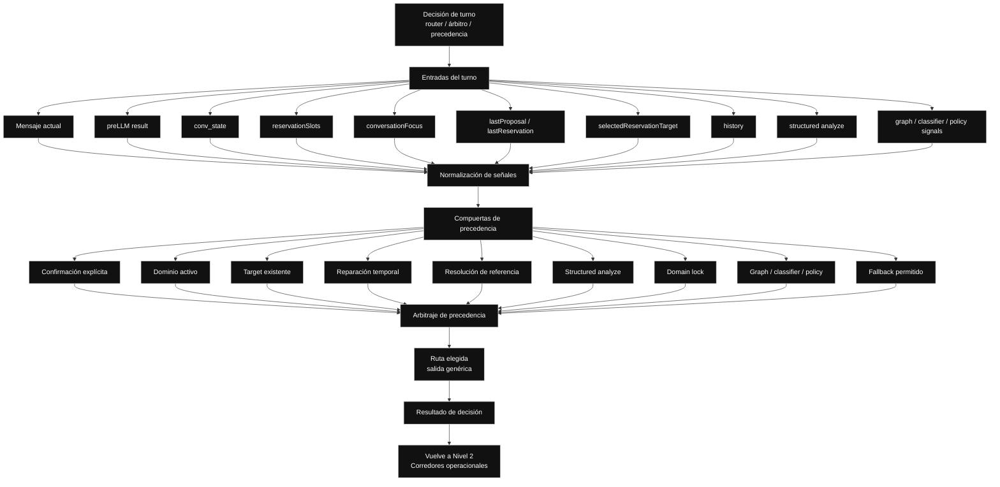

// Path: .runtime-analysis/runtime-map-v1/03-bodyllm-turn-decision-level-3.md

# Runtime Map V1 — Nivel 3A

## Propósito

Este mapa explota la caja:

```text
Decisión de turno
```

del Nivel 2 de `bodyLLM`.

La decisión de turno no es un dominio de negocio.  
No es `Reservation`.  
No es `Availability inquiry`.  
No es `FAQ`.  
No es `Graph`.  
No es `Fallback`.

Es una compuerta interna de `bodyLLM` que decide qué ruta debe dominar para el mensaje actual.

No es un refactor.  
No es una propuesta de extracción inmediata.  
No modifica arquitectura.  
No autoriza mover código.

Sirve para visualizar por qué muchos fixes provocan regresiones: varias señales compiten por decidir el mismo turno.

---

## Regla del Nivel 3A

```text
Nivel 3A = Decisión de turno abierta.

Muestra:
- entradas del turno
- señales disponibles
- normalización de señales
- compuertas de precedencia
- arbitraje
- ruta elegida
- resultado de decisión

No muestra:
- ejecución concreta de Reservation
- ejecución concreta de Availability inquiry
- ejecución concreta de FAQ / Policies / Amenities
- ejecución concreta de Billing / Support
- ejecución concreta de Graph / Classifier / Policy
- ejecución concreta de Fallback local

Las rutas concretas pertenecen a:
03-bodyllm-operational-corridors-level-3.md
```

---

## Nivel 3A — Decisión de turno dentro de bodyLLM



---

## Lectura del Nivel 3A

La decisión de turno recibe información desde varias fuentes:

```text
mensaje actual
preLLM result
conv_state
reservationSlots
conversationFocus
lastProposal
lastReservation
selectedReservationTarget
history
structured analyze
graph / classifier / policy signals
```

Con esas entradas construye señales internas.

Luego esas señales pasan por compuertas de precedencia.

La salida de esta caja no debería entenderse como una respuesta final al huésped.

La salida conceptual es:

```text
ruta elegida
intención dominante
estado que debe preservarse
estado que puede actualizarse
acción permitida
acción bloqueada
respuesta candidata o siguiente etapa
```

---

## Evidencia actual de código

```yaml
repo: /home/marcelo/begasist
base_file: lib/handlers/messageHandler.ts
commit_base: e67ba49
messageHandler_lines: 11683
working_tree_status: clean
analysis_scope: commit_e67ba4968d2275211fe63673cf64224bcae07fc8
baseline_status: committed_fix_pushed_runtime_map_refresh_applied_v20
bodyLLM_range: L4861-L11313
bodyLLM_lines: 6453
known_manual_bug: none
```

---

## Rangos relacionados

La decisión de turno no aparece como una única función física dentro de `bodyLLM`.

Por ahora se representa como caja conceptual distribuida.

Rangos tentativos relacionados:

| Zona                                                        |       Rango | Confianza | Motivo                                                                                        |
| ----------------------------------------------------------- | ----------: | --------- | --------------------------------------------------------------------------------------------- |
| Fast paths iniciales / structured analyze / create temporal | L4861-L5610 | medium    | Alta densidad de `date/temporal`, `structured analyze`, `create`, `availability` y decisiones |
| Late temporal repair / final create cleanup                 | L9861-L11313 | low      | Alta densidad temporal y mezcla de create/modify/cierre                                       |
| Helpers previos de dominio                                  | L2791-L3916 | high      | Funciones auxiliares detectadas por firma clara                                               |

Helpers relevantes previos a `bodyLLM`:

```text
detectDominantTurnDomain:           L2791-L3074
getReservationDomainLockSignal:     L3075-L3246
shouldUseReservationLocalFallback:  L3247-L3299
buildReservationLocalFallbackReply: L3300-L3436
assessReservationDateCoherence:     L3437-L3916
tryStructuredAnalyze:               L3917-L4105
```

---

## Rol de esta caja

```text
Decisión de turno = árbitro de precedencia
```

Su responsabilidad conceptual es decidir:

```text
qué señal domina
qué ruta queda habilitada
qué ruta queda bloqueada
qué estado previo importa
qué estado nuevo puede entrar
qué fallback queda permitido
qué acción no debe ejecutarse
```

---

## Entradas principales

### 1. Mensaje actual

Es el texto nuevo del huésped.

Ejemplos:

```text
confirmar
check out 25/5/2026, 2 personas
quiero modificar la reserva
¿el desayuno está incluido?
```

Riesgo:

```text
Leer el mensaje aislado sin respetar el estado conversacional.
```

---

### 2. preLLM result

Es la preparación previa del turno.

Puede aportar señales como:

```text
idioma
categoría preliminar
slots detectados
contexto mínimo
historial resumido
```

Riesgo:

```text
Tomar una señal preliminar como decisión final.
```

---

### 3. conv_state

Es el estado persistido de la conversación.

Puede incluir:

```text
reservationSlots
conversationFocus
lastProposal
lastReservation
pendingCancellation
modifyState
selectedReservationTarget
```

Riesgo:

```text
Ignorar estado activo y tratar cada turno como conversación nueva.
```

---

### 4. reservationSlots

Contiene slots de reserva conocidos o parciales.

Ejemplos:

```text
guestName
roomType
checkIn
checkOut
numGuests
```

Riesgo:

```text
Mezclar slots viejos con slots nuevos sin validar coherencia.
```

---

### 5. conversationFocus

Indica si la conversación está enfocada en un dominio o subflujo.

Ejemplos:

```text
reservation.create
reservation.modify
reservation.cancel
post-booking
lateral FAQ
```

Riesgo:

```text
Capturar laterales como create.
Perder continuidad de reserva ante una pregunta secundaria.
```

---

### 6. lastProposal / lastReservation

Permite saber si hay una propuesta activa o una reserva confirmada.

Riesgo:

```text
Interpretar “confirmar” sin saber qué se está confirmando.
```

---

### 7. selectedReservationTarget

Indica si ya hay una reserva concreta seleccionada para operar.

Afecta especialmente:

```text
modify
cancel
snapshot
reference resolution
```

Riesgo:

```text
Modificar, cancelar o resumir la reserva equivocada.
```

---

### 8. history

El historial ayuda a interpretar continuidad y referencias implícitas.

Riesgo:

```text
Usar demasiado historial y reactivar contexto viejo.
Usar poco historial y perder continuidad real.
```

---

### 9. structured analyze

Aporta una lectura estructurada del mensaje.

Puede detectar:

```text
intent
roomType
dates
numGuests
guestName
acciones posibles
```

Riesgo:

```text
Tomar la salida estructurada como verdad absoluta sin respetar estado, foco o precedencia.
```

---

### 10. graph / classifier / policy signals

Aporta capa semántica o probabilística.

Riesgo:

```text
Entrar demasiado temprano y pisar guards deterministas.
Entrar demasiado tarde y no resolver ambigüedad real.
```

---

## Compuertas de precedencia

### 1. Confirmación explícita

Determina si un mensaje como:

```text
confirmar
CONFIRMAR
sí
ok
dale
```

puede cerrar una acción o solo continuar conversación.

Riesgo:

```text
Confirmar algo que no estaba listo para confirmarse.
```

---

### 2. Dominio activo

Determina si el turno debe seguir dentro del dominio activo.

Riesgo:

```text
Un dominio activo puede capturar algo que pertenece a otro dominio.
```

---

### 3. Target existente

Determina si existe una entidad concreta sobre la cual operar.

Ejemplos:

```text
reserva seleccionada
draft activo
propuesta activa
cancelación pendiente
modificación pendiente
```

Riesgo:

```text
Operar sin target o con target equivocado.
```

---

### 4. Reparación temporal

Determina si el turno corrige fechas, completa fechas o invalida fechas.

Riesgo:

```text
Aplicar reparación de checkIn sobre checkOut.
Aplicar reparación de create sobre modify.
Cotizar con rango inválido.
```

---

### 5. Resolución de referencia

Determina a qué reserva se refiere el huésped cuando hay más de una posibilidad.

Riesgo:

```text
Saltarse la desambiguación.
Usar una reserva incorrecta como target.
```

---

### 6. Structured analyze

Puede ayudar a identificar intención y slots, pero debe ser arbitrado.

Riesgo:

```text
Structured analyze puede detectar una fecha correcta,
pero la decisión de turno debe decidir a qué slot pertenece y si es válida.
```

---

### 7. Domain lock

Mantiene o bloquea foco conversacional.

Riesgo:

```text
Bloquear demasiado y capturar laterales.
Bloquear poco y perder continuidad de reserva.
```

---

### 8. Graph / classifier / policy

Aporta interpretación semántica/probabilística o de policy.

Riesgo:

```text
Graph/classifier/policy no debe pisar contratos deterministas críticos.
```

---

### 9. Fallback permitido

Define si es seguro caer a fallback.

Riesgo:

```text
Fallback no debe inventar acciones.
Fallback no debe confirmar reservas.
Fallback no debe romper estado activo.
```

---

## Arbitraje de precedencia

La decisión de turno no solo detecta señales.

También debe arbitrar conflictos.

Ejemplo:

```text
El huésped dice: "sí"
```

Puede significar:

```text
confirmar propuesta de reserva
aceptar verificar disponibilidad
confirmar cancelación
continuar modificación
respuesta genérica
```

La señal ganadora depende del estado previo.

Otro ejemplo:

```text
El huésped dice: "check out 25/5/2026, 2 personas"
```

Puede traer:

```text
marcador explícito de checkOut
fecha inválida
numGuests válido
continuidad de create
```

La decisión correcta no es solo detectar una fecha.

Debe decidir:

```text
la fecha pertenece a checkOut
checkOut es inválido si contradice el checkIn vigente
numGuests puede preservarse como slot seguro
la ruta no debe cotizar todavía
la respuesta debe pedir nuevo checkOut
```

---

## Ruta elegida

La caja `Ruta elegida` es genérica en este nivel.

No enumera rutas concretas para evitar repetir el Nivel 3B.

Las rutas concretas se explotan en:

```text
03-bodyllm-operational-corridors-level-3.md
```

Ahí aparecerán:

```text
Reservation
Availability inquiry
FAQ / Policies / Amenities
Billing / Support
Graph / Classifier / Policy
Fallback local
```

---

## Resultado de decisión

El resultado conceptual de esta caja debería poder describirse así:

```text
rutaElegida
intenciónDominante
estadoPreservado
estadoActualizado
acciónPermitida
acciónBloqueada
motivoDeBloqueo
respuestaCandidata
```

No necesariamente existe así en código hoy.

Este mapa lo expresa como frontera conceptual para entender y auditar el runtime.

---

## Riesgo principal de esta caja

```text
El riesgo principal es la precedencia.
```

Cuando un fix cambia el orden de evaluación, puede ocurrir que:

```text
una rama que antes no ganaba ahora gana
una rama de create capture modify
una rama de date repair capture snapshot
una confirmación genérica cierre una acción sensible
un fallback responda antes que una ruta determinista
```

Por eso los fixes en esta zona deben revisar:

```text
qué señal se agregó
qué señal quedó antes
qué señal quedó después
qué ruta ganó antes
qué ruta gana ahora
qué estado se lee
qué estado se escribe
qué tests congelan la precedencia
```

---

## Regla operativa

Antes de tocar esta caja, el hito debería declarar:

```text
impact_boxes:
- runtime.messageHandler.bodyLLM.turnDecision

risk_tags:
- precedence
- temporal_repair
- slot_attribution
- confirmation_gating
- fallback_permission

forbidden_boxes:
- cajas que no deben alterarse en el fix
```

---

## Regla de lectura

```text
Identificar cajas no significa extraer cajas.
```

Antes de extraer esta caja haría falta:

```text
1. contrato de precedencia
2. tests de paridad por ruta
3. snapshots de comportamiento observable
4. inventario de estado leído/escrito
5. control de early returns
```

---

## Vuelve a Nivel 2

```text
Nivel 2:
bodyLLM abierto

Este Nivel 3A explica la caja:
Decisión de turno

Luego vuelve a:
Corredores operacionales
```
