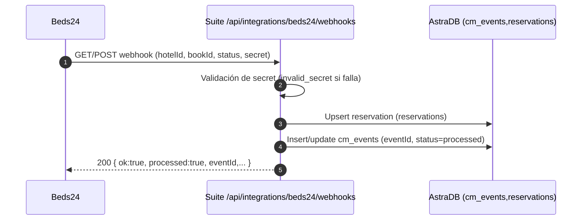
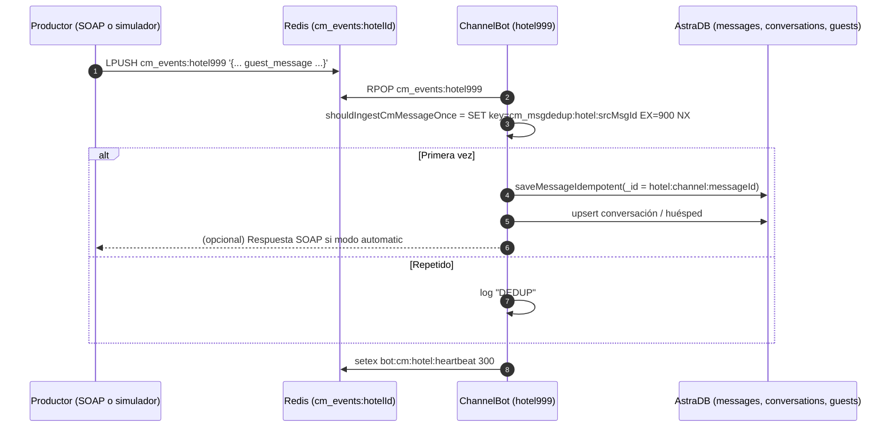

¡de una! te dejo un **.md** listo para pegar en tu repo. Incluye visión general, dos diagramas (Mermaid), colas/keys de Redis, ventanas/TTL, flujo de idempotencia, polling y troubleshooting.

---

# Arquitectura de Suite, Redis y Bots (Channel Manager & Webhooks)

Este documento describe cómo se relacionan **Suite (Next.js)**, **Redis**, los **bots** (Channel Manager), **webhooks** externos (Beds24 / CM), **AstraDB**, y cómo funcionan la **idempotencia**, **ventanas (TTL) en Redis** y la **sincronía** de eventos.

## 1) Visión general (topología)

```mermaid
flowchart LR
  subgraph Ext[Fuentes externas]
    B24[Beds24 Webhooks]
    CM[Channel Manager SOAP]
  end

  subgraph Suite[Suite (Next.js)]
    API[/API Integrations: /api/integrations/beds24/webhooks/]
    UI[[Frontend Panel]]
  end

  subgraph DB[AstraDB]
    RSV[(reservations)]
    CME[(cm_events)]
    MSG[(messages)]
    CONV[(conversations)]
    GUEST[(guests)]
  end

  subgraph Redis[(Redis)]
    Q1{{cm_events:hotelId}}:::queue
    DLQ{{cm_events:dead:hotelId}}:::queue
    DEDUP[(cm_msgdedup:hotelId:srcMsgId)]:::kv
    HB[(bot:cm:hotelId:heartbeat)]:::kv
  end

  subgraph Bot[ChannelBot (hotel999)]
    POLL[Loop Polling\n(SOAP + Redis)]
    HNDL[handleChannelManagerEvent]
  end

  classDef queue fill:#E3F2FD,stroke:#2196F3,color:#0D47A1;
  classDef kv fill:#FFF3E0,stroke:#FB8C00,color:#E65100;

  B24 -->|webhook| API
  API -->|upsert| RSV
  API -->|insert| CME
  API -->|responde JSON| B24

  CM --pull events--> POLL
  POLL --> HNDL
  HNDL -->|mensajes| MSG
  HNDL -->|conversaciones| CONV
  HNDL -->|huespedes| GUEST
  HNDL -->|dedupe SETNX| DEDUP

  POLL <-. drain .-> Q1
  POLL --> DLQ

  HNDL -->|heartbeat setex| HB

  UI -->|GET| MSG
  UI -->|GET| CONV
  UI -->|GET| RSV
  UI -->|GET| CME
```

**Resumen:**

* Los **webhooks** llegan a **Suite** → se **persisten** en Astra (**cm\_events**, **reservations**) y se responde idempotentemente al proveedor.
* El **bot** (Channel Manager) corre su **loop de polling**: drena eventos simulados de **Redis**, (opcionalmente) consulta **SOAP**, aplica **idempotencia** y persiste **messages/conversations**.
* El **frontend** consulta Astra; **Redis** se usa para **colas efímeras** e **idempotencia temporal**.

---

## 2) Flujo de Webhook (Beds24 → Suite → Astra)



**Notas:**

* La idempotencia de webhook se mantiene usando el **eventId** en `cm_events` (no duplica si llega repetido).
* El estado en `reservations.status` sigue al **Channel Manager** (`confirmed/modified/cancelled`).

---

## 3) Flujo de Mensajes del Channel Manager (Redis/SOAP → Bot → Astra)



**Claves del flujo:**

* **Idempotencia doble**:

  1. **Redis**: `SET key NX EX=900` (`cm_msgdedup:<hotelId>:<srcMsgId>`).
  2. **DB**: `_id = <hotelId>:<channel>:<messageId>` en `messages`.
* **Heartbeat**: `bot:cm:<hotelId>:heartbeat` con TTL (dev: 300s).

---

## 4) Claves & ventanas (TTL) en Redis

| Key                                | Uso                                  | Ejemplo                           | TTL                                     |
| ---------------------------------- | ------------------------------------ | --------------------------------- | --------------------------------------- |
| `cm_events:<hotelId>`              | Cola principal de eventos CM (JSON)  | `cm_events:hotel999`              | sin TTL (cola)                          |
| `cm_events:dead:<hotelId>`         | Dead-letter queue                    | `cm_events:dead:hotel999`         | sin TTL                                 |
| `cm_msgdedup:<hotelId>:<srcMsgId>` | Idempotencia por mensaje CM (SET NX) | `cm_msgdedup:hotel999:cm-msg-123` | **900s** (ajustable)                    |
| `bot:cm:<hotelId>:heartbeat`       | Latido del bot                       | `bot:cm:hotel999:heartbeat`       | **300s** (dev) / 60s (prod recomendado) |

> **“Ventanas” de Redis**: son **períodos de validez** (TTL) que usamos para:
>
> * **dedupe temporal** de mensajes entrantes (evitar duplicados cercanos en el tiempo);
> * **observabilidad** (saber que el bot está vivo) sin persistir estado a largo plazo.

---

## 5) Polling, backoff y sincronía

* **`pollingInterval`** (p.ej., **15s**): cadencia base del loop.
* **Jitter** **0–500ms**: evita que múltiples bots peguen al mismo tiempo.
* **Backoff SOAP**: si falla, se multiplica \~×1.5 hasta **120s**; si vuelve a funcionar, se resetea al `pollingInterval`.
* **Orden** en cada `poll()`:

  1. **Heartbeat** → `SETEX bot:cm:<hotelId>:heartbeat`.
  2. **`enabled`** (feature flag) → si está pausado, no procesa.
  3. **Drenar Redis** → `RPOP` hasta 200 eventos por iteración → mover inválidos a **DLQ**.
  4. (Opcional) **Pull SOAP** → parsear → procesar.
  5. **Schedule next** con jitter / backoff.

---

## 6) Idempotencia (detalle)

**Redis (rápida):**

```ts
const key = `cm_msgdedup:${hotelId}:${srcMsgId}`;
const ok = await redis.set(key, "1", "EX", 900, "NX"); // EX=TTL segundos, NX=solo si no existe
if (ok !== "OK") { /* DUPLICADO */ }
```

**DB (fuerte):**

```ts
const _id = `${msg.hotelId}:${msg.channel}:${msg.messageId}`;
if (await col.findOne({ _id })) { /* DUPLICADO */ }
await col.insertOne({ _id, ...msg });
```

> La doble barrera evita duplicados tanto en **carrera cercana** (Redis) como en **persistencia** (Astra).

---

## 7) Comandos útiles (sanity checks)

**Heartbeat del bot**

```bash
docker exec -i begasist-redis redis-cli TTL bot:cm:hotel999:heartbeat
docker exec -i begasist-redis redis-cli GET bot:cm:hotel999:heartbeat
```

**Colas**

```bash
docker exec -i begasist-redis redis-cli LLEN cm_events:hotel999
docker exec -i begasist-redis redis-cli LLEN cm_events:dead:hotel999
```

**Dedupe keys recientes**

```bash
docker exec -i begasist-redis redis-cli --scan --pattern 'cm_msgdedup:hotel999:*' | head
```

**Push de evento de prueba (desde el bot)**

```bash
docker exec -i begasist-channelbot-hotel999 node -e '
const Redis=require("ioredis"); const r=new Redis(process.env.REDIS_URL);
(async()=>{await r.lpush("cm_events:hotel999", JSON.stringify({
  eventId:"evt-sim-X", eventType:"guest_message", channel:"channelManager",
  payload:{ messageId:"cm-msg-X", conversationId:"hotel999-channelManager-guest-X",
    guestId:"guest-X", channel:"channelManager", timestamp:new Date().toISOString(), content:"Hola!" },
  receivedAt:new Date().toISOString()
})); console.log("pushed"); process.exit(0)})()'
```

---

## 8) Troubleshooting rápido

* **“No veo la key en Redis”**: inspeccioná **desde el contenedor de Redis**:

  ```bash
  docker exec -i begasist-redis redis-cli TTL bot:cm:hotel999:heartbeat
  ```

  (Evita confundir con otra instancia local.)

* **Duplicó mensajes**: revisá que **uses el `messageId` del CM** como `_id` base y que el `SET NX` esté **antes** de guardar en DB.

* **DLQ crece**: inspeccioná un item de `cm_events:dead:hotel999` con `LRANGE` y validá el JSON.

---

## 9) Notas de despliegue (compose)

* **Suite + Redis** (en `begasist_net`).
* **Bots** se unen a la **misma red externa** y usan `REDIS_URL=redis://begasist-redis:6379`.

Ejemplo (bots):

```yaml
services:
  bot_hotel999:
    image: begasist-channelbot:dev
    environment:
      - HOTEL_ID=hotel999
      - REDIS_URL=redis://begasist-redis:6379
    networks:
      - begasist_net

networks:
  begasist_net:
    external: true
```

---

## 10) Glosario breve

* **Webhook**: llamada HTTP entrante desde un tercero (Beds24/CM) hacia nuestra API.
* **Polling**: ciclo periódico para extraer eventos (de Redis o SOAP).
* **DLQ** (*Dead Letter Queue*): cola donde se guardan eventos que fallaron para diagnóstico/reproceso.
* **TTL** (*Time To Live*): caducidad de una key en Redis.
* **Idempotencia**: capacidad de procesar el mismo evento varias veces sin efectos laterales duplicados.
* **Heartbeat**: marca efímera en Redis para saber si el bot está vivo.
* **SET NX EX**: operación atómica de Redis para “guardar si no existe, con expiración”.

---

¿Querés que lo convierta en un `docs/arquitectura-mensajeria.md` dentro del repo o que lo pase a un canvas con los diagramas embebidos?
