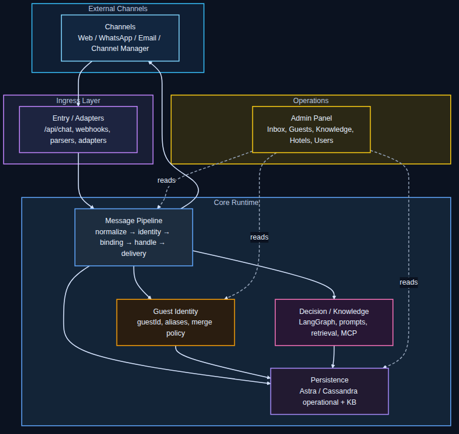
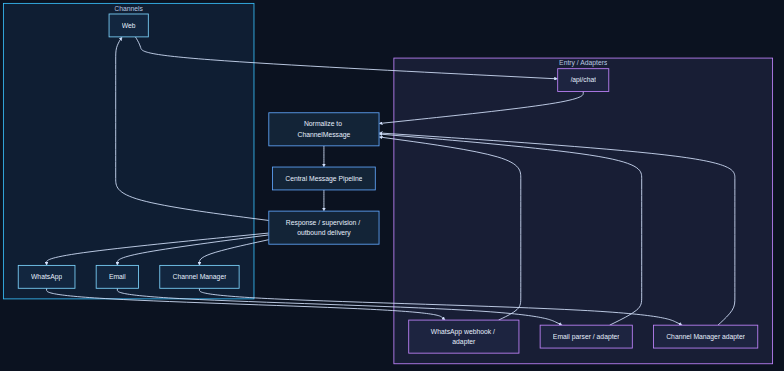
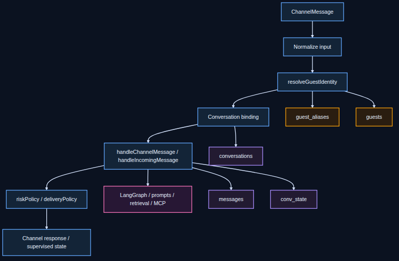
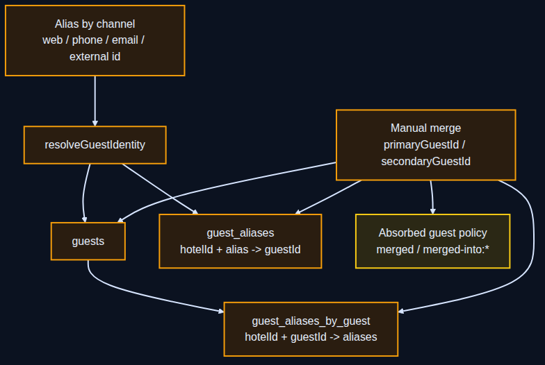
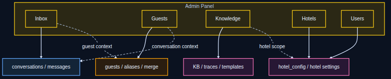

# Begasist Architecture Overview

Este directorio contiene la documentación arquitectónica estable del sistema
Begasist.

El objetivo de esta documentación es describir cómo está diseñado el sistema,
independientemente de la secuencia histórica de cambios.

Para comprender la evolución del sistema debe consultarse también:

`hito_mcp.md`

que funciona como Architecture Evolution Log del proyecto.

## Organización de la documentación

La arquitectura del sistema se documenta por dominios funcionales.

Cada archivo describe un subsistema específico.

Ejemplo de dominios documentados:

- Admin Panel
- Channels
- Guest Identity
- Knowledge Base
- MCP / Channel Manager
- Message Pipeline
- Multi-hotel SaaS architecture

## Documentos disponibles

### Pipeline conversacional vigente

`message_pipeline.md`

Es el documento vivo principal para entender el runtime conversacional actual.

Explica:

- que `messageHandler` sigue siendo el runtime principal
- cómo conviven guards deterministas, heurísticas y graph
- cómo se usa el contexto conversacional
- cómo funcionan reservas múltiples, foco activo y reference resolution
- cuáles son los límites actuales del sistema

Debe tomarse como referencia arquitectónica del pipeline actual.

### Admin Panel

`admin_panel.md`

Describe la arquitectura del panel administrativo del sistema, incluyendo:

- organización por dominios funcionales
- modelo guest-centric
- separación Inbox / Guests
- herramientas administrativas
- evolución inicial documentada en `UI-ADMIN-01`

### Arquitectura general

`system_overview.mmd`
`system_overview.svg`

Resume la arquitectura general de Begasist en nivel L1:

- Channels
- Entry / Adapters
- Message Pipeline
- Guest Identity
- Decision / Knowledge
- Persistence
- Admin Panel

[Ver diagrama](./system_overview.svg)
[PNG fallback](./system_overview.png)
[Editar fuente](./system_overview.mmd)

### Subdiagramas arquitectónicos

Los detalles operativos del sistema se separan en diagramas de nivel L2 para
evitar sobrecargar el overview principal.

#### Channels

`channel_flow_overview.mmd`
`channel_flow_overview.svg`

Describe cómo Web, WhatsApp, Email y Channel Manager convergen hacia el
pipeline conversacional central.

[Ver diagrama](./channel_flow_overview.svg)
[PNG fallback](./channel_flow_overview.png)
[Editar fuente](./channel_flow_overview.mmd)

#### Message Pipeline

`message_pipeline_detail.mmd`
`message_pipeline_detail.svg`

Describe una vista diagramática simplificada del pipeline:

- normalización
- resolución de identidad
- binding conversacional
- manejo de mensajes
- política de entrega

Para la arquitectura viva y el runtime real del pipeline, ver primero:

`message_pipeline.md`

[Ver diagrama](./message_pipeline_detail.svg)
[PNG fallback](./message_pipeline_detail.png)
[Editar fuente](./message_pipeline_detail.mmd)

#### Guest Identity

`guest_identity_detail.mmd`
`guest_identity_detail.svg`

Describe la capa de identidad transversal:

- `guests`
- `guest_aliases`
- `guest_aliases_by_guest`
- merge manual
- política de guests absorbidos

[Ver diagrama](./guest_identity_detail.svg)
[PNG fallback](./guest_identity_detail.png)
[Editar fuente](./guest_identity_detail.mmd)

#### Admin Panel

`admin_panel_relation.mmd`
`admin_panel_relation.svg`

Describe cómo las vistas administrativas consultan los dominios operativos del
sistema.

[Ver diagrama](./admin_panel_relation.svg)
[PNG fallback](./admin_panel_relation.png)
[Editar fuente](./admin_panel_relation.mmd)

### Twilio inbound routing

`twilio_inbound_contract.md`

Documenta el contrato de routing inbound de WhatsApp Twilio:

`Twilio inbound -> resolveHotelIdByTwilioTo(to) -> hotelId | unmapped`

### Persistencia Astra

`astra_persistence_policy.md`

Describe la separación entre capa operacional SaaS y capa KB/retrieval.

### Guest aliases en CQL

`astra_guest_aliases_table_adapter.md`

Documenta la implementación de `guest_aliases` como tabla Cassandra CQL.

### Binding de conversación por huésped

`conversation_binding_guest_identity.md`

Documenta la resolución de conversación por identidad (`guestId`) con prioridad:

1. `conversationId` explícito
2. conversación activa por `(hotelId + guestId)`
3. nueva conversación

### Inbox admin unificado

`admin_inbox_unified.md`

Documenta la consulta admin unificada por `guestId` sobre infraestructura
multicanal.

### ADR: Transporte Email Objetivo

`adr_email_transport_target.md`

Define la arquitectura objetivo del transporte email en producción,
preservando el pipeline conversacional central y separando transporte,
normalización, control técnico y dominio.

### ADR: Pipeline Runtime Target

`adr_pipeline_runtime_target.md`

Define el cierre arquitectónico de la serie `PIPELINE-SIGNAL-ARCH`,
manteniendo `messageHandler` como runtime principal vigente y dejando
`mhFlowGraph` como candidato condicionado para una migración gradual futura.

### Deuda VNEXT: Thread como caso operativo

`thread_domain_vnext_debt.md`

Documenta la deuda arquitectónica aprobada para una gran versión donde
`Thread` pasa a ser una entidad de dominio superior a `Conversation`.

### Modelo de identidad de huéspedes

`guest_identity_model.md`

Describe el modelo transversal de identidad (`guests`, `guest_aliases`,
`guest_aliases_by_guest`) y su impacto operativo.

## Relación con el Architecture Evolution Log

La documentación en este directorio describe el estado estructural del sistema.

La evolución histórica del sistema se documenta en:

`hito_mcp.md`

donde cada entrada corresponde a un hito técnico significativo asociado a uno o
más commits del repositorio.

Esto permite mantener trazabilidad entre:

- decisiones arquitectónicas
- implementación en código
- documentación técnica

## Filosofía de documentación

Begasist mantiene dos niveles complementarios de documentación.

### Arquitectura estable

Ubicada en:

`docs/architecture/`

Describe cómo está diseñado el sistema.

### Evolución arquitectónica

Ubicada en:

`hito_mcp.md`

Describe cómo evolucionó el sistema a lo largo del tiempo.

Este enfoque permite mantener una arquitectura clara incluso cuando el sistema
evoluciona mediante múltiples hitos técnicos.
