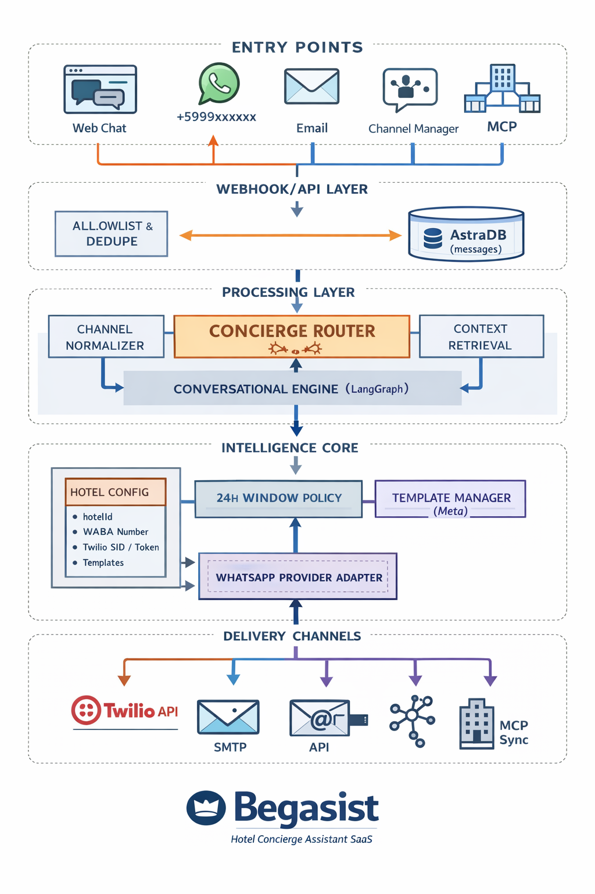

# Arquitectura

Este diagrama resume la arquitectura general de Begasist (SaaS multihotel):

- Inbound por canales (Web / WhatsApp / Email / Channel Manager)
- Normalización a `ChannelMessage`
- Persistencia (AstraDB)
- Orquestación (LangGraph)
- Respuesta (automática o supervisada)

## Contrato Twilio Inbound (vigente)

Routing inbound WhatsApp Twilio:

`Twilio inbound -> resolveHotelIdByTwilioTo(to) -> hotelId | unmapped`

Reglas:

- Si existe mapping `To -> hotelId`, el webhook procesa normalmente.
- Si no existe mapping, responde `ok/unmapped`.
- No existe fallback por variables de entorno.
