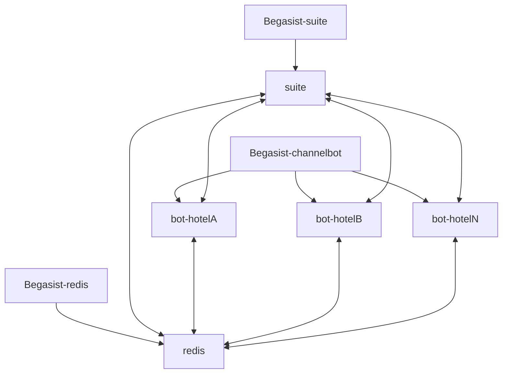

# Arquitectura Docker de Begasist

## Imágenes

- **begasist-suite**:  
  Imagen que incluye frontend (admin, web) y backend (API, servicios, endpoints).  
  Ejemplo:  
  - `begasist-suite:latest`  (producción)
  - `begasist-suite:dev`     (desarrollo)
  - `begasist-suite:pr-XXX`  (testing Pull Requests)

- **begasist-channelbot**:  
  Imagen única del bot multicanal. Cada hotel tendrá un contenedor propio, pero **siempre la misma imagen**.

- **redis**:  
  Imagen oficial de Redis (`redis:7-alpine`). Sólo una por sistema.

---

## Contenedores

- **begasist-suite**:  
  1 o más contenedores (normalmente 1 en producción).
  - Levanta web, admin y APIs.
  - Se comunica con Astra DB y Redis.

- **begasist-redis**:  
  Contenedor único, compartido por todos.

- **begasist-channelbot-hotelXYZ**:  
  Un contenedor por hotel.
  - Levanta el bot multiprotocolo (WhatsApp, Email, etc) para ese hotel.
  - Recibe eventos por Redis y configura canales activos automáticamente.

---

## Diagrama de relación
## Arquitectura de Contenedores e Imágenes (Begasist)

El sistema Begasist se compone de varios tipos de imágenes y contenedores, diferenciando entre el "molde" (imagen) y la instancia en ejecución (contenedor). La siguiente arquitectura está pensada para soportar múltiples hoteles, cada uno con su propio bot multi-canal.

### Componentes principales

- **Imagen `Begasist-suite`**: Incluye el frontend y backend (Next.js, APIs, etc.).
- **Imagen `Begasist-redis`**: Imagen oficial de Redis usada como broker y cache central.
- **Imagen `Begasist-channelbot`**: Contiene la lógica para gestionar todos los canales de un hotel.
- **Contenedores `Begasist-channelbot-hotelX`**: Instancias únicas por hotel, cada una conectando con sus canales habilitados (WhatsApp, Email, Web, etc.).

---

### Diagrama de Arquitectura (Mermaid)




### Componentes principales

- **Imagen `begasist-suite`:**
  - Incluye Frontend y Backend en una única imagen. Se utiliza para levantar el contenedor principal de la aplicación web (Next.js + API).
  - Normalmente hay solo una imagen para todos los hoteles, ya que la suite es multitenant.

- **Contenedor `begasist-redis`:**
  - Basado en la imagen oficial de Redis.
  - Sirve como broker de eventos, caché y almacenamiento temporal para QRs y mensajes efímeros.
  - Único para toda la infraestructura (no uno por hotel).

- **Imagen `begasist-channelbot`:**
  - Imagen que encapsula la lógica del bot multiprotocolo (WhatsApp, Email, Channel Manager, Web, etc.).
  - Preparada para gestionar los canales de un solo hotel.
  - De esta imagen se crean múltiples contenedores, uno por hotel.

- **Contenedor `bot-hotelX`:**
  - Cada contenedor de bot gestiona los canales de un hotel específico (por ejemplo: `bot-hotelPlaza`).
  - Se comunica con `begasist-redis` y con el backend de la suite.
  - Detecta cambios en configuración de canales vía eventos o polling y reacciona según corresponda.

### Flujo de operación

1. El usuario interactúa con el **Frontend** (contenedor `begasist-suite`).
2. Las operaciones administrativas (alta de hoteles/canales) modifican la configuración persistida (por ejemplo, en Astra DB).
3. Cuando hay cambios importantes en los canales, la suite emite un evento (por Redis) que los bots escuchan en tiempo real.
4. Cada contenedor `begasist-channelbot-hotelXXX` escucha sus eventos, gestiona los canales activos y ejecuta la lógica correspondiente (por ejemplo, arranca el bot de WhatsApp o cambia su modo).
5. Todos los bots y la suite usan `begasist-redis` como sistema de mensajería efímero y sincronización.

> **Nota:** Las imágenes (`begasist-suite` y `begasist-channelbot`) se construyen solo cuando hay cambios en el código. Los contenedores se pueden recrear cuantas veces se necesite, siempre partiendo de la última imagen build-eada.

---

¿Te gustaría agregar instrucciones de cómo lanzar los contenedores en Docker Compose o algún ejemplo concreto de docker-compose.yml?
```

---

## Preguntas frecuentes

**¿Por qué podría tener varias imágenes de `begasist-suite`?**
- Normalmente sólo vas a tener UNA, pero podrías tener varias versiones para desarrollo, pruebas o blue/green deploys.  
- Cada contenedor debe arrancar con la imagen/tag que quieras (ejemplo: `begasist-suite:staging`).

**¿Qué pasa si cambio la config/canales de un hotel?**
- El backend publica un evento en Redis.
- El contenedor del bot (`begasist-channelbot-hotelXYZ`) escucha el evento y actualiza su config y canales activos en caliente.

**¿Puedo lanzar varios contenedores del bot para el mismo hotel?**
- No, normalmente uno por hotel, pero podrías para pruebas o alta disponibilidad (requiere coordinación).

---

## Lanzar todo el sistema (ejemplo)

```sh
docker compose up -d
